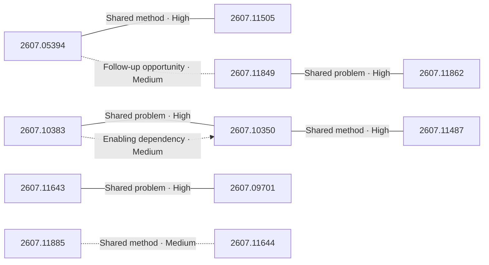

# Paper relationship graph — 2026-07-14

> [← Daily summary](../2026-07-14.md)

> **Interpretation caveat:** Every edge is an evidence-screened editorial hypothesis, not proof of citation, influence, priority, historical use, dependency, or an author-claimed relationship.

## Legend

- Rectangular nodes are current-day papers; rounded nodes are previously seen candidates.
- A line has no technical direction. An arrow shows only a proposed technical flow for an enabling dependency or method transfer.
- Solid edges are high confidence; dotted edges are medium confidence. Confidence evaluates this editorial connection, not either paper.
- Relationship labels:
  - **Shared problem:** `shared_problem`
  - **Shared method:** `shared_method`
  - **Shared evaluation:** `shared_evaluation`
  - **Complementary:** `complementary`
  - **Enabling dependency:** `enabling_dependency`
  - **Method transfer:** `method_transfer`
  - **Assumption tension:** `assumption_tension`
  - **Result tension:** `result_tension`
  - **Shared limitation:** `shared_limitation`
  - **Follow-up opportunity:** `follow_up_opportunity`

## Same-day relationships

| Source paper | Target paper | Relationship | Direction | Confidence |
| --- | --- | --- | --- | --- |
| [2607.05394](2607.05394.md) | [2607.11505](2607.11505.md) | Shared method | Not directional | High |
| [2607.10350](2607.10350.md) | [2607.11487](2607.11487.md) | Shared method | Not directional | High |
| [2607.10383](2607.10383.md) | [2607.10350](2607.10350.md) | Shared problem | Not directional | High |
| [2607.10383](2607.10383.md) | [2607.10350](2607.10350.md) | Enabling dependency | Source → target | Medium |
| [2607.11643](2607.11643.md) | [2607.09701](2607.09701.md) | Shared problem | Not directional | High |
| [2607.11849](2607.11849.md) | [2607.11862](2607.11862.md) | Shared problem | Not directional | High |
| [2607.11849](2607.11849.md) | [2607.05394](2607.05394.md) | Follow-up opportunity | Not directional | Medium |
| [2607.11885](2607.11885.md) | [2607.11644](2607.11644.md) | Shared method | Not directional | Medium |

## Connections to previously seen papers

_The relationship stage was skipped; no validated edges are available for this section._

## Current paper key

| Paper | Analysis |
| --- | --- |
| 2607.05394 — Weak-to-Strong Generalization via Direct On-Policy Distillation | [Read analysis](2607.05394.md) |
| 2607.10383 — ABot-N1: Toward a General Visual Language Navigation Foundation Model | [Read analysis](2607.10383.md) |
| 2607.10350 — ABot-AgentOS: A General Robotic Agent OS with Lifelong Multi-modal Memory | [Read analysis](2607.10350.md) |
| 2607.09125 — 4D Human-Scene Reconstruction from Low-Overlap Captures | [Read analysis](2607.09125.md) |
| 2607.11487 — LightMem-Ego: Your AI Memory for Everyday Life | [Read analysis](2607.11487.md) |
| 2607.11643 — Xiaomi-Robotics-U0: Unified Embodied Synthesis with World Foundation Model | [Read analysis](2607.11643.md) |
| 2607.11849 — AdvancedMathBench: A Benchmark Suite for Advanced Mathematical Proof Generation and Verification | [Read analysis](2607.11849.md) |
| 2607.11881 — Metacognition in LLMs: Foundations, Progress, and Opportunities | [Read analysis](2607.11881.md) |
| 2607.11505 — Proxy Exploration and Reusable Guidance: A Modular LLM Post-Training Paradigm via Proxy-Guided Update Signals | [Read analysis](2607.11505.md) |
| 2607.09701 — EgoSteer: A Full-Stack System Towards Steerable Dexterous Manipulation from Egocentric Videos | [Read analysis](2607.09701.md) |
| 2607.11250 — Multi-Agent LLMs Fail to Explore Each Other | [Read analysis](2607.11250.md) |
| 2607.07470 — A Theory of Contrastive Learning with Natural Images | [Read analysis](2607.07470.md) |
| 2607.11885 — Latent-Identity Tuning in Text-to-Image Personalization Models | [Read analysis](2607.11885.md) |
| 2607.11736 — MET: Theory-Grounded and Culture-Aware Multilingual Moral Reasoning | [Read analysis](2607.11736.md) |
| 2607.00397 — NeuroCogMap Reveals Cognitive Organization of Large Language Models | [Read analysis](2607.00397.md) |
| 2607.11644 — Motion4Motion: Motion Transfer Across Subjects at Inference | [Read analysis](2607.11644.md) |
| 2607.10623 — LATO.2: Factorized 3D Mesh Generation with Vertex and Topology Flow | [Read analysis](2607.10623.md) |
| 2607.09362 — CtrlVTON: Controllable Virtual Try-On via Visual-Instance-Prompt Segmentation | [Read analysis](2607.09362.md) |
| 2607.11862 — Evidence-Backed Video Question Answering | [Read analysis](2607.11862.md) |

## Current papers without a published edge

- [2607.09125](2607.09125.md)
- [2607.11881](2607.11881.md)
- [2607.11250](2607.11250.md)
- [2607.07470](2607.07470.md)
- [2607.11736](2607.11736.md)
- [2607.00397](2607.00397.md)
- [2607.10623](2607.10623.md)
- [2607.09362](2607.09362.md)
