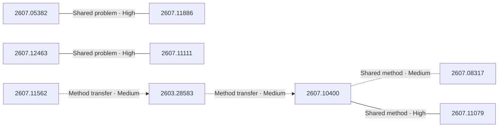

# Paper relationship graph — 2026-07-15

> [← Daily summary](../2026-07-15.md)

> **Interpretation caveat:** Every edge is an evidence-screened editorial hypothesis, not proof of citation, influence, priority, historical use, dependency, or an author-claimed relationship.

## Legend

- Rectangular nodes are current-day papers; rounded nodes are previously seen candidates.
- A line has no technical direction. An arrow shows only a proposed technical flow for an enabling dependency or method transfer.
- Solid edges are high confidence; dotted edges are medium confidence. Confidence evaluates this editorial connection, not either paper.
- Relationship labels:
  - **Shared problem:** `shared_problem`
  - **Shared method:** `shared_method`
  - **Shared evaluation:** `shared_evaluation`
  - **Complementary:** `complementary`
  - **Enabling dependency:** `enabling_dependency`
  - **Method transfer:** `method_transfer`
  - **Assumption tension:** `assumption_tension`
  - **Result tension:** `result_tension`
  - **Shared limitation:** `shared_limitation`
  - **Follow-up opportunity:** `follow_up_opportunity`

## Same-day relationships

| Source paper | Target paper | Relationship | Direction | Confidence |
| --- | --- | --- | --- | --- |
| [2607.12463](2607.12463.md) | [2607.11111](2607.11111.md) | Shared problem | Not directional | High |
| [2607.05382](2607.05382.md) | [2607.11886](2607.11886.md) | Shared problem | Not directional | High |
| [2607.10400](2607.10400.md) | [2607.08317](2607.08317.md) | Shared method | Not directional | Medium |
| [2607.10400](2607.10400.md) | [2607.11079](2607.11079.md) | Shared method | Not directional | High |
| [2603.28583](2603.28583.md) | [2607.10400](2607.10400.md) | Method transfer | Source → target | Medium |
| [2607.11562](2607.11562.md) | [2603.28583](2603.28583.md) | Method transfer | Source → target | Medium |

## Connections to previously seen papers

_The relationship stage failed; no validated edges are available for this section._

## Current paper key

| Paper | Analysis |
| --- | --- |
| 2607.12463 — Function-Aware Fill-in-the-Middle as Mid-Training for Coding Agent Foundation Models | [Read analysis](2607.12463.md) |
| 2607.05382 — Search Beyond What Can Be Taught: Evolving the Knowledge Boundary in Agentic Visual Generation | [Read analysis](2607.05382.md) |
| 2607.11886 — Read It Back: Pretrained MLLMs Are Zero-Shot Reward Models for Text-to-Image Generation | [Read analysis](2607.11886.md) |
| 2607.10400 — SynthDocBench: Controlled Benchmark for Long-Context Visual Document Understanding | [Read analysis](2607.10400.md) |
| 2607.08317 — Blind-Spots-Bench: Evaluating Blind Spots in Multimodal Models | [Read analysis](2607.08317.md) |
| 2607.10522 — Towards Autonomous and Auditable Medical Imaging Model Development | [Read analysis](2607.10522.md) |
| 2607.08168 — MuScriptor: An Open Model for Multi-Instrument Music Transcription | [Read analysis](2607.08168.md) |
| 2607.11111 — Know Before Fix: QA-Driven Repository Knowledge Acquisition for Software Issue Resolution | [Read analysis](2607.11111.md) |
| 2607.11562 — MonkeyOCRv2: A Visual-Text Foundation Model for Document AI | [Read analysis](2607.11562.md) |
| 2607.08046 — What LLM Forecasters Know but Don't Say: Probing Internal Representations for Calibration and Faithfulness | [Read analysis](2607.08046.md) |
| 2603.28583 — Navigating the Mirage: A Dual-Path Agentic Framework for Robust Misleading Chart Question Answering | [Read analysis](2603.28583.md) |
| 2607.12450 — Let RGB Be the Language of Vision | [Read analysis](2607.12450.md) |
| 2607.07769 — Principled Analysis of Deep Reinforcement Learning Evaluation and Design Paradigms | [Read analysis](2607.07769.md) |
| 2607.11079 — Are LLMs Ready for Scientific Discovery? A Capability-Oriented Benchmark for AI Scientists | [Read analysis](2607.11079.md) |
| 2607.11594 — MAGIC: Transition-Aware Generation of Navigable Multi-Scene Game Worlds with Large Language Models | [Read analysis](2607.11594.md) |

## Current papers without a published edge

- [2607.10522](2607.10522.md)
- [2607.08168](2607.08168.md)
- [2607.08046](2607.08046.md)
- [2607.12450](2607.12450.md)
- [2607.07769](2607.07769.md)
- [2607.11594](2607.11594.md)
