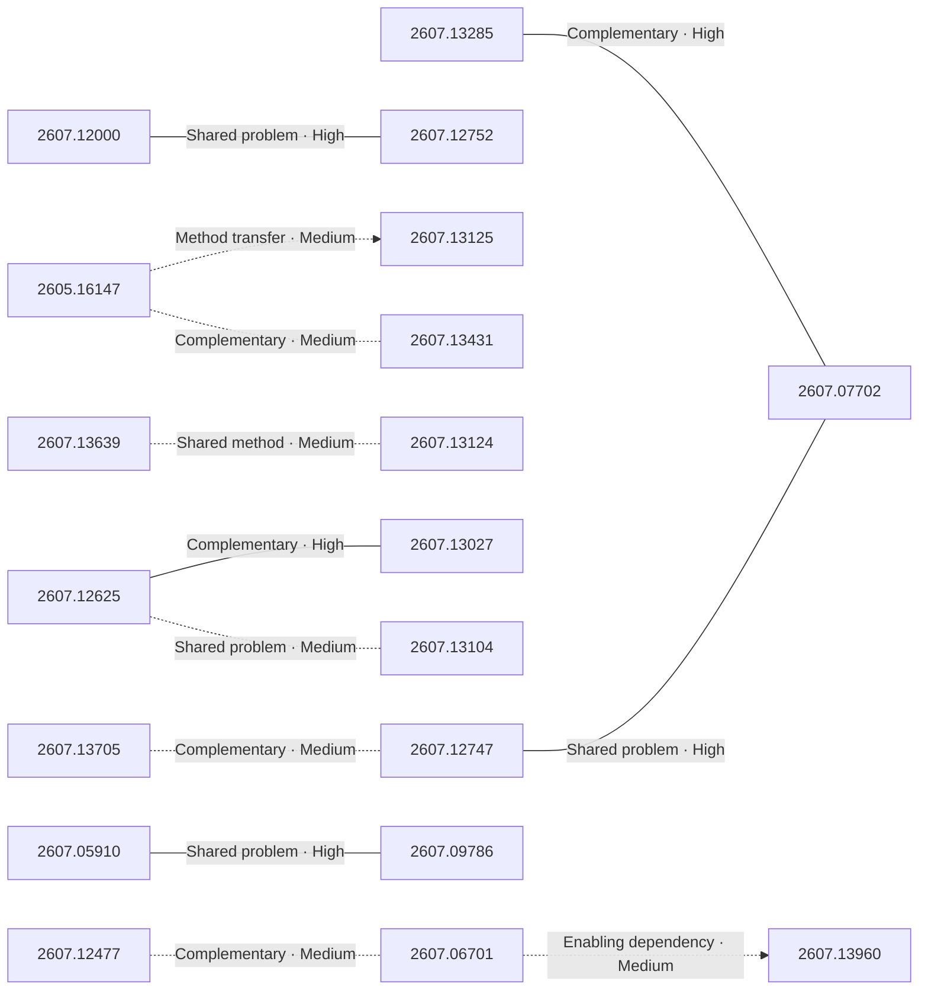

# Paper relationship graph — 2026-07-16

> [← Daily summary](../2026-07-16.md)

> **Interpretation caveat:** Every edge is an evidence-screened editorial hypothesis, not proof of citation, influence, priority, historical use, dependency, or an author-claimed relationship.

## Legend

- Rectangular nodes are current-day papers; rounded nodes are previously seen candidates.
- A line has no technical direction. An arrow shows only a proposed technical flow for an enabling dependency or method transfer.
- Solid edges are high confidence; dotted edges are medium confidence. Confidence evaluates this editorial connection, not either paper.
- Relationship labels:
  - **Shared problem:** `shared_problem`
  - **Shared method:** `shared_method`
  - **Shared evaluation:** `shared_evaluation`
  - **Complementary:** `complementary`
  - **Enabling dependency:** `enabling_dependency`
  - **Method transfer:** `method_transfer`
  - **Assumption tension:** `assumption_tension`
  - **Result tension:** `result_tension`
  - **Shared limitation:** `shared_limitation`
  - **Follow-up opportunity:** `follow_up_opportunity`

## Same-day relationships

| Source paper | Target paper | Relationship | Direction | Confidence |
| --- | --- | --- | --- | --- |
| [2607.13285](2607.13285.md) | [2607.07702](2607.07702.md) | Complementary | Not directional | High |
| [2607.12747](2607.12747.md) | [2607.07702](2607.07702.md) | Shared problem | Not directional | High |
| [2607.13705](2607.13705.md) | [2607.12747](2607.12747.md) | Complementary | Not directional | Medium |
| [2607.12625](2607.12625.md) | [2607.13027](2607.13027.md) | Complementary | Not directional | High |
| [2607.13104](2607.13104.md) | [2607.12625](2607.12625.md) | Shared problem | Not directional | Medium |
| [2607.12000](2607.12000.md) | [2607.12752](2607.12752.md) | Shared problem | Not directional | High |
| [2605.16147](2605.16147.md) | [2607.13125](2607.13125.md) | Method transfer | Source → target | Medium |
| [2607.13431](2607.13431.md) | [2605.16147](2605.16147.md) | Complementary | Not directional | Medium |
| [2607.05910](2607.05910.md) | [2607.09786](2607.09786.md) | Shared problem | Not directional | High |
| [2607.13639](2607.13639.md) | [2607.13124](2607.13124.md) | Shared method | Not directional | Medium |
| [2607.06701](2607.06701.md) | [2607.13960](2607.13960.md) | Enabling dependency | Source → target | Medium |
| [2607.12477](2607.12477.md) | [2607.06701](2607.06701.md) | Complementary | Not directional | Medium |

## Connections to previously seen papers

_The relationship stage failed; no validated edges are available for this section._

## Current paper key

| Paper | Analysis |
| --- | --- |
| 2607.13285 — Harness Handbook: Making Evolving Agent Harnesses Readable,Navigable, and Editable | [Read analysis](2607.13285.md) |
| 2607.13125 — Boogu-Image-0.1: Boosting Open-Source Unified Multimodal Understanding and Generation | [Read analysis](2607.13125.md) |
| 2607.12395 — Ring-Zero: Scaling Zero RL to a Trillion Parameters for Emergent Reasoning | [Read analysis](2607.12395.md) |
| 2607.12625 — KnowAct-GUIClaw: Know Deeply, Act Perfectly, Personal GUI Assistant with Self-Evolving Memory and Skill | [Read analysis](2607.12625.md) |
| 2607.13639 — OvisOCR2 Technical Report | [Read analysis](2607.13639.md) |
| 2607.05910 — PolicyShiftGuard: Benchmarking and Improving Policy-Adaptive Image Guardrails | [Read analysis](2607.05910.md) |
| 2607.12000 — MetaView: Monocular Novel View Synthesis with Scale-Aware Implicit Geometry Priors | [Read analysis](2607.12000.md) |
| 2607.13960 — GigaWorld-Policy-0.5: A Faster and Stronger WAM Empowered by AutoResearch | [Read analysis](2607.13960.md) |
| 2605.16147 — Registers Matter for Pixel-Space Diffusion Transformers | [Read analysis](2605.16147.md) |
| 2607.12752 — Hallo4D: Multi-Modal Hallucination Mitigation for Consistent Spatio-Temporal Generation | [Read analysis](2607.12752.md) |
| 2607.13104 — Self-Improvements in Modern Agentic Systems: A Survey | [Read analysis](2607.13104.md) |
| 2607.13124 — ShortOPD: Recovering Pruned LLMs with Short-to-Long On-Policy Distillation | [Read analysis](2607.13124.md) |
| 2607.13705 — AgentCompass: A Unified Evaluation Infrastructure for Agent Capabilities | [Read analysis](2607.13705.md) |
| 2607.11523 — Vinci2: Providing Proactive Assistance in Continuous Egocentric Videos | [Read analysis](2607.11523.md) |
| 2607.12747 — Tracing Agentic Failure from the Flow of Success | [Read analysis](2607.12747.md) |
| 2607.13431 — Discrete Diffusion Models: A Unified Framework from Tokenization to Generation | [Read analysis](2607.13431.md) |
| 2607.13027 — PalmClaw: A Native On-Device Agent Framework for Mobile Phones | [Read analysis](2607.13027.md) |
| 2607.07702 — From Noisy Traces to Root Causes: Structural Trajectory Analysis and Causal Extraction for Agent Optimization | [Read analysis](2607.07702.md) |
| 2607.12477 — Self in Space: Benchmarking Self-Awareness and Spatial Cognition in UAV Embodied Intelligence | [Read analysis](2607.12477.md) |
| 2605.10834 — From Controlled to the Wild: Evaluation of Pentesting Agents for the Real-World | [Read analysis](2605.10834.md) |
| 2607.09786 — Length Penalties Make Chain-of-Thought Less Monitorable | [Read analysis](2607.09786.md) |
| 2607.06701 — SPEAR: A Simulator for Photorealistic Embodied AI Research | [Read analysis](2607.06701.md) |
| 2607.13250 — AffectFlow-DINO: Uncertainty-Aware Multi-Task Affect Estimation via Conditional Rectified Flow | [Read analysis](2607.13250.md) |

## Current papers without a published edge

- [2607.12395](2607.12395.md)
- [2607.11523](2607.11523.md)
- [2605.10834](2605.10834.md)
- [2607.13250](2607.13250.md)
