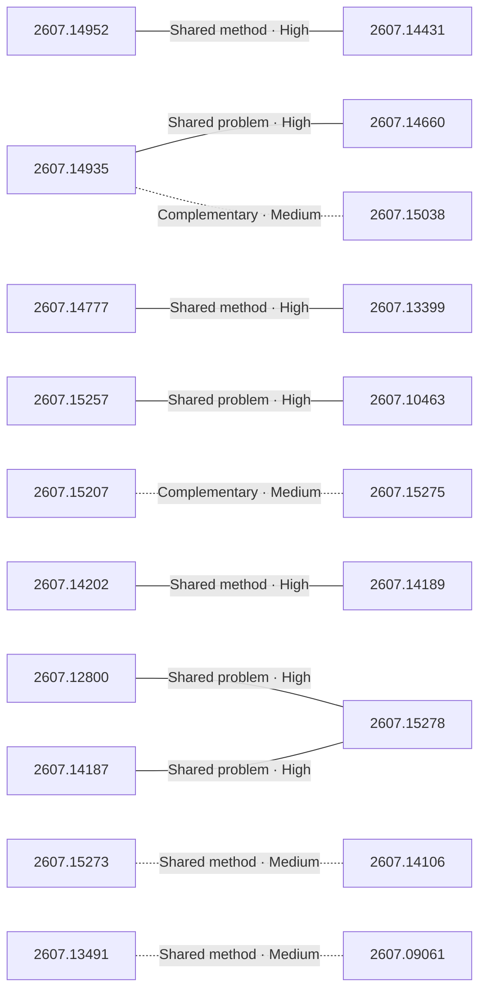

# Paper relationship graph — 2026-07-17

> [← Daily summary](../2026-07-17.md)

> **Interpretation caveat:** Every edge is an evidence-screened editorial hypothesis, not proof of citation, influence, priority, historical use, dependency, or an author-claimed relationship.

## Legend

- Rectangular nodes are current-day papers; rounded nodes are previously seen candidates.
- A line has no technical direction. An arrow shows only a proposed technical flow for an enabling dependency or method transfer.
- Solid edges are high confidence; dotted edges are medium confidence. Confidence evaluates this editorial connection, not either paper.
- Relationship labels:
  - **Shared problem:** `shared_problem`
  - **Shared method:** `shared_method`
  - **Shared evaluation:** `shared_evaluation`
  - **Complementary:** `complementary`
  - **Enabling dependency:** `enabling_dependency`
  - **Method transfer:** `method_transfer`
  - **Assumption tension:** `assumption_tension`
  - **Result tension:** `result_tension`
  - **Shared limitation:** `shared_limitation`
  - **Follow-up opportunity:** `follow_up_opportunity`

## Same-day relationships

| Source paper | Target paper | Relationship | Direction | Confidence |
| --- | --- | --- | --- | --- |
| [2607.14777](2607.14777.md) | [2607.13399](2607.13399.md) | Shared method | Not directional | High |
| [2607.15257](2607.15257.md) | [2607.10463](2607.10463.md) | Shared problem | Not directional | High |
| [2607.14202](2607.14202.md) | [2607.14189](2607.14189.md) | Shared method | Not directional | High |
| [2607.12800](2607.12800.md) | [2607.15278](2607.15278.md) | Shared problem | Not directional | High |
| [2607.14187](2607.14187.md) | [2607.15278](2607.15278.md) | Shared problem | Not directional | High |
| [2607.14935](2607.14935.md) | [2607.14660](2607.14660.md) | Shared problem | Not directional | High |
| [2607.14935](2607.14935.md) | [2607.15038](2607.15038.md) | Complementary | Not directional | Medium |
| [2607.14952](2607.14952.md) | [2607.14431](2607.14431.md) | Shared method | Not directional | High |
| [2607.15207](2607.15207.md) | [2607.15275](2607.15275.md) | Complementary | Not directional | Medium |
| [2607.15273](2607.15273.md) | [2607.14106](2607.14106.md) | Shared method | Not directional | Medium |
| [2607.13491](2607.13491.md) | [2607.09061](2607.09061.md) | Shared method | Not directional | Medium |

## Connections to previously seen papers

_The relationship stage failed; no validated edges are available for this section._

## Current paper key

| Paper | Analysis |
| --- | --- |
| 2607.14952 — LongStraw: Long-Context RL Beyond 2M Tokens under a Fixed GPU Budget | [Read analysis](2607.14952.md) |
| 2607.14935 — VideoChat3: Fully Open Video MLLM for Efficient and Generalist Video Understanding | [Read analysis](2607.14935.md) |
| 2607.14777 — SEED: Self-Evolving On-Policy Distillation for Agentic Reinforcement Learning | [Read analysis](2607.14777.md) |
| 2607.15257 — SearchOS-V1: Towards Robust Open-Domain Information-Seeking Agent Collaboration | [Read analysis](2607.15257.md) |
| 2607.15207 — BadWAM: When World-Action Models Dream Right but Act Wrong | [Read analysis](2607.15207.md) |
| 2607.14202 — KeyFrame-Compass: Towards Comprehensive Evaluation of Keyframe-Conditioned Video Generation | [Read analysis](2607.14202.md) |
| 2607.14189 — MultiRef-Compass: Towards Comprehensive Evaluation of Multi-Reference-to-Audio-Video Generation | [Read analysis](2607.14189.md) |
| 2607.14076 — From Pixels to States: Rethinking Interactive World Models as Game Engines | [Read analysis](2607.14076.md) |
| 2607.12800 — UniVR: Thinking in Visual Space for Unified Visual Reasoning | [Read analysis](2607.12800.md) |
| 2607.13188 — Concurrent Image Understanding and Generation: Self-Correcting Coupled Markov Jump Processes | [Read analysis](2607.13188.md) |
| 2607.03065 — Spectral Rewiring for Exploration, Purification, and Model Merging | [Read analysis](2607.03065.md) |
| 2607.14187 — RxBrain: Embodied Cognition Foundation Model with Joint Language-Visual Reasoning and Imagination | [Read analysis](2607.14187.md) |
| 2607.15038 — Video = World + Event Stream | [Read analysis](2607.15038.md) |
| 2607.13399 — Demystifying On-Policy Distillation: Roles, Pathologies, and Regulations | [Read analysis](2607.13399.md) |
| 2607.15275 — RoboTTT: Context Scaling for Robot Policies | [Read analysis](2607.15275.md) |
| 2607.15273 — MeanFlowNFT: Bringing Forward-Process RL to Average-Velocity Generators | [Read analysis](2607.15273.md) |
| 2607.14749 — WanSong v1.0 Technical Report | [Read analysis](2607.14749.md) |
| 2607.13491 — DeepLoop: Depth Scaling for Looped Transformers | [Read analysis](2607.13491.md) |
| 2607.14660 — VIABench: A Comprehensive Video Benchmark Collected from Blind Individuals for Visual Impairment Assistance | [Read analysis](2607.14660.md) |
| 2607.14431 — Smarter and Cheaper at Once: Byte-Exact KV-Cache Grafting Turns a Frozen Small Model into a Verified-Knowledge Flywheel | [Read analysis](2607.14431.md) |
| 2607.15277 — Partition, Prompt, Aggregate: Statistical Self-Consistency in Language Models | [Read analysis](2607.15277.md) |
| 2607.10995 — AsySplat: Efficient Asymmetric 3D Gaussian Splatting for Long-Sequence Scene Modeling | [Read analysis](2607.10995.md) |
| 2607.10463 — GRASP: GRanularity-Aware Search Policy for Agentic RAG | [Read analysis](2607.10463.md) |
| 2607.15058 — SUFLECA: Scaling Up Feature Learning for CAD-to-image Alignment | [Read analysis](2607.15058.md) |
| 2607.14106 — Token Time Continuous Diffusion for Language Modeling | [Read analysis](2607.14106.md) |
| 2607.15278 — Hierarchical Denoising For Multi-Step Visual Reasoning | [Read analysis](2607.15278.md) |
| 2607.14387 — Chat2Scenic: An Iterative RAG-Based Framework for Scenario Generation in Autonomous Driving | [Read analysis](2607.14387.md) |
| 2607.12227 — Rethinking the Evaluation of Harness Evolution for Agents | [Read analysis](2607.12227.md) |
| 2607.09061 — On Locality and Length Generalization in Visual Reasoning | [Read analysis](2607.09061.md) |

## Current papers without a published edge

- [2607.14076](2607.14076.md)
- [2607.13188](2607.13188.md)
- [2607.03065](2607.03065.md)
- [2607.14749](2607.14749.md)
- [2607.15277](2607.15277.md)
- [2607.10995](2607.10995.md)
- [2607.15058](2607.15058.md)
- [2607.14387](2607.14387.md)
- [2607.12227](2607.12227.md)
