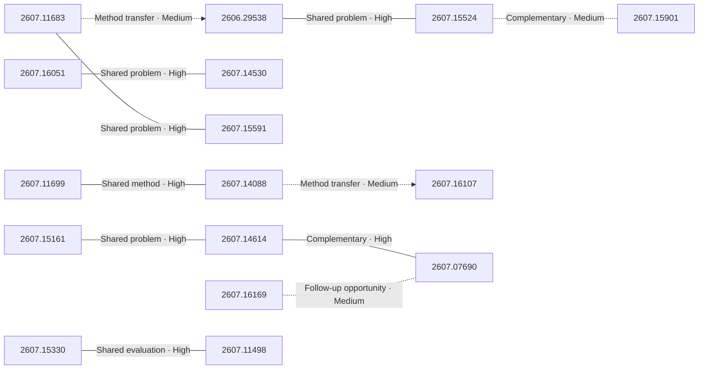

# Paper relationship graph — 2026-07-20

> [← Daily summary](../2026-07-20.md)

> **Interpretation caveat:** Every edge is an evidence-screened editorial hypothesis, not proof of citation, influence, priority, historical use, dependency, or an author-claimed relationship.

## Legend

- Rectangular nodes are current-day papers; rounded nodes are previously seen candidates.
- A line has no technical direction. An arrow shows only a proposed technical flow for an enabling dependency or method transfer.
- Solid edges are high confidence; dotted edges are medium confidence. Confidence evaluates this editorial connection, not either paper.
- Relationship labels:
  - **Shared problem:** `shared_problem`
  - **Shared method:** `shared_method`
  - **Shared evaluation:** `shared_evaluation`
  - **Complementary:** `complementary`
  - **Enabling dependency:** `enabling_dependency`
  - **Method transfer:** `method_transfer`
  - **Assumption tension:** `assumption_tension`
  - **Result tension:** `result_tension`
  - **Shared limitation:** `shared_limitation`
  - **Follow-up opportunity:** `follow_up_opportunity`

## Same-day relationships

| Source paper | Target paper | Relationship | Direction | Confidence |
| --- | --- | --- | --- | --- |
| [2607.16051](2607.16051.md) | [2607.14530](2607.14530.md) | Shared problem | Not directional | High |
| [2607.15330](2607.15330.md) | [2607.11498](2607.11498.md) | Shared evaluation | Not directional | High |
| [2607.15161](2607.15161.md) | [2607.14614](2607.14614.md) | Shared problem | Not directional | High |
| [2607.14614](2607.14614.md) | [2607.07690](2607.07690.md) | Complementary | Not directional | High |
| [2606.29538](2606.29538.md) | [2607.15524](2607.15524.md) | Shared problem | Not directional | High |
| [2607.15524](2607.15524.md) | [2607.15901](2607.15901.md) | Complementary | Not directional | Medium |
| [2607.11683](2607.11683.md) | [2607.15591](2607.15591.md) | Shared problem | Not directional | High |
| [2607.11699](2607.11699.md) | [2607.14088](2607.14088.md) | Shared method | Not directional | High |
| [2607.16169](2607.16169.md) | [2607.07690](2607.07690.md) | Follow-up opportunity | Not directional | Medium |
| [2607.11683](2607.11683.md) | [2606.29538](2606.29538.md) | Method transfer | Source → target | Medium |
| [2607.14088](2607.14088.md) | [2607.16107](2607.16107.md) | Method transfer | Source → target | Medium |

## Connections to previously seen papers

_The relationship stage failed; no validated edges are available for this section._

## Current paper key

| Paper | Analysis |
| --- | --- |
| 2607.11683 — RAGU: A Multi-Step GraphRAG Engine with a Compact Domain-Adapted LLM | [Read analysis](2607.11683.md) |
| 2606.29538 — RESOURCE2SKILL: Distilling Executable Agent Skills from Human-Created Multimodal Resources | [Read analysis](2606.29538.md) |
| 2607.16051 — Loop the Loopies! | [Read analysis](2607.16051.md) |
| 2607.15330 — Xiaomi-Robotics-1: Scaling Vision-Language-Action Models with over 100K Hours of Real-World Trajectories | [Read analysis](2607.15330.md) |
| 2607.14530 — xHC: Expanded Hyper-Connections | [Read analysis](2607.14530.md) |
| 2607.15314 — Cura 1T: Specialized Model for Agentic Healthcare | [Read analysis](2607.15314.md) |
| 2607.15591 — RecGPT-V3 Technical Report | [Read analysis](2607.15591.md) |
| 2607.15161 — On-Policy Delta Distillation | [Read analysis](2607.15161.md) |
| 2607.13196 — From Human-Centric to Agentic Code Review: The Impact of Different Generations of Generative AI Technology on Review Quality | [Read analysis](2607.13196.md) |
| 2607.16097 — Understanding Reasoning from Pretraining to Post-Training | [Read analysis](2607.16097.md) |
| 2607.11699 — Qwen-Music Technical Report | [Read analysis](2607.11699.md) |
| 2607.16169 — When Does Muon Help Agentic Reinforcement Learning? | [Read analysis](2607.16169.md) |
| 2607.15524 — Recursive Harness Self-Improvement | [Read analysis](2607.15524.md) |
| 2607.14614 — Beyond Entropy: Correctness-Aware Advantage Shaping via Contrastive Policy Optimization | [Read analysis](2607.14614.md) |
| 2607.14088 — VideoRAE: Taming Video Foundation Models for Generative Modeling via Representation Autoencoders | [Read analysis](2607.14088.md) |
| 2607.16107 — Audio-Visual Flamingo: Open Audio-Visual Intelligence for Long and Complex Videos | [Read analysis](2607.16107.md) |
| 2607.15686 — S1-Omni: A Unified Multimodal Reasoning Model for Scientific Understanding, Prediction, and Generation | [Read analysis](2607.15686.md) |
| 2607.15901 — DSWorld: A Data Science World Model for Efficient Autonomous Agents | [Read analysis](2607.15901.md) |
| 2607.09082 — REBASE: Reference-Background Subspace Elimination for Training-Free In-Context Segmentation | [Read analysis](2607.09082.md) |
| 2607.11498 — See like a Robot: Robot-Centric Pointmaps for Vision-Language-Action Models | [Read analysis](2607.11498.md) |
| 2607.07690 — Agon: Competitive Cross-Model RL with Implicit Rival Grading of Reasoning | [Read analysis](2607.07690.md) |
| 2607.06815 — Behavioral Privacy Leakage in Agentic Negotiation: Formalizing and Mitigating Inference Attacks via Randomized Policies | [Read analysis](2607.06815.md) |

## Current papers without a published edge

- [2607.15314](2607.15314.md)
- [2607.13196](2607.13196.md)
- [2607.16097](2607.16097.md)
- [2607.15686](2607.15686.md)
- [2607.09082](2607.09082.md)
- [2607.06815](2607.06815.md)
