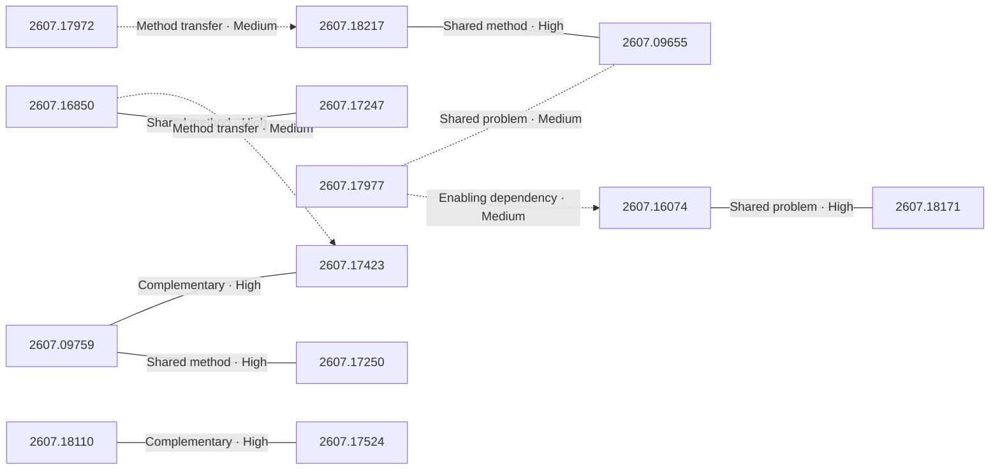

# Paper relationship graph — 2026-07-21

> [← Daily summary](../2026-07-21.md)

> **Interpretation caveat:** Every edge is an evidence-screened editorial hypothesis, not proof of citation, influence, priority, historical use, dependency, or an author-claimed relationship.

## Legend

- Rectangular nodes are current-day papers; rounded nodes are previously seen candidates.
- A line has no technical direction. An arrow shows only a proposed technical flow for an enabling dependency or method transfer.
- Solid edges are high confidence; dotted edges are medium confidence. Confidence evaluates this editorial connection, not either paper.
- Relationship labels:
  - **Shared problem:** `shared_problem`
  - **Shared method:** `shared_method`
  - **Shared evaluation:** `shared_evaluation`
  - **Complementary:** `complementary`
  - **Enabling dependency:** `enabling_dependency`
  - **Method transfer:** `method_transfer`
  - **Assumption tension:** `assumption_tension`
  - **Result tension:** `result_tension`
  - **Shared limitation:** `shared_limitation`
  - **Follow-up opportunity:** `follow_up_opportunity`

## Same-day relationships

| Source paper | Target paper | Relationship | Direction | Confidence |
| --- | --- | --- | --- | --- |
| [2607.09759](2607.09759.md) | [2607.17250](2607.17250.md) | Shared method | Not directional | High |
| [2607.09759](2607.09759.md) | [2607.17423](2607.17423.md) | Complementary | Not directional | High |
| [2607.16850](2607.16850.md) | [2607.17247](2607.17247.md) | Shared method | Not directional | High |
| [2607.16850](2607.16850.md) | [2607.17423](2607.17423.md) | Method transfer | Source → target | Medium |
| [2607.18110](2607.18110.md) | [2607.17524](2607.17524.md) | Complementary | Not directional | High |
| [2607.17977](2607.17977.md) | [2607.16074](2607.16074.md) | Enabling dependency | Source → target | Medium |
| [2607.17977](2607.17977.md) | [2607.09655](2607.09655.md) | Shared problem | Not directional | Medium |
| [2607.16074](2607.16074.md) | [2607.18171](2607.18171.md) | Shared problem | Not directional | High |
| [2607.18217](2607.18217.md) | [2607.09655](2607.09655.md) | Shared method | Not directional | High |
| [2607.17972](2607.17972.md) | [2607.18217](2607.18217.md) | Method transfer | Source → target | Medium |

## Connections to previously seen papers

_The relationship stage failed; no validated edges are available for this section._

## Current paper key

| Paper | Analysis |
| --- | --- |
| 2607.18217 — HOMIE: Human-object Centric Video Personalization via Multimodal Intelligent Enchancement | [Read analysis](2607.18217.md) |
| 2607.09759 — ReflectWorld-MM: An Entity-Oriented Multimodal Memory System for Open-Ended Video Streams | [Read analysis](2607.09759.md) |
| 2607.16850 — Group Entropy-Controlled Policy Optimization | [Read analysis](2607.16850.md) |
| 2607.17423 — TimeLens2: Generalist Video Temporal Grounding with Multimodal LLMs | [Read analysis](2607.17423.md) |
| 2607.17977 — RynnBrain 1.1: Towards More Capable and Generalizable Embodied Foundation Model | [Read analysis](2607.17977.md) |
| 2607.17250 — EvolvingWorld: An Open-Schema Framework for Co-Evolving Role-Play Agents and World Model in Interactive Literary World | [Read analysis](2607.17250.md) |
| 2607.16900 — Environment-free Synthetic Data Generation for API-Calling Agents | [Read analysis](2607.16900.md) |
| 2607.18110 — LLM-as-a-Coach: Experiential Learning for Non-Verifiable Tasks | [Read analysis](2607.18110.md) |
| 2607.13365 — DiffGI: Differentiable Geometry Images for High-Fidelity Thin-Shell 3D Generation | [Read analysis](2607.13365.md) |
| 2607.17247 — Distilled Reinforcement Learning for LLM Post-training | [Read analysis](2607.17247.md) |
| 2607.16074 — JoyNexus: Service-Oriented Multi-Tenant Post-Training for VLA Models | [Read analysis](2607.16074.md) |
| 2607.09655 — OpenLongTail: Generative Scaling of Long-Tail Driving Data | [Read analysis](2607.09655.md) |
| 2607.17524 — Token-Level Off-Policy Learning for Faithful Generation Under Distribution Shift | [Read analysis](2607.17524.md) |
| 2607.18171 — FlashRT: Agent Harness for Guiding Agents to Deploy Real-Time Multimodal Applications | [Read analysis](2607.18171.md) |
| 2607.18213 — SWE-Pruner Pro: The Coder LLM Already Knows What to Prune | [Read analysis](2607.18213.md) |
| 2607.17972 — DiFA: Inference-Time Forward-Process Alignment for Diffusion Models | [Read analysis](2607.17972.md) |

## Current papers without a published edge

- [2607.16900](2607.16900.md)
- [2607.13365](2607.13365.md)
- [2607.18213](2607.18213.md)
