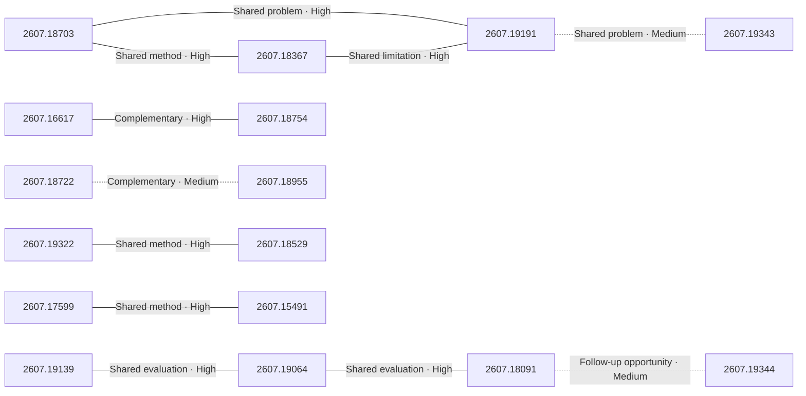

# Paper relationship graph — 2026-07-22

> [← Daily summary](../2026-07-22.md)

> **Interpretation caveat:** Every edge is an evidence-screened editorial hypothesis, not proof of citation, influence, priority, historical use, dependency, or an author-claimed relationship.

## Legend

- Rectangular nodes are current-day papers; rounded nodes are previously seen candidates.
- A line has no technical direction. An arrow shows only a proposed technical flow for an enabling dependency or method transfer.
- Solid edges are high confidence; dotted edges are medium confidence. Confidence evaluates this editorial connection, not either paper.
- Relationship labels:
  - **Shared problem:** `shared_problem`
  - **Shared method:** `shared_method`
  - **Shared evaluation:** `shared_evaluation`
  - **Complementary:** `complementary`
  - **Enabling dependency:** `enabling_dependency`
  - **Method transfer:** `method_transfer`
  - **Assumption tension:** `assumption_tension`
  - **Result tension:** `result_tension`
  - **Shared limitation:** `shared_limitation`
  - **Follow-up opportunity:** `follow_up_opportunity`

## Same-day relationships

| Source paper | Target paper | Relationship | Direction | Confidence |
| --- | --- | --- | --- | --- |
| [2607.18703](2607.18703.md) | [2607.18367](2607.18367.md) | Shared method | Not directional | High |
| [2607.18703](2607.18703.md) | [2607.19191](2607.19191.md) | Shared problem | Not directional | High |
| [2607.18367](2607.18367.md) | [2607.19191](2607.19191.md) | Shared limitation | Not directional | High |
| [2607.19139](2607.19139.md) | [2607.19064](2607.19064.md) | Shared evaluation | Not directional | High |
| [2607.19064](2607.19064.md) | [2607.18091](2607.18091.md) | Shared evaluation | Not directional | High |
| [2607.18091](2607.18091.md) | [2607.19344](2607.19344.md) | Follow-up opportunity | Not directional | Medium |
| [2607.19322](2607.19322.md) | [2607.18529](2607.18529.md) | Shared method | Not directional | High |
| [2607.16617](2607.16617.md) | [2607.18754](2607.18754.md) | Complementary | Not directional | High |
| [2607.18722](2607.18722.md) | [2607.18955](2607.18955.md) | Complementary | Not directional | Medium |
| [2607.19343](2607.19343.md) | [2607.19191](2607.19191.md) | Shared problem | Not directional | Medium |
| [2607.17599](2607.17599.md) | [2607.15491](2607.15491.md) | Shared method | Not directional | High |

## Connections to previously seen papers

_The visual diagram is omitted because this graph is too large or dense for a readable snapshot; every edge remains in the table below._

| New paper | Previously seen paper | First seen by service | Relationship | Technical direction | Confidence |
| --- | --- | --- | --- | --- | --- |
| [2607.19139](2607.19139.md) | 2605.16147 ([Hugging Face](https://huggingface.co/papers/2605.16147) · [arXiv](https://arxiv.org/abs/2605.16147)) | 2026-07-16 | Shared method | Not directional | High |
| [2607.16617](2607.16617.md) | 2607.18171 ([Hugging Face](https://huggingface.co/papers/2607.18171) · [arXiv](https://arxiv.org/abs/2607.18171)) | 2026-07-21 | Shared method | Not directional | High |
| [2607.18754](2607.18754.md) | 2607.07702 ([Hugging Face](https://huggingface.co/papers/2607.07702) · [arXiv](https://arxiv.org/abs/2607.07702)) | 2026-07-16 | Shared problem | Not directional | High |
| [2607.18754](2607.18754.md) | 2607.12747 ([Hugging Face](https://huggingface.co/papers/2607.12747) · [arXiv](https://arxiv.org/abs/2607.12747)) | 2026-07-16 | Shared evaluation | Not directional | High |
| [2607.19331](2607.19331.md) | 2607.03065 ([Hugging Face](https://huggingface.co/papers/2607.03065) · [arXiv](https://arxiv.org/abs/2607.03065)) | 2026-07-17 | Shared method | Not directional | High |
| [2607.18955](2607.18955.md) | 2607.14614 ([Hugging Face](https://huggingface.co/papers/2607.14614) · [arXiv](https://arxiv.org/abs/2607.14614)) | 2026-07-20 | Shared problem | Not directional | High |
| [2607.18955](2607.18955.md) | 2607.17247 ([Hugging Face](https://huggingface.co/papers/2607.17247) · [arXiv](https://arxiv.org/abs/2607.17247)) | 2026-07-21 | Shared method | Not directional | High |
| [2607.18367](2607.18367.md) | 2607.15278 ([Hugging Face](https://huggingface.co/papers/2607.15278) · [arXiv](https://arxiv.org/abs/2607.15278)) | 2026-07-17 | Shared problem | Not directional | High |
| [2607.19191](2607.19191.md) | 2607.15278 ([Hugging Face](https://huggingface.co/papers/2607.15278) · [arXiv](https://arxiv.org/abs/2607.15278)) | 2026-07-17 | Shared limitation | Not directional | Medium |
| [2607.19343](2607.19343.md) | 2607.11643 ([Hugging Face](https://huggingface.co/papers/2607.11643) · [arXiv](https://arxiv.org/abs/2607.11643)) | 2026-07-14 | Complementary | Not directional | High |
| [2607.18839](2607.18839.md) | 2607.11562 ([Hugging Face](https://huggingface.co/papers/2607.11562) · [arXiv](https://arxiv.org/abs/2607.11562)) | 2026-07-15 | Follow-up opportunity | Not directional | High |
| [2607.19064](2607.19064.md) | 2607.13125 ([Hugging Face](https://huggingface.co/papers/2607.13125) · [arXiv](https://arxiv.org/abs/2607.13125)) | 2026-07-16 | Shared method | Not directional | High |

## Current paper key

| Paper | Analysis |
| --- | --- |
| 2607.18703 — Generative World Renderer at the Speed of Play | [Read analysis](2607.18703.md) |
| 2607.19139 — Text Template Tokens Are Implicit Semantic Registers in Diffusion Transformers | [Read analysis](2607.19139.md) |
| 2607.16617 — DataFlow-Harness: A Grounded Code-Agent Platform for Constructing Editable LLM Data Pipelines | [Read analysis](2607.16617.md) |
| 2607.19064 — Mage-Flow: An Efficient Native-Resolution Foundation Model for Image Generation and Editing | [Read analysis](2607.19064.md) |
| 2607.18367 — AlayaWorld: Interactive Long-Horizon World Modeling -- Full Technical Report | [Read analysis](2607.18367.md) |
| 2607.18722 — Stale but Stable: Staleness-Adaptive Trust Regions for Stabilizing Asynchronous Reinforcement Learning | [Read analysis](2607.18722.md) |
| 2607.18091 — SciForma: Structure-Faithful Generation of Scientific Diagrams | [Read analysis](2607.18091.md) |
| 2607.18754 — AgentDebugX: An Open-Source Toolkit for Failure Observability, Attribution, and Recovery in LLM Agents | [Read analysis](2607.18754.md) |
| 2607.19191 — ABot-World-0: Infinite Interactive World Rollout on a Single Desktop GPU | [Read analysis](2607.19191.md) |
| 2607.18839 — HPD-Parsing: Hierarchical Parallel Document Parsing | [Read analysis](2607.18839.md) |
| 2607.19322 — Two-Level Meta-Rubrics for Evaluating Open-Ended Generation: GAMUT, a Benchmark for Factual Completeness | [Read analysis](2607.19322.md) |
| 2607.19331 — ISO: An RLVR-Native Optimization Stack | [Read analysis](2607.19331.md) |
| 2607.18955 — H^2SD: Hybrid Hindsight Self-Distillation | [Read analysis](2607.18955.md) |
| 2607.18529 — EduPanel: A Three-Agent LLM Judge for Teaching Videos -- Reliability, Complementarity, and Human Trust Calibration | [Read analysis](2607.18529.md) |
| 2607.19343 — Masked Visual Actions for Unified World Modeling | [Read analysis](2607.19343.md) |
| 2607.19344 — Appearance Pointers -- Multimodal Region Control of Diffusion Transformers | [Read analysis](2607.19344.md) |
| 2607.17599 — ConsiSpace: Learning Geometric Consistency Matters for Video Spatial Reasoning | [Read analysis](2607.17599.md) |
| 2607.15491 — Trajectory-aware Cross-view Geo-localization with Sequential Observations | [Read analysis](2607.15491.md) |

## Current papers without a published edge

_Every published current paper participates in at least one edge._

---

[Support these research summaries on Buy Me a Coffee](https://buymeacoffee.com/vollero)
