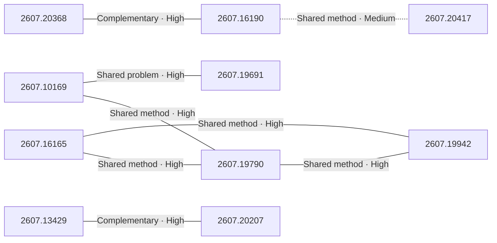

# Paper relationship graph — 2026-07-23

> [← Daily summary](../2026-07-23.md)

> **Interpretation caveat:** Every edge is an evidence-screened editorial hypothesis, not proof of citation, influence, priority, historical use, dependency, or an author-claimed relationship.

## Legend

- Rectangular nodes are current-day papers; rounded nodes are previously seen candidates.
- A line has no technical direction. An arrow shows only a proposed technical flow for an enabling dependency or method transfer.
- Solid edges are high confidence; dotted edges are medium confidence. Confidence evaluates this editorial connection, not either paper.
- Relationship labels:
  - **Shared problem:** `shared_problem`
  - **Shared method:** `shared_method`
  - **Shared evaluation:** `shared_evaluation`
  - **Complementary:** `complementary`
  - **Enabling dependency:** `enabling_dependency`
  - **Method transfer:** `method_transfer`
  - **Assumption tension:** `assumption_tension`
  - **Result tension:** `result_tension`
  - **Shared limitation:** `shared_limitation`
  - **Follow-up opportunity:** `follow_up_opportunity`

## Same-day relationships

| Source paper | Target paper | Relationship | Direction | Confidence |
| --- | --- | --- | --- | --- |
| [2607.20368](2607.20368.md) | [2607.16190](2607.16190.md) | Complementary | Not directional | High |
| [2607.16165](2607.16165.md) | [2607.19790](2607.19790.md) | Shared method | Not directional | High |
| [2607.16165](2607.16165.md) | [2607.19942](2607.19942.md) | Shared method | Not directional | High |
| [2607.19790](2607.19790.md) | [2607.19942](2607.19942.md) | Shared method | Not directional | High |
| [2607.10169](2607.10169.md) | [2607.19790](2607.19790.md) | Shared method | Not directional | High |
| [2607.10169](2607.10169.md) | [2607.19691](2607.19691.md) | Shared problem | Not directional | High |
| [2607.13429](2607.13429.md) | [2607.20207](2607.20207.md) | Complementary | Not directional | High |
| [2607.16190](2607.16190.md) | [2607.20417](2607.20417.md) | Shared method | Not directional | Medium |

## Connections to previously seen papers

_The visual diagram is omitted because this graph is too large or dense for a readable snapshot; every edge remains in the table below._

| New paper | Previously seen paper | First seen by service | Relationship | Technical direction | Confidence |
| --- | --- | --- | --- | --- | --- |
| [2607.20368](2607.20368.md) | 2607.15278 ([Hugging Face](https://huggingface.co/papers/2607.15278) · [arXiv](https://arxiv.org/abs/2607.15278)) | 2026-07-17 | Shared problem | Not directional | High |
| [2607.16165](2607.16165.md) | 2607.10400 ([Hugging Face](https://huggingface.co/papers/2607.10400) · [arXiv](https://arxiv.org/abs/2607.10400)) | 2026-07-15 | Shared method | Not directional | High |
| [2607.19790](2607.19790.md) | 2607.12800 ([Hugging Face](https://huggingface.co/papers/2607.12800) · [arXiv](https://arxiv.org/abs/2607.12800)) | 2026-07-17 | Shared method | Not directional | High |
| [2607.10169](2607.10169.md) | 2607.16850 ([Hugging Face](https://huggingface.co/papers/2607.16850) · [arXiv](https://arxiv.org/abs/2607.16850)) | 2026-07-21 | Complementary | Not directional | High |
| [2607.19691](2607.19691.md) | 2607.12395 ([Hugging Face](https://huggingface.co/papers/2607.12395) · [arXiv](https://arxiv.org/abs/2607.12395)) | 2026-07-16 | Shared problem | Not directional | High |
| [2607.20379](2607.20379.md) | 2607.08046 ([Hugging Face](https://huggingface.co/papers/2607.08046) · [arXiv](https://arxiv.org/abs/2607.08046)) | 2026-07-15 | Shared method | Not directional | High |
| [2607.13429](2607.13429.md) | 2607.15330 ([Hugging Face](https://huggingface.co/papers/2607.15330) · [arXiv](https://arxiv.org/abs/2607.15330)) | 2026-07-20 | Complementary | Not directional | High |
| [2607.20207](2607.20207.md) | 2607.17977 ([Hugging Face](https://huggingface.co/papers/2607.17977) · [arXiv](https://arxiv.org/abs/2607.17977)) | 2026-07-21 | Shared method | Not directional | High |
| [2607.19942](2607.19942.md) | 2607.06701 ([Hugging Face](https://huggingface.co/papers/2607.06701) · [arXiv](https://arxiv.org/abs/2607.06701)) | 2026-07-16 | Shared method | Not directional | High |
| [2607.20417](2607.20417.md) | 2607.10995 ([Hugging Face](https://huggingface.co/papers/2607.10995) · [arXiv](https://arxiv.org/abs/2607.10995)) | 2026-07-17 | Shared problem | Not directional | High |
| [2607.19747](2607.19747.md) | 2607.14387 ([Hugging Face](https://huggingface.co/papers/2607.14387) · [arXiv](https://arxiv.org/abs/2607.14387)) | 2026-07-17 | Method transfer | New → previous | High |
| [2607.16190](2607.16190.md) | 2607.15278 ([Hugging Face](https://huggingface.co/papers/2607.15278) · [arXiv](https://arxiv.org/abs/2607.15278)) | 2026-07-17 | Method transfer | New → previous | Medium |

## Current paper key

| Paper | Analysis |
| --- | --- |
| 2607.20145 — SLAI T-Rex: Full-Parameter Post-training of the DeepSeek-V4 Family on Ascend SuperPOD | [Read analysis](2607.20145.md) |
| 2607.20368 — Self Gradient Forcing: Native Long Video Extrapolation | [Read analysis](2607.20368.md) |
| 2607.16165 — An Exam for Active Observers | [Read analysis](2607.16165.md) |
| 2607.19604 — Scaling Laws for Hypernetwork-Based Knowledge Injection in Large Language Models | [Read analysis](2607.19604.md) |
| 2607.10169 — Beyond Euclidean Clipping: Overcoming Exploration Collapse in LLM RL via Riemannian Isometric Policy Optimization | [Read analysis](2607.10169.md) |
| 2607.19747 — Beyond Relevance-Centric Retrieval: Rubric-Oriented Document Set Selection and Ranking | [Read analysis](2607.19747.md) |
| 2607.13429 — Generalizable VLA Finetuning via Representation Anchoring and Language-Action Alignment | [Read analysis](2607.13429.md) |
| 2607.16190 — FVAttn: Adaptive Sparse Attention with Runtime Load Balancing for Video Generation | [Read analysis](2607.16190.md) |
| 2607.19790 — Trace: A Taxonomy-Guided Environment for Multidomain Visual Reasoning | [Read analysis](2607.19790.md) |
| 2607.19691 — SLPO: Scaling Latent Reasoning via a Surrogate Policy | [Read analysis](2607.19691.md) |
| 2607.20379 — Train the Model, Not the Reader: Decodability Supervision for Verifiable Activation Explanations | [Read analysis](2607.20379.md) |
| 2607.19942 — G-MAD: A Game-Based Data Generation Framework for Multi-View RGB-T Aerial Object Detection | [Read analysis](2607.19942.md) |
| 2607.20207 — SeededGrasp: Language-Guided Grasping in Complex Scenes with Multiple Embodiments | [Read analysis](2607.20207.md) |
| 2607.20417 — ATSplat: Compact Feed-forward 3D Gaussian Splatting with Adaptive Token Expansion | [Read analysis](2607.20417.md) |

## Current papers without a published edge

- [2607.20145](2607.20145.md)
- [2607.19604](2607.19604.md)

---

[Support these research summaries on Buy Me a Coffee](https://buymeacoffee.com/vollero)
