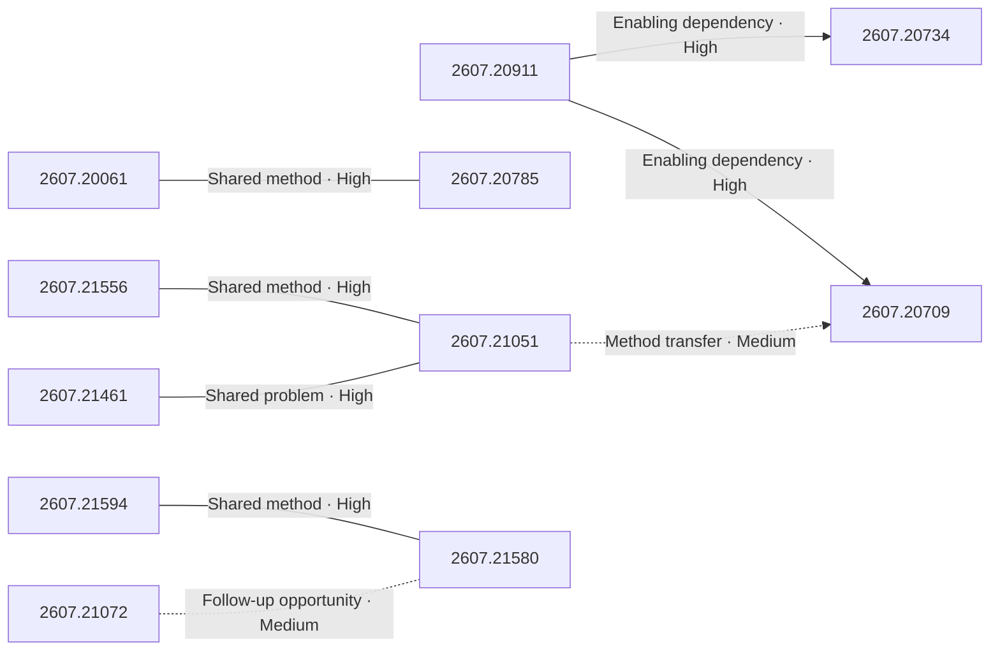

# Paper relationship graph — 2026-07-24

> [← Daily summary](../2026-07-24.md)

> **Interpretation caveat:** Every edge is an evidence-screened editorial hypothesis, not proof of citation, influence, priority, historical use, dependency, or an author-claimed relationship.

## Legend

- Rectangular nodes are current-day papers; rounded nodes are previously seen candidates.
- A line has no technical direction. An arrow shows only a proposed technical flow for an enabling dependency or method transfer.
- Solid edges are high confidence; dotted edges are medium confidence. Confidence evaluates this editorial connection, not either paper.
- Relationship labels:
  - **Shared problem:** `shared_problem`
  - **Shared method:** `shared_method`
  - **Shared evaluation:** `shared_evaluation`
  - **Complementary:** `complementary`
  - **Enabling dependency:** `enabling_dependency`
  - **Method transfer:** `method_transfer`
  - **Assumption tension:** `assumption_tension`
  - **Result tension:** `result_tension`
  - **Shared limitation:** `shared_limitation`
  - **Follow-up opportunity:** `follow_up_opportunity`

## Same-day relationships

| Source paper | Target paper | Relationship | Direction | Confidence |
| --- | --- | --- | --- | --- |
| [2607.20911](2607.20911.md) | [2607.20734](2607.20734.md) | Enabling dependency | Source → target | High |
| [2607.20911](2607.20911.md) | [2607.20709](2607.20709.md) | Enabling dependency | Source → target | High |
| [2607.20061](2607.20061.md) | [2607.20785](2607.20785.md) | Shared method | Not directional | High |
| [2607.21594](2607.21594.md) | [2607.21580](2607.21580.md) | Shared method | Not directional | High |
| [2607.21556](2607.21556.md) | [2607.21051](2607.21051.md) | Shared method | Not directional | High |
| [2607.21461](2607.21461.md) | [2607.21051](2607.21051.md) | Shared problem | Not directional | High |
| [2607.21051](2607.21051.md) | [2607.20709](2607.20709.md) | Method transfer | Source → target | Medium |
| [2607.21072](2607.21072.md) | [2607.21580](2607.21580.md) | Follow-up opportunity | Not directional | Medium |

## Connections to previously seen papers

_The relationship stage failed; no validated edges are available for this section._

## Current paper key

| Paper | Analysis |
| --- | --- |
| 2607.21461 — AREX: Towards a Recursively Self-Improving Agent for Deep Research | [Read analysis](2607.21461.md) |
| 2607.21556 — Visual Contrastive Self-Distillation | [Read analysis](2607.21556.md) |
| 2607.20061 — ReferTrack: Referring Then Tracking for Embodied Visual Tracking | [Read analysis](2607.20061.md) |
| 2607.20911 — Tencent WorkBuddy Bench: A Multi-Domain Coding-Agent Benchmark with Contamination-Resistant Task Construction | [Read analysis](2607.20911.md) |
| 2607.21072 — Show, Don't Tell: Evaluating Spatial Cognition in Generative Pixels Rather Than LLM Text | [Read analysis](2607.21072.md) |
| 2607.12746 — Color Pass-Through via Camera-Display Coupling | [Read analysis](2607.12746.md) |
| 2607.21485 — Recurrent Sinusoidal INRs for Efficient High-Fidelity Representation | [Read analysis](2607.21485.md) |
| 2607.20734 — LLMs Get Lost in Evolving User Intent | [Read analysis](2607.20734.md) |
| 2607.21017 — TableVerse: A Large-scale Tabletop Dataset with Real-world Grounded Layouts for Generalizable Manipulation | [Read analysis](2607.21017.md) |
| 2607.21594 — Streaming Multi-Agent Autoregressive Diffusion Model with World State Registers | [Read analysis](2607.21594.md) |
| 2607.20785 — Robostral Navigate | [Read analysis](2607.20785.md) |
| 2607.20709 — NVIDIA-labs OO Agents: Native Python Object-Oriented Agents | [Read analysis](2607.20709.md) |
| 2607.10848 — Predictive Divergence Masks for LLM RL | [Read analysis](2607.10848.md) |
| 2607.21051 — Sample-Efficient Learning from Agent Experience | [Read analysis](2607.21051.md) |
| 2607.21580 — GraphVid: Interactive Graph-Controllable Video Generation | [Read analysis](2607.21580.md) |

## Current papers without a published edge

- [2607.12746](2607.12746.md)
- [2607.21485](2607.21485.md)
- [2607.21017](2607.21017.md)
- [2607.10848](2607.10848.md)

---

[Support these research summaries on Buy Me a Coffee](https://buymeacoffee.com/vollero)
