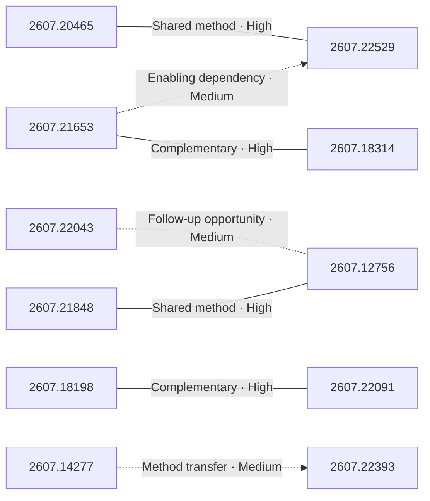

# Paper relationship graph — 2026-07-27

> [← Daily summary](../2026-07-27.md)

> **Interpretation caveat:** Every edge is an evidence-screened editorial hypothesis, not proof of citation, influence, priority, historical use, dependency, or an author-claimed relationship.

## Legend

- Rectangular nodes are current-day papers; rounded nodes are previously seen candidates.
- A line has no technical direction. An arrow shows only a proposed technical flow for an enabling dependency or method transfer.
- Solid edges are high confidence; dotted edges are medium confidence. Confidence evaluates this editorial connection, not either paper.
- Relationship labels:
  - **Shared problem:** `shared_problem`
  - **Shared method:** `shared_method`
  - **Shared evaluation:** `shared_evaluation`
  - **Complementary:** `complementary`
  - **Enabling dependency:** `enabling_dependency`
  - **Method transfer:** `method_transfer`
  - **Assumption tension:** `assumption_tension`
  - **Result tension:** `result_tension`
  - **Shared limitation:** `shared_limitation`
  - **Follow-up opportunity:** `follow_up_opportunity`

## Same-day relationships

| Source paper | Target paper | Relationship | Direction | Confidence |
| --- | --- | --- | --- | --- |
| [2607.21653](2607.21653.md) | [2607.18314](2607.18314.md) | Complementary | Not directional | High |
| [2607.21653](2607.21653.md) | [2607.22529](2607.22529.md) | Enabling dependency | Source → target | Medium |
| [2607.20465](2607.20465.md) | [2607.22529](2607.22529.md) | Shared method | Not directional | High |
| [2607.18198](2607.18198.md) | [2607.22091](2607.22091.md) | Complementary | Not directional | High |
| [2607.21848](2607.21848.md) | [2607.12756](2607.12756.md) | Shared method | Not directional | High |
| [2607.12756](2607.12756.md) | [2607.22043](2607.22043.md) | Follow-up opportunity | Not directional | Medium |
| [2607.14277](2607.14277.md) | [2607.22393](2607.22393.md) | Method transfer | Source → target | Medium |

## Connections to previously seen papers

_The visual diagram is omitted because this graph is too large or dense for a readable snapshot; every edge remains in the table below._

| New paper | Previously seen paper | First seen by service | Relationship | Technical direction | Confidence |
| --- | --- | --- | --- | --- | --- |
| [2607.20465](2607.20465.md) | 2607.16617 ([Hugging Face](https://huggingface.co/papers/2607.16617) · [arXiv](https://arxiv.org/abs/2607.16617)) | 2026-07-22 | Shared problem | Not directional | High |
| [2607.22529](2607.22529.md) | 2607.14777 ([Hugging Face](https://huggingface.co/papers/2607.14777) · [arXiv](https://arxiv.org/abs/2607.14777)) | 2026-07-17 | Shared method | Not directional | High |
| [2607.21653](2607.21653.md) | 2607.18722 ([Hugging Face](https://huggingface.co/papers/2607.18722) · [arXiv](https://arxiv.org/abs/2607.18722)) | 2026-07-22 | Method transfer | Previous → new | High |
| [2607.21503](2607.21503.md) | 2607.10350 ([Hugging Face](https://huggingface.co/papers/2607.10350) · [arXiv](https://arxiv.org/abs/2607.10350)) | 2026-07-14 | Shared method | Not directional | Medium |
| [2607.18198](2607.18198.md) | 2605.16147 ([Hugging Face](https://huggingface.co/papers/2605.16147) · [arXiv](https://arxiv.org/abs/2605.16147)) | 2026-07-16 | Shared evaluation | Not directional | High |
| [2607.14277](2607.14277.md) | 2607.08046 ([Hugging Face](https://huggingface.co/papers/2607.08046) · [arXiv](https://arxiv.org/abs/2607.08046)) | 2026-07-15 | Shared method | Not directional | High |
| [2607.14277](2607.14277.md) | 2607.18213 ([Hugging Face](https://huggingface.co/papers/2607.18213) · [arXiv](https://arxiv.org/abs/2607.18213)) | 2026-07-21 | Shared method | Not directional | High |
| [2607.21848](2607.21848.md) | 2607.18703 ([Hugging Face](https://huggingface.co/papers/2607.18703) · [arXiv](https://arxiv.org/abs/2607.18703)) | 2026-07-22 | Method transfer | New → previous | High |
| [2607.22393](2607.22393.md) | 2607.11594 ([Hugging Face](https://huggingface.co/papers/2607.11594) · [arXiv](https://arxiv.org/abs/2607.11594)) | 2026-07-15 | Shared evaluation | Not directional | Medium |
| [2607.22091](2607.22091.md) | 2607.17972 ([Hugging Face](https://huggingface.co/papers/2607.17972) · [arXiv](https://arxiv.org/abs/2607.17972)) | 2026-07-21 | Shared problem | Not directional | High |
| [2607.12756](2607.12756.md) | 2607.14935 ([Hugging Face](https://huggingface.co/papers/2607.14935) · [arXiv](https://arxiv.org/abs/2607.14935)) | 2026-07-17 | Shared problem | Not directional | Medium |

## Current paper key

| Paper | Analysis |
| --- | --- |
| 2607.20465 — DataPrep-Bench: Benchmarking LLMs as Training Data Preparators | [Read analysis](2607.20465.md) |
| 2607.22529 — Skill Self-Play: Pushing the Frontier of LLM Capability with Co-Evolving Skills | [Read analysis](2607.22529.md) |
| 2607.21653 — Molt: A Scalable PyTorch-Native Training Framework for Agentic Reinforcement Learning | [Read analysis](2607.21653.md) |
| 2607.21503 — Agentic Context Management: Solving Agent Memory and Cost by Treating Them as Lifecycle and Architecture Problems | [Read analysis](2607.21503.md) |
| 2607.18314 — Interactive Training 2: Auditable Control Plane for Live Model Training | [Read analysis](2607.18314.md) |
| 2607.22043 — Scaling Native Multimodal Pre-Training From Scratch | [Read analysis](2607.22043.md) |
| 2607.18198 — Three-Body Scattering for Generative Modeling | [Read analysis](2607.18198.md) |
| 2607.22042 — LAMAR: An Open Language-Aware Multilingual Alignment Reranker | [Read analysis](2607.22042.md) |
| 2607.18142 — O-VAD: Industrial Video Anomaly Detection through Object-Centric Tracking and Reasoning | [Read analysis](2607.18142.md) |
| 2607.14277 — Multi-Head Latent Control: A Unified Interface for LLM Agent Decision Making | [Read analysis](2607.14277.md) |
| 2607.21848 — Closing the Loop: Training-Free Revisit Consistency for Autoregressive Generative Rendering | [Read analysis](2607.21848.md) |
| 2607.22375 — IDEAgent: Agentic Quality-Diversity Search for Research Idea Generation | [Read analysis](2607.22375.md) |
| 2607.22393 — SceneActBench: Can Agents Act on the 3D Scenes They See? | [Read analysis](2607.22393.md) |
| 2607.22091 — Spectral Prior for Reducing Exposure Bias in Diffusion Models | [Read analysis](2607.22091.md) |
| 2607.12756 — VisCo: Leveraging Large Language Models as Intrinsic Encoders for Visual Token Compression | [Read analysis](2607.12756.md) |
| 2607.19636 — Multimodal Speaker Verification as a Threat to Speaker Anonymization | [Read analysis](2607.19636.md) |

## Current papers without a published edge

- [2607.22042](2607.22042.md)
- [2607.18142](2607.18142.md)
- [2607.22375](2607.22375.md)
- [2607.19636](2607.19636.md)

---

[Support these research summaries on Buy Me a Coffee](https://buymeacoffee.com/vollero)
