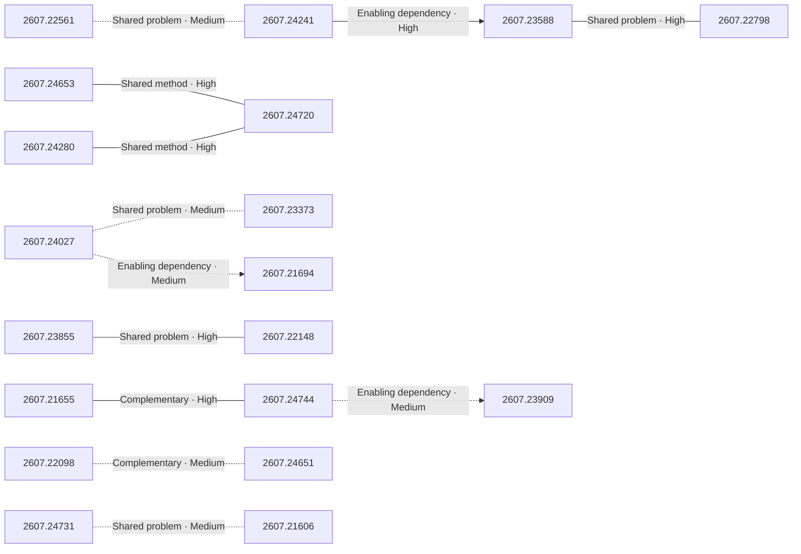

# Paper relationship graph — 2026-07-28

> [← Daily summary](../2026-07-28.md)

> **Interpretation caveat:** Every edge is an evidence-screened editorial hypothesis, not proof of citation, influence, priority, historical use, dependency, or an author-claimed relationship.

## Legend

- Rectangular nodes are current-day papers; rounded nodes are previously seen candidates.
- A line has no technical direction. An arrow shows only a proposed technical flow for an enabling dependency or method transfer.
- Solid edges are high confidence; dotted edges are medium confidence. Confidence evaluates this editorial connection, not either paper.
- Relationship labels:
  - **Shared problem:** `shared_problem`
  - **Shared method:** `shared_method`
  - **Shared evaluation:** `shared_evaluation`
  - **Complementary:** `complementary`
  - **Enabling dependency:** `enabling_dependency`
  - **Method transfer:** `method_transfer`
  - **Assumption tension:** `assumption_tension`
  - **Result tension:** `result_tension`
  - **Shared limitation:** `shared_limitation`
  - **Follow-up opportunity:** `follow_up_opportunity`

## Same-day relationships

| Source paper | Target paper | Relationship | Direction | Confidence |
| --- | --- | --- | --- | --- |
| [2607.23588](2607.23588.md) | [2607.22798](2607.22798.md) | Shared problem | Not directional | High |
| [2607.24653](2607.24653.md) | [2607.24720](2607.24720.md) | Shared method | Not directional | High |
| [2607.24280](2607.24280.md) | [2607.24720](2607.24720.md) | Shared method | Not directional | High |
| [2607.24731](2607.24731.md) | [2607.21606](2607.21606.md) | Shared problem | Not directional | Medium |
| [2607.24027](2607.24027.md) | [2607.23373](2607.23373.md) | Shared problem | Not directional | Medium |
| [2607.23855](2607.23855.md) | [2607.22148](2607.22148.md) | Shared problem | Not directional | High |
| [2607.21655](2607.21655.md) | [2607.24744](2607.24744.md) | Complementary | Not directional | High |
| [2607.22561](2607.22561.md) | [2607.24241](2607.24241.md) | Shared problem | Not directional | Medium |
| [2607.24241](2607.24241.md) | [2607.23588](2607.23588.md) | Enabling dependency | Source → target | High |
| [2607.24027](2607.24027.md) | [2607.21694](2607.21694.md) | Enabling dependency | Source → target | Medium |
| [2607.24744](2607.24744.md) | [2607.23909](2607.23909.md) | Enabling dependency | Source → target | Medium |
| [2607.22098](2607.22098.md) | [2607.24651](2607.24651.md) | Complementary | Not directional | Medium |

## Connections to previously seen papers

_The visual diagram is omitted because this graph is too large or dense for a readable snapshot; every edge remains in the table below._

| New paper | Previously seen paper | First seen by service | Relationship | Technical direction | Confidence |
| --- | --- | --- | --- | --- | --- |
| [2607.23588](2607.23588.md) | 2607.16617 ([Hugging Face](https://huggingface.co/papers/2607.16617) · [arXiv](https://arxiv.org/abs/2607.16617)) | 2026-07-22 | Shared method | Not directional | High |
| [2607.24280](2607.24280.md) | 2607.14777 ([Hugging Face](https://huggingface.co/papers/2607.14777) · [arXiv](https://arxiv.org/abs/2607.14777)) | 2026-07-17 | Shared method | Not directional | High |
| [2607.24280](2607.24280.md) | 2607.13399 ([Hugging Face](https://huggingface.co/papers/2607.13399) · [arXiv](https://arxiv.org/abs/2607.13399)) | 2026-07-17 | Shared method | Not directional | High |
| [2607.24720](2607.24720.md) | 2607.13399 ([Hugging Face](https://huggingface.co/papers/2607.13399) · [arXiv](https://arxiv.org/abs/2607.13399)) | 2026-07-17 | Shared problem | Not directional | High |
| [2607.22798](2607.22798.md) | 2607.20709 ([Hugging Face](https://huggingface.co/papers/2607.20709) · [arXiv](https://arxiv.org/abs/2607.20709)) | 2026-07-24 | Shared method | Not directional | High |
| [2607.24027](2607.24027.md) | 2607.16190 ([Hugging Face](https://huggingface.co/papers/2607.16190) · [arXiv](https://arxiv.org/abs/2607.16190)) | 2026-07-23 | Complementary | Not directional | High |
| [2607.21694](2607.21694.md) | 2607.09362 ([Hugging Face](https://huggingface.co/papers/2607.09362) · [arXiv](https://arxiv.org/abs/2607.09362)) | 2026-07-14 | Complementary | Not directional | High |
| [2607.22148](2607.22148.md) | 2607.14088 ([Hugging Face](https://huggingface.co/papers/2607.14088) · [arXiv](https://arxiv.org/abs/2607.14088)) | 2026-07-20 | Shared method | Not directional | High |
| [2607.24241](2607.24241.md) | 2607.14202 ([Hugging Face](https://huggingface.co/papers/2607.14202) · [arXiv](https://arxiv.org/abs/2607.14202)) | 2026-07-17 | Complementary | Not directional | High |
| [2607.23909](2607.23909.md) | 2607.13960 ([Hugging Face](https://huggingface.co/papers/2607.13960) · [arXiv](https://arxiv.org/abs/2607.13960)) | 2026-07-16 | Shared method | Not directional | High |
| [2607.23373](2607.23373.md) | 2607.12756 ([Hugging Face](https://huggingface.co/papers/2607.12756) · [arXiv](https://arxiv.org/abs/2607.12756)) | 2026-07-27 | Complementary | Not directional | High |
| [2607.22682](2607.22682.md) | 2607.12227 ([Hugging Face](https://huggingface.co/papers/2607.12227) · [arXiv](https://arxiv.org/abs/2607.12227)) | 2026-07-17 | Complementary | Not directional | High |

## Current paper key

| Paper | Analysis |
| --- | --- |
| 2607.24653 — Kimi K3: Open Frontier Intelligence | [Read analysis](2607.24653.md) |
| 2607.23588 — JarvisHub: An Open Harness for Canvas-Native Multimodal Creative Agents | [Read analysis](2607.23588.md) |
| 2607.24280 — From Proprietary to Open-Source: Bridging the Distribution Gap via Multi-Agent Protocol Distillation in Agentic Search | [Read analysis](2607.24280.md) |
| 2607.24731 — Rethinking Classifier-Free Guidance in On-Policy Diffusion Distillation | [Read analysis](2607.24731.md) |
| 2607.21655 — Progress Reward Modeling for Robotic Learning: A Comprehensive Survey | [Read analysis](2607.21655.md) |
| 2607.22798 — StateAct: Program State, before Pixels, for Long-Horizon Computer-Use Agents | [Read analysis](2607.22798.md) |
| 2607.24744 — Data Pyramid for Embodied Manipulation | [Read analysis](2607.24744.md) |
| 2607.24027 — Sol-Attn: Accelerating Video Generation Inference via On-the-Fly Attention Sparsification | [Read analysis](2607.24027.md) |
| 2607.23855 — OmniVAE: An Audio-Video VAE with Cross-Modal Alignment for Joint Generation | [Read analysis](2607.23855.md) |
| 2607.21694 — Oxygen-TryOn: Fashion-Native Foundation Model for Any-item Virtual Try-On | [Read analysis](2607.21694.md) |
| 2607.24720 — The Physics of Multi-Turn Long-Horizon Planning: From Pre-training to Post-training via Single- and Multi-Teacher On-Policy Agentic Distillation | [Read analysis](2607.24720.md) |
| 2607.23518 — Chamaileon: Cross-Context Binder Design with Contextualized Modeling and Mixed Sampling | [Read analysis](2607.23518.md) |
| 2607.22148 — dRAE: Representation Autoencoder with Hyper-Spherical Codes | [Read analysis](2607.22148.md) |
| 2607.24516 — DecoupleMix: Decoupled Ratio Search and Convex Allocation for Scalable VLM Data Recipes | [Read analysis](2607.24516.md) |
| 2607.22098 — Reasoning Denoiser: Denoising Reasoning Traces for Hallucination Detection in Large Reasoning Models | [Read analysis](2607.22098.md) |
| 2607.22561 — Codifying the Judge: Scalable Evaluation via Program Distillation | [Read analysis](2607.22561.md) |
| 2607.24743 — ClinFusion: A Vision-Centric Multimodal LLM System for Holistic Medical Understanding | [Read analysis](2607.24743.md) |
| 2607.24241 — FilmBench: A Film-Grade Benchmark for Cinematic Video Generation | [Read analysis](2607.24241.md) |
| 2607.23806 — A Frozen 12B Beats Frontier Models on Verified Work: 100% Accuracy, 0 Tokens, Bit-Exact, Forever | [Read analysis](2607.23806.md) |
| 2607.23687 — GNM Head: A Generative aNthropometric Model of the human head | [Read analysis](2607.23687.md) |
| 2607.21936 — Leveraging External Knowledge for Historical Document Restoration via Retrieval-Augmented Large Language Models | [Read analysis](2607.21936.md) |
| 2607.24651 — Evidence Attribution in Visual Document Understanding without Coordinates or Region Labels | [Read analysis](2607.24651.md) |
| 2607.23242 — IndicTalk: A Large-Scale Persona-Based Multilingual Conversational Corpus for Indic Languages | [Read analysis](2607.23242.md) |
| 2607.22639 — TRACE: Business Rule-Grounded Reasoning Curriculum for Knowledge-Preserving Parametric Tool Retrieval in Enterprise LLMs | [Read analysis](2607.22639.md) |
| 2607.23402 — Characterizing Warp Divergence from Pascal to Blackwell | [Read analysis](2607.23402.md) |
| 2607.23370 — Bitcoin Price Direction Prediction via Regime-Aware Multi-Modal Fusion of Social Sentiment and Technical Features | [Read analysis](2607.23370.md) |
| 2607.23373 — UltraViT: Latency-Optimized On-device Vision Encoder for Large Vision-Language Models | [Read analysis](2607.23373.md) |
| 2607.22682 — A Vocabulary for Multi-Agent Automated Research Systems | [Read analysis](2607.22682.md) |
| 2607.23909 — WorldDiT: A Unified Diffusion Architecture for World and Action Modeling | [Read analysis](2607.23909.md) |
| 2607.23822 — DriveDNA: A Large-Scale Multimodal Naturalistic Driving Dataset and Benchmark for Driving Style Identification | [Read analysis](2607.23822.md) |
| 2607.21606 — TILT: Improving Compositional Generation in Diffusion Models with a Model-Intrinsic Reward | [Read analysis](2607.21606.md) |

## Current papers without a published edge

- [2607.23518](2607.23518.md)
- [2607.24516](2607.24516.md)
- [2607.24743](2607.24743.md)
- [2607.23806](2607.23806.md)
- [2607.23687](2607.23687.md)
- [2607.21936](2607.21936.md)
- [2607.23242](2607.23242.md)
- [2607.22639](2607.22639.md)
- [2607.23402](2607.23402.md)
- [2607.23370](2607.23370.md)
- [2607.23822](2607.23822.md)

---

[Support these research summaries on Buy Me a Coffee](https://buymeacoffee.com/vollero)
