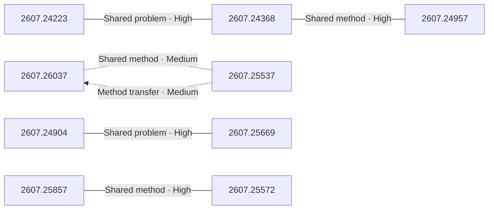

# Paper relationship graph — 2026-07-29

> [← Daily summary](../2026-07-29.md)

> **Interpretation caveat:** Every edge is an evidence-screened editorial hypothesis, not proof of citation, influence, priority, historical use, dependency, or an author-claimed relationship.

## Legend

- Rectangular nodes are current-day papers; rounded nodes are previously seen candidates.
- A line has no technical direction. An arrow shows only a proposed technical flow for an enabling dependency or method transfer.
- Solid edges are high confidence; dotted edges are medium confidence. Confidence evaluates this editorial connection, not either paper.
- Relationship labels:
  - **Shared problem:** `shared_problem`
  - **Shared method:** `shared_method`
  - **Shared evaluation:** `shared_evaluation`
  - **Complementary:** `complementary`
  - **Enabling dependency:** `enabling_dependency`
  - **Method transfer:** `method_transfer`
  - **Assumption tension:** `assumption_tension`
  - **Result tension:** `result_tension`
  - **Shared limitation:** `shared_limitation`
  - **Follow-up opportunity:** `follow_up_opportunity`

## Same-day relationships

| Source paper | Target paper | Relationship | Direction | Confidence |
| --- | --- | --- | --- | --- |
| [2607.24223](2607.24223.md) | [2607.24368](2607.24368.md) | Shared problem | Not directional | High |
| [2607.24368](2607.24368.md) | [2607.24957](2607.24957.md) | Shared method | Not directional | High |
| [2607.24904](2607.24904.md) | [2607.25669](2607.25669.md) | Shared problem | Not directional | High |
| [2607.26037](2607.26037.md) | [2607.25537](2607.25537.md) | Shared method | Not directional | Medium |
| [2607.25857](2607.25857.md) | [2607.25572](2607.25572.md) | Shared method | Not directional | High |
| [2607.25537](2607.25537.md) | [2607.26037](2607.26037.md) | Method transfer | Source → target | Medium |

## Connections to previously seen papers

_The visual diagram is omitted because this graph is too large or dense for a readable snapshot; every edge remains in the table below._

| New paper | Previously seen paper | First seen by service | Relationship | Technical direction | Confidence |
| --- | --- | --- | --- | --- | --- |
| [2607.25895](2607.25895.md) | 2607.24744 ([Hugging Face](https://huggingface.co/papers/2607.24744) · [arXiv](https://arxiv.org/abs/2607.24744)) | 2026-07-28 | Shared problem | Not directional | High |
| [2607.25895](2607.25895.md) | 2607.15330 ([Hugging Face](https://huggingface.co/papers/2607.15330) · [arXiv](https://arxiv.org/abs/2607.15330)) | 2026-07-20 | Shared method | Not directional | High |
| [2607.24223](2607.24223.md) | 2607.10463 ([Hugging Face](https://huggingface.co/papers/2607.10463) · [arXiv](https://arxiv.org/abs/2607.10463)) | 2026-07-17 | Complementary | Not directional | High |
| [2607.24368](2607.24368.md) | 2607.21503 ([Hugging Face](https://huggingface.co/papers/2607.21503) · [arXiv](https://arxiv.org/abs/2607.21503)) | 2026-07-27 | Assumption tension | Not directional | High |
| [2607.24904](2607.24904.md) | 2607.14935 ([Hugging Face](https://huggingface.co/papers/2607.14935) · [arXiv](https://arxiv.org/abs/2607.14935)) | 2026-07-17 | Shared method | Not directional | High |
| [2607.26037](2607.26037.md) | 2607.19191 ([Hugging Face](https://huggingface.co/papers/2607.19191) · [arXiv](https://arxiv.org/abs/2607.19191)) | 2026-07-22 | Shared problem | Not directional | High |
| [2607.26037](2607.26037.md) | 2607.18367 ([Hugging Face](https://huggingface.co/papers/2607.18367) · [arXiv](https://arxiv.org/abs/2607.18367)) | 2026-07-22 | Shared method | Not directional | High |
| [2607.24957](2607.24957.md) | 2607.08317 ([Hugging Face](https://huggingface.co/papers/2607.08317) · [arXiv](https://arxiv.org/abs/2607.08317)) | 2026-07-15 | Shared method | Not directional | High |
| [2607.25857](2607.25857.md) | 2607.05910 ([Hugging Face](https://huggingface.co/papers/2607.05910) · [arXiv](https://arxiv.org/abs/2607.05910)) | 2026-07-16 | Shared problem | Not directional | High |
| [2607.25537](2607.25537.md) | 2607.19790 ([Hugging Face](https://huggingface.co/papers/2607.19790) · [arXiv](https://arxiv.org/abs/2607.19790)) | 2026-07-23 | Follow-up opportunity | Not directional | High |
| [2607.25091](2607.25091.md) | 2607.18722 ([Hugging Face](https://huggingface.co/papers/2607.18722) · [arXiv](https://arxiv.org/abs/2607.18722)) | 2026-07-22 | Complementary | Not directional | High |
| [2607.25669](2607.25669.md) | 2607.12756 ([Hugging Face](https://huggingface.co/papers/2607.12756) · [arXiv](https://arxiv.org/abs/2607.12756)) | 2026-07-27 | Complementary | Not directional | High |

## Current paper key

| Paper | Analysis |
| --- | --- |
| 2607.25895 — HiFi-UMI: Learning Deployable Manipulation Policies from High-Fidelity UMI Data Alone | [Read analysis](2607.25895.md) |
| 2607.24223 — A New Role for Relevance: Guiding Corpus Interaction in Agentic Search | [Read analysis](2607.24223.md) |
| 2607.25565 — ReDesign: Recovering Editable Design Structures from Images via Agentic Decomposition | [Read analysis](2607.25565.md) |
| 2607.24368 — Keep It InMind: Benchmarking the Implicit-Association Blind Spot in Agent Memory | [Read analysis](2607.24368.md) |
| 2607.24904 — Mage-VL: An Efficient Codec-Native Streaming Multimodal Foundation Model | [Read analysis](2607.24904.md) |
| 2607.26037 — Wonder: Video World Model Done Better | [Read analysis](2607.26037.md) |
| 2607.24957 — PerceptionBench: Evaluating Atomic Visual Perception in Multimodal Large Language Models | [Read analysis](2607.24957.md) |
| 2607.25857 — Shieldstral | [Read analysis](2607.25857.md) |
| 2607.25537 — Visual prompt engineering for video models | [Read analysis](2607.25537.md) |
| 2607.25091 — Towards Robust Reinforcement Learning for Small-Scale Language Model Agents | [Read analysis](2607.25091.md) |
| 2607.25669 — OmniDelta: Skill-Driven Budget Allocation for Token Compression in OmniLLMs | [Read analysis](2607.25669.md) |
| 2607.25572 — Mapping CVEs to MITRE ATT&amp;CK Techniques: A Curated Gold-Set Classifier and the Limits of LLM-Assisted Label Expansion | [Read analysis](2607.25572.md) |

## Current papers without a published edge

- [2607.25565](2607.25565.md)

---

[Support these research summaries on Buy Me a Coffee](https://buymeacoffee.com/vollero)
