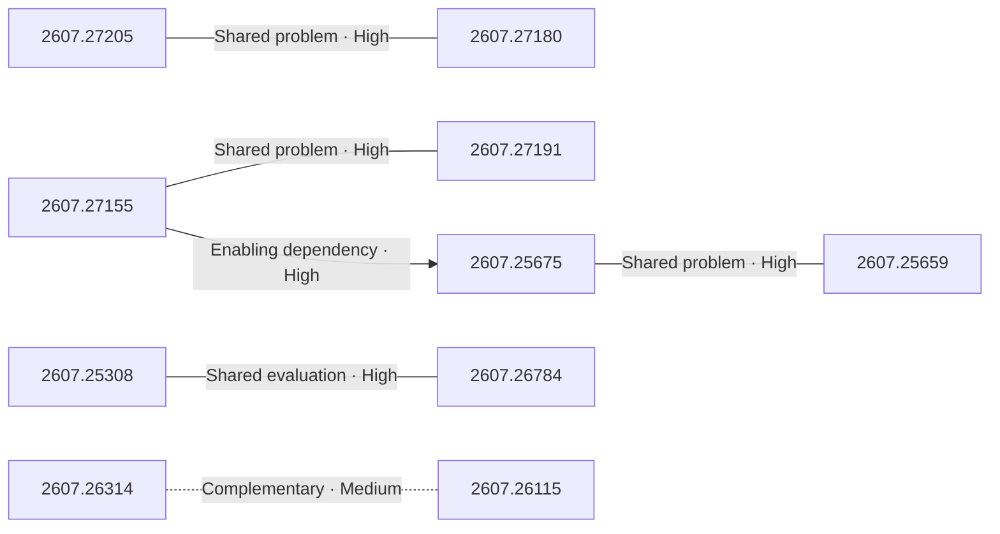
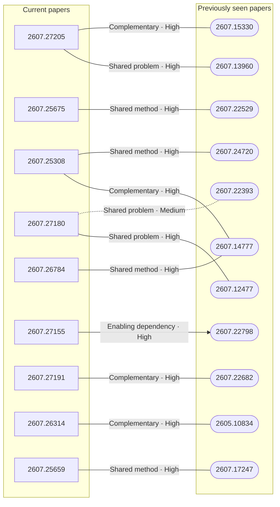

# Paper relationship graph — 2026-07-30

> [← Daily summary](../2026-07-30.md)

> **Interpretation caveat:** Every edge is an evidence-screened editorial hypothesis, not proof of citation, influence, priority, historical use, dependency, or an author-claimed relationship.

## Legend

- Rectangular nodes are current-day papers; rounded nodes are previously seen candidates.
- A line has no technical direction. An arrow shows only a proposed technical flow for an enabling dependency or method transfer.
- Solid edges are high confidence; dotted edges are medium confidence. Confidence evaluates this editorial connection, not either paper.
- Relationship labels:
  - **Shared problem:** `shared_problem`
  - **Shared method:** `shared_method`
  - **Shared evaluation:** `shared_evaluation`
  - **Complementary:** `complementary`
  - **Enabling dependency:** `enabling_dependency`
  - **Method transfer:** `method_transfer`
  - **Assumption tension:** `assumption_tension`
  - **Result tension:** `result_tension`
  - **Shared limitation:** `shared_limitation`
  - **Follow-up opportunity:** `follow_up_opportunity`

## Same-day relationships

| Source paper | Target paper | Relationship | Direction | Confidence |
| --- | --- | --- | --- | --- |
| [2607.27205](2607.27205.md) | [2607.27180](2607.27180.md) | Shared problem | Not directional | High |
| [2607.25308](2607.25308.md) | [2607.26784](2607.26784.md) | Shared evaluation | Not directional | High |
| [2607.25675](2607.25675.md) | [2607.25659](2607.25659.md) | Shared problem | Not directional | High |
| [2607.27155](2607.27155.md) | [2607.27191](2607.27191.md) | Shared problem | Not directional | High |
| [2607.26314](2607.26314.md) | [2607.26115](2607.26115.md) | Complementary | Not directional | Medium |
| [2607.27155](2607.27155.md) | [2607.25675](2607.25675.md) | Enabling dependency | Source → target | High |

## Connections to previously seen papers

| New paper | Previously seen paper | First seen by service | Relationship | Technical direction | Confidence |
| --- | --- | --- | --- | --- | --- |
| [2607.27205](2607.27205.md) | 2607.13960 ([Hugging Face](https://huggingface.co/papers/2607.13960) · [arXiv](https://arxiv.org/abs/2607.13960)) | 2026-07-16 | Shared problem | Not directional | High |
| [2607.27205](2607.27205.md) | 2607.15330 ([Hugging Face](https://huggingface.co/papers/2607.15330) · [arXiv](https://arxiv.org/abs/2607.15330)) | 2026-07-20 | Complementary | Not directional | High |
| [2607.25308](2607.25308.md) | 2607.14777 ([Hugging Face](https://huggingface.co/papers/2607.14777) · [arXiv](https://arxiv.org/abs/2607.14777)) | 2026-07-17 | Complementary | Not directional | High |
| [2607.25308](2607.25308.md) | 2607.24720 ([Hugging Face](https://huggingface.co/papers/2607.24720) · [arXiv](https://arxiv.org/abs/2607.24720)) | 2026-07-28 | Shared method | Not directional | High |
| [2607.27180](2607.27180.md) | 2607.12477 ([Hugging Face](https://huggingface.co/papers/2607.12477) · [arXiv](https://arxiv.org/abs/2607.12477)) | 2026-07-16 | Shared problem | Not directional | High |
| [2607.27180](2607.27180.md) | 2607.22393 ([Hugging Face](https://huggingface.co/papers/2607.22393) · [arXiv](https://arxiv.org/abs/2607.22393)) | 2026-07-27 | Shared problem | Not directional | Medium |
| [2607.26784](2607.26784.md) | 2607.14777 ([Hugging Face](https://huggingface.co/papers/2607.14777) · [arXiv](https://arxiv.org/abs/2607.14777)) | 2026-07-17 | Shared method | Not directional | High |
| [2607.25675](2607.25675.md) | 2607.22529 ([Hugging Face](https://huggingface.co/papers/2607.22529) · [arXiv](https://arxiv.org/abs/2607.22529)) | 2026-07-27 | Shared method | Not directional | High |
| [2607.27155](2607.27155.md) | 2607.22798 ([Hugging Face](https://huggingface.co/papers/2607.22798) · [arXiv](https://arxiv.org/abs/2607.22798)) | 2026-07-28 | Enabling dependency | New → previous | High |
| [2607.27191](2607.27191.md) | 2607.22682 ([Hugging Face](https://huggingface.co/papers/2607.22682) · [arXiv](https://arxiv.org/abs/2607.22682)) | 2026-07-28 | Complementary | Not directional | High |
| [2607.26314](2607.26314.md) | 2605.10834 ([Hugging Face](https://huggingface.co/papers/2605.10834) · [arXiv](https://arxiv.org/abs/2605.10834)) | 2026-07-16 | Complementary | Not directional | High |
| [2607.25659](2607.25659.md) | 2607.17247 ([Hugging Face](https://huggingface.co/papers/2607.17247) · [arXiv](https://arxiv.org/abs/2607.17247)) | 2026-07-21 | Shared method | Not directional | High |

## Current paper key

| Paper | Analysis |
| --- | --- |
| 2607.27205 — TurboVLA: Real-Time Vision-Language-Action Model at 32 Hz on an RTX 4090 with &lt;1 GB VRAM | [Read analysis](2607.27205.md) |
| 2607.25675 — DecoEvo: Score-Decoupled Co-Evolution of Solver and Rubric-Generator Skills in Text Space | [Read analysis](2607.25675.md) |
| 2607.25308 — CAST: Game Solvers as Turn-Level Teachers for LLM Agents | [Read analysis](2607.25308.md) |
| 2607.27180 — HumanCLAW: Can Vision-Language Models Act Through a Body? | [Read analysis](2607.27180.md) |
| 2607.26784 — SkillRise: Agentic Reinforcement Learning for Cross-Task Skill Evolution | [Read analysis](2607.26784.md) |
| 2607.27155 — OmegaUse-OfficeVal: Benchmarking LLM Agents on Long-Horizon Office-Suite Tasks with Economic Grounding | [Read analysis](2607.27155.md) |
| 2607.27191 — Can AI agents conduct open-ended AI research? Early evidence from two case studies | [Read analysis](2607.27191.md) |
| 2607.26314 — StealthBench: Measuring Operational Stealth in Autonomous Offensive-Security Agents | [Read analysis](2607.26314.md) |
| 2607.26115 — GPT-Red: Automated Red Teaming via Self-Play at Scale | [Read analysis](2607.26115.md) |
| 2607.25802 — Explicit Layer Modeling for Video Object Insertion and Layer Decomposition | [Read analysis](2607.25802.md) |
| 2607.25659 — CoRT: Counterfactual Replay for Token-Level Rubric-Guided Policy Optimization | [Read analysis](2607.25659.md) |

## Current papers without a published edge

- [2607.25802](2607.25802.md)

---

[Support these research summaries on Buy Me a Coffee](https://buymeacoffee.com/vollero)
