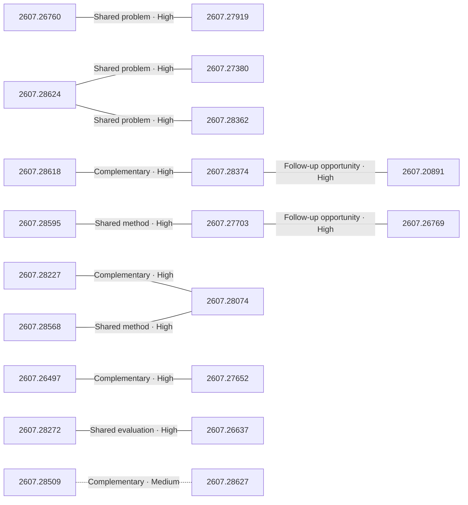

# Paper relationship graph — 2026-07-31

> [← Daily summary](../2026-07-31.md)

> **Interpretation caveat:** Every edge is an evidence-screened editorial hypothesis, not proof of citation, influence, priority, historical use, dependency, or an author-claimed relationship.

## Legend

- Rectangular nodes are current-day papers; rounded nodes are previously seen candidates.
- A line has no technical direction. An arrow shows only a proposed technical flow for an enabling dependency or method transfer.
- Solid edges are high confidence; dotted edges are medium confidence. Confidence evaluates this editorial connection, not either paper.
- Relationship labels:
  - **Shared problem:** `shared_problem`
  - **Shared method:** `shared_method`
  - **Shared evaluation:** `shared_evaluation`
  - **Complementary:** `complementary`
  - **Enabling dependency:** `enabling_dependency`
  - **Method transfer:** `method_transfer`
  - **Assumption tension:** `assumption_tension`
  - **Result tension:** `result_tension`
  - **Shared limitation:** `shared_limitation`
  - **Follow-up opportunity:** `follow_up_opportunity`

## Same-day relationships

| Source paper | Target paper | Relationship | Direction | Confidence |
| --- | --- | --- | --- | --- |
| [2607.28624](2607.28624.md) | [2607.27380](2607.27380.md) | Shared problem | Not directional | High |
| [2607.28624](2607.28624.md) | [2607.28362](2607.28362.md) | Shared problem | Not directional | High |
| [2607.26760](2607.26760.md) | [2607.27919](2607.27919.md) | Shared problem | Not directional | High |
| [2607.28272](2607.28272.md) | [2607.26637](2607.26637.md) | Shared evaluation | Not directional | High |
| [2607.28227](2607.28227.md) | [2607.28074](2607.28074.md) | Complementary | Not directional | High |
| [2607.28568](2607.28568.md) | [2607.28074](2607.28074.md) | Shared method | Not directional | High |
| [2607.28595](2607.28595.md) | [2607.27703](2607.27703.md) | Shared method | Not directional | High |
| [2607.27703](2607.27703.md) | [2607.26769](2607.26769.md) | Follow-up opportunity | Not directional | High |
| [2607.28618](2607.28618.md) | [2607.28374](2607.28374.md) | Complementary | Not directional | High |
| [2607.20891](2607.20891.md) | [2607.28374](2607.28374.md) | Follow-up opportunity | Not directional | High |
| [2607.26497](2607.26497.md) | [2607.27652](2607.27652.md) | Complementary | Not directional | High |
| [2607.28627](2607.28627.md) | [2607.28509](2607.28509.md) | Complementary | Not directional | Medium |

## Connections to previously seen papers

_The visual diagram is omitted because this graph is too large or dense for a readable snapshot; every edge remains in the table below._

| New paper | Previously seen paper | First seen by service | Relationship | Technical direction | Confidence |
| --- | --- | --- | --- | --- | --- |
| [2607.28568](2607.28568.md) | 2607.15524 ([Hugging Face](https://huggingface.co/papers/2607.15524) · [arXiv](https://arxiv.org/abs/2607.15524)) | 2026-07-20 | Shared problem | Not directional | High |
| [2607.28022](2607.28022.md) | 2607.13399 ([Hugging Face](https://huggingface.co/papers/2607.13399) · [arXiv](https://arxiv.org/abs/2607.13399)) | 2026-07-17 | Shared method | Not directional | High |
| [2607.28624](2607.28624.md) | 2607.14187 ([Hugging Face](https://huggingface.co/papers/2607.14187) · [arXiv](https://arxiv.org/abs/2607.14187)) | 2026-07-17 | Complementary | Not directional | High |
| [2607.27380](2607.27380.md) | 2607.14387 ([Hugging Face](https://huggingface.co/papers/2607.14387) · [arXiv](https://arxiv.org/abs/2607.14387)) | 2026-07-17 | Method transfer | Previous → new | High |
| [2607.28227](2607.28227.md) | 2607.22798 ([Hugging Face](https://huggingface.co/papers/2607.22798) · [arXiv](https://arxiv.org/abs/2607.22798)) | 2026-07-28 | Shared method | Not directional | High |
| [2607.27652](2607.27652.md) | 2607.10463 ([Hugging Face](https://huggingface.co/papers/2607.10463) · [arXiv](https://arxiv.org/abs/2607.10463)) | 2026-07-17 | Shared problem | Not directional | High |
| [2607.26637](2607.26637.md) | 2607.21503 ([Hugging Face](https://huggingface.co/papers/2607.21503) · [arXiv](https://arxiv.org/abs/2607.21503)) | 2026-07-27 | Shared problem | Not directional | High |
| [2607.28272](2607.28272.md) | 2607.26784 ([Hugging Face](https://huggingface.co/papers/2607.26784) · [arXiv](https://arxiv.org/abs/2607.26784)) | 2026-07-30 | Shared method | Not directional | High |
| [2607.26056](2607.26056.md) | 2607.23909 ([Hugging Face](https://huggingface.co/papers/2607.23909) · [arXiv](https://arxiv.org/abs/2607.23909)) | 2026-07-28 | Complementary | Not directional | High |
| [2607.28625](2607.28625.md) | 2607.24744 ([Hugging Face](https://huggingface.co/papers/2607.24744) · [arXiv](https://arxiv.org/abs/2607.24744)) | 2026-07-28 | Complementary | Not directional | High |
| [2607.28611](2607.28611.md) | 2607.24653 ([Hugging Face](https://huggingface.co/papers/2607.24653) · [arXiv](https://arxiv.org/abs/2607.24653)) | 2026-07-28 | Shared method | Not directional | High |
| [2607.27230](2607.27230.md) | 2607.24653 ([Hugging Face](https://huggingface.co/papers/2607.24653) · [arXiv](https://arxiv.org/abs/2607.24653)) | 2026-07-28 | Method transfer | New → previous | High |

## Current paper key

| Paper | Analysis |
| --- | --- |
| 2607.28624 — PhiZero: A World Model Built Around Physical Language | [Read analysis](2607.28624.md) |
| 2607.28568 — Frontis-MA1: Training an AI4AI Model towards Recursive Self-Improvement in Machine Learning Engineering | [Read analysis](2607.28568.md) |
| 2607.26760 — Metis: Memory Foundation Model | [Read analysis](2607.26760.md) |
| 2607.28618 — AskChem: Claim-Centered Infrastructure for Chemistry Literature Synthesis | [Read analysis](2607.28618.md) |
| 2607.28227 — Qwen-UI-Agent Technical Report: Toward Next-Generation Real-World Centric Foundation GUI Agents | [Read analysis](2607.28227.md) |
| 2607.27380 — VideoCoCo: Code-as-CoT for Physically-Consistent Video Generation via an Agentic Dual-Engine System | [Read analysis](2607.27380.md) |
| 2607.28595 — Beacon: Knowing When and How to Perform Agentic Visual Reasoning | [Read analysis](2607.28595.md) |
| 2607.27919 — Memory Decoder at Scale: A Pretrained, Parametric Long-Term Memory | [Read analysis](2607.27919.md) |
| 2607.26497 — BM25 Wins at Scale: A Scaling Study of Retrieval-Augmented Generation Paradigms | [Read analysis](2607.26497.md) |
| 2607.27616 — MPIE-Bench: Benchmarking Anatomically Plausible Multi-Person Interaction Editing | [Read analysis](2607.27616.md) |
| 2607.28625 — ACE-Data-0: Human-Centric Ambient Capture as Embodied Data Engine | [Read analysis](2607.28625.md) |
| 2607.28022 — Flux-OPD: On-Policy Distillation with Evolving Contexts | [Read analysis](2607.28022.md) |
| 2607.27816 — Beyond Borrowed Histories: Person-Aligned User Simulation for Interactive Role-Playing Evaluation | [Read analysis](2607.27816.md) |
| 2607.28509 — RefCaptioner: Multi-Reference Image-Grounded Video Captioning | [Read analysis](2607.28509.md) |
| 2607.27703 — SpatialCLI: Learning to Reason With Spatial Tools, Then Without Them | [Read analysis](2607.27703.md) |
| 2607.28362 — ShadowDancer: Teaching Video World Models Any Action by Learning Unified Dynamics Representations from a Video and Its Shadow | [Read analysis](2607.28362.md) |
| 2607.28272 — MemHarness: Memory Is Reconstructed, Not Replayed | [Read analysis](2607.28272.md) |
| 2607.26056 — INTACT: Isomorphic Intent-to-Action Learning for Search-Free World Models | [Read analysis](2607.26056.md) |
| 2607.28410 — Can Large Language Models Execute Parent Orders? | [Read analysis](2607.28410.md) |
| 2607.28611 — Chimera: Designing and Chinchilla-Scaling Hybrid Visual Diffusion Transformers | [Read analysis](2607.28611.md) |
| 2607.28374 — LEDGERMIND: Provenance-Constrained Multimodal Agentic Reasoning with a Structured Evidence Ledger | [Read analysis](2607.28374.md) |
| 2607.28074 — Echoverse: Deep, Evolving Environments for Training Computer-Use Agents at Scale | [Read analysis](2607.28074.md) |
| 2607.26627 — Revisiting Lossy Verification in Speculative Decoding: Mechanisms, Trade-offs, and Failure Modes | [Read analysis](2607.26627.md) |
| 2607.27230 — Multi-Head Attention Residuals | [Read analysis](2607.27230.md) |
| 2607.27652 — Harness-G: A Graph-Structured Harness for Search Agents | [Read analysis](2607.27652.md) |
| 2607.27372 — Explorative Modeling: Unlocking a Third Pretraining Axis and End-to-End Generation | [Read analysis](2607.27372.md) |
| 2607.26769 — See2Think: Do Multimodal Models Really Use Intermediate Visual States? | [Read analysis](2607.26769.md) |
| 2607.26637 — Filesystem-Based Memory for LLM Agents: Organization, Evolution, and Sustainability | [Read analysis](2607.26637.md) |
| 2607.28627 — ReToken: One Token to Improve Vision-Language Models for Visual Retrieval | [Read analysis](2607.28627.md) |
| 2607.20891 — Is Deep Research Reliable? Misleading Knowledge Induces False Conclusions | [Read analysis](2607.20891.md) |
| 2607.18806 — AI Tour Meeting: Group Travel Planning by LLM Agents | [Read analysis](2607.18806.md) |
| 2607.25289 — AMRD: Adaptive Multi-Teacher Relational Distillation for Lightweight Speech Emotion Recognition | [Read analysis](2607.25289.md) |
| 2607.16922 — Pedestrian Archetypes Extension -- More Pedestrian Models for Autonomous Vehicle Safety Testing | [Read analysis](2607.16922.md) |

## Current papers without a published edge

- [2607.27616](2607.27616.md)
- [2607.27816](2607.27816.md)
- [2607.28410](2607.28410.md)
- [2607.26627](2607.26627.md)
- [2607.27372](2607.27372.md)
- [2607.18806](2607.18806.md)
- [2607.25289](2607.25289.md)
- [2607.16922](2607.16922.md)

---

[Support these research summaries on Buy Me a Coffee](https://buymeacoffee.com/vollero)
