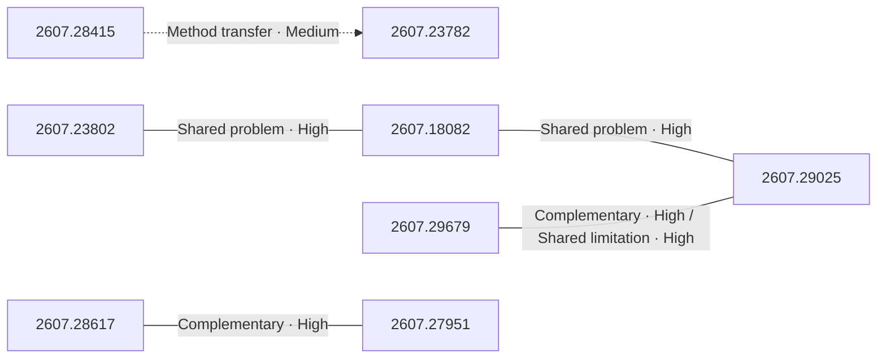
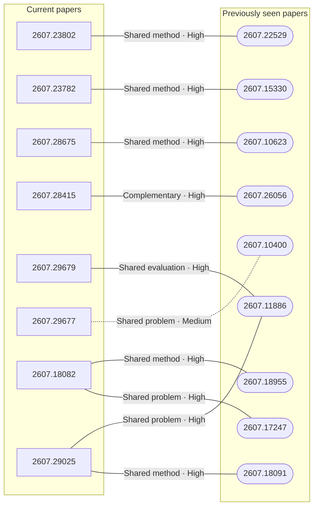

# Paper relationship graph — 2026-08-03

> [← Daily summary](../2026-08-03.md)

> **Interpretation caveat:** Every edge is an evidence-screened editorial hypothesis, not proof of citation, influence, priority, historical use, dependency, or an author-claimed relationship.

## Legend

- Rectangular nodes are current-day papers; rounded nodes are previously seen candidates.
- A line has no technical direction. An arrow shows only a proposed technical flow for an enabling dependency or method transfer.
- Solid edges are high confidence; dotted edges are medium confidence. Confidence evaluates this editorial connection, not either paper.
- Relationship labels:
  - **Shared problem:** `shared_problem`
  - **Shared method:** `shared_method`
  - **Shared evaluation:** `shared_evaluation`
  - **Complementary:** `complementary`
  - **Enabling dependency:** `enabling_dependency`
  - **Method transfer:** `method_transfer`
  - **Assumption tension:** `assumption_tension`
  - **Result tension:** `result_tension`
  - **Shared limitation:** `shared_limitation`
  - **Follow-up opportunity:** `follow_up_opportunity`

## Same-day relationships

| Source paper | Target paper | Relationship | Direction | Confidence |
| --- | --- | --- | --- | --- |
| [2607.23802](2607.23802.md) | [2607.18082](2607.18082.md) | Shared problem | Not directional | High |
| [2607.18082](2607.18082.md) | [2607.29025](2607.29025.md) | Shared problem | Not directional | High |
| [2607.29679](2607.29679.md) | [2607.29025](2607.29025.md) | Complementary | Not directional | High |
| [2607.28415](2607.28415.md) | [2607.23782](2607.23782.md) | Method transfer | Source → target | Medium |
| [2607.28617](2607.28617.md) | [2607.27951](2607.27951.md) | Complementary | Not directional | High |
| [2607.29679](2607.29679.md) | [2607.29025](2607.29025.md) | Shared limitation | Not directional | High |

## Connections to previously seen papers

| New paper | Previously seen paper | First seen by service | Relationship | Technical direction | Confidence |
| --- | --- | --- | --- | --- | --- |
| [2607.23802](2607.23802.md) | 2607.22529 ([Hugging Face](https://huggingface.co/papers/2607.22529) · [arXiv](https://arxiv.org/abs/2607.22529)) | 2026-07-27 | Shared method | Not directional | High |
| [2607.23782](2607.23782.md) | 2607.15330 ([Hugging Face](https://huggingface.co/papers/2607.15330) · [arXiv](https://arxiv.org/abs/2607.15330)) | 2026-07-20 | Shared method | Not directional | High |
| [2607.28675](2607.28675.md) | 2607.10623 ([Hugging Face](https://huggingface.co/papers/2607.10623) · [arXiv](https://arxiv.org/abs/2607.10623)) | 2026-07-14 | Shared method | Not directional | High |
| [2607.28415](2607.28415.md) | 2607.26056 ([Hugging Face](https://huggingface.co/papers/2607.26056) · [arXiv](https://arxiv.org/abs/2607.26056)) | 2026-07-31 | Complementary | Not directional | High |
| [2607.29679](2607.29679.md) | 2607.11886 ([Hugging Face](https://huggingface.co/papers/2607.11886) · [arXiv](https://arxiv.org/abs/2607.11886)) | 2026-07-15 | Shared evaluation | Not directional | High |
| [2607.29677](2607.29677.md) | 2607.10400 ([Hugging Face](https://huggingface.co/papers/2607.10400) · [arXiv](https://arxiv.org/abs/2607.10400)) | 2026-07-15 | Shared problem | Not directional | Medium |
| [2607.18082](2607.18082.md) | 2607.17247 ([Hugging Face](https://huggingface.co/papers/2607.17247) · [arXiv](https://arxiv.org/abs/2607.17247)) | 2026-07-21 | Shared problem | Not directional | High |
| [2607.18082](2607.18082.md) | 2607.18955 ([Hugging Face](https://huggingface.co/papers/2607.18955) · [arXiv](https://arxiv.org/abs/2607.18955)) | 2026-07-22 | Shared method | Not directional | High |
| [2607.29025](2607.29025.md) | 2607.18091 ([Hugging Face](https://huggingface.co/papers/2607.18091) · [arXiv](https://arxiv.org/abs/2607.18091)) | 2026-07-22 | Shared method | Not directional | High |
| [2607.29025](2607.29025.md) | 2607.11886 ([Hugging Face](https://huggingface.co/papers/2607.11886) · [arXiv](https://arxiv.org/abs/2607.11886)) | 2026-07-15 | Shared problem | Not directional | High |

## Current paper key

| Paper | Analysis |
| --- | --- |
| 2607.23802 — From RLVR to RLSVR: Task Transformation Induces Self-Verifiable Rewards for Open-Ended LLM Self-Improvement | [Read analysis](2607.23802.md) |
| 2607.28617 — AISPA: User-Centric System Prompt Auditing for Large Language Model Applications | [Read analysis](2607.28617.md) |
| 2607.23782 — N\_0-VTLA: Scaling Vision-Tactile-Language-Action Model with Latent Tactile Tokens | [Read analysis](2607.23782.md) |
| 2607.28675 — Meshy T2: Fast Native Mesh Generation with Flow Matching | [Read analysis](2607.28675.md) |
| 2607.28415 — QQWorld: Quantile-Quantile Matching for World Model Regularization | [Read analysis](2607.28415.md) |
| 2607.29679 — Scaling Properties of Text Conditioning in Visual Generation | [Read analysis](2607.29679.md) |
| 2607.29677 — ExtractBench: A Benchmark for Schema-Guided Enterprise Document Extraction | [Read analysis](2607.29677.md) |
| 2607.18082 — Enhancing Rubric-based RL via Self-Distillation | [Read analysis](2607.18082.md) |
| 2607.29025 — Evaluation-Verification Reward for Consistent Multi-Reference Image Editing | [Read analysis](2607.29025.md) |
| 2607.28996 — SULAND v2: A Refined RGB Dataset and Deep Learning Object Detection Benchmark for UAV/UGV-Based SUrface LANDmine Detection Under Domain Shift | [Read analysis](2607.28996.md) |
| 2607.27951 — Safeguards Based on Copyable Context Cannot Provide Reliable Safety for LLMs | [Read analysis](2607.27951.md) |

## Current papers without a published edge

- [2607.28996](2607.28996.md)

---

[Support these research summaries on Buy Me a Coffee](https://buymeacoffee.com/vollero)
