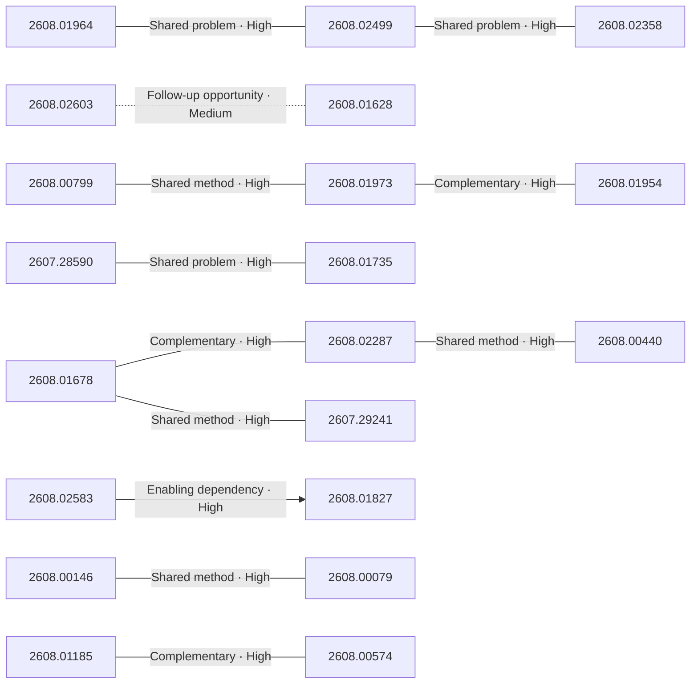

# Paper relationship graph — 2026-08-04

> [← Daily summary](../2026-08-04.md)

> **Interpretation caveat:** Every edge is an evidence-screened editorial hypothesis, not proof of citation, influence, priority, historical use, dependency, or an author-claimed relationship.

## Legend

- Rectangular nodes are current-day papers; rounded nodes are previously seen candidates.
- A line has no technical direction. An arrow shows only a proposed technical flow for an enabling dependency or method transfer.
- Solid edges are high confidence; dotted edges are medium confidence. Confidence evaluates this editorial connection, not either paper.
- Relationship labels:
  - **Shared problem:** `shared_problem`
  - **Shared method:** `shared_method`
  - **Shared evaluation:** `shared_evaluation`
  - **Complementary:** `complementary`
  - **Enabling dependency:** `enabling_dependency`
  - **Method transfer:** `method_transfer`
  - **Assumption tension:** `assumption_tension`
  - **Result tension:** `result_tension`
  - **Shared limitation:** `shared_limitation`
  - **Follow-up opportunity:** `follow_up_opportunity`

## Same-day relationships

| Source paper | Target paper | Relationship | Direction | Confidence |
| --- | --- | --- | --- | --- |
| [2608.01678](2608.01678.md) | [2608.02287](2608.02287.md) | Complementary | Not directional | High |
| [2608.01678](2608.01678.md) | [2607.29241](2607.29241.md) | Shared method | Not directional | High |
| [2608.02287](2608.02287.md) | [2608.00440](2608.00440.md) | Shared method | Not directional | High |
| [2608.01964](2608.01964.md) | [2608.02499](2608.02499.md) | Shared problem | Not directional | High |
| [2608.02499](2608.02499.md) | [2608.02358](2608.02358.md) | Shared problem | Not directional | High |
| [2608.02583](2608.02583.md) | [2608.01827](2608.01827.md) | Enabling dependency | Source → target | High |
| [2607.28590](2607.28590.md) | [2608.01735](2608.01735.md) | Shared problem | Not directional | High |
| [2608.01973](2608.01973.md) | [2608.01954](2608.01954.md) | Complementary | Not directional | High |
| [2608.00799](2608.00799.md) | [2608.01973](2608.01973.md) | Shared method | Not directional | High |
| [2608.01185](2608.01185.md) | [2608.00574](2608.00574.md) | Complementary | Not directional | High |
| [2608.00146](2608.00146.md) | [2608.00079](2608.00079.md) | Shared method | Not directional | High |
| [2608.02603](2608.02603.md) | [2608.01628](2608.01628.md) | Follow-up opportunity | Not directional | Medium |

## Connections to previously seen papers

_The visual diagram is omitted because this graph is too large or dense for a readable snapshot; every edge remains in the table below._

| New paper | Previously seen paper | First seen by service | Relationship | Technical direction | Confidence |
| --- | --- | --- | --- | --- | --- |
| [2608.01964](2608.01964.md) | 2607.22798 ([Hugging Face](https://huggingface.co/papers/2607.22798) · [arXiv](https://arxiv.org/abs/2607.22798)) | 2026-07-28 | Shared method | Not directional | High |
| [2608.01678](2608.01678.md) | 2607.26784 ([Hugging Face](https://huggingface.co/papers/2607.26784) · [arXiv](https://arxiv.org/abs/2607.26784)) | 2026-07-30 | Shared method | Not directional | High |
| [2608.01678](2608.01678.md) | 2607.25675 ([Hugging Face](https://huggingface.co/papers/2607.25675) · [arXiv](https://arxiv.org/abs/2607.25675)) | 2026-07-30 | Complementary | Not directional | High |
| [2608.02287](2608.02287.md) | 2607.16900 ([Hugging Face](https://huggingface.co/papers/2607.16900) · [arXiv](https://arxiv.org/abs/2607.16900)) | 2026-07-21 | Shared method | Not directional | High |
| [2608.01628](2608.01628.md) | 2607.11644 ([Hugging Face](https://huggingface.co/papers/2607.11644) · [arXiv](https://arxiv.org/abs/2607.11644)) | 2026-07-14 | Shared problem | Not directional | High |
| [2608.01628](2608.01628.md) | 2607.28362 ([Hugging Face](https://huggingface.co/papers/2607.28362) · [arXiv](https://arxiv.org/abs/2607.28362)) | 2026-07-31 | Complementary | Not directional | High |
| [2607.28590](2607.28590.md) | 2607.21556 ([Hugging Face](https://huggingface.co/papers/2607.21556) · [arXiv](https://arxiv.org/abs/2607.21556)) | 2026-07-24 | Shared method | Not directional | High |
| [2608.02603](2608.02603.md) | 2607.18367 ([Hugging Face](https://huggingface.co/papers/2607.18367) · [arXiv](https://arxiv.org/abs/2607.18367)) | 2026-07-22 | Shared evaluation | Not directional | High |
| [2608.01185](2608.01185.md) | 2607.12756 ([Hugging Face](https://huggingface.co/papers/2607.12756) · [arXiv](https://arxiv.org/abs/2607.12756)) | 2026-07-27 | Shared problem | Not directional | High |
| [2608.02585](2608.02585.md) | 2607.19691 ([Hugging Face](https://huggingface.co/papers/2607.19691) · [arXiv](https://arxiv.org/abs/2607.19691)) | 2026-07-23 | Shared problem | Not directional | High |
| [2608.02499](2608.02499.md) | 2607.22798 ([Hugging Face](https://huggingface.co/papers/2607.22798) · [arXiv](https://arxiv.org/abs/2607.22798)) | 2026-07-28 | Follow-up opportunity | Not directional | High |
| [2608.01973](2608.01973.md) | 2607.11594 ([Hugging Face](https://huggingface.co/papers/2607.11594) · [arXiv](https://arxiv.org/abs/2607.11594)) | 2026-07-15 | Complementary | Not directional | High |

## Current paper key

| Paper | Analysis |
| --- | --- |
| 2608.02023 — SwanTale: Unified Multi-Speaker Speech and Audio Generation for Instruct and Zero-Shot Tasks | [Read analysis](2608.02023.md) |
| 2608.01964 — LongHorizon-Harness: Advancing Long-Horizon Agents for Real-World Tasks | [Read analysis](2608.01964.md) |
| 2608.01678 — Progressive Agent Skill Generation via Reinforcement Learning | [Read analysis](2608.01678.md) |
| 2607.28590 — VAD: Attributing Visual Evidence for Target Reconstruction in Multimodal On-Policy Distillation | [Read analysis](2607.28590.md) |
| 2608.02603 — WorldExam: Benchmarking World Models from Apparent Appearance to Inherent Reactivity | [Read analysis](2608.02603.md) |
| 2608.02583 — UEmbed: Unified Sparse and Dense Multimodal Embeddings | [Read analysis](2608.02583.md) |
| 2608.00799 — CADENA: Stepwise CAD Reverse Engineering | [Read analysis](2608.00799.md) |
| 2608.02287 — SKT: Skill-Use Training at Scale via Verified Synthetic Data Generation | [Read analysis](2608.02287.md) |
| 2608.02499 — SWE-Touch: Benchmarking Coding Agents When Users Touch the Code | [Read analysis](2608.02499.md) |
| 2608.01628 — Motion Beyond Morphology: Bootstrapping Cross-Category Motion Transfer from Abstract Motion Representations | [Read analysis](2608.01628.md) |
| 2607.29613 — WCM: A World Critic Model for Vision-Language-Action Reinforcement Learning | [Read analysis](2607.29613.md) |
| 2608.01973 — Roomer: Reflective Object-Grounded Model Editing and Repair for 3D Indoor Layout Synthesis | [Read analysis](2608.01973.md) |
| 2608.02585 — GradCuit: Credit-Assigned Gradient Flow Enables Robust and Interpretable Test-Time Latent Reasoning | [Read analysis](2608.02585.md) |
| 2608.01735 — DAPD: Dual-Anchored Policy Distillation | [Read analysis](2608.01735.md) |
| 2607.27042 — GPTQ-2D: Cubic-Time Two-Sided Adaptive Rounding | [Read analysis](2607.27042.md) |
| 2608.01185 — 3DZip: Spatial-Aware Feature Diversity-Guided Token Compression for 3D Question Answering | [Read analysis](2608.01185.md) |
| 2608.01827 — DeepVoyager-VL: Incentivizing Vision-in-the-Loop Search for Long-Horizon Multimodal Agents | [Read analysis](2608.01827.md) |
| 2608.01954 — StyleForge: Indoor Furniture Styling by Counterfactual Reasoning in a Hypergraph Field | [Read analysis](2608.01954.md) |
| 2608.00146 — DiffusionGemma Technical Report | [Read analysis](2608.00146.md) |
| 2608.00440 — Poplar: A Scalable Pipeline for Human-Centric Image Dataset Synthesis | [Read analysis](2608.00440.md) |
| 2608.00079 — LeapTalk: Breaking the Latency-Quality Trade-off in Talking Head Generation | [Read analysis](2608.00079.md) |
| 2608.02358 — ScrambleToolBench: Agents Search Exhaustively Even When Their Own Map Points to the Next Step | [Read analysis](2608.02358.md) |
| 2608.01755 — Deferred Exposure of Future Trajectories for Verifiable Reasoning in Autonomous Driving VLMs | [Read analysis](2608.01755.md) |
| 2608.00486 — DreamTraj: Generating 6-DoF Object Trajectories by Reading Unrendered Video Diffusion Latents | [Read analysis](2608.00486.md) |
| 2608.00574 — Relax Within, Balance Across: Geometry-Guided Load Balancing for Vision-Language Mixture-of-Experts | [Read analysis](2608.00574.md) |
| 2607.29241 — RecHarness: A Bandit-Routed Agentic Harness for Self-Evolving Recommender Systems | [Read analysis](2607.29241.md) |

## Current papers without a published edge

- [2608.02023](2608.02023.md)
- [2607.29613](2607.29613.md)
- [2607.27042](2607.27042.md)
- [2608.01755](2608.01755.md)
- [2608.00486](2608.00486.md)

---

[Support these research summaries on Buy Me a Coffee](https://buymeacoffee.com/vollero)
