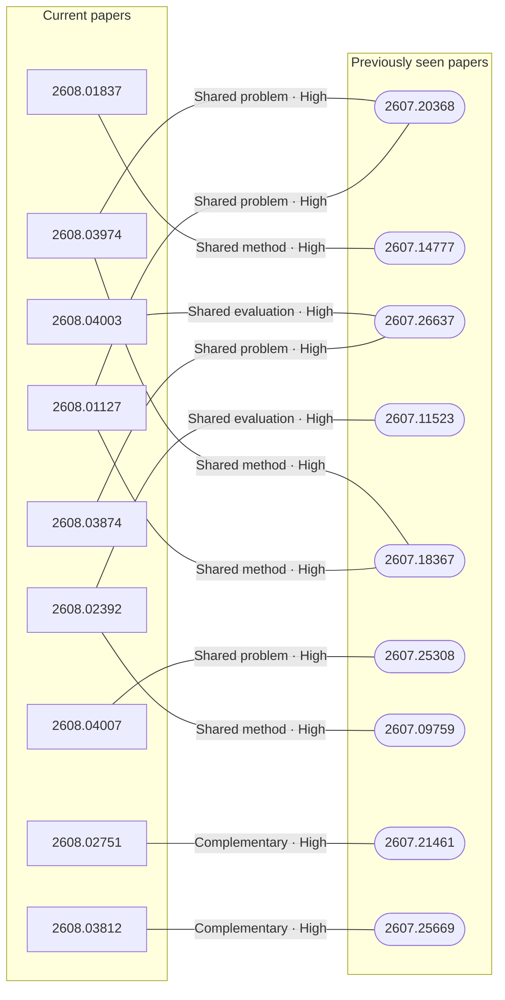

# Paper relationship graph — 2026-08-05

> [← Daily summary](../2026-08-05.md)

> **Interpretation caveat:** Every edge is an evidence-screened editorial hypothesis, not proof of citation, influence, priority, historical use, dependency, or an author-claimed relationship.

## Legend

- Rectangular nodes are current-day papers; rounded nodes are previously seen candidates.
- A line has no technical direction. An arrow shows only a proposed technical flow for an enabling dependency or method transfer.
- Solid edges are high confidence; dotted edges are medium confidence. Confidence evaluates this editorial connection, not either paper.
- Relationship labels:
  - **Shared problem:** `shared_problem`
  - **Shared method:** `shared_method`
  - **Shared evaluation:** `shared_evaluation`
  - **Complementary:** `complementary`
  - **Enabling dependency:** `enabling_dependency`
  - **Method transfer:** `method_transfer`
  - **Assumption tension:** `assumption_tension`
  - **Result tension:** `result_tension`
  - **Shared limitation:** `shared_limitation`
  - **Follow-up opportunity:** `follow_up_opportunity`

## Same-day relationships

_The visual diagram is omitted because this graph is too large or dense for a readable snapshot; every edge remains in the table below._

| Source paper | Target paper | Relationship | Direction | Confidence |
| --- | --- | --- | --- | --- |
| [2608.03974](2608.03974.md) | [2608.01127](2608.01127.md) | Shared method | Not directional | High |
| [2608.03509](2608.03509.md) | [2608.03700](2608.03700.md) | Shared problem | Not directional | High |
| [2608.04003](2608.04003.md) | [2608.03874](2608.03874.md) | Shared problem | Not directional | High |
| [2608.01837](2608.01837.md) | [2608.04007](2608.04007.md) | Shared problem | Not directional | High |
| [2607.00482](2607.00482.md) | [2608.03506](2608.03506.md) | Shared method | Not directional | High |
| [2608.02751](2608.02751.md) | [2608.03979](2608.03979.md) | Method transfer | Source → target | High |
| [2608.02392](2608.02392.md) | [2608.03979](2608.03979.md) | Complementary | Not directional | High |
| [2608.02602](2608.02602.md) | [2608.03457](2608.03457.md) | Shared problem | Not directional | High |
| [2608.03316](2608.03316.md) | [2608.03974](2608.03974.md) | Shared method | Not directional | Medium |
| [2608.02791](2608.02791.md) | [2608.02833](2608.02833.md) | Shared problem | Not directional | High |
| [2608.03971](2608.03971.md) | [2608.02218](2608.02218.md) | Shared problem | Not directional | Medium |
| [2608.00730](2608.00730.md) | [2607.28993](2607.28993.md) | Shared problem | Not directional | Medium |

## Connections to previously seen papers

| New paper | Previously seen paper | First seen by service | Relationship | Technical direction | Confidence |
| --- | --- | --- | --- | --- | --- |
| [2608.03974](2608.03974.md) | 2607.20368 ([Hugging Face](https://huggingface.co/papers/2607.20368) · [arXiv](https://arxiv.org/abs/2607.20368)) | 2026-07-23 | Shared problem | Not directional | High |
| [2608.03974](2608.03974.md) | 2607.18367 ([Hugging Face](https://huggingface.co/papers/2607.18367) · [arXiv](https://arxiv.org/abs/2607.18367)) | 2026-07-22 | Shared method | Not directional | High |
| [2608.01127](2608.01127.md) | 2607.20368 ([Hugging Face](https://huggingface.co/papers/2607.20368) · [arXiv](https://arxiv.org/abs/2607.20368)) | 2026-07-23 | Shared problem | Not directional | High |
| [2608.01127](2608.01127.md) | 2607.18367 ([Hugging Face](https://huggingface.co/papers/2607.18367) · [arXiv](https://arxiv.org/abs/2607.18367)) | 2026-07-22 | Shared method | Not directional | High |
| [2608.03812](2608.03812.md) | 2607.25669 ([Hugging Face](https://huggingface.co/papers/2607.25669) · [arXiv](https://arxiv.org/abs/2607.25669)) | 2026-07-29 | Complementary | Not directional | High |
| [2608.01837](2608.01837.md) | 2607.14777 ([Hugging Face](https://huggingface.co/papers/2607.14777) · [arXiv](https://arxiv.org/abs/2607.14777)) | 2026-07-17 | Shared method | Not directional | High |
| [2608.04007](2608.04007.md) | 2607.25308 ([Hugging Face](https://huggingface.co/papers/2607.25308) · [arXiv](https://arxiv.org/abs/2607.25308)) | 2026-07-30 | Shared problem | Not directional | High |
| [2608.04003](2608.04003.md) | 2607.26637 ([Hugging Face](https://huggingface.co/papers/2607.26637) · [arXiv](https://arxiv.org/abs/2607.26637)) | 2026-07-31 | Shared evaluation | Not directional | High |
| [2608.03874](2608.03874.md) | 2607.26637 ([Hugging Face](https://huggingface.co/papers/2607.26637) · [arXiv](https://arxiv.org/abs/2607.26637)) | 2026-07-31 | Shared problem | Not directional | High |
| [2608.02392](2608.02392.md) | 2607.11523 ([Hugging Face](https://huggingface.co/papers/2607.11523) · [arXiv](https://arxiv.org/abs/2607.11523)) | 2026-07-16 | Shared evaluation | Not directional | High |
| [2608.02392](2608.02392.md) | 2607.09759 ([Hugging Face](https://huggingface.co/papers/2607.09759) · [arXiv](https://arxiv.org/abs/2607.09759)) | 2026-07-21 | Shared method | Not directional | High |
| [2608.02751](2608.02751.md) | 2607.21461 ([Hugging Face](https://huggingface.co/papers/2607.21461) · [arXiv](https://arxiv.org/abs/2607.21461)) | 2026-07-24 | Complementary | Not directional | High |

## Current paper key

| Paper | Analysis |
| --- | --- |
| 2607.28956 — MerchantBench: Benchmarking LLM Agents for Long-Term Coherence in E-Commerce Operations | [Read analysis](2607.28956.md) |
| 2608.03974 — JoyAI-Video-Edit: Real-Time Open-Ended Video Editing with Autoregressive Diffusion | [Read analysis](2608.03974.md) |
| 2608.02711 — Hunyuan3D-Buffalo 1.0: A Unified Multimodal Model for Scalable 3D Generation, Understanding, and Editing | [Read analysis](2608.02711.md) |
| 2608.02602 — AURORA-LM: Autoencoding Unified Representation for Continuous-Latent Diffusion Language Modeling | [Read analysis](2608.02602.md) |
| 2608.03979 — Video-DeepResearch: Towards the Next-Generation Multimodal Deepresearch Agent | [Read analysis](2608.03979.md) |
| 2608.02738 — Knowledge-Geometry Decoupling: Refreshable Pretrained Transfer for Streaming Recommendation | [Read analysis](2608.02738.md) |
| 2608.01837 — PCSD: Persistent Consistency for Self-Distillation in Agentic Reinforcement Learning | [Read analysis](2608.01837.md) |
| 2608.02713 — Quo Vadis, World Modeling? | [Read analysis](2608.02713.md) |
| 2608.04003 — PAST-Bench: Benchmarking the Foundations of Recursive Self-Improvement in Personal Agents | [Read analysis](2608.04003.md) |
| 2608.03457 — LLaDA MoE v2: Scaling Mixture-of-Experts Diffusion Language Models | [Read analysis](2608.03457.md) |
| 2608.03812 — OmniPack: Unified Token Compression for Efficient Omni-modal Large Language Models | [Read analysis](2608.03812.md) |
| 2608.03316 — Any-OPD: Heterogeneous On-Policy Distillation for Flow-Matching Models via Representation-Space Bridging | [Read analysis](2608.03316.md) |
| 2608.02589 — CAPEval: A Decoupled Caption Evaluation across Understanding and Generation | [Read analysis](2608.02589.md) |
| 2608.03509 — SkillJack: Persistent Skill Backdoors in Self-Evolving Agents | [Read analysis](2608.03509.md) |
| 2608.03971 — UniWorld-Design: From Pixel Generation to Layer-Native Design | [Read analysis](2608.03971.md) |
| 2608.04007 — TurnSight: Turn-Level Hindsight Self-Distillation for Tool-Integrated Reasoning | [Read analysis](2608.04007.md) |
| 2608.02392 — GROVE: Growing and Reasoning over Temporally Stratified Memory from Streaming Video Experience | [Read analysis](2608.02392.md) |
| 2608.01127 — MiniWorld: Democratizing the Training of Video World Models from Scratch | [Read analysis](2608.01127.md) |
| 2608.00371 — Decoding Children's Gait Behavior | [Read analysis](2608.00371.md) |
| 2607.26451 — ExplainBench: Evaluating Code Explanations from Agents | [Read analysis](2607.26451.md) |
| 2608.03874 — ContinualSkillBench: Can LLM Agents Truly Evolve Their Capabilities? | [Read analysis](2608.03874.md) |
| 2608.01247 — RestoreKV: Recovering Full-Cache Behavior Under Aggressive Query-Agnostic KV Cache Eviction | [Read analysis](2608.01247.md) |
| 2607.28661 — Are the Financial Reasoning from LLMs Credible? A Real World Test over Long-Horizon Statements | [Read analysis](2607.28661.md) |
| 2608.03700 — When Agents Learn to Be You: Benchmarking Privacy Leakage, Impersonation Risk, and Defenses in Persona Skills | [Read analysis](2608.03700.md) |
| 2608.02218 — PosterMELD: Multi-Agent Paper-to-Poster Generation for Controllable Design Diversity with Editable Print-Ready Outputs | [Read analysis](2608.02218.md) |
| 2608.00730 — Push-Wiper: Toward General-Purpose Robotic Cleaning across Varied Stains and Surfaces with Segmented Pushing Trajectories | [Read analysis](2608.00730.md) |
| 2607.28993 — ST-WAM: Semantic-Temporal World Action Model for Robust Manipulation under Visual Distribution Shifts | [Read analysis](2607.28993.md) |
| 2607.00482 — Know When to Stop: Segment-Level Credit Assignment for Reducing Overthinking | [Read analysis](2607.00482.md) |
| 2608.03994 — When Attention Goes Blind: Numerical Failure in ALiBi Positional Encodings | [Read analysis](2608.03994.md) |
| 2608.02703 — ARCHead: Activation-Metric Residual Correction for Large Language Model Output Heads | [Read analysis](2608.02703.md) |
| 2608.03756 — LegalPincite: Multi-level Legal Information Retrieval Dataset | [Read analysis](2608.03756.md) |
| 2608.03972 — ReflectRL: Learning from Golden Negative Trajectories via Reflective-to-Direct Reasoning | [Read analysis](2608.03972.md) |
| 2608.03507 — ChronoLens: Measuring Language Change Across Time, Languages, and Linguistic Levels | [Read analysis](2608.03507.md) |
| 2608.03419 — Multi-Task Multi-Frame Visual Piano Transcription | [Read analysis](2608.03419.md) |
| 2608.02791 — Better, Stronger, Faster, and Broader: Structured All-Mask Prediction for MLLM-Based Segmentation | [Read analysis](2608.02791.md) |
| 2608.03506 — When Many Answers Are Valid, Voting Fails: Symbolic Verification for Best-of-K Causal Reasoning in LLMs | [Read analysis](2608.03506.md) |
| 2608.02751 — Search, Inspect, Fetch: Exploiting Boolean Retrieval for Deep-Research Agents | [Read analysis](2608.02751.md) |
| 2608.02833 — CURV: Enhancing Chart Understanding Through Curriculum Visual Grounded Reasoning | [Read analysis](2608.02833.md) |

## Current papers without a published edge

- [2607.28956](2607.28956.md)
- [2608.02711](2608.02711.md)
- [2608.02738](2608.02738.md)
- [2608.02713](2608.02713.md)
- [2608.02589](2608.02589.md)
- [2608.00371](2608.00371.md)
- [2607.26451](2607.26451.md)
- [2608.01247](2608.01247.md)
- [2607.28661](2607.28661.md)
- [2608.03994](2608.03994.md)
- [2608.02703](2608.02703.md)
- [2608.03756](2608.03756.md)
- [2608.03972](2608.03972.md)
- [2608.03507](2608.03507.md)
- [2608.03419](2608.03419.md)

---

[Support these research summaries on Buy Me a Coffee](https://buymeacoffee.com/vollero)
