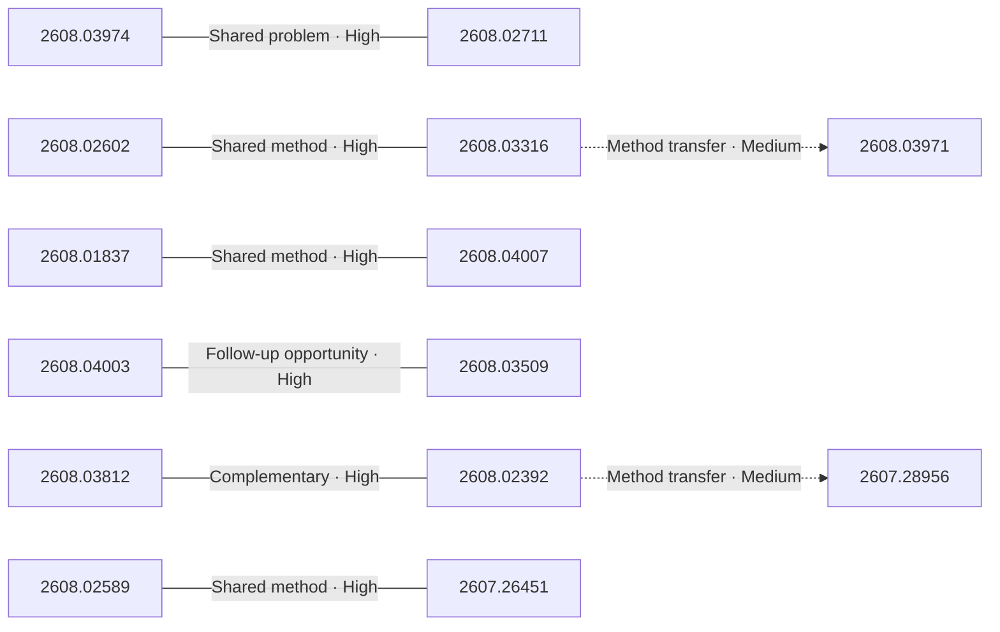

# Paper relationship graph — 2026-08-05

> [← Daily summary](../2026-08-05.md)

> **Interpretation caveat:** Every edge is an evidence-screened editorial hypothesis, not proof of citation, influence, priority, historical use, dependency, or an author-claimed relationship.

## Legend

- Rectangular nodes are current-day papers; rounded nodes are previously seen candidates.
- A line has no technical direction. An arrow shows only a proposed technical flow for an enabling dependency or method transfer.
- Solid edges are high confidence; dotted edges are medium confidence. Confidence evaluates this editorial connection, not either paper.
- Relationship labels:
  - **Shared problem:** `shared_problem`
  - **Shared method:** `shared_method`
  - **Shared evaluation:** `shared_evaluation`
  - **Complementary:** `complementary`
  - **Enabling dependency:** `enabling_dependency`
  - **Method transfer:** `method_transfer`
  - **Assumption tension:** `assumption_tension`
  - **Result tension:** `result_tension`
  - **Shared limitation:** `shared_limitation`
  - **Follow-up opportunity:** `follow_up_opportunity`

## Same-day relationships

| Source paper | Target paper | Relationship | Direction | Confidence |
| --- | --- | --- | --- | --- |
| [2608.01837](2608.01837.md) | [2608.04007](2608.04007.md) | Shared method | Not directional | High |
| [2608.02602](2608.02602.md) | [2608.03316](2608.03316.md) | Shared method | Not directional | High |
| [2608.03974](2608.03974.md) | [2608.02711](2608.02711.md) | Shared problem | Not directional | High |
| [2608.03812](2608.03812.md) | [2608.02392](2608.02392.md) | Complementary | Not directional | High |
| [2608.02392](2608.02392.md) | [2607.28956](2607.28956.md) | Method transfer | Source → target | Medium |
| [2608.04003](2608.04003.md) | [2608.03509](2608.03509.md) | Follow-up opportunity | Not directional | High |
| [2608.02589](2608.02589.md) | [2607.26451](2607.26451.md) | Shared method | Not directional | High |
| [2608.03316](2608.03316.md) | [2608.03971](2608.03971.md) | Method transfer | Source → target | Medium |

## Connections to previously seen papers

_The visual diagram is omitted because this graph is too large or dense for a readable snapshot; every edge remains in the table below._

| New paper | Previously seen paper | First seen by service | Relationship | Technical direction | Confidence |
| --- | --- | --- | --- | --- | --- |
| [2608.03974](2608.03974.md) | 2607.20368 ([Hugging Face](https://huggingface.co/papers/2607.20368) · [arXiv](https://arxiv.org/abs/2607.20368)) | 2026-07-23 | Shared problem | Not directional | High |
| [2608.03974](2608.03974.md) | 2607.21848 ([Hugging Face](https://huggingface.co/papers/2607.21848) · [arXiv](https://arxiv.org/abs/2607.21848)) | 2026-07-27 | Complementary | Not directional | High |
| [2608.02602](2608.02602.md) | 2607.14106 ([Hugging Face](https://huggingface.co/papers/2607.14106) · [arXiv](https://arxiv.org/abs/2607.14106)) | 2026-07-17 | Shared method | Not directional | High |
| [2608.01837](2608.01837.md) | 2607.14777 ([Hugging Face](https://huggingface.co/papers/2607.14777) · [arXiv](https://arxiv.org/abs/2607.14777)) | 2026-07-17 | Shared method | Not directional | High |
| [2608.04003](2608.04003.md) | 2607.26637 ([Hugging Face](https://huggingface.co/papers/2607.26637) · [arXiv](https://arxiv.org/abs/2607.26637)) | 2026-07-31 | Shared problem | Not directional | High |
| [2608.04003](2608.04003.md) | 2608.02358 ([Hugging Face](https://huggingface.co/papers/2608.02358) · [arXiv](https://arxiv.org/abs/2608.02358)) | 2026-08-04 | Complementary | Not directional | High |
| [2608.03812](2608.03812.md) | 2607.25669 ([Hugging Face](https://huggingface.co/papers/2607.25669) · [arXiv](https://arxiv.org/abs/2607.25669)) | 2026-07-29 | Complementary | Not directional | High |
| [2608.04007](2608.04007.md) | 2607.25308 ([Hugging Face](https://huggingface.co/papers/2607.25308) · [arXiv](https://arxiv.org/abs/2607.25308)) | 2026-07-30 | Shared problem | Not directional | High |
| [2608.03509](2608.03509.md) | 2607.12625 ([Hugging Face](https://huggingface.co/papers/2607.12625) · [arXiv](https://arxiv.org/abs/2607.12625)) | 2026-07-16 | Assumption tension | Not directional | High |
| [2608.02392](2608.02392.md) | 2607.11523 ([Hugging Face](https://huggingface.co/papers/2607.11523) · [arXiv](https://arxiv.org/abs/2607.11523)) | 2026-07-16 | Shared evaluation | Not directional | High |
| [2608.02392](2608.02392.md) | 2607.09759 ([Hugging Face](https://huggingface.co/papers/2607.09759) · [arXiv](https://arxiv.org/abs/2607.09759)) | 2026-07-21 | Shared method | Not directional | High |
| [2608.02589](2608.02589.md) | 2607.19322 ([Hugging Face](https://huggingface.co/papers/2607.19322) · [arXiv](https://arxiv.org/abs/2607.19322)) | 2026-07-22 | Shared method | Not directional | High |

## Current paper key

| Paper | Analysis |
| --- | --- |
| 2608.03974 — JoyAI-Video-Edit: Real-Time Open-Ended Video Editing with Autoregressive Diffusion | [Read analysis](2608.03974.md) |
| 2608.02602 — AURORA-LM: Autoencoding Unified Representation for Continuous-Latent Diffusion Language Modeling | [Read analysis](2608.02602.md) |
| 2607.28956 — MerchantBench: Benchmarking LLM Agents for Long-Term Coherence in E-Commerce Operations | [Read analysis](2607.28956.md) |
| 2608.02711 — Hunyuan3D-Buffalo 1.0: A Unified Multimodal Model for Scalable 3D Generation, Understanding, and Editing | [Read analysis](2608.02711.md) |
| 2608.01837 — PCSD: Persistent Consistency for Self-Distillation in Agentic Reinforcement Learning | [Read analysis](2608.01837.md) |
| 2608.04003 — PAST-Bench: Benchmarking the Foundations of Recursive Self-Improvement in Personal Agents | [Read analysis](2608.04003.md) |
| 2608.03812 — OmniPack: Unified Token Compression for Efficient Omni-modal Large Language Models | [Read analysis](2608.03812.md) |
| 2608.03971 — UniWorld-Design: From Pixel Generation to Layer-Native Design | [Read analysis](2608.03971.md) |
| 2608.02589 — CAPEval: A Decoupled Caption Evaluation across Understanding and Generation | [Read analysis](2608.02589.md) |
| 2608.03316 — Any-OPD: Heterogeneous On-Policy Distillation for Flow-Matching Models via Representation-Space Bridging | [Read analysis](2608.03316.md) |
| 2608.04007 — TurnSight: Turn-Level Hindsight Self-Distillation for Tool-Integrated Reasoning | [Read analysis](2608.04007.md) |
| 2608.03509 — SkillJack: Persistent Skill Backdoors in Self-Evolving Agents | [Read analysis](2608.03509.md) |
| 2608.02392 — GROVE: Growing and Reasoning over Temporally Stratified Memory from Streaming Video Experience | [Read analysis](2608.02392.md) |
| 2608.02738 — Knowledge-Geometry Decoupling: Refreshable Pretrained Transfer for Streaming Recommendation | [Read analysis](2608.02738.md) |
| 2607.26451 — ExplainBench: Evaluating Code Explanations from Agents | [Read analysis](2607.26451.md) |

## Current papers without a published edge

- [2608.02738](2608.02738.md)

---

[Support these research summaries on Buy Me a Coffee](https://buymeacoffee.com/vollero)
