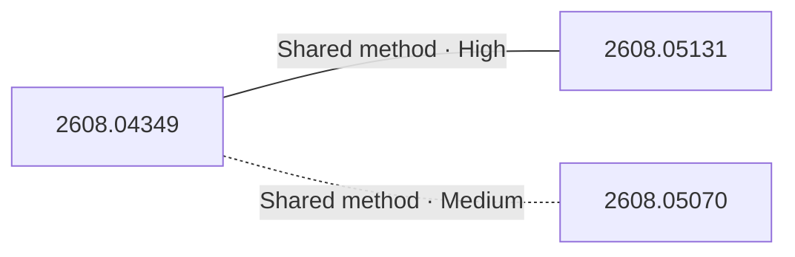

# Paper relationship graph — 2026-08-06

> [← Daily summary](../2026-08-06.md)

> **Interpretation caveat:** Every edge is an evidence-screened editorial hypothesis, not proof of citation, influence, priority, historical use, dependency, or an author-claimed relationship.

## Legend

- Rectangular nodes are current-day papers; rounded nodes are previously seen candidates.
- A line has no technical direction. An arrow shows only a proposed technical flow for an enabling dependency or method transfer.
- Solid edges are high confidence; dotted edges are medium confidence. Confidence evaluates this editorial connection, not either paper.
- Relationship labels:
  - **Shared problem:** `shared_problem`
  - **Shared method:** `shared_method`
  - **Shared evaluation:** `shared_evaluation`
  - **Complementary:** `complementary`
  - **Enabling dependency:** `enabling_dependency`
  - **Method transfer:** `method_transfer`
  - **Assumption tension:** `assumption_tension`
  - **Result tension:** `result_tension`
  - **Shared limitation:** `shared_limitation`
  - **Follow-up opportunity:** `follow_up_opportunity`

## Same-day relationships

| Source paper | Target paper | Relationship | Direction | Confidence |
| --- | --- | --- | --- | --- |
| [2608.04349](2608.04349.md) | [2608.05131](2608.05131.md) | Shared method | Not directional | High |
| [2608.04349](2608.04349.md) | [2608.05070](2608.05070.md) | Shared method | Not directional | Medium |

## Connections to previously seen papers

_The relationship stage failed; no validated edges are available for this section._

## Current paper key

| Paper | Analysis |
| --- | --- |
| 2608.04349 — Poly-OPD: Heterogeneous Multi-Teacher On-Policy Distillation for Capability-Selectable Flow Models | [Read analysis](2608.04349.md) |
| 2608.05070 — HelloWorld: Enabling Socially Interactive Characters in Video World Models | [Read analysis](2608.05070.md) |
| 2608.05131 — OPD-V: Visual On-Policy Self-Distillation with Modality Balance | [Read analysis](2608.05131.md) |
| 2607.22143 — TriGlue: a Biology-Inspired Generative Model for Generating Molecular Glue-Induced Ternary Complex | [Read analysis](2607.22143.md) |

## Current papers without a published edge

- [2607.22143](2607.22143.md)

---

[Support these research summaries on Buy Me a Coffee](https://buymeacoffee.com/vollero)
