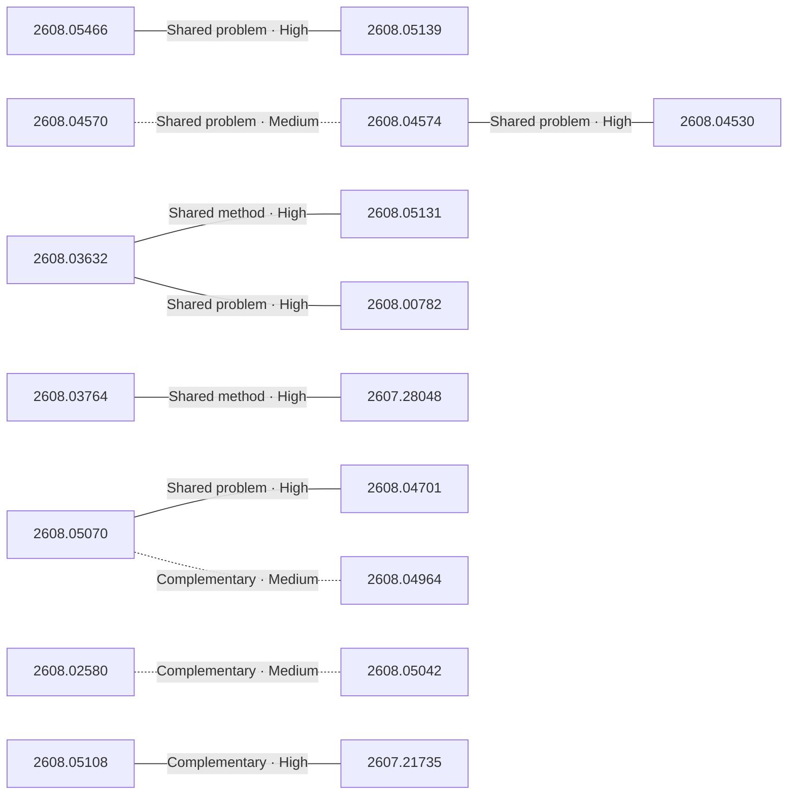

# Paper relationship graph — 2026-08-06

> [← Daily summary](../2026-08-06.md)

> **Interpretation caveat:** Every edge is an evidence-screened editorial hypothesis, not proof of citation, influence, priority, historical use, dependency, or an author-claimed relationship.

## Legend

- Rectangular nodes are current-day papers; rounded nodes are previously seen candidates.
- A line has no technical direction. An arrow shows only a proposed technical flow for an enabling dependency or method transfer.
- Solid edges are high confidence; dotted edges are medium confidence. Confidence evaluates this editorial connection, not either paper.
- Relationship labels:
  - **Shared problem:** `shared_problem`
  - **Shared method:** `shared_method`
  - **Shared evaluation:** `shared_evaluation`
  - **Complementary:** `complementary`
  - **Enabling dependency:** `enabling_dependency`
  - **Method transfer:** `method_transfer`
  - **Assumption tension:** `assumption_tension`
  - **Result tension:** `result_tension`
  - **Shared limitation:** `shared_limitation`
  - **Follow-up opportunity:** `follow_up_opportunity`

## Same-day relationships

| Source paper | Target paper | Relationship | Direction | Confidence |
| --- | --- | --- | --- | --- |
| [2608.04574](2608.04574.md) | [2608.04530](2608.04530.md) | Shared problem | Not directional | High |
| [2608.03764](2608.03764.md) | [2607.28048](2607.28048.md) | Shared method | Not directional | High |
| [2608.03632](2608.03632.md) | [2608.05131](2608.05131.md) | Shared method | Not directional | High |
| [2608.00782](2608.00782.md) | [2608.03632](2608.03632.md) | Shared problem | Not directional | High |
| [2608.05070](2608.05070.md) | [2608.04701](2608.04701.md) | Shared problem | Not directional | High |
| [2608.05070](2608.05070.md) | [2608.04964](2608.04964.md) | Complementary | Not directional | Medium |
| [2608.05466](2608.05466.md) | [2608.05139](2608.05139.md) | Shared problem | Not directional | High |
| [2608.05108](2608.05108.md) | [2607.21735](2607.21735.md) | Complementary | Not directional | High |
| [2608.04570](2608.04570.md) | [2608.04574](2608.04574.md) | Shared problem | Not directional | Medium |
| [2608.02580](2608.02580.md) | [2608.05042](2608.05042.md) | Complementary | Not directional | Medium |

## Connections to previously seen papers

_The visual diagram is omitted because this graph is too large or dense for a readable snapshot; every edge remains in the table below._

| New paper | Previously seen paper | First seen by service | Relationship | Technical direction | Confidence |
| --- | --- | --- | --- | --- | --- |
| [2608.05102](2608.05102.md) | 2607.27652 ([Hugging Face](https://huggingface.co/papers/2607.27652) · [arXiv](https://arxiv.org/abs/2607.27652)) | 2026-07-31 | Shared problem | Not directional | High |
| [2608.05466](2608.05466.md) | 2608.02287 ([Hugging Face](https://huggingface.co/papers/2608.02287) · [arXiv](https://arxiv.org/abs/2608.02287)) | 2026-08-04 | Shared method | Not directional | High |
| [2608.05013](2608.05013.md) | 2608.01964 ([Hugging Face](https://huggingface.co/papers/2608.01964) · [arXiv](https://arxiv.org/abs/2608.01964)) | 2026-08-04 | Shared method | Not directional | High |
| [2608.04574](2608.04574.md) | 2608.04003 ([Hugging Face](https://huggingface.co/papers/2608.04003) · [arXiv](https://arxiv.org/abs/2608.04003)) | 2026-08-05 | Shared problem | Not directional | High |
| [2608.04530](2608.04530.md) | 2607.26637 ([Hugging Face](https://huggingface.co/papers/2607.26637) · [arXiv](https://arxiv.org/abs/2607.26637)) | 2026-07-31 | Shared problem | Not directional | High |
| [2608.05131](2608.05131.md) | 2607.28590 ([Hugging Face](https://huggingface.co/papers/2607.28590) · [arXiv](https://arxiv.org/abs/2607.28590)) | 2026-08-04 | Shared method | Not directional | High |
| [2608.05131](2608.05131.md) | 2607.21556 ([Hugging Face](https://huggingface.co/papers/2607.21556) · [arXiv](https://arxiv.org/abs/2607.21556)) | 2026-07-24 | Shared method | Not directional | High |
| [2608.00782](2608.00782.md) | 2607.18955 ([Hugging Face](https://huggingface.co/papers/2607.18955) · [arXiv](https://arxiv.org/abs/2607.18955)) | 2026-07-22 | Shared problem | Not directional | High |
| [2608.04349](2608.04349.md) | 2608.03316 ([Hugging Face](https://huggingface.co/papers/2608.03316) · [arXiv](https://arxiv.org/abs/2608.03316)) | 2026-08-05 | Shared method | Not directional | High |
| [2608.04701](2608.04701.md) | 2607.12000 ([Hugging Face](https://huggingface.co/papers/2607.12000) · [arXiv](https://arxiv.org/abs/2607.12000)) | 2026-07-16 | Shared problem | Not directional | High |
| [2608.02580](2608.02580.md) | 2607.25895 ([Hugging Face](https://huggingface.co/papers/2607.25895) · [arXiv](https://arxiv.org/abs/2607.25895)) | 2026-07-29 | Complementary | Not directional | High |
| [2608.05042](2608.05042.md) | 2607.28993 ([Hugging Face](https://huggingface.co/papers/2607.28993) · [arXiv](https://arxiv.org/abs/2607.28993)) | 2026-08-05 | Complementary | Not directional | High |

## Current paper key

| Paper | Analysis |
| --- | --- |
| 2608.05102 — ABSeeker: Training Long-Horizon Search Agents via Answer-Backtracked Credit Assignment | [Read analysis](2608.05102.md) |
| 2608.05466 — Recursive Synthesis for Long-Horizon Terminal Tasks | [Read analysis](2608.05466.md) |
| 2608.04436 — ToolArtist: Tool-Using Unified Multimodal Models for Agentic Image Generation | [Read analysis](2608.04436.md) |
| 2608.05000 — Towards Physics of Multimodal Pretraining: Knowledge Flow, Modality Synergy, Early Unification, and Recipes | [Read analysis](2608.05000.md) |
| 2608.04570 — The Personalization Mirage: How LLMs Fabricate User Profiles, and Why Self-Monitoring Misleads | [Read analysis](2608.04570.md) |
| 2608.05013 — OneDayAgent: Towards a Long-Horizon Harness for Autonomous Agents | [Read analysis](2608.05013.md) |
| 2608.05139 — Toward Skill-Native LLMs: Skill Entropy for Benchmarking and Training Long-Horizon Reasoning | [Read analysis](2608.05139.md) |
| 2608.03764 — GDPevo: Evaluating Agent Self-Evolution on Real Business Tasks | [Read analysis](2608.03764.md) |
| 2608.02580 — Ego2Robot: Scalable Robot Data Synthesis from Egocentric Human Data | [Read analysis](2608.02580.md) |
| 2608.03632 — When Teachers Mislead: Spurious-Signal-Aware On-Policy Distillation | [Read analysis](2608.03632.md) |
| 2608.04397 — NOLLI: A Difficulty-Calibrated Puzzle Benchmark for Diagnosing the English-Korean Performance Gap | [Read analysis](2608.04397.md) |
| 2608.05070 — HelloWorld: Enabling Socially Interactive Characters in Video World Models | [Read analysis](2608.05070.md) |
| 2608.04505 — K-EXAONE 2.0 Technical Report | [Read analysis](2608.04505.md) |
| 2607.24821 — AVE-Compass: Towards Holistic Evaluation for Audio-Video Editing Abilities | [Read analysis](2607.24821.md) |
| 2608.00782 — Distill Where You Fail: Recovering Learning Signals of Negative RL-Groups from Adaptive Teacher Guidance | [Read analysis](2608.00782.md) |
| 2608.04574 — When Memory Lies: An Empirical Study of Spatial Memory Staleness in VLM Agents | [Read analysis](2608.04574.md) |
| 2608.04530 — FocusMem: Factorizing Content, Readout, and Trust in Latent GUI Memory | [Read analysis](2608.04530.md) |
| 2608.04964 — WorldCycle: Self-Verifiable Reinforcement Learning for Long-Horizon Video World Models | [Read analysis](2608.04964.md) |
| 2608.04349 — Poly-OPD: Heterogeneous Multi-Teacher On-Policy Distillation for Capability-Selectable Flow Models | [Read analysis](2608.04349.md) |
| 2607.28048 — SKILL-KD: Contrastive Skill Distillation for LLM Agents | [Read analysis](2607.28048.md) |
| 2608.02162 — Lossless Tensor Compression as Program Synthesis | [Read analysis](2608.02162.md) |
| 2608.05131 — OPD-V: Visual On-Policy Self-Distillation with Modality Balance | [Read analysis](2608.05131.md) |
| 2608.05042 — BridgeVLA++: A Data-Efficient, Generalizable, and Memory-Augmented Vision-Language-Action Framework for 3D Manipulation | [Read analysis](2608.05042.md) |
| 2608.04926 — Consistency-Driven Co-Evolution for Self-Supervised Cross-Representation Learning | [Read analysis](2608.04926.md) |
| 2608.04701 — UniWorld-View: Large-Baseline View Synthesis via Video Diffusion Models | [Read analysis](2608.04701.md) |
| 2608.05108 — Agent Against Agent: An Agentic System for Automatic Prompt Injection Red Teaming | [Read analysis](2608.05108.md) |
| 2607.22143 — TriGlue: a Biology-Inspired Generative Model for Generating Molecular Glue-Induced Ternary Complex | [Read analysis](2607.22143.md) |
| 2607.27853 — FinanceHarness: Autonomous Financial Deep Research Framework | [Read analysis](2607.27853.md) |
| 2608.03392 — Self-Evolving Coding Agents | [Read analysis](2608.03392.md) |
| 2608.03207 — DRIFT: Derailing Denoising Trajectories of Flow-Matching VLAs with Adversarial Patch Attack | [Read analysis](2608.03207.md) |
| 2608.04244 — SIGNPOST-Bench: Benchmarking Text-Vision Conflict Resolution in Multimodal Large Language Models | [Read analysis](2608.04244.md) |
| 2607.21735 — What AI Red-Team Evaluations Can and Cannot Prove | [Read analysis](2607.21735.md) |
| 2608.04378 — Helping Music Co-Creation Agents 'Listen' Well: Hierarchical Self-Supervised World Models for Understanding and Generation | [Read analysis](2608.04378.md) |
| 2608.03836 — Resume Means Resume: A Machine-Checked Conformance Contract for Checkpoint, Interrupt, and Resume Semantics in Workflow Persistence Layers | [Read analysis](2608.03836.md) |

## Current papers without a published edge

- [2608.04436](2608.04436.md)
- [2608.05000](2608.05000.md)
- [2608.04397](2608.04397.md)
- [2608.04505](2608.04505.md)
- [2607.24821](2607.24821.md)
- [2608.02162](2608.02162.md)
- [2608.04926](2608.04926.md)
- [2607.22143](2607.22143.md)
- [2607.27853](2607.27853.md)
- [2608.03392](2608.03392.md)
- [2608.03207](2608.03207.md)
- [2608.04244](2608.04244.md)
- [2608.04378](2608.04378.md)
- [2608.03836](2608.03836.md)

---

[Support these research summaries on Buy Me a Coffee](https://buymeacoffee.com/vollero)
