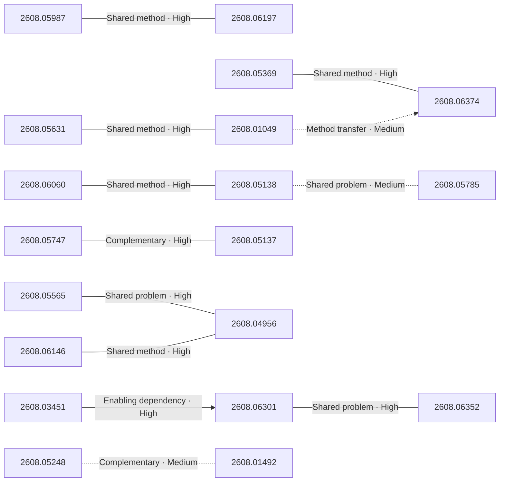

# Paper relationship graph — 2026-08-07

> [← Daily summary](../2026-08-07.md)

> **Interpretation caveat:** Every edge is an evidence-screened editorial hypothesis, not proof of citation, influence, priority, historical use, dependency, or an author-claimed relationship.

## Legend

- Rectangular nodes are current-day papers; rounded nodes are previously seen candidates.
- A line has no technical direction. An arrow shows only a proposed technical flow for an enabling dependency or method transfer.
- Solid edges are high confidence; dotted edges are medium confidence. Confidence evaluates this editorial connection, not either paper.
- Relationship labels:
  - **Shared problem:** `shared_problem`
  - **Shared method:** `shared_method`
  - **Shared evaluation:** `shared_evaluation`
  - **Complementary:** `complementary`
  - **Enabling dependency:** `enabling_dependency`
  - **Method transfer:** `method_transfer`
  - **Assumption tension:** `assumption_tension`
  - **Result tension:** `result_tension`
  - **Shared limitation:** `shared_limitation`
  - **Follow-up opportunity:** `follow_up_opportunity`

## Same-day relationships

| Source paper | Target paper | Relationship | Direction | Confidence |
| --- | --- | --- | --- | --- |
| [2608.05987](2608.05987.md) | [2608.06197](2608.06197.md) | Shared method | Not directional | High |
| [2608.06301](2608.06301.md) | [2608.06352](2608.06352.md) | Shared problem | Not directional | High |
| [2608.05747](2608.05747.md) | [2608.05137](2608.05137.md) | Complementary | Not directional | High |
| [2608.05631](2608.05631.md) | [2608.01049](2608.01049.md) | Shared method | Not directional | High |
| [2608.05369](2608.05369.md) | [2608.06374](2608.06374.md) | Shared method | Not directional | High |
| [2608.06060](2608.06060.md) | [2608.05138](2608.05138.md) | Shared method | Not directional | High |
| [2608.05138](2608.05138.md) | [2608.05785](2608.05785.md) | Shared problem | Not directional | Medium |
| [2608.05565](2608.05565.md) | [2608.04956](2608.04956.md) | Shared problem | Not directional | High |
| [2608.06146](2608.06146.md) | [2608.04956](2608.04956.md) | Shared method | Not directional | High |
| [2608.05248](2608.05248.md) | [2608.01492](2608.01492.md) | Complementary | Not directional | Medium |
| [2608.03451](2608.03451.md) | [2608.06301](2608.06301.md) | Enabling dependency | Source → target | High |
| [2608.01049](2608.01049.md) | [2608.06374](2608.06374.md) | Method transfer | Source → target | Medium |

## Connections to previously seen papers

_The visual diagram is omitted because this graph is too large or dense for a readable snapshot; every edge remains in the table below._

| New paper | Previously seen paper | First seen by service | Relationship | Technical direction | Confidence |
| --- | --- | --- | --- | --- | --- |
| [2608.05987](2608.05987.md) | 2608.01837 ([Hugging Face](https://huggingface.co/papers/2608.01837) · [arXiv](https://arxiv.org/abs/2608.01837)) | 2026-08-05 | Shared problem | Not directional | High |
| [2608.05987](2608.05987.md) | 2607.14777 ([Hugging Face](https://huggingface.co/papers/2607.14777) · [arXiv](https://arxiv.org/abs/2607.14777)) | 2026-07-17 | Shared method | Not directional | High |
| [2608.05802](2608.05802.md) | 2607.15161 ([Hugging Face](https://huggingface.co/papers/2607.15161) · [arXiv](https://arxiv.org/abs/2607.15161)) | 2026-07-20 | Shared method | Not directional | High |
| [2608.06146](2608.06146.md) | 2607.18839 ([Hugging Face](https://huggingface.co/papers/2607.18839) · [arXiv](https://arxiv.org/abs/2607.18839)) | 2026-07-22 | Shared method | Not directional | High |
| [2608.06301](2608.06301.md) | 2607.15524 ([Hugging Face](https://huggingface.co/papers/2607.15524) · [arXiv](https://arxiv.org/abs/2607.15524)) | 2026-07-20 | Shared problem | Not directional | High |
| [2608.06352](2608.06352.md) | 2608.05466 ([Hugging Face](https://huggingface.co/papers/2608.05466) · [arXiv](https://arxiv.org/abs/2608.05466)) | 2026-08-06 | Complementary | Not directional | High |
| [2608.06257](2608.06257.md) | 2607.21594 ([Hugging Face](https://huggingface.co/papers/2607.21594) · [arXiv](https://arxiv.org/abs/2607.21594)) | 2026-07-24 | Shared method | Not directional | High |
| [2608.05798](2608.05798.md) | 2607.14088 ([Hugging Face](https://huggingface.co/papers/2607.14088) · [arXiv](https://arxiv.org/abs/2607.14088)) | 2026-07-20 | Shared problem | Not directional | High |
| [2608.05565](2608.05565.md) | 2607.25802 ([Hugging Face](https://huggingface.co/papers/2607.25802) · [arXiv](https://arxiv.org/abs/2607.25802)) | 2026-07-30 | Shared problem | Not directional | High |
| [2608.05747](2608.05747.md) | 2607.12477 ([Hugging Face](https://huggingface.co/papers/2607.12477) · [arXiv](https://arxiv.org/abs/2607.12477)) | 2026-07-16 | Shared evaluation | Not directional | High |
| [2608.03451](2608.03451.md) | 2607.29677 ([Hugging Face](https://huggingface.co/papers/2607.29677) · [arXiv](https://arxiv.org/abs/2607.29677)) | 2026-08-03 | Shared problem | Not directional | High |
| [2608.05369](2608.05369.md) | 2607.28993 ([Hugging Face](https://huggingface.co/papers/2607.28993) · [arXiv](https://arxiv.org/abs/2607.28993)) | 2026-08-05 | Shared method | Not directional | High |

## Current paper key

| Paper | Analysis |
| --- | --- |
| 2608.05987 — AgentOPSD: Recursive Self-Distillation for Agentic Reinforcement Learning | [Read analysis](2608.05987.md) |
| 2607.28609 — OSReward: Instituting Standardized Evaluation for Cross-Platform Computer-Use Reward Models | [Read analysis](2607.28609.md) |
| 2608.01481 — Interpretable MEG Decoding of Perceived Speech: Cortical Sources and the Stimulus Features That Drive Retrieval | [Read analysis](2608.01481.md) |
| 2608.05248 — WorldClaw: Agentic 3D Open-World Generation at Scale | [Read analysis](2608.05248.md) |
| 2608.05747 — GST-Bench: Can VLMs Develop Global Spatial Awareness from Video? | [Read analysis](2608.05747.md) |
| 2608.06197 — EnvACE: Internalizing Environment Dynamics via World Rehearsal for Agentic Reinforcement Learning | [Read analysis](2608.06197.md) |
| 2608.05631 — ChronoVision: Temporal Reasoning via Latent State Reconstruction | [Read analysis](2608.05631.md) |
| 2608.06060 — Learning from Failures: Retrieval-Centric CoT via Hard Negatives for Unified Multimodal Retrieval | [Read analysis](2608.06060.md) |
| 2608.06301 — HarnessOpt-Bench: Evaluating LLMs at Harness Optimization | [Read analysis](2608.06301.md) |
| 2608.06020 — From Economic Agents to Agentic Economies: A Systems Blueprint for Economic World Models | [Read analysis](2608.06020.md) |
| 2608.03451 — DataSpace: Benchmarking Data Agents for Verifiable Analytics over Heterogeneous Workspaces | [Read analysis](2608.03451.md) |
| 2608.05802 — On-Policy Delta Distillation for Multilingual Math Reasoning | [Read analysis](2608.05802.md) |
| 2608.05138 — Teaching Nemotron Greek: Mining a Corpus, Adapting Retrieval, and Grounding Generation for Modern Greek across Specialist Domains | [Read analysis](2608.05138.md) |
| 2608.05369 — World-to-Wrist: Task-Conditioned Future Wrist Modeling for Fine-Grained Robot Manipulation | [Read analysis](2608.05369.md) |
| 2608.06374 — DyPES-VLA: Learning Shared Dynamics Priors and Embodiment-Specific Control for Cross-Embodiment Manipulation | [Read analysis](2608.06374.md) |
| 2608.05137 — SmartMage: Dynamic Modality Orchestration for 3D Scene Understanding | [Read analysis](2608.05137.md) |
| 2608.05565 — EffectLearner: World-Aware Object-Effect Reasoning for Real-World Video Object Removal | [Read analysis](2608.05565.md) |
| 2608.06352 — CalibForge: Adversarial Solver Calibration for Scaling Learnable Terminal Tasks | [Read analysis](2608.06352.md) |
| 2608.05784 — Activity Frames: Deterministic Screen-Activity Compilation for Agent Memory and Replay | [Read analysis](2608.05784.md) |
| 2608.05850 — MameLoshnLM: Yiddish Language Model and Evaluation Benchmark | [Read analysis](2608.05850.md) |
| 2608.06146 — PaDoc: Layout-Grounded Parallel Decoding for Document Parsing | [Read analysis](2608.06146.md) |
| 2608.05798 — KVAE: Family of Tokenizers for Multimodal Generative Models | [Read analysis](2608.05798.md) |
| 2608.06216 — Continual Learning in Transition | [Read analysis](2608.06216.md) |
| 2608.04956 — ContextMaster: Interactive Multi-Shot Video Creation via Fixed-Budget Sparse Context Routing | [Read analysis](2608.04956.md) |
| 2608.05424 — Invisible Shortcuts: Why Vision Encoders Know Your Camera | [Read analysis](2608.05424.md) |
| 2608.06257 — MASS: Multiplayer World Models with Authoritative Shared State | [Read analysis](2608.06257.md) |
| 2608.01049 — FactorJEPA: Factorizing Monolithic Futures into Layout-Agent-Interaction Channels for Crowded and Chaotic Global South Urban Worlds | [Read analysis](2608.01049.md) |
| 2608.01851 — Weights or Skills? A Survey of Robot-Learning Techniques: from Action-Predicting Weights to Robots that Write their Own Skills | [Read analysis](2608.01851.md) |
| 2608.01492 — GaussianSelector: Lightweight Human-Guided Object Selection in 3D Gaussian Splatting with Graph Optimization | [Read analysis](2608.01492.md) |
| 2608.05785 — Task-Conditional Flow Matching for Balanced Multilingual Text Embedding Adaptation | [Read analysis](2608.05785.md) |

## Current papers without a published edge

- [2607.28609](2607.28609.md)
- [2608.01481](2608.01481.md)
- [2608.06020](2608.06020.md)
- [2608.05784](2608.05784.md)
- [2608.05850](2608.05850.md)
- [2608.06216](2608.06216.md)
- [2608.05424](2608.05424.md)
- [2608.01851](2608.01851.md)

---

[Support these research summaries on Buy Me a Coffee](https://buymeacoffee.com/vollero)
