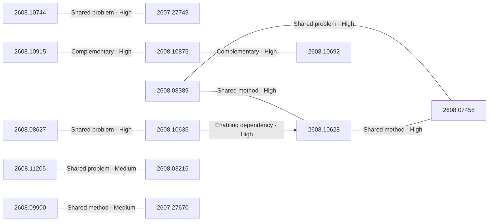

# Paper relationship graph — 2026-08-12

> [← Daily summary](../2026-08-12.md)

> **Interpretation caveat:** Every edge is an evidence-screened editorial hypothesis, not proof of citation, influence, priority, historical use, dependency, or an author-claimed relationship.

## Legend

- Rectangular nodes are current-day papers; rounded nodes are previously seen candidates.
- A line has no technical direction. An arrow shows only a proposed technical flow for an enabling dependency or method transfer.
- Solid edges are high confidence; dotted edges are medium confidence. Confidence evaluates this editorial connection, not either paper.
- Relationship labels:
  - **Shared problem:** `shared_problem`
  - **Shared method:** `shared_method`
  - **Shared evaluation:** `shared_evaluation`
  - **Complementary:** `complementary`
  - **Enabling dependency:** `enabling_dependency`
  - **Method transfer:** `method_transfer`
  - **Assumption tension:** `assumption_tension`
  - **Result tension:** `result_tension`
  - **Shared limitation:** `shared_limitation`
  - **Follow-up opportunity:** `follow_up_opportunity`

## Same-day relationships

| Source paper | Target paper | Relationship | Direction | Confidence |
| --- | --- | --- | --- | --- |
| [2608.10915](2608.10915.md) | [2608.10875](2608.10875.md) | Complementary | Not directional | High |
| [2608.10875](2608.10875.md) | [2608.10692](2608.10692.md) | Complementary | Not directional | High |
| [2608.10744](2608.10744.md) | [2607.27749](2607.27749.md) | Shared problem | Not directional | High |
| [2608.08389](2608.08389.md) | [2608.10628](2608.10628.md) | Shared method | Not directional | High |
| [2608.08389](2608.08389.md) | [2608.07458](2608.07458.md) | Shared problem | Not directional | High |
| [2608.10628](2608.10628.md) | [2608.07458](2608.07458.md) | Shared method | Not directional | High |
| [2608.10636](2608.10636.md) | [2608.10628](2608.10628.md) | Enabling dependency | Source → target | High |
| [2608.08627](2608.08627.md) | [2608.10636](2608.10636.md) | Shared problem | Not directional | High |
| [2608.09900](2608.09900.md) | [2607.27670](2607.27670.md) | Shared method | Not directional | Medium |
| [2608.11205](2608.11205.md) | [2608.03216](2608.03216.md) | Shared problem | Not directional | Medium |

## Connections to previously seen papers

_The visual diagram is omitted because this graph is too large or dense for a readable snapshot; every edge remains in the table below._

| New paper | Previously seen paper | First seen by service | Relationship | Technical direction | Confidence |
| --- | --- | --- | --- | --- | --- |
| [2608.07645](2608.07645.md) | 2608.09096 ([Hugging Face](https://huggingface.co/papers/2608.09096) · [arXiv](https://arxiv.org/abs/2608.09096)) | 2026-08-11 | Shared method | Not directional | High |
| [2608.11079](2608.11079.md) | 2608.01678 ([Hugging Face](https://huggingface.co/papers/2608.01678) · [arXiv](https://arxiv.org/abs/2608.01678)) | 2026-08-04 | Complementary | Not directional | High |
| [2608.11079](2608.11079.md) | 2607.28048 ([Hugging Face](https://huggingface.co/papers/2607.28048) · [arXiv](https://arxiv.org/abs/2607.28048)) | 2026-08-06 | Shared problem | Not directional | High |
| [2608.10875](2608.10875.md) | 2607.28956 ([Hugging Face](https://huggingface.co/papers/2607.28956) · [arXiv](https://arxiv.org/abs/2607.28956)) | 2026-08-05 | Shared problem | Not directional | High |
| [2608.10875](2608.10875.md) | 2608.04003 ([Hugging Face](https://huggingface.co/papers/2608.04003) · [arXiv](https://arxiv.org/abs/2608.04003)) | 2026-08-05 | Shared evaluation | Not directional | High |
| [2608.10628](2608.10628.md) | 2607.24651 ([Hugging Face](https://huggingface.co/papers/2607.24651) · [arXiv](https://arxiv.org/abs/2607.24651)) | 2026-07-28 | Shared problem | Not directional | High |
| [2608.07458](2608.07458.md) | 2607.10463 ([Hugging Face](https://huggingface.co/papers/2607.10463) · [arXiv](https://arxiv.org/abs/2607.10463)) | 2026-07-17 | Shared method | Not directional | High |
| [2608.08814](2608.08814.md) | 2608.05747 ([Hugging Face](https://huggingface.co/papers/2608.05747) · [arXiv](https://arxiv.org/abs/2608.05747)) | 2026-08-07 | Shared evaluation | Not directional | High |
| [2607.27749](2607.27749.md) | 2608.00486 ([Hugging Face](https://huggingface.co/papers/2608.00486) · [arXiv](https://arxiv.org/abs/2608.00486)) | 2026-08-04 | Shared method | Not directional | High |
| [2608.10744](2608.10744.md) | 2608.04701 ([Hugging Face](https://huggingface.co/papers/2608.04701) · [arXiv](https://arxiv.org/abs/2608.04701)) | 2026-08-06 | Shared problem | Not directional | High |
| [2608.10720](2608.10720.md) | 2607.20368 ([Hugging Face](https://huggingface.co/papers/2607.20368) · [arXiv](https://arxiv.org/abs/2607.20368)) | 2026-07-23 | Shared problem | Not directional | High |
| [2608.10299](2608.10299.md) | 2608.06020 ([Hugging Face](https://huggingface.co/papers/2608.06020) · [arXiv](https://arxiv.org/abs/2608.06020)) | 2026-08-07 | Shared problem | Not directional | High |

## Current paper key

| Paper | Analysis |
| --- | --- |
| 2608.10915 — ComBodied Agents: a New Paradigm of Human-Centric Agentic AI | [Read analysis](2608.10915.md) |
| 2608.10299 — Co-Evolution in Agentic Systems: Toward Self-Directed Evolution Beyond Human Design | [Read analysis](2608.10299.md) |
| 2608.10744 — Beyond Pixels: From Video Priors to 4D Worlds | [Read analysis](2608.10744.md) |
| 2607.27749 — Articulated Object Reconstruction from Rest-State Observation | [Read analysis](2607.27749.md) |
| 2608.11205 — AdvFD: Boosting Visual Generation via Adversarial Fr'echet Distance Loss | [Read analysis](2608.11205.md) |
| 2608.07645 — Mendel Gödel Machine: Recursive Self-Improving Coding Agents via Comparative Evolution | [Read analysis](2608.07645.md) |
| 2608.10875 — VibeLifeBench: Can Your Life Agent Be Proactive and Persistent in a Living World? | [Read analysis](2608.10875.md) |
| 2608.10720 — Ex-Omni-2D: Expressive Omni-Modal Dialogue Models with Native Visual Presence | [Read analysis](2608.10720.md) |
| 2608.11079 — SkillZip: Evaluation-Free Skill Compression for Self-Evolving Agents by Discovering Reusable Structure | [Read analysis](2608.11079.md) |
| 2608.09900 — Decoding-Level Taboo: A Diagnostic Stress Test for LLM Robustness | [Read analysis](2608.09900.md) |
| 2608.08627 — UniMoMo: Expert Merging-Based MoE Acceleration for Large Recommendation Models | [Read analysis](2608.08627.md) |
| 2608.08389 — Not Worth Another Token: Marginal Value Estimation for Efficient Deep Research Agents | [Read analysis](2608.08389.md) |
| 2608.10628 — InSight-doc: Agentic Visual Perception for Long-Document Understanding | [Read analysis](2608.10628.md) |
| 2608.10636 — DistilVDR: A Compact End-to-End Visual Document Retriever via Dual-Student Distillation | [Read analysis](2608.10636.md) |
| 2608.10812 — Reference-Free Post-Training of Open Large Language Models for Multilingual Machine Translation | [Read analysis](2608.10812.md) |
| 2608.10692 — SPIEval: Evaluating Large Language Models as Mobile Assistants over Scattered Personal Information | [Read analysis](2608.10692.md) |
| 2608.08814 — 360CityArena: A Realistic Virtual Urban Navigation Benchmark for Embodied Agents | [Read analysis](2608.08814.md) |
| 2608.08119 — TSDS-Toolbox: A Toolbox for Measuring Time-Series Dataset Similarity | [Read analysis](2608.08119.md) |
| 2608.03216 — iFAN: Inference-Aware Learning for Plain Mask Transformers | [Read analysis](2608.03216.md) |
| 2608.10366 — DSAgentBench: Can Agents Automate End-to-End Data-Science Workflows in Real Computer Environments? | [Read analysis](2608.10366.md) |
| 2607.27670 — JigShape: Evaluating Visual-Geometric Reasoning in VLMs through Jigsaw Puzzles | [Read analysis](2607.27670.md) |
| 2608.10288 — Power law graph attention: exact generalization of scaled dot-product attention, empirical collapse at inference | [Read analysis](2608.10288.md) |
| 2608.07458 — CoinRAG: Contextualized Information Nugget KV Cache Reuse for Long-Context RAG | [Read analysis](2608.07458.md) |

## Current papers without a published edge

- [2608.10812](2608.10812.md)
- [2608.08119](2608.08119.md)
- [2608.10366](2608.10366.md)
- [2608.10288](2608.10288.md)

---

[Support these research summaries on Buy Me a Coffee](https://buymeacoffee.com/vollero)
