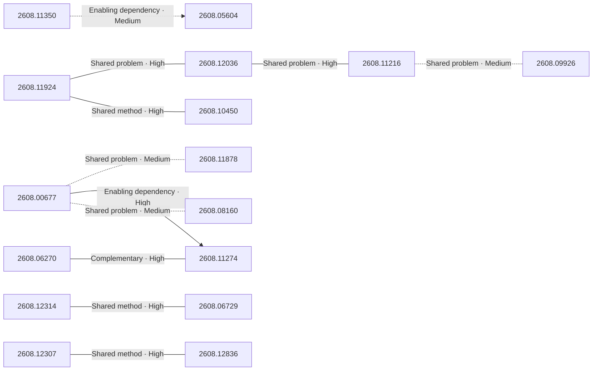

# Paper relationship graph — 2026-08-13

> [← Daily summary](../2026-08-13.md)

> **Interpretation caveat:** Every edge is an evidence-screened editorial hypothesis, not proof of citation, influence, priority, historical use, dependency, or an author-claimed relationship.

## Legend

- Rectangular nodes are current-day papers; rounded nodes are previously seen candidates.
- A line has no technical direction. An arrow shows only a proposed technical flow for an enabling dependency or method transfer.
- Solid edges are high confidence; dotted edges are medium confidence. Confidence evaluates this editorial connection, not either paper.
- Relationship labels:
  - **Shared problem:** `shared_problem`
  - **Shared method:** `shared_method`
  - **Shared evaluation:** `shared_evaluation`
  - **Complementary:** `complementary`
  - **Enabling dependency:** `enabling_dependency`
  - **Method transfer:** `method_transfer`
  - **Assumption tension:** `assumption_tension`
  - **Result tension:** `result_tension`
  - **Shared limitation:** `shared_limitation`
  - **Follow-up opportunity:** `follow_up_opportunity`

## Same-day relationships

| Source paper | Target paper | Relationship | Direction | Confidence |
| --- | --- | --- | --- | --- |
| [2608.00677](2608.00677.md) | [2608.11878](2608.11878.md) | Shared problem | Not directional | Medium |
| [2608.00677](2608.00677.md) | [2608.11274](2608.11274.md) | Enabling dependency | Source → target | High |
| [2608.00677](2608.00677.md) | [2608.08160](2608.08160.md) | Shared problem | Not directional | Medium |
| [2608.06270](2608.06270.md) | [2608.11274](2608.11274.md) | Complementary | Not directional | High |
| [2608.11924](2608.11924.md) | [2608.12036](2608.12036.md) | Shared problem | Not directional | High |
| [2608.11924](2608.11924.md) | [2608.10450](2608.10450.md) | Shared method | Not directional | High |
| [2608.12036](2608.12036.md) | [2608.11216](2608.11216.md) | Shared problem | Not directional | High |
| [2608.11350](2608.11350.md) | [2608.05604](2608.05604.md) | Enabling dependency | Source → target | Medium |
| [2608.12307](2608.12307.md) | [2608.12836](2608.12836.md) | Shared method | Not directional | High |
| [2608.12314](2608.12314.md) | [2608.06729](2608.06729.md) | Shared method | Not directional | High |
| [2608.09926](2608.09926.md) | [2608.11216](2608.11216.md) | Shared problem | Not directional | Medium |

## Connections to previously seen papers

_The visual diagram is omitted because this graph is too large or dense for a readable snapshot; every edge remains in the table below._

| New paper | Previously seen paper | First seen by service | Relationship | Technical direction | Confidence |
| --- | --- | --- | --- | --- | --- |
| [2608.05604](2608.05604.md) | 2608.11079 ([Hugging Face](https://huggingface.co/papers/2608.11079) · [arXiv](https://arxiv.org/abs/2608.11079)) | 2026-08-12 | Shared problem | Not directional | High |
| [2608.05604](2608.05604.md) | 2607.26637 ([Hugging Face](https://huggingface.co/papers/2607.26637) · [arXiv](https://arxiv.org/abs/2607.26637)) | 2026-07-31 | Complementary | Not directional | Medium |
| [2608.12307](2608.12307.md) | 2608.09096 ([Hugging Face](https://huggingface.co/papers/2608.09096) · [arXiv](https://arxiv.org/abs/2608.09096)) | 2026-08-11 | Shared problem | Not directional | High |
| [2608.12307](2608.12307.md) | 2607.15524 ([Hugging Face](https://huggingface.co/papers/2607.15524) · [arXiv](https://arxiv.org/abs/2607.15524)) | 2026-07-20 | Shared method | Not directional | High |
| [2608.11350](2608.11350.md) | 2607.26784 ([Hugging Face](https://huggingface.co/papers/2607.26784) · [arXiv](https://arxiv.org/abs/2607.26784)) | 2026-07-30 | Shared method | Not directional | High |
| [2608.11274](2608.11274.md) | 2608.03499 ([Hugging Face](https://huggingface.co/papers/2608.03499) · [arXiv](https://arxiv.org/abs/2608.03499)) | 2026-08-11 | Complementary | Not directional | High |
| [2608.11274](2608.11274.md) | 2608.03836 ([Hugging Face](https://huggingface.co/papers/2608.03836) · [arXiv](https://arxiv.org/abs/2608.03836)) | 2026-08-06 | Shared method | Not directional | High |
| [2608.06270](2608.06270.md) | 2607.26769 ([Hugging Face](https://huggingface.co/papers/2607.26769) · [arXiv](https://arxiv.org/abs/2607.26769)) | 2026-07-31 | Shared evaluation | Not directional | High |
| [2608.06729](2608.06729.md) | 2608.05042 ([Hugging Face](https://huggingface.co/papers/2608.05042) · [arXiv](https://arxiv.org/abs/2608.05042)) | 2026-08-06 | Shared method | Not directional | High |
| [2608.12314](2608.12314.md) | 2607.11594 ([Hugging Face](https://huggingface.co/papers/2607.11594) · [arXiv](https://arxiv.org/abs/2607.11594)) | 2026-07-15 | Complementary | Not directional | Medium |
| [2608.12036](2608.12036.md) | 2607.11079 ([Hugging Face](https://huggingface.co/papers/2607.11079) · [arXiv](https://arxiv.org/abs/2607.11079)) | 2026-07-15 | Complementary | Not directional | Medium |
| [2608.11924](2608.11924.md) | 2607.22375 ([Hugging Face](https://huggingface.co/papers/2607.22375) · [arXiv](https://arxiv.org/abs/2607.22375)) | 2026-07-27 | Complementary | Not directional | Medium |

## Current paper key

| Paper | Analysis |
| --- | --- |
| 2608.00677 — OpenART: Scaling Agent Red Teaming via Open-Ended Environment Evolution | [Read analysis](2608.00677.md) |
| 2608.11924 — Spark-to-Paper: End-to-End Research Paper Generation as a Composable Skill | [Read analysis](2608.11924.md) |
| 2608.12307 — AI4AI at Test-Time: Strong-to-Weak Capability Transfer via Harnesses | [Read analysis](2608.12307.md) |
| 2608.12036 — Mechanist: AI as a Scientific Instrument for Discovering the Mechanisms of Intelligence | [Read analysis](2608.12036.md) |
| 2608.05604 — SkillZip: Contract-Preserving Graph Compression for Scalable Agent Skill Libraries | [Read analysis](2608.05604.md) |
| 2608.08160 — Can LLM Agents Stick to the Script? A Benchmark for Long-Horizon Consistency in Interactive Narratives | [Read analysis](2608.08160.md) |
| 2608.12314 — StateFlow: Building, Evolving, and Accessing 3D World States for Previsualization | [Read analysis](2608.12314.md) |
| 2608.10708 — Self-Geometry: GT-Free and Plug-and-Play Test-Time Adaptation for Geometrically Consistent 3D Vision Foundation Models | [Read analysis](2608.10708.md) |
| 2608.11350 — Self-Evolving Embodied Agents via Skill-Harness Evolution | [Read analysis](2608.11350.md) |
| 2608.11216 — AutoWorldModel-Bench: A State-Centric Benchmark for Automated World-Model Research | [Read analysis](2608.11216.md) |
| 2608.11878 — ToolHazard: Scaling Adversarial Environments for Security Evaluation and Alignment of LLM-based Agents | [Read analysis](2608.11878.md) |
| 2608.11562 — From Synthesis to Removal: Physics-Grounded Reflection Simulation and Diffusion-Based Video Dereflection | [Read analysis](2608.11562.md) |
| 2608.09926 — Learning How the World Evolves: Extrapolative Video World Models via Latent Dynamics Reasoning | [Read analysis](2608.09926.md) |
| 2608.06270 — The Illusion of Visual Tool-Use: A Causal Audit of Thinking with Images | [Read analysis](2608.06270.md) |
| 2608.11616 — MBA: Multimodal Benchmark and Agents for Real-World Business Ideation | [Read analysis](2608.11616.md) |
| 2608.10450 — Persistent Recursive Worlds Enable Autonomous Software Evolution | [Read analysis](2608.10450.md) |
| 2608.11367 — Gaze Target Estimation Anywhere with Concepts | [Read analysis](2608.11367.md) |
| 2608.10615 — Simplex Relaxation for Discrete Diffusion | [Read analysis](2608.10615.md) |
| 2608.09805 — Parameter Exploration for RLVR via Variational Learning | [Read analysis](2608.09805.md) |
| 2608.11274 — Agent Safety Should Be a Runtime Contract | [Read analysis](2608.11274.md) |
| 2608.11215 — Poor Man's Agentic Modeling: Simulating Large LLM-Agent Societies on a Laptop | [Read analysis](2608.11215.md) |
| 2608.12123 — Ready Cohorts: Bounding GPU Opportunity and Avoiding Host Round Trips in LLM-Agent Control | [Read analysis](2608.12123.md) |
| 2608.08107 — NeuPAT: Neuron-aware Plasticity Allocation Tuning for Language-Preserving MLLMs | [Read analysis](2608.08107.md) |
| 2608.06729 — AtlasVLA: Persistent World-Ego State Modeling for Vision-Language-Action Models | [Read analysis](2608.06729.md) |
| 2608.12836 — From Atomic Evidence to Logical Composition: Structured Compositional Reasoning over Compound Answer Options | [Read analysis](2608.12836.md) |
| 2608.11574 — Hand Visibility Detector: Per-Keypoint Visibility Estimation for Hands | [Read analysis](2608.11574.md) |
| 2608.11045 — ReRound: Reconstructive Rounding to Resolve Midpoint Ambiguity in Calibration-Free LLM Quantization | [Read analysis](2608.11045.md) |

## Current papers without a published edge

- [2608.10708](2608.10708.md)
- [2608.11562](2608.11562.md)
- [2608.11616](2608.11616.md)
- [2608.11367](2608.11367.md)
- [2608.10615](2608.10615.md)
- [2608.09805](2608.09805.md)
- [2608.11215](2608.11215.md)
- [2608.12123](2608.12123.md)
- [2608.08107](2608.08107.md)
- [2608.11574](2608.11574.md)
- [2608.11045](2608.11045.md)

---

[Support these research summaries on Buy Me a Coffee](https://buymeacoffee.com/vollero)
