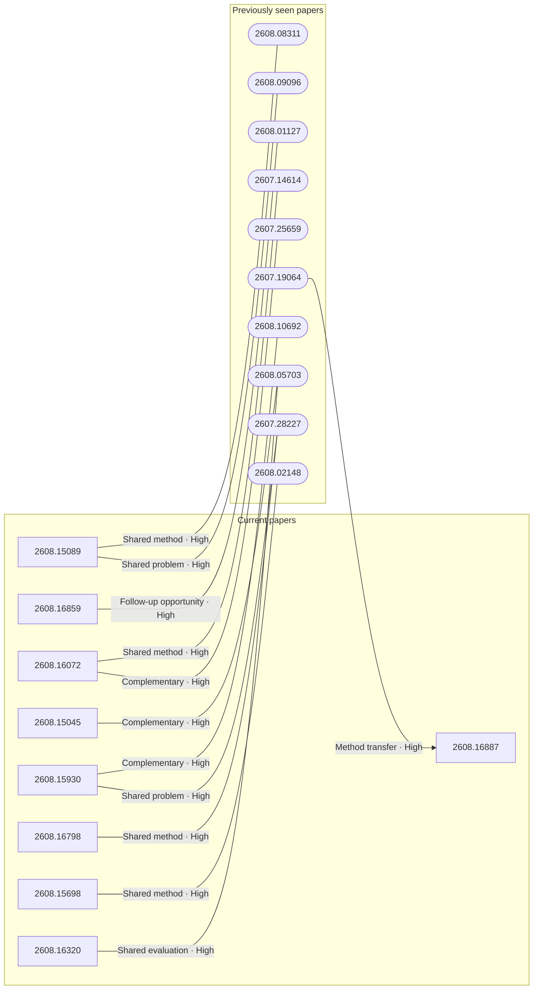

# Paper relationship graph — 2026-08-18

> [← Daily summary](../2026-08-18.md)

> **Interpretation caveat:** Every edge is an evidence-screened editorial hypothesis, not proof of citation, influence, priority, historical use, dependency, or an author-claimed relationship.

## Legend

- Rectangular nodes are current-day papers; rounded nodes are previously seen candidates.
- A line has no technical direction. An arrow shows only a proposed technical flow for an enabling dependency or method transfer.
- Solid edges are high confidence; dotted edges are medium confidence. Confidence evaluates this editorial connection, not either paper.
- Relationship labels:
  - **Shared problem:** `shared_problem`
  - **Shared method:** `shared_method`
  - **Shared evaluation:** `shared_evaluation`
  - **Complementary:** `complementary`
  - **Enabling dependency:** `enabling_dependency`
  - **Method transfer:** `method_transfer`
  - **Assumption tension:** `assumption_tension`
  - **Result tension:** `result_tension`
  - **Shared limitation:** `shared_limitation`
  - **Follow-up opportunity:** `follow_up_opportunity`

## Same-day relationships

_The visual diagram is omitted because this graph is too large or dense for a readable snapshot; every edge remains in the table below._

| Source paper | Target paper | Relationship | Direction | Confidence |
| --- | --- | --- | --- | --- |
| [2608.15089](2608.15089.md) | [2608.13900](2608.13900.md) | Shared problem | Not directional | High |
| [2608.15930](2608.15930.md) | [2608.16798](2608.16798.md) | Shared method | Not directional | High |
| [2608.15265](2608.15265.md) | [2608.16859](2608.16859.md) | Shared problem | Not directional | High |
| [2608.16859](2608.16859.md) | [2608.16765](2608.16765.md) | Shared method | Not directional | High |
| [2608.15045](2608.15045.md) | [2608.16320](2608.16320.md) | Shared evaluation | Not directional | High |
| [2608.15045](2608.15045.md) | [2608.15869](2608.15869.md) | Shared problem | Not directional | High |
| [2608.16072](2608.16072.md) | [2608.16320](2608.16320.md) | Shared method | Not directional | High |
| [2608.16887](2608.16887.md) | [2608.16721](2608.16721.md) | Complementary | Not directional | High |
| [2608.14783](2608.14783.md) | [2608.16485](2608.16485.md) | Shared problem | Not directional | High |
| [2608.14905](2608.14905.md) | [2608.14667](2608.14667.md) | Follow-up opportunity | Not directional | High |
| [2608.15669](2608.15669.md) | [2608.16884](2608.16884.md) | Shared problem | Not directional | Medium |
| [2608.16003](2608.16003.md) | [2608.11947](2608.11947.md) | Shared problem | Not directional | High |

## Connections to previously seen papers

| New paper | Previously seen paper | First seen by service | Relationship | Technical direction | Confidence |
| --- | --- | --- | --- | --- | --- |
| [2608.15089](2608.15089.md) | 2608.09096 ([Hugging Face](https://huggingface.co/papers/2608.09096) · [arXiv](https://arxiv.org/abs/2608.09096)) | 2026-08-11 | Shared problem | Not directional | High |
| [2608.15089](2608.15089.md) | 2608.08311 ([Hugging Face](https://huggingface.co/papers/2608.08311) · [arXiv](https://arxiv.org/abs/2608.08311)) | 2026-08-11 | Shared method | Not directional | High |
| [2608.16072](2608.16072.md) | 2607.25659 ([Hugging Face](https://huggingface.co/papers/2607.25659) · [arXiv](https://arxiv.org/abs/2607.25659)) | 2026-07-30 | Complementary | Not directional | High |
| [2608.16072](2608.16072.md) | 2607.14614 ([Hugging Face](https://huggingface.co/papers/2607.14614) · [arXiv](https://arxiv.org/abs/2607.14614)) | 2026-07-20 | Shared method | Not directional | High |
| [2608.15930](2608.15930.md) | 2607.28227 ([Hugging Face](https://huggingface.co/papers/2607.28227) · [arXiv](https://arxiv.org/abs/2607.28227)) | 2026-07-31 | Shared problem | Not directional | High |
| [2608.15930](2608.15930.md) | 2608.10692 ([Hugging Face](https://huggingface.co/papers/2608.10692) · [arXiv](https://arxiv.org/abs/2608.10692)) | 2026-08-12 | Complementary | Not directional | High |
| [2608.16798](2608.16798.md) | 2607.28227 ([Hugging Face](https://huggingface.co/papers/2607.28227) · [arXiv](https://arxiv.org/abs/2607.28227)) | 2026-07-31 | Shared method | Not directional | High |
| [2608.16859](2608.16859.md) | 2608.01127 ([Hugging Face](https://huggingface.co/papers/2608.01127) · [arXiv](https://arxiv.org/abs/2608.01127)) | 2026-08-05 | Follow-up opportunity | Not directional | High |
| [2608.15045](2608.15045.md) | 2608.05703 ([Hugging Face](https://huggingface.co/papers/2608.05703) · [arXiv](https://arxiv.org/abs/2608.05703)) | 2026-08-10 | Complementary | Not directional | High |
| [2608.16320](2608.16320.md) | 2608.05703 ([Hugging Face](https://huggingface.co/papers/2608.05703) · [arXiv](https://arxiv.org/abs/2608.05703)) | 2026-08-10 | Shared evaluation | Not directional | High |
| [2608.15698](2608.15698.md) | 2608.02148 ([Hugging Face](https://huggingface.co/papers/2608.02148) · [arXiv](https://arxiv.org/abs/2608.02148)) | 2026-08-10 | Shared method | Not directional | High |
| [2608.16887](2608.16887.md) | 2607.19064 ([Hugging Face](https://huggingface.co/papers/2607.19064) · [arXiv](https://arxiv.org/abs/2607.19064)) | 2026-07-22 | Method transfer | Previous → new | High |

## Current paper key

| Paper | Analysis |
| --- | --- |
| 2608.15089 — StateM: Reaching 95.3% Raw Accuracy, or a \\$15 Frontier Run, on Terminal-Bench 2.1 via Harness Scaling | [Read analysis](2608.15089.md) |
| 2608.16859 — HarnessEval-W: Agentifying the Evaluation of Visual Worlds | [Read analysis](2608.16859.md) |
| 2608.16072 — Learn What's Left, Not What's Mastered: Saturation Aware Advantage Reweighting for Multi-Reward Policy Optimization | [Read analysis](2608.16072.md) |
| 2608.15669 — Large Discovery Models: Empirically-grounded Model-Based Open-Ended Search | [Read analysis](2608.15669.md) |
| 2608.15265 — VibeWorlding: Can Multimodal Agents Construct 3D Open Worlds End-to-End? | [Read analysis](2608.15265.md) |
| 2608.15045 — MOSS-VL Technical Report | [Read analysis](2608.15045.md) |
| 2608.15930 — UI-Mate: Advancing Open-Weight Foundation GUI Agents with In-Context Demonstrations | [Read analysis](2608.15930.md) |
| 2608.16798 — ClawGym II: Exploring Black-Box RL on Agent Harness | [Read analysis](2608.16798.md) |
| 2608.16887 — An Empirical Study of Training Pixel-Space Text-to-Image Diffusion Models | [Read analysis](2608.16887.md) |
| 2608.13900 — Agentic Transaction: Towards ACID-Compliant Agent Systems | [Read analysis](2608.13900.md) |
| 2608.14905 — How Do Agents Fail on AutoResearch: End-to-End Diagnostic Evaluation on 100 Real-World Frontier Research Tasks | [Read analysis](2608.14905.md) |
| 2608.16319 — Advancing Open and Reproducible Relational Learning: RelArena-α, TabPFN-Rel and RPI | [Read analysis](2608.16319.md) |
| 2608.16721 — GenRouter: Unified Workflow Routing for Agentic Image Generation | [Read analysis](2608.16721.md) |
| 2608.14577 — HarmProfile: Characterizing Harmful Distributions in Frontier LLMs | [Read analysis](2608.14577.md) |
| 2608.14783 — MegaParts: Scaling Part-Aware 3D Object Generation to 300 Parts via Token-Efficient Autoregressive Modeling | [Read analysis](2608.14783.md) |
| 2608.15304 — Understanding Cognition-Induced Risks in Agentic AI Systems | [Read analysis](2608.15304.md) |
| 2608.16328 — GRNEdit: Efficient General Video Editing from a New Binary-Evidence Perspective in Generative Refinement Networks | [Read analysis](2608.16328.md) |
| 2608.16884 — Improving the matrix multiplication exponent with modern optimization and AlphaEvolve | [Read analysis](2608.16884.md) |
| 2608.16391 — Ventor-QTest: Threat-Model-Driven Verification of Vendor-Hosted LLM APIs | [Read analysis](2608.16391.md) |
| 2608.16033 — R^3-Bench: LLMs Struggle with Resource-Rational Reasoning under Shared Budgets | [Read analysis](2608.16033.md) |
| 2608.14441 — PACE-Bench: Benchmarking Physics Adaptation via Code Evolution in Dynamic Environments | [Read analysis](2608.14441.md) |
| 2608.16765 — TRACE-Bench: Decomposing and Diagnosing Multi-Reference Image Generation | [Read analysis](2608.16765.md) |
| 2608.14718 — VideoGAIA: A Benchmark for General AI Assistants on Agentic Video Understanding | [Read analysis](2608.14718.md) |
| 2608.16143 — AnyTalk: Speech Animation for Arbitrary Characters Leveraging a Video Generation Model | [Read analysis](2608.16143.md) |
| 2608.15869 — Beyond Visual CoT: Internalized Visual Thinking for Proactive Video Reasoning | [Read analysis](2608.15869.md) |
| 2608.12898 — NaviDC-OCR: Navigating Document Parsing Across Digital and Camera-Captured Documents | [Read analysis](2608.12898.md) |
| 2608.15698 — ConceptFormer: Learning Adaptive Latent Concepts for Query-Document Alignment in Visual Document Retrieval | [Read analysis](2608.15698.md) |
| 2608.10679 — ENTLORE: A Graph-Grounded Benchmark for Latent Organizational Reasoning in Enterprise Question Answering | [Read analysis](2608.10679.md) |
| 2608.16003 — Prior Audit-Repair Context Shifts LLM Verifier Thresholds Toward Leniency | [Read analysis](2608.16003.md) |
| 2608.16435 — Drive, Pack, Fly: The Travelling Thief Problem with Drone | [Read analysis](2608.16435.md) |
| 2608.15022 — Gathered, Not Admitted: How Attention Brings a Latent Variable into Verbalizable Form | [Read analysis](2608.15022.md) |
| 2608.14614 — DumpsterCluster: From Dumpster Diving to Serving LLaMA-70B on $60 GPUs | [Read analysis](2608.14614.md) |
| 2608.14606 — Plausible but Not Valid: A Psychometric Audit of LLMs as Synthetic Survey Respondents | [Read analysis](2608.14606.md) |
| 2608.15984 — A Plug-and-Play 2D Motion Interface for Real-World Motion Language Models | [Read analysis](2608.15984.md) |
| 2608.15659 — WorldRover: A Scalable Synthetic Video Data Engine for World Exploration with Rich Annotations | [Read analysis](2608.15659.md) |
| 2608.11947 — Accuracy and Order Sensitivity Diverge Under Label-Free Strategies | [Read analysis](2608.11947.md) |
| 2608.06947 — When Context Bites: Detecting RAG Poisoning via Document-Level Attention Collapse | [Read analysis](2608.06947.md) |
| 2608.14667 — Position: AI Agents in Scientific Teams Should Be Studied as Human-Agent Systems | [Read analysis](2608.14667.md) |
| 2608.14639 — Valid Per-Field Selective Risk Control for Document Extraction: Three Failure Modes, a Validity Ladder, and When Conditioning Pays | [Read analysis](2608.14639.md) |
| 2608.16320 — StreamOPD: A Post-Training Recipe with Spatio-Temporal Cue Gating for Streaming Video Understanding | [Read analysis](2608.16320.md) |
| 2608.16485 — HiFi-BRep: High-Fidelity Latent Representation for Robust B-Rep Generation | [Read analysis](2608.16485.md) |
| 2608.15037 — Prototype-Rectified Iterative Self-supervised Manifold Denoising under Severe Acoustic Shift | [Read analysis](2608.15037.md) |

## Current papers without a published edge

- [2608.16319](2608.16319.md)
- [2608.14577](2608.14577.md)
- [2608.15304](2608.15304.md)
- [2608.16328](2608.16328.md)
- [2608.16391](2608.16391.md)
- [2608.16033](2608.16033.md)
- [2608.14441](2608.14441.md)
- [2608.14718](2608.14718.md)
- [2608.16143](2608.16143.md)
- [2608.12898](2608.12898.md)
- [2608.10679](2608.10679.md)
- [2608.16435](2608.16435.md)
- [2608.15022](2608.15022.md)
- [2608.14614](2608.14614.md)
- [2608.14606](2608.14606.md)
- [2608.15984](2608.15984.md)
- [2608.15659](2608.15659.md)
- [2608.06947](2608.06947.md)
- [2608.14639](2608.14639.md)
- [2608.15037](2608.15037.md)

---

[Support these research summaries on Buy Me a Coffee](https://buymeacoffee.com/vollero)
