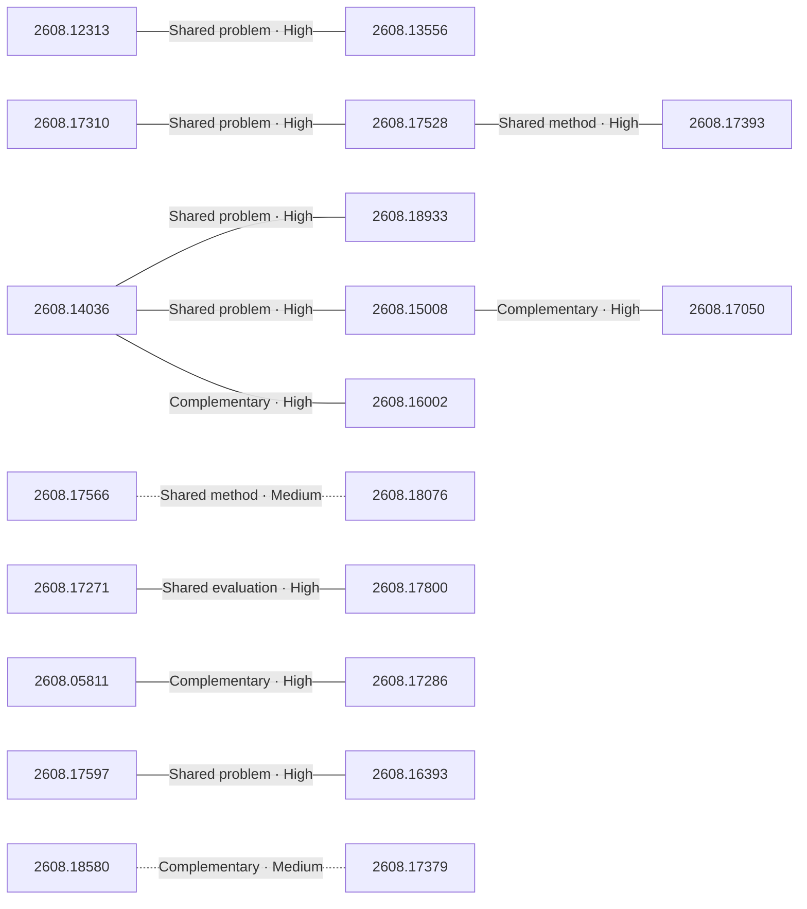

# Paper relationship graph — 2026-08-19

> [← Daily summary](../2026-08-19.md)

> **Interpretation caveat:** Every edge is an evidence-screened editorial hypothesis, not proof of citation, influence, priority, historical use, dependency, or an author-claimed relationship.

## Legend

- Rectangular nodes are current-day papers; rounded nodes are previously seen candidates.
- A line has no technical direction. An arrow shows only a proposed technical flow for an enabling dependency or method transfer.
- Solid edges are high confidence; dotted edges are medium confidence. Confidence evaluates this editorial connection, not either paper.
- Relationship labels:
  - **Shared problem:** `shared_problem`
  - **Shared method:** `shared_method`
  - **Shared evaluation:** `shared_evaluation`
  - **Complementary:** `complementary`
  - **Enabling dependency:** `enabling_dependency`
  - **Method transfer:** `method_transfer`
  - **Assumption tension:** `assumption_tension`
  - **Result tension:** `result_tension`
  - **Shared limitation:** `shared_limitation`
  - **Follow-up opportunity:** `follow_up_opportunity`

## Same-day relationships

| Source paper | Target paper | Relationship | Direction | Confidence |
| --- | --- | --- | --- | --- |
| [2608.17528](2608.17528.md) | [2608.17393](2608.17393.md) | Shared method | Not directional | High |
| [2608.17310](2608.17310.md) | [2608.17528](2608.17528.md) | Shared problem | Not directional | High |
| [2608.14036](2608.14036.md) | [2608.18933](2608.18933.md) | Shared problem | Not directional | High |
| [2608.14036](2608.14036.md) | [2608.15008](2608.15008.md) | Shared problem | Not directional | High |
| [2608.14036](2608.14036.md) | [2608.16002](2608.16002.md) | Complementary | Not directional | High |
| [2608.15008](2608.15008.md) | [2608.17050](2608.17050.md) | Complementary | Not directional | High |
| [2608.17597](2608.17597.md) | [2608.16393](2608.16393.md) | Shared problem | Not directional | High |
| [2608.17271](2608.17271.md) | [2608.17800](2608.17800.md) | Shared evaluation | Not directional | High |
| [2608.12313](2608.12313.md) | [2608.13556](2608.13556.md) | Shared problem | Not directional | High |
| [2608.17566](2608.17566.md) | [2608.18076](2608.18076.md) | Shared method | Not directional | Medium |
| [2608.05811](2608.05811.md) | [2608.17286](2608.17286.md) | Complementary | Not directional | High |
| [2608.18580](2608.18580.md) | [2608.17379](2608.17379.md) | Complementary | Not directional | Medium |

## Connections to previously seen papers

_The visual diagram is omitted because this graph is too large or dense for a readable snapshot; every edge remains in the table below._

| New paper | Previously seen paper | First seen by service | Relationship | Technical direction | Confidence |
| --- | --- | --- | --- | --- | --- |
| [2608.14036](2608.14036.md) | 2607.28048 ([Hugging Face](https://huggingface.co/papers/2607.28048) · [arXiv](https://arxiv.org/abs/2607.28048)) | 2026-08-06 | Shared method | Not directional | High |
| [2608.14036](2608.14036.md) | 2608.05604 ([Hugging Face](https://huggingface.co/papers/2608.05604) · [arXiv](https://arxiv.org/abs/2608.05604)) | 2026-08-13 | Shared problem | Not directional | High |
| [2608.13556](2608.13556.md) | 2607.14088 ([Hugging Face](https://huggingface.co/papers/2607.14088) · [arXiv](https://arxiv.org/abs/2607.14088)) | 2026-07-20 | Shared method | Not directional | High |
| [2608.17566](2608.17566.md) | 2608.16328 ([Hugging Face](https://huggingface.co/papers/2608.16328) · [arXiv](https://arxiv.org/abs/2608.16328)) | 2026-08-18 | Shared evaluation | Not directional | High |
| [2608.18076](2608.18076.md) | 2608.14546 ([Hugging Face](https://huggingface.co/papers/2608.14546) · [arXiv](https://arxiv.org/abs/2608.14546)) | 2026-08-17 | Shared evaluation | Not directional | High |
| [2608.18580](2608.18580.md) | 2608.05466 ([Hugging Face](https://huggingface.co/papers/2608.05466) · [arXiv](https://arxiv.org/abs/2608.05466)) | 2026-08-06 | Shared problem | Not directional | High |
| [2608.17597](2608.17597.md) | 2608.03499 ([Hugging Face](https://huggingface.co/papers/2608.03499) · [arXiv](https://arxiv.org/abs/2608.03499)) | 2026-08-11 | Shared evaluation | Not directional | High |
| [2608.17271](2608.17271.md) | 2608.14905 ([Hugging Face](https://huggingface.co/papers/2608.14905) · [arXiv](https://arxiv.org/abs/2608.14905)) | 2026-08-18 | Complementary | Not directional | High |
| [2608.17512](2608.17512.md) | 2608.05042 ([Hugging Face](https://huggingface.co/papers/2608.05042) · [arXiv](https://arxiv.org/abs/2608.05042)) | 2026-08-06 | Shared method | Not directional | High |
| [2608.16002](2608.16002.md) | 2607.14277 ([Hugging Face](https://huggingface.co/papers/2607.14277) · [arXiv](https://arxiv.org/abs/2607.14277)) | 2026-07-27 | Complementary | Not directional | Medium |
| [2608.17393](2608.17393.md) | 2608.05102 ([Hugging Face](https://huggingface.co/papers/2608.05102) · [arXiv](https://arxiv.org/abs/2608.05102)) | 2026-08-06 | Method transfer | Previous → new | Medium |
| [2608.18933](2608.18933.md) | 2608.10538 ([Hugging Face](https://huggingface.co/papers/2608.10538) · [arXiv](https://arxiv.org/abs/2608.10538)) | 2026-08-14 | Shared problem | Not directional | High |

## Current paper key

| Paper | Analysis |
| --- | --- |
| 2608.14036 — Demystifying Agent Skills: Why They Work-Until They Don't | [Read analysis](2608.14036.md) |
| 2608.17310 — Agentic ESOpt: Fine-Tuning Long-Horizon LLM Agents with Minimal GPU Requirements | [Read analysis](2608.17310.md) |
| 2608.16157 — FreeToken: Efficient Edge-Native MoE Serving with Bandwidth-Adaptive Execution | [Read analysis](2608.16157.md) |
| 2608.17271 — ASI-Bench: At the Dawn of Artificial Superintelligence | [Read analysis](2608.17271.md) |
| 2608.17512 — Embodied-Navigator: Point, Think, Memorize, and Align for Efficient Navigation | [Read analysis](2608.17512.md) |
| 2608.12313 — AVA-Encoder: Towards Agent-Native Video Representation Learning | [Read analysis](2608.12313.md) |
| 2608.13556 — V-RAE: Rethinking Video Latent Spaces for Generation | [Read analysis](2608.13556.md) |
| 2608.18063 — EDITBRIDGE: Towards Faithful and Efficient Ultra-High-Resolution Image Editing | [Read analysis](2608.18063.md) |
| 2608.17528 — Agent Lightning v1.0: Towards Harnessed Agentic RL | [Read analysis](2608.17528.md) |
| 2608.17067 — DiSCO: Defending text-to-image generation through distribution-guided contrastive prompt optimization | [Read analysis](2608.17067.md) |
| 2608.17393 — LEGO-RL: Harness-Native Reinforcement Learning for Coding Agents | [Read analysis](2608.17393.md) |
| 2608.15454 — Dynamic Multi-Byte Prediction With Hierarchical Language Models | [Read analysis](2608.15454.md) |
| 2608.17566 — CoinVE-200K: A Large-Scale High-Quality Dataset for Compositional Instruction-Guided Video Editing | [Read analysis](2608.17566.md) |
| 2608.15008 — Harness the Memory: A Holistic Evaluation of Memory Substrates in Memory Agents | [Read analysis](2608.15008.md) |
| 2608.17402 — MoE-ViE: Mixture of Experts Vision Encoder for Efficient Image and Video Understanding | [Read analysis](2608.17402.md) |
| 2608.18933 — SkillForge: Self-Distilling Agents for Project-Specific Issue Resolution | [Read analysis](2608.18933.md) |
| 2608.18076 — From Corpora to Co-Evolving Capabilities: Capability-Centric Data Design for Generalist Image Generation | [Read analysis](2608.18076.md) |
| 2608.05811 — Energy-Guided Flow Matching | [Read analysis](2608.05811.md) |
| 2608.17597 — HarnessRisk: A Lifecycle-Oriented Benchmark for Agent Harness Safety | [Read analysis](2608.17597.md) |
| 2608.17800 — StartupBench: Benchmarking General-Purpose Agents on Market-Validated End-to-End Workflows | [Read analysis](2608.17800.md) |
| 2608.17286 — Abra: Scaling Diffusion Image Training | [Read analysis](2608.17286.md) |
| 2608.16002 — From Sequence to Structure: Relational Uncertainty Propagation for LLM Agents | [Read analysis](2608.16002.md) |
| 2608.14221 — MathForm: Scaling Mathematical Autoformalization with Knowledge Retrieval and Verification-Guided Refinement | [Read analysis](2608.14221.md) |
| 2608.16393 — Security Assessment of DeepSeek Harness with A.I.G: Evaluating Resistance to Indirect Prompt Injection | [Read analysis](2608.16393.md) |
| 2608.17050 — Cross-Model Memory Transfer via Target-Side Reader Adaptation | [Read analysis](2608.17050.md) |
| 2608.14881 — Personalized Auto-Research: Towards a True AI Co-Scientist | [Read analysis](2608.14881.md) |
| 2608.17988 — GS-Voxel: Fitting-Free Structured Latents for Large-Scale 3DGS Generation | [Read analysis](2608.17988.md) |
| 2608.17975 — aDSL: Agentic 3D Creation via Joint Agent-Program Design | [Read analysis](2608.17975.md) |
| 2608.16977 — The Problem Is the Problem: Towards Scalable Mathematical Discovery | [Read analysis](2608.16977.md) |
| 2608.18580 — FACET: Preserving Source Intent and Executable State in Terminal Task Synthesis | [Read analysis](2608.18580.md) |
| 2608.16097 — Unifying Graph Neural Networks Through a Common Layer Equation | [Read analysis](2608.16097.md) |
| 2608.17379 — PTXBench: Benchmark and Adapt LLMs for GPU Kernel Optimization with Architecture-specific PTX | [Read analysis](2608.17379.md) |
| 2608.16793 — PixRestore: Unified Image Restoration via Pixel Diffusion Transformer | [Read analysis](2608.16793.md) |
| 2608.12944 — CardioState-JEPA: Delay-Aware Cross-Modal Learning of a Shared Cardiac Representation | [Read analysis](2608.12944.md) |

## Current papers without a published edge

- [2608.16157](2608.16157.md)
- [2608.18063](2608.18063.md)
- [2608.17067](2608.17067.md)
- [2608.15454](2608.15454.md)
- [2608.17402](2608.17402.md)
- [2608.14221](2608.14221.md)
- [2608.14881](2608.14881.md)
- [2608.17988](2608.17988.md)
- [2608.17975](2608.17975.md)
- [2608.16977](2608.16977.md)
- [2608.16097](2608.16097.md)
- [2608.16793](2608.16793.md)
- [2608.12944](2608.12944.md)

---

[Support these research summaries on Buy Me a Coffee](https://buymeacoffee.com/vollero)
