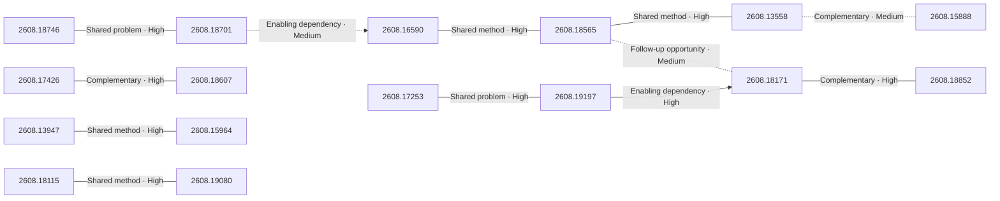

# Paper relationship graph — 2026-08-20

> [← Daily summary](../2026-08-20.md)

> **Interpretation caveat:** Every edge is an evidence-screened editorial hypothesis, not proof of citation, influence, priority, historical use, dependency, or an author-claimed relationship.

## Legend

- Rectangular nodes are current-day papers; rounded nodes are previously seen candidates.
- A line has no technical direction. An arrow shows only a proposed technical flow for an enabling dependency or method transfer.
- Solid edges are high confidence; dotted edges are medium confidence. Confidence evaluates this editorial connection, not either paper.
- Relationship labels:
  - **Shared problem:** `shared_problem`
  - **Shared method:** `shared_method`
  - **Shared evaluation:** `shared_evaluation`
  - **Complementary:** `complementary`
  - **Enabling dependency:** `enabling_dependency`
  - **Method transfer:** `method_transfer`
  - **Assumption tension:** `assumption_tension`
  - **Result tension:** `result_tension`
  - **Shared limitation:** `shared_limitation`
  - **Follow-up opportunity:** `follow_up_opportunity`

## Same-day relationships

| Source paper | Target paper | Relationship | Direction | Confidence |
| --- | --- | --- | --- | --- |
| [2608.16590](2608.16590.md) | [2608.18565](2608.18565.md) | Shared method | Not directional | High |
| [2608.18565](2608.18565.md) | [2608.13558](2608.13558.md) | Shared method | Not directional | High |
| [2608.13558](2608.13558.md) | [2608.15888](2608.15888.md) | Complementary | Not directional | Medium |
| [2608.17253](2608.17253.md) | [2608.19197](2608.19197.md) | Shared problem | Not directional | High |
| [2608.18171](2608.18171.md) | [2608.18852](2608.18852.md) | Complementary | Not directional | High |
| [2608.17426](2608.17426.md) | [2608.18607](2608.18607.md) | Complementary | Not directional | High |
| [2608.18115](2608.18115.md) | [2608.19080](2608.19080.md) | Shared method | Not directional | High |
| [2608.13947](2608.13947.md) | [2608.15964](2608.15964.md) | Shared method | Not directional | High |
| [2608.18746](2608.18746.md) | [2608.18701](2608.18701.md) | Shared problem | Not directional | High |
| [2608.18701](2608.18701.md) | [2608.16590](2608.16590.md) | Enabling dependency | Source → target | Medium |
| [2608.19197](2608.19197.md) | [2608.18171](2608.18171.md) | Enabling dependency | Source → target | High |
| [2608.18565](2608.18565.md) | [2608.18171](2608.18171.md) | Follow-up opportunity | Not directional | Medium |

## Connections to previously seen papers

_The visual diagram is omitted because this graph is too large or dense for a readable snapshot; every edge remains in the table below._

| New paper | Previously seen paper | First seen by service | Relationship | Technical direction | Confidence |
| --- | --- | --- | --- | --- | --- |
| [2608.17426](2608.17426.md) | 2608.13049 ([Hugging Face](https://huggingface.co/papers/2608.13049) · [arXiv](https://arxiv.org/abs/2608.13049)) | 2026-08-14 | Shared problem | Not directional | High |
| [2608.16590](2608.16590.md) | 2608.11350 ([Hugging Face](https://huggingface.co/papers/2608.11350) · [arXiv](https://arxiv.org/abs/2608.11350)) | 2026-08-13 | Shared method | Not directional | High |
| [2608.16590](2608.16590.md) | 2608.09096 ([Hugging Face](https://huggingface.co/papers/2608.09096) · [arXiv](https://arxiv.org/abs/2608.09096)) | 2026-08-11 | Shared method | Not directional | High |
| [2608.17253](2608.17253.md) | 2608.06296 ([Hugging Face](https://huggingface.co/papers/2608.06296) · [arXiv](https://arxiv.org/abs/2608.06296)) | 2026-08-11 | Shared method | Not directional | High |
| [2608.19197](2608.19197.md) | 2607.28074 ([Hugging Face](https://huggingface.co/papers/2607.28074) · [arXiv](https://arxiv.org/abs/2607.28074)) | 2026-07-31 | Shared method | Not directional | High |
| [2608.18746](2608.18746.md) | 2607.26056 ([Hugging Face](https://huggingface.co/papers/2607.26056) · [arXiv](https://arxiv.org/abs/2607.26056)) | 2026-07-31 | Shared method | Not directional | High |
| [2608.18423](2608.18423.md) | 2607.28956 ([Hugging Face](https://huggingface.co/papers/2607.28956) · [arXiv](https://arxiv.org/abs/2607.28956)) | 2026-08-05 | Shared problem | Not directional | High |
| [2608.18171](2608.18171.md) | 2608.06197 ([Hugging Face](https://huggingface.co/papers/2608.06197) · [arXiv](https://arxiv.org/abs/2608.06197)) | 2026-08-07 | Shared problem | Not directional | Medium |
| [2608.18607](2608.18607.md) | 2607.23855 ([Hugging Face](https://huggingface.co/papers/2607.23855) · [arXiv](https://arxiv.org/abs/2607.23855)) | 2026-07-28 | Complementary | Not directional | High |
| [2608.18852](2608.18852.md) | 2608.02287 ([Hugging Face](https://huggingface.co/papers/2608.02287) · [arXiv](https://arxiv.org/abs/2608.02287)) | 2026-08-04 | Shared problem | Not directional | High |
| [2608.15888](2608.15888.md) | 2608.17597 ([Hugging Face](https://huggingface.co/papers/2608.17597) · [arXiv](https://arxiv.org/abs/2608.17597)) | 2026-08-19 | Complementary | Not directional | High |
| [2608.18115](2608.18115.md) | 2608.10835 ([Hugging Face](https://huggingface.co/papers/2608.10835) · [arXiv](https://arxiv.org/abs/2608.10835)) | 2026-08-17 | Shared method | Not directional | Medium |

## Current paper key

| Paper | Analysis |
| --- | --- |
| 2608.17426 — SemComp-Bench: Benchmarking Semantic Task Completion in Video Generation | [Read analysis](2608.17426.md) |
| 2608.16590 — Zetta ζ: An Efficient Closed-Loop Embodied Harness for Self-Evolving Physical Intelligence | [Read analysis](2608.16590.md) |
| 2608.18565 — SemaPLC: A Project-Grounded, Verification-Gated Agent Harness for PLC Code Generation | [Read analysis](2608.18565.md) |
| 2608.17253 — Co-RL: Unsupervised Reasoning Emerges from Diverse Cohort in Multi-agent RL | [Read analysis](2608.17253.md) |
| 2608.13558 — OmniScientist: An Omni-Modal Omni-Discipline AI Scientist | [Read analysis](2608.13558.md) |
| 2608.19197 — SPADE: Self-Play in Adaptive Synthetic Executable Environments | [Read analysis](2608.19197.md) |
| 2608.18940 — Training Chemical Plausibility-Aware Large Language Models for Single-Step Retrosynthesis | [Read analysis](2608.18940.md) |
| 2608.14929 — Training Leaves Traces: Centered Residual Signatures for Language Model Lineage Verification | [Read analysis](2608.14929.md) |
| 2608.18746 — Decision-Metric Alignment in Latent World Models: Diagnostics and Action-Conditioned Objectives for MPC Planning | [Read analysis](2608.18746.md) |
| 2608.18423 — FM-Bench: A Benchmark for Long-Horizon Management with Competing Agents | [Read analysis](2608.18423.md) |
| 2608.18171 — Looped Language Models Improve Compositional Tool Calling | [Read analysis](2608.18171.md) |
| 2608.14229 — The More Popular, The Harder to Forget: Adaptive Popularity for LLM Unlearning | [Read analysis](2608.14229.md) |
| 2608.13947 — Scaling Creative Writing Beyond Story-Centric Data with Attribute-Guided Genre Expansion | [Read analysis](2608.13947.md) |
| 2608.18701 — SoftVTBench: A Deformation-Aware Visuo-Tactile Dataset and Benchmark for Deformable-Object Manipulation | [Read analysis](2608.18701.md) |
| 2608.18607 — VA-Judger: Reward Modeling from Human Preference Feedback for Joint Video-Audio Generation | [Read analysis](2608.18607.md) |
| 2608.18852 — SkillGate: Training In-Policy Skill Selection in Long-Horizon Agents | [Read analysis](2608.18852.md) |
| 2608.15964 — LLMs Get Smarter from Targeted Synthetic Multilingual Data | [Read analysis](2608.15964.md) |
| 2512.14629 — Evaluating Music Context Preservation: A Multi-facet Framework for Music Editing Systems | [Read analysis](2512.14629.md) |
| 2608.16490 — Towards Real-Time and Adaptable LiDAR Scene Completion | [Read analysis](2608.16490.md) |
| 2608.15888 — Bounded Agents: Delegation Security for Multi-Agent AI Systems | [Read analysis](2608.15888.md) |
| 2608.18115 — Temporal Multi-Signal Fusion for Token-Level Hallucination Detection | [Read analysis](2608.18115.md) |
| 2608.19080 — SPK: Eliciting Structured Prior Knowledge for Interpretable Out-of-Distribution Detection in Real-Time Object Detection | [Read analysis](2608.19080.md) |

## Current papers without a published edge

- [2608.18940](2608.18940.md)
- [2608.14929](2608.14929.md)
- [2608.14229](2608.14229.md)
- [2512.14629](2512.14629.md)
- [2608.16490](2608.16490.md)

---

[Support these research summaries on Buy Me a Coffee](https://buymeacoffee.com/vollero)
