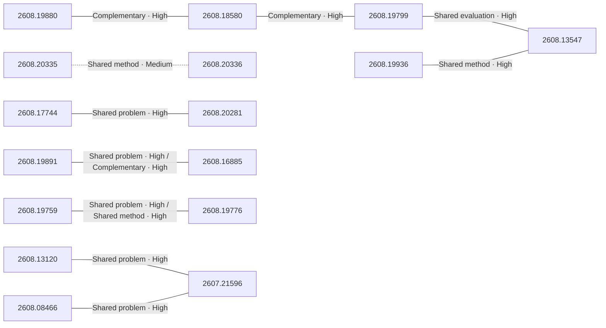

# Paper relationship graph — 2026-08-21

> [← Daily summary](../2026-08-21.md)

> **Interpretation caveat:** Every edge is an evidence-screened editorial hypothesis, not proof of citation, influence, priority, historical use, dependency, or an author-claimed relationship.

## Legend

- Rectangular nodes are current-day papers; rounded nodes are previously seen candidates.
- A line has no technical direction. An arrow shows only a proposed technical flow for an enabling dependency or method transfer.
- Solid edges are high confidence; dotted edges are medium confidence. Confidence evaluates this editorial connection, not either paper.
- Relationship labels:
  - **Shared problem:** `shared_problem`
  - **Shared method:** `shared_method`
  - **Shared evaluation:** `shared_evaluation`
  - **Complementary:** `complementary`
  - **Enabling dependency:** `enabling_dependency`
  - **Method transfer:** `method_transfer`
  - **Assumption tension:** `assumption_tension`
  - **Result tension:** `result_tension`
  - **Shared limitation:** `shared_limitation`
  - **Follow-up opportunity:** `follow_up_opportunity`

## Same-day relationships

| Source paper | Target paper | Relationship | Direction | Confidence |
| --- | --- | --- | --- | --- |
| [2608.19880](2608.19880.md) | [2608.18580](2608.18580.md) | Complementary | Not directional | High |
| [2608.18580](2608.18580.md) | [2608.19799](2608.19799.md) | Complementary | Not directional | High |
| [2608.19799](2608.19799.md) | [2608.13547](2608.13547.md) | Shared evaluation | Not directional | High |
| [2608.19936](2608.19936.md) | [2608.13547](2608.13547.md) | Shared method | Not directional | High |
| [2608.19759](2608.19759.md) | [2608.19776](2608.19776.md) | Shared problem | Not directional | High |
| [2608.19759](2608.19759.md) | [2608.19776](2608.19776.md) | Shared method | Not directional | High |
| [2608.19891](2608.19891.md) | [2608.16885](2608.16885.md) | Shared problem | Not directional | High |
| [2608.19891](2608.19891.md) | [2608.16885](2608.16885.md) | Complementary | Not directional | High |
| [2608.17744](2608.17744.md) | [2608.20281](2608.20281.md) | Shared problem | Not directional | High |
| [2608.13120](2608.13120.md) | [2607.21596](2607.21596.md) | Shared problem | Not directional | High |
| [2608.08466](2608.08466.md) | [2607.21596](2607.21596.md) | Shared problem | Not directional | High |
| [2608.20335](2608.20335.md) | [2608.20336](2608.20336.md) | Shared method | Not directional | Medium |

## Connections to previously seen papers

_The visual diagram is omitted because this graph is too large or dense for a readable snapshot; every edge remains in the table below._

| New paper | Previously seen paper | First seen by service | Relationship | Technical direction | Confidence |
| --- | --- | --- | --- | --- | --- |
| [2608.20335](2608.20335.md) | 2608.04701 ([Hugging Face](https://huggingface.co/papers/2608.04701) · [arXiv](https://arxiv.org/abs/2608.04701)) | 2026-08-06 | Shared method | Not directional | High |
| [2608.14022](2608.14022.md) | 2608.13391 ([Hugging Face](https://huggingface.co/papers/2608.13391) · [arXiv](https://arxiv.org/abs/2608.13391)) | 2026-08-14 | Shared method | Not directional | High |
| [2608.19758](2608.19758.md) | 2607.24027 ([Hugging Face](https://huggingface.co/papers/2607.24027) · [arXiv](https://arxiv.org/abs/2607.24027)) | 2026-07-28 | Shared method | Not directional | High |
| [2608.20202](2608.20202.md) | 2607.26760 ([Hugging Face](https://huggingface.co/papers/2607.26760) · [arXiv](https://arxiv.org/abs/2607.26760)) | 2026-07-31 | Shared limitation | Not directional | High |
| [2608.13120](2608.13120.md) | 2608.11079 ([Hugging Face](https://huggingface.co/papers/2608.11079) · [arXiv](https://arxiv.org/abs/2608.11079)) | 2026-08-12 | Complementary | Not directional | High |
| [2608.08466](2608.08466.md) | 2608.07545 ([Hugging Face](https://huggingface.co/papers/2608.07545) · [arXiv](https://arxiv.org/abs/2608.07545)) | 2026-08-14 | Shared method | Not directional | High |
| [2607.21596](2607.21596.md) | 2607.23806 ([Hugging Face](https://huggingface.co/papers/2607.23806) · [arXiv](https://arxiv.org/abs/2607.23806)) | 2026-07-28 | Shared method | Not directional | High |
| [2608.19854](2608.19854.md) | 2607.16617 ([Hugging Face](https://huggingface.co/papers/2607.16617) · [arXiv](https://arxiv.org/abs/2607.16617)) | 2026-07-22 | Shared method | Not directional | High |
| [2608.15767](2608.15767.md) | 2607.27945 ([Hugging Face](https://huggingface.co/papers/2607.27945) · [arXiv](https://arxiv.org/abs/2607.27945)) | 2026-08-10 | Shared problem | Not directional | High |
| [2608.19891](2608.19891.md) | 2608.09853 ([Hugging Face](https://huggingface.co/papers/2608.09853) · [arXiv](https://arxiv.org/abs/2608.09853)) | 2026-08-11 | Complementary | Not directional | Medium |
| [2608.19799](2608.19799.md) | 2608.18565 ([Hugging Face](https://huggingface.co/papers/2608.18565) · [arXiv](https://arxiv.org/abs/2608.18565)) | 2026-08-20 | Shared evaluation | Not directional | High |
| [2608.13210](2608.13210.md) | 2608.14718 ([Hugging Face](https://huggingface.co/papers/2608.14718) · [arXiv](https://arxiv.org/abs/2608.14718)) | 2026-08-18 | Shared problem | Not directional | High |

## Current paper key

| Paper | Analysis |
| --- | --- |
| 2608.19880 — EnvHarness: Awakening Static Worlds for Agent Learning | [Read analysis](2608.19880.md) |
| 2608.18580 — FACET: Preserving Source Intent and Executable State in Terminal Task Synthesis | [Read analysis](2608.18580.md) |
| 2608.20335 — 4DAnyone: Create Anyone in 4D from a Casual Monocular Video | [Read analysis](2608.20335.md) |
| 2608.19799 — SWE-bench Science: Can Coding Agents Resolve Engineering Tasks in Science? | [Read analysis](2608.19799.md) |
| 2608.20336 — WithEveryone: Unified Planning and Identity Grounding for Group Image Generation | [Read analysis](2608.20336.md) |
| 2608.20202 — MemTrapBench: Benchmarking Cognitive Traps in LLM Memory Use | [Read analysis](2608.20202.md) |
| 2608.13120 — SkillEvo: Self-Renewing Evolution Gradients from Multi-Turn Interaction Feedback | [Read analysis](2608.13120.md) |
| 2608.14022 — ForgeWM: Progressive Causal Training for Few-Step Action-Conditioned Video World Models | [Read analysis](2608.14022.md) |
| 2608.19854 — Repo0: Design-Driven Zero-to-All Code Generation | [Read analysis](2608.19854.md) |
| 2608.19758 — FlashPrefill V2: Block-Sparse Prefill Attention for Long-Context LLM Serving | [Read analysis](2608.19758.md) |
| 2608.17744 — Thinking in a Low-Resource Language: What SFT Builds, What RL Fixes, What Accuracy Cannot See | [Read analysis](2608.17744.md) |
| 2608.20281 — Inject, Align, Recover: Staged Post-Training for Retrieval-Free Document Knowledge Internalization | [Read analysis](2608.20281.md) |
| 2608.19891 — EXIMO: VLM Guided Exploration of VLA Policies | [Read analysis](2608.19891.md) |
| 2608.19936 — Towards Quantifying Benchmark Optimization in ASR Models | [Read analysis](2608.19936.md) |
| 2608.15767 — TinyCast: Probabilistic Zero-Shot Forecasting with Computed Periodicity | [Read analysis](2608.15767.md) |
| 2608.13210 — NARU: A Benchmark for NARrative Evolution and Cultural Nuance Understanding in Japanese Extreme Long Video | [Read analysis](2608.13210.md) |
| 2608.19861 — PolicyGuide: From Guarding One Action to Guiding the Whole Workflow for Policy-Compliant LLM Agents | [Read analysis](2608.19861.md) |
| 2608.18027 — Chain-of-Experience for Continual LLM Improvement | [Read analysis](2608.18027.md) |
| 2608.16885 — τ\_0-VLA: a Hierarchical Robot Foundation Model with World-Model-Guided Test-Time Computation | [Read analysis](2608.16885.md) |
| 2608.08466 — Hierarchical Self-Improvement: A Framework for Task-Specific Evolvable Agent Harnesses | [Read analysis](2608.08466.md) |
| 2608.19759 — GOAG: Generative and Object-Agnostic Grasp Planner for Dexterous Robotic Manipulation | [Read analysis](2608.19759.md) |
| 2608.19776 — CoToGrasp: Contact-Topology-Conditioned Dexterous Grasp Synthesis via Canonical Workspace Learning | [Read analysis](2608.19776.md) |
| 2608.12875 — The Embedder's Dilemma: LLMs Are Better, but at What Cost? | [Read analysis](2608.12875.md) |
| 2608.13547 — QuoteBench: How Matched Scores Can Hide Command-Path Failures | [Read analysis](2608.13547.md) |
| 2608.19863 — Listening Forward: Next Patch Embedding Prediction Enables Scalable Audio Learners | [Read analysis](2608.19863.md) |
| 2607.21596 — FlowEvo: Self-Evolving Agents through the Co-Evolution of Workflows and Executable Skills | [Read analysis](2607.21596.md) |

## Current papers without a published edge

- [2608.19861](2608.19861.md)
- [2608.18027](2608.18027.md)
- [2608.12875](2608.12875.md)
- [2608.19863](2608.19863.md)

---

[Support these research summaries on Buy Me a Coffee](https://buymeacoffee.com/vollero)
