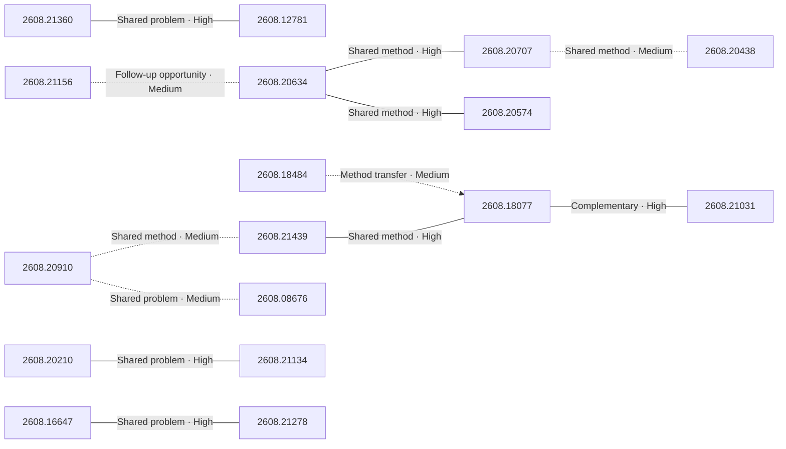

# Paper relationship graph — 2026-08-24

> [← Daily summary](../2026-08-24.md)

> **Interpretation caveat:** Every edge is an evidence-screened editorial hypothesis, not proof of citation, influence, priority, historical use, dependency, or an author-claimed relationship.

## Legend

- Rectangular nodes are current-day papers; rounded nodes are previously seen candidates.
- A line has no technical direction. An arrow shows only a proposed technical flow for an enabling dependency or method transfer.
- Solid edges are high confidence; dotted edges are medium confidence. Confidence evaluates this editorial connection, not either paper.
- Relationship labels:
  - **Shared problem:** `shared_problem`
  - **Shared method:** `shared_method`
  - **Shared evaluation:** `shared_evaluation`
  - **Complementary:** `complementary`
  - **Enabling dependency:** `enabling_dependency`
  - **Method transfer:** `method_transfer`
  - **Assumption tension:** `assumption_tension`
  - **Result tension:** `result_tension`
  - **Shared limitation:** `shared_limitation`
  - **Follow-up opportunity:** `follow_up_opportunity`

## Same-day relationships

| Source paper | Target paper | Relationship | Direction | Confidence |
| --- | --- | --- | --- | --- |
| [2608.21360](2608.21360.md) | [2608.12781](2608.12781.md) | Shared problem | Not directional | High |
| [2608.16647](2608.16647.md) | [2608.21278](2608.21278.md) | Shared problem | Not directional | High |
| [2608.20634](2608.20634.md) | [2608.20707](2608.20707.md) | Shared method | Not directional | High |
| [2608.20634](2608.20634.md) | [2608.20574](2608.20574.md) | Shared method | Not directional | High |
| [2608.20707](2608.20707.md) | [2608.20438](2608.20438.md) | Shared method | Not directional | Medium |
| [2608.18077](2608.18077.md) | [2608.21031](2608.21031.md) | Complementary | Not directional | High |
| [2608.18484](2608.18484.md) | [2608.18077](2608.18077.md) | Method transfer | Source → target | Medium |
| [2608.18077](2608.18077.md) | [2608.21439](2608.21439.md) | Shared method | Not directional | High |
| [2608.20910](2608.20910.md) | [2608.21439](2608.21439.md) | Shared method | Not directional | Medium |
| [2608.08676](2608.08676.md) | [2608.20910](2608.20910.md) | Shared problem | Not directional | Medium |
| [2608.20210](2608.20210.md) | [2608.21134](2608.21134.md) | Shared problem | Not directional | High |
| [2608.21156](2608.21156.md) | [2608.20634](2608.20634.md) | Follow-up opportunity | Not directional | Medium |

## Connections to previously seen papers

_The visual diagram is omitted because this graph is too large or dense for a readable snapshot; every edge remains in the table below._

| New paper | Previously seen paper | First seen by service | Relationship | Technical direction | Confidence |
| --- | --- | --- | --- | --- | --- |
| [2608.18484](2608.18484.md) | 2607.24027 ([Hugging Face](https://huggingface.co/papers/2607.24027) · [arXiv](https://arxiv.org/abs/2607.24027)) | 2026-07-28 | Shared problem | Not directional | High |
| [2608.20061](2608.20061.md) | 2607.28611 ([Hugging Face](https://huggingface.co/papers/2607.28611) · [arXiv](https://arxiv.org/abs/2607.28611)) | 2026-07-31 | Shared method | Not directional | High |
| [2608.20061](2608.20061.md) | 2608.03457 ([Hugging Face](https://huggingface.co/papers/2608.03457) · [arXiv](https://arxiv.org/abs/2608.03457)) | 2026-08-05 | Shared problem | Not directional | High |
| [2608.20910](2608.20910.md) | 2608.17566 ([Hugging Face](https://huggingface.co/papers/2608.17566) · [arXiv](https://arxiv.org/abs/2608.17566)) | 2026-08-19 | Complementary | Not directional | High |
| [2608.20910](2608.20910.md) | 2608.04956 ([Hugging Face](https://huggingface.co/papers/2608.04956) · [arXiv](https://arxiv.org/abs/2608.04956)) | 2026-08-07 | Shared problem | Not directional | High |
| [2608.16647](2608.16647.md) | 2607.24720 ([Hugging Face](https://huggingface.co/papers/2607.24720) · [arXiv](https://arxiv.org/abs/2607.24720)) | 2026-07-28 | Shared method | Not directional | High |
| [2608.21156](2608.21156.md) | 2608.16002 ([Hugging Face](https://huggingface.co/papers/2608.16002) · [arXiv](https://arxiv.org/abs/2608.16002)) | 2026-08-19 | Shared method | Not directional | High |
| [2608.20634](2608.20634.md) | 2608.10875 ([Hugging Face](https://huggingface.co/papers/2608.10875) · [arXiv](https://arxiv.org/abs/2608.10875)) | 2026-08-12 | Complementary | Not directional | High |
| [2608.18077](2608.18077.md) | 2608.06374 ([Hugging Face](https://huggingface.co/papers/2608.06374) · [arXiv](https://arxiv.org/abs/2608.06374)) | 2026-08-07 | Shared problem | Not directional | High |
| [2608.18077](2608.18077.md) | 2607.23909 ([Hugging Face](https://huggingface.co/papers/2607.23909) · [arXiv](https://arxiv.org/abs/2607.23909)) | 2026-07-28 | Complementary | Not directional | High |
| [2608.21278](2608.21278.md) | 2607.14277 ([Hugging Face](https://huggingface.co/papers/2607.14277) · [arXiv](https://arxiv.org/abs/2607.14277)) | 2026-07-27 | Method transfer | Previous → new | High |
| [2608.21360](2608.21360.md) | 2607.24904 ([Hugging Face](https://huggingface.co/papers/2607.24904) · [arXiv](https://arxiv.org/abs/2607.24904)) | 2026-07-29 | Shared evaluation | Not directional | High |

## Current paper key

| Paper | Analysis |
| --- | --- |
| 2608.21156 — Graph Engineering in the Era of LLM Agents: From Individual Intelligence to System Intelligence | [Read analysis](2608.21156.md) |
| 2608.20061 — Let's Scale Step by Step: Compute-Efficient Hyperparameter Transfer for Large-Scale Mixture-of-Experts | [Read analysis](2608.20061.md) |
| 2608.20910 — InfinityEdit: Infinite Video Editing with a Lightweight Edit-Ignition Adapter | [Read analysis](2608.20910.md) |
| 2608.16425 — ParaTempo: Efficient Parallel Reasoning via Temporal Confidence | [Read analysis](2608.16425.md) |
| 2608.21360 — OmniAssistBench: Assistant-style Interaction Benchmark for Omni-LLMs | [Read analysis](2608.21360.md) |
| 2608.12781 — Beyond Correctness: Benchmarking and Aligning Response Behaviors in Hybrid-Thinking MLLMs | [Read analysis](2608.12781.md) |
| 2608.16647 — Every Coin Has Two Sides: On the Dual Nature of Generalization in On-Policy Distillation of Large Language Models | [Read analysis](2608.16647.md) |
| 2608.20886 — EviRank: Structured Relevance Evidence for Multimodal Image Re-ranking | [Read analysis](2608.20886.md) |
| 2608.08676 — UniSpace: Unified Visual Representation and Scalable Multimodal Modeling | [Read analysis](2608.08676.md) |
| 2608.18484 — Partition the Support, Reconstruct the Residual: Training-Free Sparse Attention for Video Generation and World Models | [Read analysis](2608.18484.md) |
| 2608.21439 — WorldMind: Decoupled Game World Model for State-Aware NPC Behavior | [Read analysis](2608.21439.md) |
| 2608.20634 — AgentMercury: Your Agent Can Synthesize Verifiable Environments for Business Scenarios at scale | [Read analysis](2608.20634.md) |
| 2608.20210 — Daedalus-150M: A Convolution-Attention Hybrid Designed for CPU Inference | [Read analysis](2608.20210.md) |
| 2608.20707 — Towards Faithful Simulation of Human Shopping Behavior | [Read analysis](2608.20707.md) |
| 2608.21134 — Llama-Mobile: Efficient 2.7-Bit Quantization of VLMs | [Read analysis](2608.21134.md) |
| 2608.18077 — Hydra-0: Action Flow for Generalist World Modeling and Control | [Read analysis](2608.18077.md) |
| 2608.18184 — Human-Centric Intelligence in the Era of Foundation Models: A Survey | [Read analysis](2608.18184.md) |
| 2608.21031 — PhysCaP: Grounding Code-as-Policy Agent with Physics-Informed Exploration | [Read analysis](2608.21031.md) |
| 2608.21278 — CLEAR: Continuous Latent Adapter Routing for Utility-Preserving LLM Safety Alignment | [Read analysis](2608.21278.md) |
| 2608.20438 — Peer-Voted LLM-Agent Stress Tests Find Feed-Induced Lexical Convergence but No Reliable Matched-Exposure Advantage for Distributed Sources | [Read analysis](2608.20438.md) |
| 2608.20574 — FlavourBench: Ranking Frontier Language Models with Executable Culinary Ground Truth | [Read analysis](2608.20574.md) |
| 2608.20364 — Hadith computational science in the age of large language models: a critical narrative review | [Read analysis](2608.20364.md) |

## Current papers without a published edge

- [2608.16425](2608.16425.md)
- [2608.20886](2608.20886.md)
- [2608.18184](2608.18184.md)
- [2608.20364](2608.20364.md)

---

[Support these research summaries on Buy Me a Coffee](https://buymeacoffee.com/vollero)
