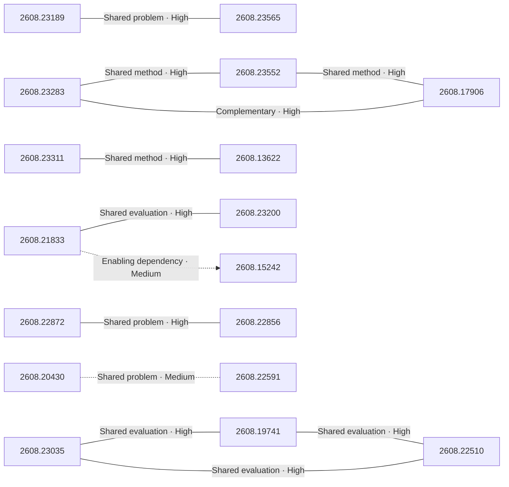

# Paper relationship graph — 2026-08-25

> [← Daily summary](../2026-08-25.md)

> **Interpretation caveat:** Every edge is an evidence-screened editorial hypothesis, not proof of citation, influence, priority, historical use, dependency, or an author-claimed relationship.

## Legend

- Rectangular nodes are current-day papers; rounded nodes are previously seen candidates.
- A line has no technical direction. An arrow shows only a proposed technical flow for an enabling dependency or method transfer.
- Solid edges are high confidence; dotted edges are medium confidence. Confidence evaluates this editorial connection, not either paper.
- Relationship labels:
  - **Shared problem:** `shared_problem`
  - **Shared method:** `shared_method`
  - **Shared evaluation:** `shared_evaluation`
  - **Complementary:** `complementary`
  - **Enabling dependency:** `enabling_dependency`
  - **Method transfer:** `method_transfer`
  - **Assumption tension:** `assumption_tension`
  - **Result tension:** `result_tension`
  - **Shared limitation:** `shared_limitation`
  - **Follow-up opportunity:** `follow_up_opportunity`

## Same-day relationships

| Source paper | Target paper | Relationship | Direction | Confidence |
| --- | --- | --- | --- | --- |
| [2608.23283](2608.23283.md) | [2608.23552](2608.23552.md) | Shared method | Not directional | High |
| [2608.23283](2608.23283.md) | [2608.17906](2608.17906.md) | Complementary | Not directional | High |
| [2608.23552](2608.23552.md) | [2608.17906](2608.17906.md) | Shared method | Not directional | High |
| [2608.23035](2608.23035.md) | [2608.19741](2608.19741.md) | Shared evaluation | Not directional | High |
| [2608.19741](2608.19741.md) | [2608.22510](2608.22510.md) | Shared evaluation | Not directional | High |
| [2608.23035](2608.23035.md) | [2608.22510](2608.22510.md) | Shared evaluation | Not directional | High |
| [2608.23189](2608.23189.md) | [2608.23565](2608.23565.md) | Shared problem | Not directional | High |
| [2608.20430](2608.20430.md) | [2608.22591](2608.22591.md) | Shared problem | Not directional | Medium |
| [2608.23311](2608.23311.md) | [2608.13622](2608.13622.md) | Shared method | Not directional | High |
| [2608.21833](2608.21833.md) | [2608.23200](2608.23200.md) | Shared evaluation | Not directional | High |
| [2608.21833](2608.21833.md) | [2608.15242](2608.15242.md) | Enabling dependency | Source → target | Medium |
| [2608.22872](2608.22872.md) | [2608.22856](2608.22856.md) | Shared problem | Not directional | High |

## Connections to previously seen papers

_The visual diagram is omitted because this graph is too large or dense for a readable snapshot; every edge remains in the table below._

| New paper | Previously seen paper | First seen by service | Relationship | Technical direction | Confidence |
| --- | --- | --- | --- | --- | --- |
| [2608.23283](2608.23283.md) | 2608.11341 ([Hugging Face](https://huggingface.co/papers/2608.11341) · [arXiv](https://arxiv.org/abs/2608.11341)) | 2026-08-17 | Shared evaluation | Not directional | High |
| [2608.23552](2608.23552.md) | 2608.08466 ([Hugging Face](https://huggingface.co/papers/2608.08466) · [arXiv](https://arxiv.org/abs/2608.08466)) | 2026-08-21 | Shared method | Not directional | High |
| [2608.23565](2608.23565.md) | 2608.07408 ([Hugging Face](https://huggingface.co/papers/2608.07408) · [arXiv](https://arxiv.org/abs/2608.07408)) | 2026-08-10 | Shared method | Not directional | High |
| [2608.23565](2608.23565.md) | 2608.13546 ([Hugging Face](https://huggingface.co/papers/2608.13546) · [arXiv](https://arxiv.org/abs/2608.13546)) | 2026-08-14 | Shared problem | Not directional | High |
| [2608.20430](2608.20430.md) | 2608.07468 ([Hugging Face](https://huggingface.co/papers/2608.07468) · [arXiv](https://arxiv.org/abs/2608.07468)) | 2026-08-10 | Complementary | Not directional | High |
| [2608.20953](2608.20953.md) | 2608.03796 ([Hugging Face](https://huggingface.co/papers/2608.03796) · [arXiv](https://arxiv.org/abs/2608.03796)) | 2026-08-10 | Enabling dependency | Previous → new | High |
| [2608.20169](2608.20169.md) | 2608.06301 ([Hugging Face](https://huggingface.co/papers/2608.06301) · [arXiv](https://arxiv.org/abs/2608.06301)) | 2026-08-07 | Complementary | Not directional | High |
| [2608.19567](2608.19567.md) | 2608.14783 ([Hugging Face](https://huggingface.co/papers/2608.14783) · [arXiv](https://arxiv.org/abs/2608.14783)) | 2026-08-18 | Shared evaluation | Not directional | High |
| [2608.16812](2608.16812.md) | 2608.14546 ([Hugging Face](https://huggingface.co/papers/2608.14546) · [arXiv](https://arxiv.org/abs/2608.14546)) | 2026-08-17 | Complementary | Not directional | High |
| [2608.19408](2608.19408.md) | 2608.04419 ([Hugging Face](https://huggingface.co/papers/2608.04419) · [arXiv](https://arxiv.org/abs/2608.04419)) | 2026-08-11 | Complementary | Not directional | High |
| [2608.15242](2608.15242.md) | 2608.14905 ([Hugging Face](https://huggingface.co/papers/2608.14905) · [arXiv](https://arxiv.org/abs/2608.14905)) | 2026-08-18 | Complementary | Not directional | High |
| [2608.22510](2608.22510.md) | 2608.17597 ([Hugging Face](https://huggingface.co/papers/2608.17597) · [arXiv](https://arxiv.org/abs/2608.17597)) | 2026-08-19 | Shared problem | Not directional | High |

## Current paper key

| Paper | Analysis |
| --- | --- |
| 2608.23283 — Apodex 1.1: Scaling Agentic Intelligence for Complex Work | [Read analysis](2608.23283.md) |
| 2608.23189 — EchoWM: Open and Enterable Omnimodal World Models | [Read analysis](2608.23189.md) |
| 2608.20958 — TLive-Omni: An Omni-Modal Understanding Model for E-Commerce Live Streaming | [Read analysis](2608.20958.md) |
| 2608.16812 — Unlocking the Potential of Image Editing via Concept Scaling and Dense Supervision | [Read analysis](2608.16812.md) |
| 2608.23035 — MobilePA-Bench: Benchmarking Mobile Planner Agents on Complex Real-World Tasks | [Read analysis](2608.23035.md) |
| 2608.23552 — Prime Agent: A Self-Improving RLM Harness | [Read analysis](2608.23552.md) |
| 2608.22876 — The Mask Is Not the Model: Auditing Prefix Invariance in Attention, State-Space, and Hybrid Sequence Models | [Read analysis](2608.22876.md) |
| 2608.19567 — Block3D: Efficient Text-to-3D Generation via Block-Wise Diffusion | [Read analysis](2608.19567.md) |
| 2608.23392 — Towards a Densing Law for User Representation Learning at Billion-Scale Capacity | [Read analysis](2608.23392.md) |
| 2608.20430 — RISE: Adaptive Imagination for World Action Models | [Read analysis](2608.20430.md) |
| 2608.23565 — ReWorld: An Interactive World Model with Long-Horizon Memory | [Read analysis](2608.23565.md) |
| 2608.23311 — Beyond the Stability-Exploration Dilemma: Environmental Regularization for LLM Policy Optimization | [Read analysis](2608.23311.md) |
| 2608.13622 — ARC: Fair Relative Advantage Comparison in Open-Ended Real-World Interaction | [Read analysis](2608.13622.md) |
| 2608.21833 — GameXpert-Bench: How Far Are Coding Agents from Expert Game Development? | [Read analysis](2608.21833.md) |
| 2608.15242 — LongRCA Bench: Diagnosing Responsible Roles and Root Causes in Long-Horizon Agent Failures | [Read analysis](2608.15242.md) |
| 2608.19741 — One Success Isn't Reliability: Thinkingbox, a Sandbox and Benchmark for Agents in Stateful Business Workflows | [Read analysis](2608.19741.md) |
| 2608.20953 — Quantization-Aware Healing: A Practical Recipe for Recovering Compressed, 4-Bit LLMs | [Read analysis](2608.20953.md) |
| 2608.17906 — AutoResearch: Insight In, Hallucination Out | [Read analysis](2608.17906.md) |
| 2608.19408 — Beyond Imitation: Filtering On-Policy Distillation by Reasoning Progress | [Read analysis](2608.19408.md) |
| 2608.20169 — Task-CoEvolve: Efficient Harness Optimization via Adaptive Validation Task Selection | [Read analysis](2608.20169.md) |
| 2608.23200 — LongWoF-Bench: Evaluating EvoMap Genes for Verifiable Long-Workflow Tasks | [Read analysis](2608.23200.md) |
| 2608.22872 — Better Retrieval, Worse Robustness:How Multi-hop RAG Amplifies Upstream ASR Errors | [Read analysis](2608.22872.md) |
| 2608.22817 — Industrial-Instruction: An End-to-End Framework for Building Instruction-Tuning and Benchmark Datasets from Industrial Technical Reports | [Read analysis](2608.22817.md) |
| 2606.13610 — One Polluted Page Is Enough: Evaluating Web Content Pollution in LLM Recommenders | [Read analysis](2606.13610.md) |
| 2608.17336 — TileMix: Tile-Centric Mixed-Precision Attention for LLM Inference Acceleration | [Read analysis](2608.17336.md) |
| 2608.23252 — The Laws of Context Allocation: Causal Measurement and Closed-Loop Orchestration in Generative Search | [Read analysis](2608.23252.md) |
| 2608.22856 — Same Agent, Different Answers: A Repeat-Aware Audit of Corpus-Induced Answer Churn in Retrieval-Augmented QA | [Read analysis](2608.22856.md) |
| 2608.23070 — From Generation to Simulation: How Far Are World Models from Being True Simulators? | [Read analysis](2608.23070.md) |
| 2608.22614 — What AstroPT knows about galaxies, and what that can teach us about LLMs | [Read analysis](2608.22614.md) |
| 2608.22510 — ClawProBench: Trace-Aware Evaluation of AI Agents with Runtime Coverage and Frozen Workplace-Style Holdouts | [Read analysis](2608.22510.md) |
| 2608.22849 — RIBOSPAN: A Long-Context RNA Foundation Model for Versatile RNA Modeling | [Read analysis](2608.22849.md) |
| 2608.13914 — Hybrid Quantum-inspired Kolmogorov-Arnold Networks for Privacy-Aware Federated Biosignal Learning | [Read analysis](2608.13914.md) |
| 2608.21455 — Tomatoes, Potatoes, and Onions: Questioning the Need for Faces in Face Presentation Attack Detection | [Read analysis](2608.21455.md) |
| 2608.22591 — WorldToken: Time-First Sequence Modeling for Robotic Imitation Learning | [Read analysis](2608.22591.md) |
| 2608.21486 — EXPL-FR: Explaining Face Recognition Models via Vision-Language Alignment | [Read analysis](2608.21486.md) |

## Current papers without a published edge

- [2608.20958](2608.20958.md)
- [2608.22876](2608.22876.md)
- [2608.23392](2608.23392.md)
- [2608.22817](2608.22817.md)
- [2606.13610](2606.13610.md)
- [2608.17336](2608.17336.md)
- [2608.23252](2608.23252.md)
- [2608.23070](2608.23070.md)
- [2608.22614](2608.22614.md)
- [2608.22849](2608.22849.md)
- [2608.13914](2608.13914.md)
- [2608.21455](2608.21455.md)
- [2608.21486](2608.21486.md)

---

[Support these research summaries on Buy Me a Coffee](https://buymeacoffee.com/vollero)
