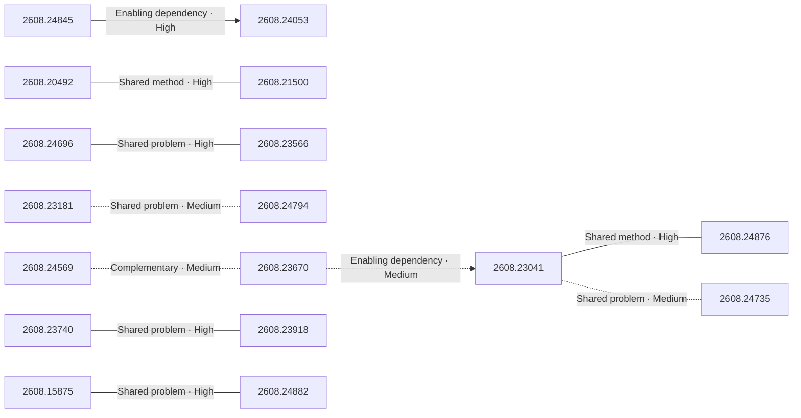
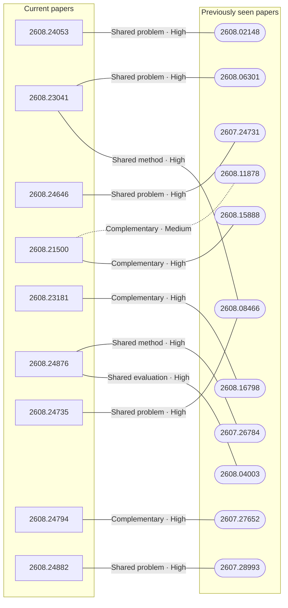

# Paper relationship graph — 2026-08-26

> [← Daily summary](../2026-08-26.md)

> **Interpretation caveat:** Every edge is an evidence-screened editorial hypothesis, not proof of citation, influence, priority, historical use, dependency, or an author-claimed relationship.

## Legend

- Rectangular nodes are current-day papers; rounded nodes are previously seen candidates.
- A line has no technical direction. An arrow shows only a proposed technical flow for an enabling dependency or method transfer.
- Solid edges are high confidence; dotted edges are medium confidence. Confidence evaluates this editorial connection, not either paper.
- Relationship labels:
  - **Shared problem:** `shared_problem`
  - **Shared method:** `shared_method`
  - **Shared evaluation:** `shared_evaluation`
  - **Complementary:** `complementary`
  - **Enabling dependency:** `enabling_dependency`
  - **Method transfer:** `method_transfer`
  - **Assumption tension:** `assumption_tension`
  - **Result tension:** `result_tension`
  - **Shared limitation:** `shared_limitation`
  - **Follow-up opportunity:** `follow_up_opportunity`

## Same-day relationships

| Source paper | Target paper | Relationship | Direction | Confidence |
| --- | --- | --- | --- | --- |
| [2608.15875](2608.15875.md) | [2608.24882](2608.24882.md) | Shared problem | Not directional | High |
| [2608.20492](2608.20492.md) | [2608.21500](2608.21500.md) | Shared method | Not directional | High |
| [2608.24696](2608.24696.md) | [2608.23566](2608.23566.md) | Shared problem | Not directional | High |
| [2608.23041](2608.23041.md) | [2608.24876](2608.24876.md) | Shared method | Not directional | High |
| [2608.23041](2608.23041.md) | [2608.24735](2608.24735.md) | Shared problem | Not directional | Medium |
| [2608.23670](2608.23670.md) | [2608.23041](2608.23041.md) | Enabling dependency | Source → target | Medium |
| [2608.24569](2608.24569.md) | [2608.23670](2608.23670.md) | Complementary | Not directional | Medium |
| [2608.23181](2608.23181.md) | [2608.24794](2608.24794.md) | Shared problem | Not directional | Medium |
| [2608.24845](2608.24845.md) | [2608.24053](2608.24053.md) | Enabling dependency | Source → target | High |
| [2608.23740](2608.23740.md) | [2608.23918](2608.23918.md) | Shared problem | Not directional | High |

## Connections to previously seen papers

| New paper | Previously seen paper | First seen by service | Relationship | Technical direction | Confidence |
| --- | --- | --- | --- | --- | --- |
| [2608.24053](2608.24053.md) | 2608.02148 ([Hugging Face](https://huggingface.co/papers/2608.02148) · [arXiv](https://arxiv.org/abs/2608.02148)) | 2026-08-10 | Shared problem | Not directional | High |
| [2608.23041](2608.23041.md) | 2608.06301 ([Hugging Face](https://huggingface.co/papers/2608.06301) · [arXiv](https://arxiv.org/abs/2608.06301)) | 2026-08-07 | Shared problem | Not directional | High |
| [2608.23041](2608.23041.md) | 2608.08466 ([Hugging Face](https://huggingface.co/papers/2608.08466) · [arXiv](https://arxiv.org/abs/2608.08466)) | 2026-08-21 | Shared method | Not directional | High |
| [2608.24646](2608.24646.md) | 2607.24731 ([Hugging Face](https://huggingface.co/papers/2607.24731) · [arXiv](https://arxiv.org/abs/2607.24731)) | 2026-07-28 | Shared problem | Not directional | High |
| [2608.21500](2608.21500.md) | 2608.11878 ([Hugging Face](https://huggingface.co/papers/2608.11878) · [arXiv](https://arxiv.org/abs/2608.11878)) | 2026-08-13 | Complementary | Not directional | Medium |
| [2608.21500](2608.21500.md) | 2608.15888 ([Hugging Face](https://huggingface.co/papers/2608.15888) · [arXiv](https://arxiv.org/abs/2608.15888)) | 2026-08-20 | Complementary | Not directional | High |
| [2608.23181](2608.23181.md) | 2608.16798 ([Hugging Face](https://huggingface.co/papers/2608.16798) · [arXiv](https://arxiv.org/abs/2608.16798)) | 2026-08-18 | Complementary | Not directional | High |
| [2608.24876](2608.24876.md) | 2607.26784 ([Hugging Face](https://huggingface.co/papers/2607.26784) · [arXiv](https://arxiv.org/abs/2607.26784)) | 2026-07-30 | Shared method | Not directional | High |
| [2608.24876](2608.24876.md) | 2608.04003 ([Hugging Face](https://huggingface.co/papers/2608.04003) · [arXiv](https://arxiv.org/abs/2608.04003)) | 2026-08-05 | Shared evaluation | Not directional | High |
| [2608.24735](2608.24735.md) | 2608.08466 ([Hugging Face](https://huggingface.co/papers/2608.08466) · [arXiv](https://arxiv.org/abs/2608.08466)) | 2026-08-21 | Shared problem | Not directional | High |
| [2608.24794](2608.24794.md) | 2607.27652 ([Hugging Face](https://huggingface.co/papers/2607.27652) · [arXiv](https://arxiv.org/abs/2607.27652)) | 2026-07-31 | Complementary | Not directional | High |
| [2608.24882](2608.24882.md) | 2607.28993 ([Hugging Face](https://huggingface.co/papers/2607.28993) · [arXiv](https://arxiv.org/abs/2607.28993)) | 2026-08-05 | Shared problem | Not directional | High |

## Current paper key

| Paper | Analysis |
| --- | --- |
| 2608.15875 — GigaBrain-0.7: Scaling Embodied Foundation Models to Emergent Capabilities with a Three-System Architecture | [Read analysis](2608.15875.md) |
| 2608.20492 — Annotations as Rollouts: Efficient and Scalable Reinforcement Learning for Video MLLMs | [Read analysis](2608.20492.md) |
| 2608.24053 — WeMM-Embedding: WeChat Multi-Modal Embedding Technical Report | [Read analysis](2608.24053.md) |
| 2608.23041 — AutoSaddler: Automatic Harness Optimization with Durable Updates from Agent Execution Traces | [Read analysis](2608.23041.md) |
| 2608.24646 — On-Policy Self-Distillation in Diffusion Models | [Read analysis](2608.24646.md) |
| 2608.21500 — SecOPD: Mitigating Adaptive Prompt Injections by On-Policy Distillation | [Read analysis](2608.21500.md) |
| 2608.23181 — CyberFactory: Scaling Cyber Security Capabilities with Instances from the Wild | [Read analysis](2608.23181.md) |
| 2608.24876 — Recursive Experiential-Working Memory Evolution for Long-Horizon Agent Harnesses | [Read analysis](2608.24876.md) |
| 2608.24696 — On-policy Distillation with Verifiable Reward | [Read analysis](2608.24696.md) |
| 2608.23566 — Best Practice Critic Optimization | [Read analysis](2608.23566.md) |
| 2608.24735 — Meta^n: Recursive Self-Improvement through Emergent Depth | [Read analysis](2608.24735.md) |
| 2608.24845 — LAION-BVD: A 10-Million-Hour Open Video Dataset for Multimodal Pre-training | [Read analysis](2608.24845.md) |
| 2608.24680 — Game2World Engine: Unlocking In-the-Wild Gameplay Videos for World Model Training | [Read analysis](2608.24680.md) |
| 2608.24877 — From Seeing to Acting: Smart Glasses as First-Person Intelligence Platforms | [Read analysis](2608.24877.md) |
| 2608.24569 — When "Must" Becomes "Maybe": Constraint Weakening in LLM Agent Workflows | [Read analysis](2608.24569.md) |
| 2608.23740 — AgentRoom: Concurrent Multi-Agent Coding in a CRDT-Backed Shared Workspace | [Read analysis](2608.23740.md) |
| 2608.24794 — CAFE: Self-Improving Search Agents Need Co-Evolving Feedback | [Read analysis](2608.24794.md) |
| 2608.23670 — Automata from Agent Traces: Failure and Next-Step Prediction | [Read analysis](2608.23670.md) |
| 2608.22274 — Length-Adaptive Decoding for Masked Diffusion Machine Translation | [Read analysis](2608.22274.md) |
| 2608.09408 — DREAM Technical Report | [Read analysis](2608.09408.md) |
| 2608.24763 — MoTE: Mixture of Task Experts for Multi-Task Video Understanding | [Read analysis](2608.24763.md) |
| 2608.24738 — TorchMorph: CUDA-accelerated Morphological Transforms | [Read analysis](2608.24738.md) |
| 2608.23691 — Autonomous Mathematical Discovery in an Open-World Multi-Agent Environment | [Read analysis](2608.23691.md) |
| 2608.24189 — MemUse: Moving Memory Evaluation from Direct QA to Natural Integration in Long-Term Human-AI Conversation | [Read analysis](2608.24189.md) |
| 2608.23918 — MARS: Multi-Specialist LLM Relay System for Competitive Programming | [Read analysis](2608.23918.md) |
| 2608.24882 — Latent Action as Intention Enables Efficient Future Imagination for World Action Models | [Read analysis](2608.24882.md) |

## Current papers without a published edge

- [2608.24680](2608.24680.md)
- [2608.24877](2608.24877.md)
- [2608.22274](2608.22274.md)
- [2608.09408](2608.09408.md)
- [2608.24763](2608.24763.md)
- [2608.24738](2608.24738.md)
- [2608.23691](2608.23691.md)
- [2608.24189](2608.24189.md)

---

[Support these research summaries on Buy Me a Coffee](https://buymeacoffee.com/vollero)
