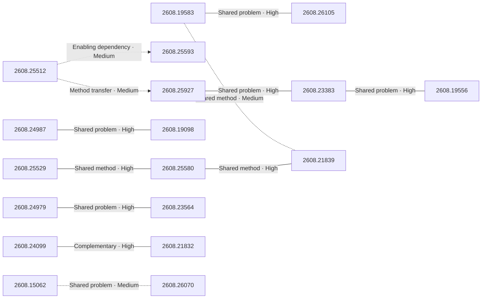

# Paper relationship graph — 2026-08-27

> [← Daily summary](../2026-08-27.md)

> **Interpretation caveat:** Every edge is an evidence-screened editorial hypothesis, not proof of citation, influence, priority, historical use, dependency, or an author-claimed relationship.

## Legend

- Rectangular nodes are current-day papers; rounded nodes are previously seen candidates.
- A line has no technical direction. An arrow shows only a proposed technical flow for an enabling dependency or method transfer.
- Solid edges are high confidence; dotted edges are medium confidence. Confidence evaluates this editorial connection, not either paper.
- Relationship labels:
  - **Shared problem:** `shared_problem`
  - **Shared method:** `shared_method`
  - **Shared evaluation:** `shared_evaluation`
  - **Complementary:** `complementary`
  - **Enabling dependency:** `enabling_dependency`
  - **Method transfer:** `method_transfer`
  - **Assumption tension:** `assumption_tension`
  - **Result tension:** `result_tension`
  - **Shared limitation:** `shared_limitation`
  - **Follow-up opportunity:** `follow_up_opportunity`

## Same-day relationships

| Source paper | Target paper | Relationship | Direction | Confidence |
| --- | --- | --- | --- | --- |
| [2608.19583](2608.19583.md) | [2608.26105](2608.26105.md) | Shared problem | Not directional | High |
| [2608.19583](2608.19583.md) | [2608.21839](2608.21839.md) | Shared method | Not directional | Medium |
| [2608.24979](2608.24979.md) | [2608.23564](2608.23564.md) | Shared problem | Not directional | High |
| [2608.24987](2608.24987.md) | [2608.19098](2608.19098.md) | Shared problem | Not directional | High |
| [2608.25927](2608.25927.md) | [2608.23383](2608.23383.md) | Shared problem | Not directional | High |
| [2608.23383](2608.23383.md) | [2608.19556](2608.19556.md) | Shared problem | Not directional | High |
| [2608.25512](2608.25512.md) | [2608.25593](2608.25593.md) | Enabling dependency | Source → target | Medium |
| [2608.25512](2608.25512.md) | [2608.25927](2608.25927.md) | Method transfer | Source → target | Medium |
| [2608.24099](2608.24099.md) | [2608.21832](2608.21832.md) | Complementary | Not directional | High |
| [2608.25529](2608.25529.md) | [2608.25580](2608.25580.md) | Shared method | Not directional | High |
| [2608.25580](2608.25580.md) | [2608.21839](2608.21839.md) | Shared method | Not directional | High |
| [2608.15062](2608.15062.md) | [2608.26070](2608.26070.md) | Shared problem | Not directional | Medium |

## Connections to previously seen papers

_The visual diagram is omitted because this graph is too large or dense for a readable snapshot; every edge remains in the table below._

| New paper | Previously seen paper | First seen by service | Relationship | Technical direction | Confidence |
| --- | --- | --- | --- | --- | --- |
| [2608.26005](2608.26005.md) | 2608.09043 ([Hugging Face](https://huggingface.co/papers/2608.09043) · [arXiv](https://arxiv.org/abs/2608.09043)) | 2026-08-11 | Method transfer | Previous → new | High |
| [2608.24979](2608.24979.md) | 2608.10366 ([Hugging Face](https://huggingface.co/papers/2608.10366) · [arXiv](https://arxiv.org/abs/2608.10366)) | 2026-08-12 | Shared evaluation | Not directional | High |
| [2608.24479](2608.24479.md) | 2607.29613 ([Hugging Face](https://huggingface.co/papers/2607.29613) · [arXiv](https://arxiv.org/abs/2607.29613)) | 2026-08-04 | Method transfer | New → previous | High |
| [2608.26105](2608.26105.md) | 2608.09873 ([Hugging Face](https://huggingface.co/papers/2608.09873) · [arXiv](https://arxiv.org/abs/2608.09873)) | 2026-08-11 | Method transfer | New → previous | High |
| [2608.25593](2608.25593.md) | 2608.15089 ([Hugging Face](https://huggingface.co/papers/2608.15089) · [arXiv](https://arxiv.org/abs/2608.15089)) | 2026-08-18 | Shared problem | Not directional | High |
| [2608.24987](2608.24987.md) | 2608.04349 ([Hugging Face](https://huggingface.co/papers/2608.04349) · [arXiv](https://arxiv.org/abs/2608.04349)) | 2026-08-06 | Shared method | Not directional | High |
| [2608.23318](2608.23318.md) | 2608.05987 ([Hugging Face](https://huggingface.co/papers/2608.05987) · [arXiv](https://arxiv.org/abs/2608.05987)) | 2026-08-07 | Complementary | Not directional | High |
| [2608.19098](2608.19098.md) | 2607.24720 ([Hugging Face](https://huggingface.co/papers/2607.24720) · [arXiv](https://arxiv.org/abs/2607.24720)) | 2026-07-28 | Shared problem | Not directional | High |
| [2608.25927](2608.25927.md) | 2608.21439 ([Hugging Face](https://huggingface.co/papers/2608.21439) · [arXiv](https://arxiv.org/abs/2608.21439)) | 2026-08-24 | Shared method | Not directional | High |
| [2608.23383](2608.23383.md) | 2608.13391 ([Hugging Face](https://huggingface.co/papers/2608.13391) · [arXiv](https://arxiv.org/abs/2608.13391)) | 2026-08-14 | Shared method | Not directional | High |
| [2608.26067](2608.26067.md) | 2608.06729 ([Hugging Face](https://huggingface.co/papers/2608.06729) · [arXiv](https://arxiv.org/abs/2608.06729)) | 2026-08-13 | Complementary | Not directional | High |
| [2608.25204](2608.25204.md) | 2608.01481 ([Hugging Face](https://huggingface.co/papers/2608.01481) · [arXiv](https://arxiv.org/abs/2608.01481)) | 2026-08-07 | Shared problem | Not directional | High |

## Current paper key

| Paper | Analysis |
| --- | --- |
| 2608.26005 — VoiceMem: Streaming Dual-Brain Memory for Real-Time Interaction | [Read analysis](2608.26005.md) |
| 2608.19583 — VGI-Bench: Probing Visual Intelligence in Video Generation Models | [Read analysis](2608.19583.md) |
| 2608.24979 — FrontierChallenge: Evaluating Scientific Workflow Completion | [Read analysis](2608.24979.md) |
| 2608.24479 — WarpSAC: Towards the Pinnacle of Scalable Off-policy RL by Rethinking Exploration and Exploitation | [Read analysis](2608.24479.md) |
| 2608.26105 — VBVR-Pro: A Scalable and Verifiable Suite for Native Visual Reasoning | [Read analysis](2608.26105.md) |
| 2608.25593 — JIT-Agent: Scaling Harness Intelligence via Just-in-Time Harness Evolution | [Read analysis](2608.25593.md) |
| 2608.24987 — D^3-MOPD: Adaptive Dynamic Domain ScheDuling for Efficient Multi-Teacher Distillation | [Read analysis](2608.24987.md) |
| 2608.23318 — Agent-G^2: Gaussian Guidance for Agentic Reinforcement Learning | [Read analysis](2608.23318.md) |
| 2608.23256 — Is Next-Chunk Reasoning RL Really Better than SFT? Revisiting Training Strategies under no-CoT Data | [Read analysis](2608.23256.md) |
| 2608.25927 — Code World Model: Coding Agent as World Brain | [Read analysis](2608.25927.md) |
| 2608.23383 — Long-Horizon Audio-Visual Generation for Persistent Stories and Interactive Worlds | [Read analysis](2608.23383.md) |
| 2608.19098 — Open-MOPD: Diagnosing and Fixing Capability Imbalance in Multi-Teacher On-Policy Distillation | [Read analysis](2608.19098.md) |
| 2608.26067 — StreamPI: Streaming Multimodal Temporal Modeling for Vision-Language-Action Models | [Read analysis](2608.26067.md) |
| 2608.25529 — Video-IFBench: Evaluating Instruction Following of Multimodal LLMs in Video Understanding Scenarios | [Read analysis](2608.25529.md) |
| 2608.25580 — V-Rubrics: Visual Faithfulness via Rubric-Based Reinforcement Learning | [Read analysis](2608.25580.md) |
| 2608.23564 — SWE Refactor Bench: Can Coding Agents Complete a Long-Horizon, Whole-Repository Stack Migration? | [Read analysis](2608.23564.md) |
| 2608.24138 — Rubrics as Visual-Repair Context for Self-Evolving UI-to-Code Generation | [Read analysis](2608.24138.md) |
| 2608.24099 — Are Android GUI Agents Robust Against Runtime Anomalies? AnTrap: Evaluating Agents in Dynamic Adversarial Environments | [Read analysis](2608.24099.md) |
| 2608.24358 — The Handoff Tax: Continuing Non-Native Trajectories in LLM Agents | [Read analysis](2608.24358.md) |
| 2608.25512 — A Programming Paradigm for Spatiotemporal Composability | [Read analysis](2608.25512.md) |
| 2608.21832 — GUI-Primitives: Diagnosing Spatial Reasoning Failures in Vision-Language GUI Grounding | [Read analysis](2608.21832.md) |
| 2608.15062 — Gated Recurrent Transformers: Expressive Depth through Recurrent Modulation | [Read analysis](2608.15062.md) |
| 2608.25864 — MA-VLA: Multi-Arm Vision-Language-Action Model for Collaboration and Compositional Generalization | [Read analysis](2608.25864.md) |
| 2608.25832 — Skill Issue: Are Skills Language-Invariant in LLMs? | [Read analysis](2608.25832.md) |
| 2608.19556 — Stream4D: 4D-Consistency for Streaming Autoregressive Diffusion Video Models | [Read analysis](2608.19556.md) |
| 2608.14652 — Pushing the Limits of High-Resolution Weather Forecasting through Data Scaling | [Read analysis](2608.14652.md) |
| 2608.26070 — Prefix Sliding for efficient test-time scaling | [Read analysis](2608.26070.md) |
| 2608.25625 — RetrievalRouter: Joint Modality and Architecture Selection for Document Retrieval | [Read analysis](2608.25625.md) |
| 2608.21839 — FIRM-Video: Check Before You Score for Reliable Text-to-Video Reward Modeling | [Read analysis](2608.21839.md) |
| 2608.24909 — Super Star: Towards Streaming Real-time Interactive Agents for Digital Humans | [Read analysis](2608.24909.md) |
| 2608.25204 — LibriBrain100: One Hundred Hours of Broad and Deep MEG Data for Neural Speech Decoding at Scale | [Read analysis](2608.25204.md) |
| 2608.21140 — A Modular Agent for Reliable and Auditable Spatial Relation Verification in CT Scans | [Read analysis](2608.21140.md) |
| 2608.22071 — Real-TurnTurk: A Multimodal Turkish Corpus for Turn-Taking Prediction | [Read analysis](2608.22071.md) |

## Current papers without a published edge

- [2608.23256](2608.23256.md)
- [2608.24138](2608.24138.md)
- [2608.24358](2608.24358.md)
- [2608.25864](2608.25864.md)
- [2608.25832](2608.25832.md)
- [2608.14652](2608.14652.md)
- [2608.25625](2608.25625.md)
- [2608.24909](2608.24909.md)
- [2608.21140](2608.21140.md)
- [2608.22071](2608.22071.md)

---

[Support these research summaries on Buy Me a Coffee](https://buymeacoffee.com/vollero)
