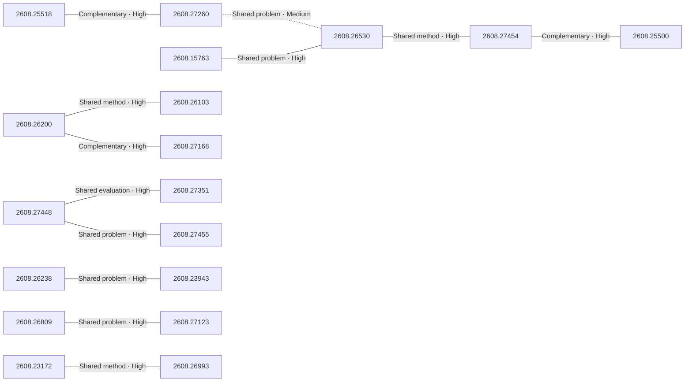

# Paper relationship graph — 2026-08-28

> [← Daily summary](../2026-08-28.md)

> **Interpretation caveat:** Every edge is an evidence-screened editorial hypothesis, not proof of citation, influence, priority, historical use, dependency, or an author-claimed relationship.

## Legend

- Rectangular nodes are current-day papers; rounded nodes are previously seen candidates.
- A line has no technical direction. An arrow shows only a proposed technical flow for an enabling dependency or method transfer.
- Solid edges are high confidence; dotted edges are medium confidence. Confidence evaluates this editorial connection, not either paper.
- Relationship labels:
  - **Shared problem:** `shared_problem`
  - **Shared method:** `shared_method`
  - **Shared evaluation:** `shared_evaluation`
  - **Complementary:** `complementary`
  - **Enabling dependency:** `enabling_dependency`
  - **Method transfer:** `method_transfer`
  - **Assumption tension:** `assumption_tension`
  - **Result tension:** `result_tension`
  - **Shared limitation:** `shared_limitation`
  - **Follow-up opportunity:** `follow_up_opportunity`

## Same-day relationships

| Source paper | Target paper | Relationship | Direction | Confidence |
| --- | --- | --- | --- | --- |
| [2608.27260](2608.27260.md) | [2608.25518](2608.25518.md) | Complementary | Not directional | High |
| [2608.27260](2608.27260.md) | [2608.26530](2608.26530.md) | Shared problem | Not directional | Medium |
| [2608.15763](2608.15763.md) | [2608.26530](2608.26530.md) | Shared problem | Not directional | High |
| [2608.26530](2608.26530.md) | [2608.27454](2608.27454.md) | Shared method | Not directional | High |
| [2608.27454](2608.27454.md) | [2608.25500](2608.25500.md) | Complementary | Not directional | High |
| [2608.26200](2608.26200.md) | [2608.26103](2608.26103.md) | Shared method | Not directional | High |
| [2608.26200](2608.26200.md) | [2608.27168](2608.27168.md) | Complementary | Not directional | High |
| [2608.26809](2608.26809.md) | [2608.27123](2608.27123.md) | Shared problem | Not directional | High |
| [2608.23172](2608.23172.md) | [2608.26993](2608.26993.md) | Shared method | Not directional | High |
| [2608.26238](2608.26238.md) | [2608.23943](2608.23943.md) | Shared problem | Not directional | High |
| [2608.27448](2608.27448.md) | [2608.27351](2608.27351.md) | Shared evaluation | Not directional | High |
| [2608.27455](2608.27455.md) | [2608.27448](2608.27448.md) | Shared problem | Not directional | High |

## Connections to previously seen papers

_The visual diagram is omitted because this graph is too large or dense for a readable snapshot; every edge remains in the table below._

| New paper | Previously seen paper | First seen by service | Relationship | Technical direction | Confidence |
| --- | --- | --- | --- | --- | --- |
| [2608.27448](2608.27448.md) | 2608.06296 ([Hugging Face](https://huggingface.co/papers/2608.06296) · [arXiv](https://arxiv.org/abs/2608.06296)) | 2026-08-11 | Shared method | Not directional | High |
| [2608.26872](2608.26872.md) | 2608.04349 ([Hugging Face](https://huggingface.co/papers/2608.04349) · [arXiv](https://arxiv.org/abs/2608.04349)) | 2026-08-06 | Shared method | Not directional | High |
| [2608.25518](2608.25518.md) | 2608.15659 ([Hugging Face](https://huggingface.co/papers/2608.15659) · [arXiv](https://arxiv.org/abs/2608.15659)) | 2026-08-18 | Enabling dependency | Previous → new | High |
| [2608.25518](2608.25518.md) | 2608.21833 ([Hugging Face](https://huggingface.co/papers/2608.21833) · [arXiv](https://arxiv.org/abs/2608.21833)) | 2026-08-25 | Shared evaluation | Not directional | High |
| [2608.27345](2608.27345.md) | 2608.23070 ([Hugging Face](https://huggingface.co/papers/2608.23070) · [arXiv](https://arxiv.org/abs/2608.23070)) | 2026-08-25 | Shared problem | Not directional | High |
| [2608.27456](2608.27456.md) | 2608.04574 ([Hugging Face](https://huggingface.co/papers/2608.04574) · [arXiv](https://arxiv.org/abs/2608.04574)) | 2026-08-06 | Follow-up opportunity | Not directional | High |
| [2608.26200](2608.26200.md) | 2608.21439 ([Hugging Face](https://huggingface.co/papers/2608.21439) · [arXiv](https://arxiv.org/abs/2608.21439)) | 2026-08-24 | Complementary | Not directional | High |
| [2608.26103](2608.26103.md) | 2607.28993 ([Hugging Face](https://huggingface.co/papers/2607.28993) · [arXiv](https://arxiv.org/abs/2607.28993)) | 2026-08-05 | Shared method | Not directional | High |
| [2608.27454](2608.27454.md) | 2608.24876 ([Hugging Face](https://huggingface.co/papers/2608.24876) · [arXiv](https://arxiv.org/abs/2608.24876)) | 2026-08-26 | Shared problem | Not directional | High |
| [2608.25500](2608.25500.md) | 2608.05604 ([Hugging Face](https://huggingface.co/papers/2608.05604) · [arXiv](https://arxiv.org/abs/2608.05604)) | 2026-08-13 | Shared problem | Not directional | High |
| [2608.27123](2608.27123.md) | 2608.11752 ([Hugging Face](https://huggingface.co/papers/2608.11752) · [arXiv](https://arxiv.org/abs/2608.11752)) | 2026-08-14 | Shared method | Not directional | High |
| [2608.19269](2608.19269.md) | 2608.14905 ([Hugging Face](https://huggingface.co/papers/2608.14905) · [arXiv](https://arxiv.org/abs/2608.14905)) | 2026-08-18 | Shared problem | Not directional | High |

## Current paper key

| Paper | Analysis |
| --- | --- |
| 2608.25518 — Agentic Game Development as a Verifiable Trajectory Data Engine for Scaling World Models | [Read analysis](2608.25518.md) |
| 2608.27345 — PAWBench: How Far Are We from Probabilistically Aligned World Modeling? | [Read analysis](2608.27345.md) |
| 2608.27456 — UrbanGround: From Local Perception to Spatial Agency in a Real-Scale City | [Read analysis](2608.27456.md) |
| 2608.27448 — TTPO: Test-Time Policy Optimization | [Read analysis](2608.27448.md) |
| 2608.26872 — Self-OPD: On-Policy Distillation for Flow Matching Models without Teacher | [Read analysis](2608.26872.md) |
| 2608.27260 — What Makes Good Agentic Data? An ACE Lens on Data Generation for LLM Agents | [Read analysis](2608.27260.md) |
| 2608.15763 — Training Agents to Evolve with Their Harness: TaoLive Digital Avatar Agent Technical Report | [Read analysis](2608.15763.md) |
| 2608.26200 — GameWAM: A World Action Model for Video Games | [Read analysis](2608.26200.md) |
| 2608.26530 — PILOT in the Loop: Live Self-Improvement for Long-Horizon Agents | [Read analysis](2608.26530.md) |
| 2608.26103 — Zero-WAM: In-Context World-Action Modeling from Human Videos for Open-Ended Task Generalization | [Read analysis](2608.26103.md) |
| 2608.27351 — Understanding Evolution Strategies for LLM Reasoning: Broader Reasoning Coverage than GRPO | [Read analysis](2608.27351.md) |
| 2608.27454 — WikiSkill: Compiling Agent Experience into Persistent Knowledge for Skill Evolution | [Read analysis](2608.27454.md) |
| 2608.26238 — Procedura: Agentic 3D Modeling with Procedural Control | [Read analysis](2608.26238.md) |
| 2608.27168 — Magpie: Real-Time World Renderer for Interactive Games | [Read analysis](2608.27168.md) |
| 2608.23943 — Luce: Relightable Gaussians for 3D Asset Generation | [Read analysis](2608.23943.md) |
| 2608.27455 — CritICL: Inference-Time Weak-to-Strong Generalization from Small Language Model Failure Modes | [Read analysis](2608.27455.md) |
| 2608.23172 — CaRGo-T: Causal Reasoning Graph-of-Thought improves Multimodal Humor Comprehension | [Read analysis](2608.23172.md) |
| 2608.25500 — CaSKG: Counterfactual-Causal Skill Graphs for Scalable Agent Skill Retrieval | [Read analysis](2608.25500.md) |
| 2608.25798 — TacForcing: Streaming Action Generation with Execution-Time Tactile Feedback | [Read analysis](2608.25798.md) |
| 2608.26809 — Thinking on Shots: Consistent Multi-Shot Video Editing with Agentic Reasoning | [Read analysis](2608.26809.md) |
| 2608.27123 — EditaLive! Unified Character Video Editing for Live Streaming | [Read analysis](2608.27123.md) |
| 2608.26993 — Aphanta: Diagnosing Task-Aligned Image-Edited Intermediates for Multimodal Reasoning | [Read analysis](2608.26993.md) |
| 2608.19269 — What Does an Evaluation License? A Commit-Bound Census of Claim-Relative Inference in Inspect Evals | [Read analysis](2608.19269.md) |

## Current papers without a published edge

- [2608.25798](2608.25798.md)

---

[Support these research summaries on Buy Me a Coffee](https://buymeacoffee.com/vollero)
