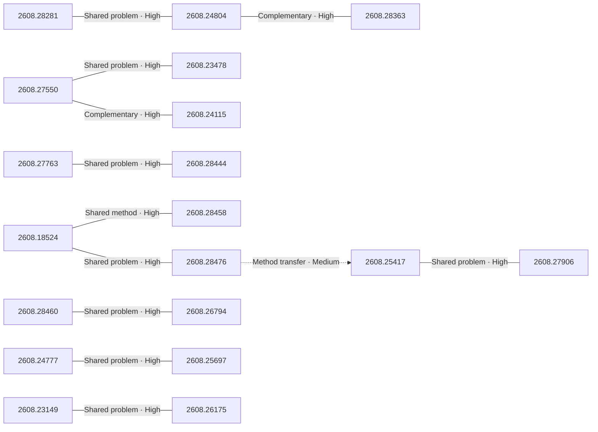

# Paper relationship graph — 2026-08-31

> [← Daily summary](../2026-08-31.md)

> **Interpretation caveat:** Every edge is an evidence-screened editorial hypothesis, not proof of citation, influence, priority, historical use, dependency, or an author-claimed relationship.

## Legend

- Rectangular nodes are current-day papers; rounded nodes are previously seen candidates.
- A line has no technical direction. An arrow shows only a proposed technical flow for an enabling dependency or method transfer.
- Solid edges are high confidence; dotted edges are medium confidence. Confidence evaluates this editorial connection, not either paper.
- Relationship labels:
  - **Shared problem:** `shared_problem`
  - **Shared method:** `shared_method`
  - **Shared evaluation:** `shared_evaluation`
  - **Complementary:** `complementary`
  - **Enabling dependency:** `enabling_dependency`
  - **Method transfer:** `method_transfer`
  - **Assumption tension:** `assumption_tension`
  - **Result tension:** `result_tension`
  - **Shared limitation:** `shared_limitation`
  - **Follow-up opportunity:** `follow_up_opportunity`

## Same-day relationships

| Source paper | Target paper | Relationship | Direction | Confidence |
| --- | --- | --- | --- | --- |
| [2608.28281](2608.28281.md) | [2608.24804](2608.24804.md) | Shared problem | Not directional | High |
| [2608.24804](2608.24804.md) | [2608.28363](2608.28363.md) | Complementary | Not directional | High |
| [2608.18524](2608.18524.md) | [2608.28458](2608.28458.md) | Shared method | Not directional | High |
| [2608.18524](2608.18524.md) | [2608.28476](2608.28476.md) | Shared problem | Not directional | High |
| [2608.27550](2608.27550.md) | [2608.23478](2608.23478.md) | Shared problem | Not directional | High |
| [2608.27550](2608.27550.md) | [2608.24115](2608.24115.md) | Complementary | Not directional | High |
| [2608.28460](2608.28460.md) | [2608.26794](2608.26794.md) | Shared problem | Not directional | High |
| [2608.27763](2608.27763.md) | [2608.28444](2608.28444.md) | Shared problem | Not directional | High |
| [2608.24777](2608.24777.md) | [2608.25697](2608.25697.md) | Shared problem | Not directional | High |
| [2608.25417](2608.25417.md) | [2608.27906](2608.27906.md) | Shared problem | Not directional | High |
| [2608.28476](2608.28476.md) | [2608.25417](2608.25417.md) | Method transfer | Source → target | Medium |
| [2608.23149](2608.23149.md) | [2608.26175](2608.26175.md) | Shared problem | Not directional | High |

## Connections to previously seen papers

_The visual diagram is omitted because this graph is too large or dense for a readable snapshot; every edge remains in the table below._

| New paper | Previously seen paper | First seen by service | Relationship | Technical direction | Confidence |
| --- | --- | --- | --- | --- | --- |
| [2608.28281](2608.28281.md) | 2608.13417 ([Hugging Face](https://huggingface.co/papers/2608.13417) · [arXiv](https://arxiv.org/abs/2608.13417)) | 2026-08-17 | Shared evaluation | Not directional | High |
| [2608.18524](2608.18524.md) | 2608.05219 ([Hugging Face](https://huggingface.co/papers/2608.05219) · [arXiv](https://arxiv.org/abs/2608.05219)) | 2026-08-10 | Shared problem | Not directional | High |
| [2608.27550](2608.27550.md) | 2608.25864 ([Hugging Face](https://huggingface.co/papers/2608.25864) · [arXiv](https://arxiv.org/abs/2608.25864)) | 2026-08-27 | Complementary | Not directional | High |
| [2608.27529](2608.27529.md) | 2608.16490 ([Hugging Face](https://huggingface.co/papers/2608.16490) · [arXiv](https://arxiv.org/abs/2608.16490)) | 2026-08-20 | Complementary | Not directional | High |
| [2608.23478](2608.23478.md) | 2607.26657 ([Hugging Face](https://huggingface.co/papers/2607.26657) · [arXiv](https://arxiv.org/abs/2607.26657)) | 2026-08-10 | Shared method | Not directional | High |
| [2608.28460](2608.28460.md) | 2608.23383 ([Hugging Face](https://huggingface.co/papers/2608.23383) · [arXiv](https://arxiv.org/abs/2608.23383)) | 2026-08-27 | Shared problem | Not directional | High |
| [2608.24804](2608.24804.md) | 2608.07545 ([Hugging Face](https://huggingface.co/papers/2608.07545) · [arXiv](https://arxiv.org/abs/2608.07545)) | 2026-08-14 | Shared method | Not directional | High |
| [2608.28476](2608.28476.md) | 2608.05102 ([Hugging Face](https://huggingface.co/papers/2608.05102) · [arXiv](https://arxiv.org/abs/2608.05102)) | 2026-08-06 | Shared method | Not directional | High |
| [2608.26794](2608.26794.md) | 2608.23383 ([Hugging Face](https://huggingface.co/papers/2608.23383) · [arXiv](https://arxiv.org/abs/2608.23383)) | 2026-08-27 | Shared problem | Not directional | High |
| [2608.24115](2608.24115.md) | 2608.05042 ([Hugging Face](https://huggingface.co/papers/2608.05042) · [arXiv](https://arxiv.org/abs/2608.05042)) | 2026-08-06 | Shared problem | Not directional | High |
| [2608.28363](2608.28363.md) | 2608.07545 ([Hugging Face](https://huggingface.co/papers/2608.07545) · [arXiv](https://arxiv.org/abs/2608.07545)) | 2026-08-14 | Complementary | Not directional | High |
| [2608.26175](2608.26175.md) | 2608.04569 ([Hugging Face](https://huggingface.co/papers/2608.04569) · [arXiv](https://arxiv.org/abs/2608.04569)) | 2026-08-10 | Shared limitation | Not directional | High |

## Current paper key

| Paper | Analysis |
| --- | --- |
| 2608.28281 — LoopArena: Benchmarking Models as Runtime Controllers for Loop Engineering | [Read analysis](2608.28281.md) |
| 2608.18524 — DART-SD: Diamond-topology Aware Retrieval and Tuning for Self-Distillation of Multi-Turn Tool-Calling Agents | [Read analysis](2608.18524.md) |
| 2608.27550 — Beyond Data Scaling: Representation-Centric Continued Pre-training for Vision-Language-Action Models | [Read analysis](2608.27550.md) |
| 2608.28122 — Agentic Artifact Creation: Systems, Evaluation, Principles, and Opportunities | [Read analysis](2608.28122.md) |
| 2608.27549 — Code as Worlds: Agentic Discovery of Executable World Representations for Physical Reasoning | [Read analysis](2608.27549.md) |
| 2608.26582 — J-Zero: Unified Challenger--Solver--Judge Co-Evolution from Zero Data | [Read analysis](2608.26582.md) |
| 2608.27529 — Revisiting Local Context for Long-Horizon Streaming 3D Reconstruction | [Read analysis](2608.27529.md) |
| 2608.27370 — Puro-2B: Poor Lab's Qwen2-1.5B Trained on RTX 5090 within $5090 | [Read analysis](2608.27370.md) |
| 2608.23478 — Act with Intent: Distilling Behavior Intent for Vision-Language-Action Models | [Read analysis](2608.23478.md) |
| 2608.28460 — LayerRecall: A State-Conditioned Memory Router for Long-Horizon Consistency in Video Generation | [Read analysis](2608.28460.md) |
| 2608.24804 — StarHarness: Evolving Harnesses with Stratified Search for Enterprise Environments | [Read analysis](2608.24804.md) |
| 2608.28476 — ContextPilot: Teaching Agents for Proactive Context Management via Fine-grained RL | [Read analysis](2608.28476.md) |
| 2608.27763 — Fast Weight Attention for Continual Learning | [Read analysis](2608.27763.md) |
| 2608.28192 — Locate Anything in Videos: Rethinking Efficient Generative Spatio-Temporal Video Grounding | [Read analysis](2608.28192.md) |
| 2608.28478 — Blind Men and the Elephant: Probing the Epistemic Myopia of LLMs under Long-Tail Divergent Knowledge | [Read analysis](2608.28478.md) |
| 2608.28444 — Sliding-window beats linear attention | [Read analysis](2608.28444.md) |
| 2608.25417 — Paint What You See: Benchmarking Dexterous Visual Tool Use in Multimodal Agents | [Read analysis](2608.25417.md) |
| 2608.24777 — StepGuard: Learning Step-Level Guardrails with Scalable Supervision and Safety-Utility Balancing | [Read analysis](2608.24777.md) |
| 2608.28549 — Video Generative Models as Geometry Learner | [Read analysis](2608.28549.md) |
| 2608.26794 — Ring Forcing: Towards Precise Long-Term Memory for Autoregressive Video Diffusion | [Read analysis](2608.26794.md) |
| 2608.24115 — PonderPounce: A Pretrained MLLM as an Episode Context Engine for Robot Control | [Read analysis](2608.24115.md) |
| 2608.27906 — Rubric-to-Code Credit Assignment for Reinforcement Learning | [Read analysis](2608.27906.md) |
| 2608.28363 — EvoUndo: Recoverability-Constrained Self-Evolution for LLM Agent Harnesses | [Read analysis](2608.28363.md) |
| 2608.23149 — Language Chain in Alignment: Cross-lingual Ranking Preference Optimization | [Read analysis](2608.23149.md) |
| 2608.25375 — GGSS: Geodesic-Gated Spherical Steering for Inference-Time Debiasing of Generative Vision-Language Models | [Read analysis](2608.25375.md) |
| 2608.25697 — LMSM: LLM Security Framework Inspired by Linux Security Modules | [Read analysis](2608.25697.md) |
| 2608.21721 — Ask or Answer: A Decision Framework for Multi-Turn Health Misinformation Intervention | [Read analysis](2608.21721.md) |
| 2608.20965 — Training, learning and inference: unified dynamics of neural systems | [Read analysis](2608.20965.md) |
| 2608.28458 — Acquire, Repair, Preserve: A Diagnosis-Guided Post-Training Recipe for Small-Model Dialogue Game Agents | [Read analysis](2608.28458.md) |
| 2608.26737 — Generative Semantic Scene Completion | [Read analysis](2608.26737.md) |
| 2608.26175 — Lost in Compression: A Controlled Cross-Lingual Audit of Extractive Prompt Compressors | [Read analysis](2608.26175.md) |

## Current papers without a published edge

- [2608.28122](2608.28122.md)
- [2608.27549](2608.27549.md)
- [2608.26582](2608.26582.md)
- [2608.27370](2608.27370.md)
- [2608.28192](2608.28192.md)
- [2608.28478](2608.28478.md)
- [2608.28549](2608.28549.md)
- [2608.25375](2608.25375.md)
- [2608.21721](2608.21721.md)
- [2608.20965](2608.20965.md)
- [2608.26737](2608.26737.md)

---

[Support these research summaries on Buy Me a Coffee](https://buymeacoffee.com/vollero)
