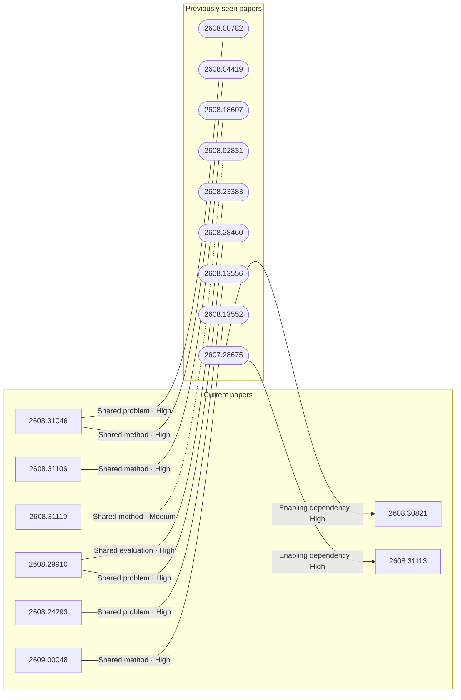

# Paper relationship graph — 2026-09-01

> [← Daily summary](../2026-09-01.md)

> **Interpretation caveat:** Every edge is an evidence-screened editorial hypothesis, not proof of citation, influence, priority, historical use, dependency, or an author-claimed relationship.

## Legend

- Rectangular nodes are current-day papers; rounded nodes are previously seen candidates.
- A line has no technical direction. An arrow shows only a proposed technical flow for an enabling dependency or method transfer.
- Solid edges are high confidence; dotted edges are medium confidence. Confidence evaluates this editorial connection, not either paper.
- Relationship labels:
  - **Shared problem:** `shared_problem`
  - **Shared method:** `shared_method`
  - **Shared evaluation:** `shared_evaluation`
  - **Complementary:** `complementary`
  - **Enabling dependency:** `enabling_dependency`
  - **Method transfer:** `method_transfer`
  - **Assumption tension:** `assumption_tension`
  - **Result tension:** `result_tension`
  - **Shared limitation:** `shared_limitation`
  - **Follow-up opportunity:** `follow_up_opportunity`

## Same-day relationships

_The visual diagram is omitted because this graph is too large or dense for a readable snapshot; every edge remains in the table below._

| Source paper | Target paper | Relationship | Direction | Confidence |
| --- | --- | --- | --- | --- |
| [2608.31046](2608.31046.md) | [2608.29252](2608.29252.md) | Shared problem | Not directional | High |
| [2608.31119](2608.31119.md) | [2608.31076](2608.31076.md) | Complementary | Not directional | High |
| [2608.30935](2608.30935.md) | [2608.31022](2608.31022.md) | Shared problem | Not directional | High |
| [2608.31022](2608.31022.md) | [2608.30396](2608.30396.md) | Complementary | Not directional | High |
| [2608.30968](2608.30968.md) | [2608.30530](2608.30530.md) | Shared method | Not directional | High |
| [2609.00048](2609.00048.md) | [2608.29387](2608.29387.md) | Shared problem | Not directional | High |
| [2608.30241](2608.30241.md) | [2608.29387](2608.29387.md) | Shared problem | Not directional | High |
| [2608.29910](2608.29910.md) | [2608.26671](2608.26671.md) | Shared problem | Not directional | High |
| [2608.29335](2608.29335.md) | [2608.24293](2608.24293.md) | Complementary | Not directional | High |
| [2608.28833](2608.28833.md) | [2608.29464](2608.29464.md) | Shared problem | Not directional | High |
| [2608.30821](2608.30821.md) | [2608.31113](2608.31113.md) | Enabling dependency | Source → target | Medium |
| [2608.30147](2608.30147.md) | [2608.29310](2608.29310.md) | Method transfer | Source → target | Medium |

## Connections to previously seen papers

| New paper | Previously seen paper | First seen by service | Relationship | Technical direction | Confidence |
| --- | --- | --- | --- | --- | --- |
| [2608.31046](2608.31046.md) | 2608.00782 ([Hugging Face](https://huggingface.co/papers/2608.00782) · [arXiv](https://arxiv.org/abs/2608.00782)) | 2026-08-06 | Shared problem | Not directional | High |
| [2608.31046](2608.31046.md) | 2608.04419 ([Hugging Face](https://huggingface.co/papers/2608.04419) · [arXiv](https://arxiv.org/abs/2608.04419)) | 2026-08-11 | Shared method | Not directional | High |
| [2608.31106](2608.31106.md) | 2608.18607 ([Hugging Face](https://huggingface.co/papers/2608.18607) · [arXiv](https://arxiv.org/abs/2608.18607)) | 2026-08-20 | Shared method | Not directional | High |
| [2608.24293](2608.24293.md) | 2608.13556 ([Hugging Face](https://huggingface.co/papers/2608.13556) · [arXiv](https://arxiv.org/abs/2608.13556)) | 2026-08-19 | Shared problem | Not directional | High |
| [2608.29910](2608.29910.md) | 2608.23383 ([Hugging Face](https://huggingface.co/papers/2608.23383) · [arXiv](https://arxiv.org/abs/2608.23383)) | 2026-08-27 | Shared evaluation | Not directional | High |
| [2608.29910](2608.29910.md) | 2608.28460 ([Hugging Face](https://huggingface.co/papers/2608.28460) · [arXiv](https://arxiv.org/abs/2608.28460)) | 2026-08-31 | Shared problem | Not directional | High |
| [2609.00048](2609.00048.md) | 2608.13552 ([Hugging Face](https://huggingface.co/papers/2608.13552) · [arXiv](https://arxiv.org/abs/2608.13552)) | 2026-08-14 | Shared method | Not directional | High |
| [2608.31119](2608.31119.md) | 2608.02831 ([Hugging Face](https://huggingface.co/papers/2608.02831) · [arXiv](https://arxiv.org/abs/2608.02831)) | 2026-08-10 | Shared method | Not directional | Medium |
| [2608.30821](2608.30821.md) | 2607.28675 ([Hugging Face](https://huggingface.co/papers/2607.28675) · [arXiv](https://arxiv.org/abs/2607.28675)) | 2026-08-03 | Enabling dependency | Previous → new | High |
| [2608.31113](2608.31113.md) | 2607.28675 ([Hugging Face](https://huggingface.co/papers/2607.28675) · [arXiv](https://arxiv.org/abs/2607.28675)) | 2026-08-03 | Enabling dependency | Previous → new | High |

## Current paper key

| Paper | Analysis |
| --- | --- |
| 2608.31046 — Does On-Policy Distillation Really Distill? From Noisy Teacher to Self-Improvement | [Read analysis](2608.31046.md) |
| 2608.31106 — DreamX-Creator: Democratizing Native Audio-Video Generation at 2K Resolution | [Read analysis](2608.31106.md) |
| 2608.30821 — Lucida: Parse, Generate, and Place for Composable Real-to-Sim Scene Modeling | [Read analysis](2608.30821.md) |
| 2608.29335 — GenFirst: Generation Before Reconstruction for Stable End-to-End Latent Generative Modeling | [Read analysis](2608.29335.md) |
| 2608.31036 — Normalized Low-Rank Adaptation | [Read analysis](2608.31036.md) |
| 2608.30320 — On the Design of Qwen3.8-Next Architecture: Evaluation, Efficiency, and Training Stability | [Read analysis](2608.30320.md) |
| 2608.31119 — PaperGym: Rubric-Centered Evolution for Research-Plan Generation | [Read analysis](2608.31119.md) |
| 2608.30968 — CogEvol: Towards Efficient and Reliable Learning Environment Generation | [Read analysis](2608.30968.md) |
| 2608.28600 — SHAPE of Chain-of-Thought in Math Reasoning | [Read analysis](2608.28600.md) |
| 2608.30935 — LightNav-0: Eliciting VLM Spatial Intelligence for Generalist Embodied Navigation | [Read analysis](2608.30935.md) |
| 2608.29310 — Super Library Agent: Joint Generation and Maintenance of Multiple Applications Beyond the Single Codebase | [Read analysis](2608.29310.md) |
| 2608.28833 — Evaluating the Hidden Costs of Personalization in Large Language Models | [Read analysis](2608.28833.md) |
| 2608.31075 — Scaling Large Reasoning Models beyond Human Supervision: A Path toward Superintelligence | [Read analysis](2608.31075.md) |
| 2608.31076 — Learning to Evaluate Before Improving: Automatic Rubric Induction for Automatic Research Agents | [Read analysis](2608.31076.md) |
| 2608.29910 — Matrix-Game 3.5: Enhancing Real-Time Streaming Interactive World Models with Patch Memory | [Read analysis](2608.29910.md) |
| 2608.30428 — Lies We Can See: Joint Verbal and Non-Verbal Deception by VLM Agents in Embodied Social Interactions | [Read analysis](2608.30428.md) |
| 2608.24293 — Keep-or-Drop? Adaptive Tokenizer for Compact Video Representation | [Read analysis](2608.24293.md) |
| 2608.29464 — Chain-of-Thought Faithfulness of Reasoning Models Varies with Where and How Preference Cues Are Delivered | [Read analysis](2608.29464.md) |
| 2609.00048 — GUI-CC: Benchmarking Contextual Consistency of GUI World Models as Agent Environments | [Read analysis](2609.00048.md) |
| 2608.30241 — PaperBanana-Interact: Scientific Diagram Refinement with Multi-Turn Human Feedback | [Read analysis](2608.30241.md) |
| 2608.31022 — MNIST-PRO: MNIST is Back as a Partially Observable World for AI Agents | [Read analysis](2608.31022.md) |
| 2608.30396 — Scaffolding Foundation Models into Physical-World Agents Pushes the Frontier of Long-Horizon Navigation | [Read analysis](2608.30396.md) |
| 2608.30147 — CAST: Critique-Aware Supervision for Training Reliable Long-Horizon Tool-Calling Agents | [Read analysis](2608.30147.md) |
| 2608.28695 — Weaving Visual Narratives: Agentic Image Bundle Composition Beyond Atomic Visual Matching | [Read analysis](2608.28695.md) |
| 2608.30530 — WebWorld: The Browser as a World Model for Self-Improving Web Code | [Read analysis](2608.30530.md) |
| 2608.30135 — Verification-Aware Training for Speculative Decoding | [Read analysis](2608.30135.md) |
| 2608.29847 — ContextBias: Controlled Evaluation of Bias Persistence Under Context Shift in Text-to-Image Models | [Read analysis](2608.29847.md) |
| 2608.28958 — CoVA-SFT: A Large-Scale Dataset for Chain of Visual Abstractions | [Read analysis](2608.28958.md) |
| 2608.29387 — EvoGenUI-Bench: Evaluating LLMs as Multi-Turn Generative UI Assistants | [Read analysis](2608.29387.md) |
| 2608.29098 — SafeAtlas-VL: Beyond Binary Multimodal Safety with Large-Scale Data and Guard Models | [Read analysis](2608.29098.md) |
| 2609.00519 — The Safeguard Worked. Is the LLM System Safer? | [Read analysis](2609.00519.md) |
| 2608.31113 — BLARM: Animating 3D Objects from Video via Blending Latent Rigid Motion Primitives | [Read analysis](2608.31113.md) |
| 2608.29613 — Cross-lingual Functional Vectors for Emotion Detection in Large Language Models | [Read analysis](2608.29613.md) |
| 2608.29137 — Chat-Edit-3D++: Interactive 3D and 4D Scene Editing via Large Language Models | [Read analysis](2608.29137.md) |
| 2608.30209 — DICS: Exploring Data Intrinsic Consistency for Visual Instruction Selection | [Read analysis](2608.30209.md) |
| 2608.29974 — SpanCalib-VLM: Calibrated Hallucination Span Detection in Vision-Language Models | [Read analysis](2608.29974.md) |
| 2608.29252 — Dynamic Important Example Mining for Reinforcement Finetuning | [Read analysis](2608.29252.md) |
| 2608.26671 — RECAP-Forcing: Retaining Content Appearances for Long Video Generation | [Read analysis](2608.26671.md) |
| 2608.30795 — Uncertainty-Aware End-to-End AI Weather Forecasting: Disentangling Observation and Model Contributions | [Read analysis](2608.30795.md) |
| 2608.29681 — MMMMM: A Unified Taxonomy for Investigating the Mechanisms of Multilingual MultiModal Misinformation | [Read analysis](2608.29681.md) |

## Current papers without a published edge

- [2608.31036](2608.31036.md)
- [2608.30320](2608.30320.md)
- [2608.28600](2608.28600.md)
- [2608.31075](2608.31075.md)
- [2608.30428](2608.30428.md)
- [2608.28695](2608.28695.md)
- [2608.30135](2608.30135.md)
- [2608.29847](2608.29847.md)
- [2608.28958](2608.28958.md)
- [2608.29098](2608.29098.md)
- [2609.00519](2609.00519.md)
- [2608.29613](2608.29613.md)
- [2608.29137](2608.29137.md)
- [2608.30209](2608.30209.md)
- [2608.29974](2608.29974.md)
- [2608.30795](2608.30795.md)
- [2608.29681](2608.29681.md)

---

[Support these research summaries on Buy Me a Coffee](https://buymeacoffee.com/vollero)
