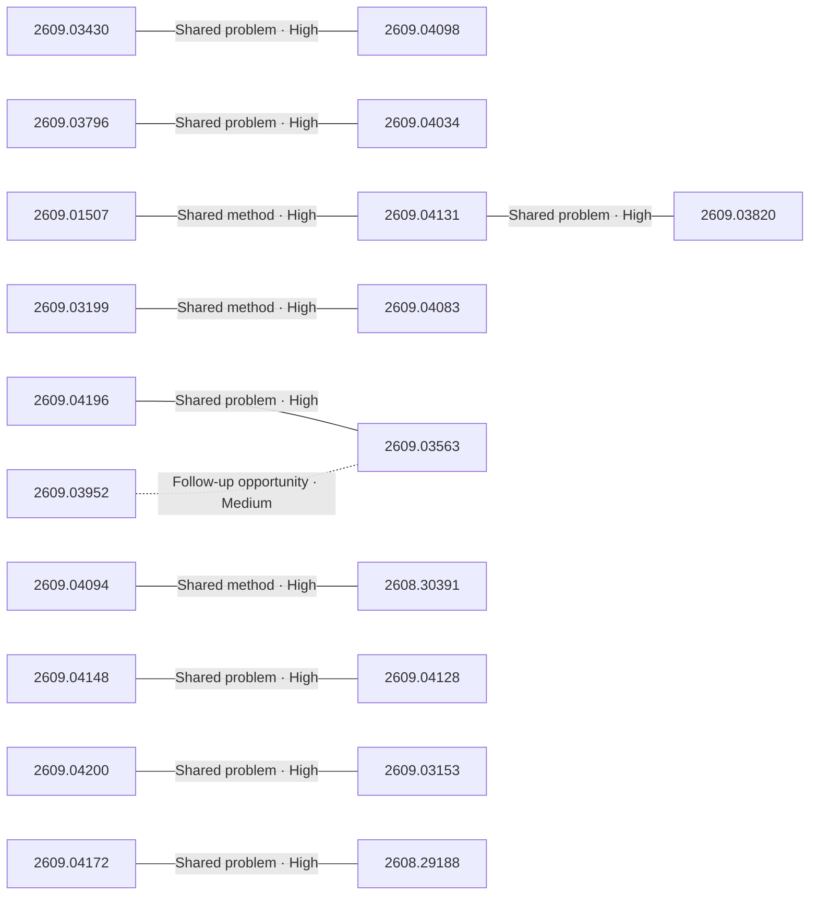

# Paper relationship graph — 2026-09-04

> [← Daily summary](../2026-09-04.md)

> **Interpretation caveat:** Every edge is an evidence-screened editorial hypothesis, not proof of citation, influence, priority, historical use, dependency, or an author-claimed relationship.

## Legend

- Rectangular nodes are current-day papers; rounded nodes are previously seen candidates.
- A line has no technical direction. An arrow shows only a proposed technical flow for an enabling dependency or method transfer.
- Solid edges are high confidence; dotted edges are medium confidence. Confidence evaluates this editorial connection, not either paper.
- Relationship labels:
  - **Shared problem:** `shared_problem`
  - **Shared method:** `shared_method`
  - **Shared evaluation:** `shared_evaluation`
  - **Complementary:** `complementary`
  - **Enabling dependency:** `enabling_dependency`
  - **Method transfer:** `method_transfer`
  - **Assumption tension:** `assumption_tension`
  - **Result tension:** `result_tension`
  - **Shared limitation:** `shared_limitation`
  - **Follow-up opportunity:** `follow_up_opportunity`

## Same-day relationships

| Source paper | Target paper | Relationship | Direction | Confidence |
| --- | --- | --- | --- | --- |
| [2609.04148](2609.04148.md) | [2609.04128](2609.04128.md) | Shared problem | Not directional | High |
| [2609.03796](2609.03796.md) | [2609.04034](2609.04034.md) | Shared problem | Not directional | High |
| [2609.03430](2609.03430.md) | [2609.04098](2609.04098.md) | Shared problem | Not directional | High |
| [2609.01507](2609.01507.md) | [2609.04131](2609.04131.md) | Shared method | Not directional | High |
| [2609.04131](2609.04131.md) | [2609.03820](2609.03820.md) | Shared problem | Not directional | High |
| [2609.03199](2609.03199.md) | [2609.04083](2609.04083.md) | Shared method | Not directional | High |
| [2609.04094](2609.04094.md) | [2608.30391](2608.30391.md) | Shared method | Not directional | High |
| [2609.04200](2609.04200.md) | [2609.03153](2609.03153.md) | Shared problem | Not directional | High |
| [2609.04172](2609.04172.md) | [2608.29188](2608.29188.md) | Shared problem | Not directional | High |
| [2609.04196](2609.04196.md) | [2609.03563](2609.03563.md) | Shared problem | Not directional | High |
| [2609.03952](2609.03952.md) | [2609.03563](2609.03563.md) | Follow-up opportunity | Not directional | Medium |

## Connections to previously seen papers

_The visual diagram is omitted because this graph is too large or dense for a readable snapshot; every edge remains in the table below._

| New paper | Previously seen paper | First seen by service | Relationship | Technical direction | Confidence |
| --- | --- | --- | --- | --- | --- |
| [2609.03430](2609.03430.md) | 2608.26070 ([Hugging Face](https://huggingface.co/papers/2608.26070) · [arXiv](https://arxiv.org/abs/2608.26070)) | 2026-08-27 | Shared method | Not directional | High |
| [2609.04172](2609.04172.md) | 2608.16647 ([Hugging Face](https://huggingface.co/papers/2608.16647) · [arXiv](https://arxiv.org/abs/2608.16647)) | 2026-08-24 | Shared method | Not directional | High |
| [2609.04148](2609.04148.md) | 2608.20634 ([Hugging Face](https://huggingface.co/papers/2608.20634) · [arXiv](https://arxiv.org/abs/2608.20634)) | 2026-08-24 | Shared method | Not directional | High |
| [2609.04128](2609.04128.md) | 2608.18580 ([Hugging Face](https://huggingface.co/papers/2608.18580) · [arXiv](https://arxiv.org/abs/2608.18580)) | 2026-08-19 | Shared method | Not directional | High |
| [2609.04201](2609.04201.md) | 2608.27529 ([Hugging Face](https://huggingface.co/papers/2608.27529) · [arXiv](https://arxiv.org/abs/2608.27529)) | 2026-08-31 | Shared problem | Not directional | High |
| [2609.02887](2609.02887.md) | 2608.25204 ([Hugging Face](https://huggingface.co/papers/2608.25204) · [arXiv](https://arxiv.org/abs/2608.25204)) | 2026-08-27 | Enabling dependency | Previous → new | High |
| [2609.04034](2609.04034.md) | 2608.24138 ([Hugging Face](https://huggingface.co/papers/2608.24138) · [arXiv](https://arxiv.org/abs/2608.24138)) | 2026-08-27 | Method transfer | Previous → new | Medium |
| [2609.04083](2609.04083.md) | 2608.10636 ([Hugging Face](https://huggingface.co/papers/2608.10636) · [arXiv](https://arxiv.org/abs/2608.10636)) | 2026-08-12 | Method transfer | New → previous | Medium |
| [2609.03153](2609.03153.md) | 2608.21839 ([Hugging Face](https://huggingface.co/papers/2608.21839) · [arXiv](https://arxiv.org/abs/2608.21839)) | 2026-08-27 | Shared method | Not directional | High |
| [2609.03952](2609.03952.md) | 2608.18607 ([Hugging Face](https://huggingface.co/papers/2608.18607) · [arXiv](https://arxiv.org/abs/2608.18607)) | 2026-08-20 | Shared method | Not directional | High |
| [2609.03563](2609.03563.md) | 2608.04701 ([Hugging Face](https://huggingface.co/papers/2608.04701) · [arXiv](https://arxiv.org/abs/2608.04701)) | 2026-08-06 | Shared problem | Not directional | High |
| [2608.29188](2608.29188.md) | 2608.09805 ([Hugging Face](https://huggingface.co/papers/2608.09805) · [arXiv](https://arxiv.org/abs/2608.09805)) | 2026-08-13 | Follow-up opportunity | Not directional | Medium |

## Current paper key

| Paper | Analysis |
| --- | --- |
| 2609.04199 — Compile by Training: Turning Natural-Language Specifications into Local Neural Functions | [Read analysis](2609.04199.md) |
| 2609.04148 — Terminal-Universe: Turning Agent Trajectories into Scalable Terminal Environments | [Read analysis](2609.04148.md) |
| 2609.03796 — LLaDA-Image: Building Strong Image Generators with Fully Open Training Recipes | [Read analysis](2609.03796.md) |
| 2609.03430 — Random Attention: Rethinking KV Cache Eviction for Efficient Reasoning | [Read analysis](2609.03430.md) |
| 2608.26730 — Knowing When Not to Reuse: Conditional Experience Transfer in Autonomous LLM Post-Training | [Read analysis](2608.26730.md) |
| 2609.01507 — LatentPress: Context Compression Beyond Text and Vision | [Read analysis](2609.01507.md) |
| 2609.04172 — Rethinking On-Policy Distillation of Large Language Models II: One Training Example | [Read analysis](2609.04172.md) |
| 2609.04098 — Why Gated DeltaNet Survives 4-Bit Quantization: NVFP4 W4A4 for the Recurrent Half of a Hybrid 27B LLM | [Read analysis](2609.04098.md) |
| 2609.04196 — Puffin-World: Scaling a Unified Multimodal Model with Native 3D World States | [Read analysis](2609.04196.md) |
| 2609.03199 — RoboTok: An Internet-Scale Data Engine for Human Demonstration Retrieval and Dexterous Manipulation Learning | [Read analysis](2609.03199.md) |
| 2609.04201 — Scal3R: Learning Efficient Multi-Relative Pose Query for Scalable Online 3D Reconstruction | [Read analysis](2609.04201.md) |
| 2609.04034 — Editable Visual Design | [Read analysis](2609.04034.md) |
| 2609.02367 — The Missing Temporal Link: Temporal Context Routing for Script-Driven Audio-Video Generation | [Read analysis](2609.02367.md) |
| 2609.04131 — Beyond Retrieval: Progressive Latent Memory Evolution for Streaming Video Understanding | [Read analysis](2609.04131.md) |
| 2609.04083 — CORE: Improving Compositional Reasoning in MLLM Embedding via Reranker Distillation | [Read analysis](2609.04083.md) |
| 2609.04173 — Last Translation Benchmark | [Read analysis](2609.04173.md) |
| 2608.27831 — RealSWE: A Compositional Evaluation of Coding Agents under Realistic User Requests | [Read analysis](2608.27831.md) |
| 2609.04094 — DRACO: Fine-Grained Credit Assignment with Dynamic Rubrics for Long-Horizon Agent Training | [Read analysis](2609.04094.md) |
| 2609.03952 — WorldReward: Reward Modeling for Camera-Conditioned World Models | [Read analysis](2609.03952.md) |
| 2609.03293 — PACE: Towards Surfacing Hidden Conflicts in User Requests | [Read analysis](2609.03293.md) |
| 2609.03563 — FlashRender: Few-Step Generative Rendering via Camera-Controlled Video MeanFlow | [Read analysis](2609.03563.md) |
| 2608.30391 — Using Grounded Theory for Agent Behavior Analysis at Scale | [Read analysis](2608.30391.md) |
| 2609.04128 — Environment Evolution for Terminal Agents | [Read analysis](2609.04128.md) |
| 2609.04200 — Principia: Relational Physics Tests for Video Models | [Read analysis](2609.04200.md) |
| 2609.03820 — Select, Compress, Reinvest: A Controlled Study of Visual-Token Allocation in Long-Video MLLMs | [Read analysis](2609.03820.md) |
| 2609.01072 — Let Confidence Change, Not the Prediction: Prediction-Preserving Repair for Post-hoc Calibration | [Read analysis](2609.01072.md) |
| 2609.02373 — Percolation Dynamics in Optimization : Variance Cascades and Discrete Scale Invariance | [Read analysis](2609.02373.md) |
| 2608.29253 — QCell: Recombining and Aligning Cell Queries for Overlapping Instance Segmentation | [Read analysis](2608.29253.md) |
| 2609.03153 — VeriPhy: Agentic Physical Reasoning for World Model Evaluation and Refinement | [Read analysis](2609.03153.md) |
| 2609.02887 — A Common Measure of Communication for Speech Brain-Computer Interfaces | [Read analysis](2609.02887.md) |
| 2608.29188 — Locked at the Entrance, Open Inside: Where RLVR Narrows the Solution Space | [Read analysis](2608.29188.md) |

## Current papers without a published edge

- [2609.04199](2609.04199.md)
- [2608.26730](2608.26730.md)
- [2609.02367](2609.02367.md)
- [2609.04173](2609.04173.md)
- [2608.27831](2608.27831.md)
- [2609.03293](2609.03293.md)
- [2609.01072](2609.01072.md)
- [2609.02373](2609.02373.md)
- [2608.29253](2608.29253.md)

---

[Support these research summaries on Buy Me a Coffee](https://buymeacoffee.com/vollero)
