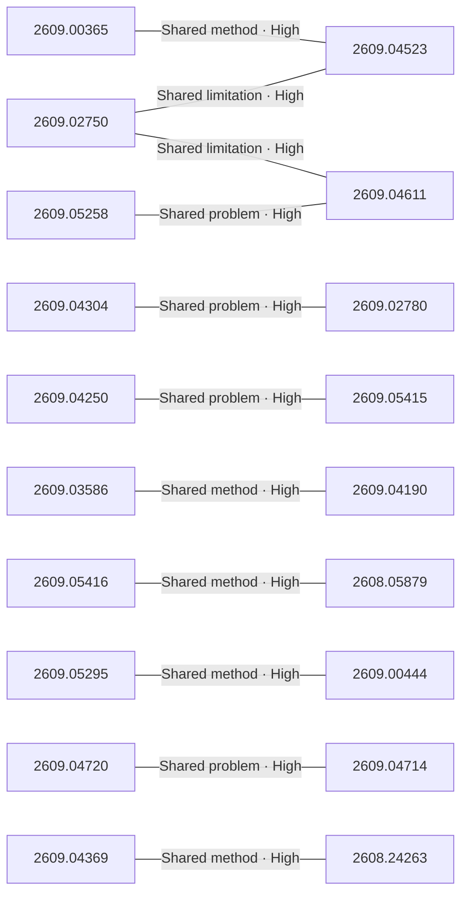

# Paper relationship graph — 2026-09-07

> [← Daily summary](../2026-09-07.md)

> **Interpretation caveat:** Every edge is an evidence-screened editorial hypothesis, not proof of citation, influence, priority, historical use, dependency, or an author-claimed relationship.

## Legend

- Rectangular nodes are current-day papers; rounded nodes are previously seen candidates.
- A line has no technical direction. An arrow shows only a proposed technical flow for an enabling dependency or method transfer.
- Solid edges are high confidence; dotted edges are medium confidence. Confidence evaluates this editorial connection, not either paper.
- Relationship labels:
  - **Shared problem:** `shared_problem`
  - **Shared method:** `shared_method`
  - **Shared evaluation:** `shared_evaluation`
  - **Complementary:** `complementary`
  - **Enabling dependency:** `enabling_dependency`
  - **Method transfer:** `method_transfer`
  - **Assumption tension:** `assumption_tension`
  - **Result tension:** `result_tension`
  - **Shared limitation:** `shared_limitation`
  - **Follow-up opportunity:** `follow_up_opportunity`

## Same-day relationships

| Source paper | Target paper | Relationship | Direction | Confidence |
| --- | --- | --- | --- | --- |
| [2609.05258](2609.05258.md) | [2609.04611](2609.04611.md) | Shared problem | Not directional | High |
| [2609.05295](2609.05295.md) | [2609.00444](2609.00444.md) | Shared method | Not directional | High |
| [2609.03586](2609.03586.md) | [2609.04190](2609.04190.md) | Shared method | Not directional | High |
| [2609.04369](2609.04369.md) | [2608.24263](2608.24263.md) | Shared method | Not directional | High |
| [2609.05416](2609.05416.md) | [2608.05879](2608.05879.md) | Shared method | Not directional | High |
| [2609.04250](2609.04250.md) | [2609.05415](2609.05415.md) | Shared problem | Not directional | High |
| [2609.04304](2609.04304.md) | [2609.02780](2609.02780.md) | Shared problem | Not directional | High |
| [2609.04720](2609.04720.md) | [2609.04714](2609.04714.md) | Shared problem | Not directional | High |
| [2609.02750](2609.02750.md) | [2609.04523](2609.04523.md) | Shared limitation | Not directional | High |
| [2609.00365](2609.00365.md) | [2609.04523](2609.04523.md) | Shared method | Not directional | High |
| [2609.02750](2609.02750.md) | [2609.04611](2609.04611.md) | Shared limitation | Not directional | High |

## Connections to previously seen papers

_The visual diagram is omitted because this graph is too large or dense for a readable snapshot; every edge remains in the table below._

| New paper | Previously seen paper | First seen by service | Relationship | Technical direction | Confidence |
| --- | --- | --- | --- | --- | --- |
| [2609.03231](2609.03231.md) | 2608.25204 ([Hugging Face](https://huggingface.co/papers/2608.25204) · [arXiv](https://arxiv.org/abs/2608.25204)) | 2026-08-27 | Shared evaluation | Not directional | High |
| [2609.00365](2609.00365.md) | 2608.31076 ([Hugging Face](https://huggingface.co/papers/2608.31076) · [arXiv](https://arxiv.org/abs/2608.31076)) | 2026-09-01 | Method transfer | Previous → new | Medium |
| [2609.02750](2609.02750.md) | 2608.13560 ([Hugging Face](https://huggingface.co/papers/2608.13560) · [arXiv](https://arxiv.org/abs/2608.13560)) | 2026-08-14 | Shared method | Not directional | High |
| [2609.04250](2609.04250.md) | 2608.24909 ([Hugging Face](https://huggingface.co/papers/2608.24909) · [arXiv](https://arxiv.org/abs/2608.24909)) | 2026-08-27 | Shared method | Not directional | High |
| [2609.03586](2609.03586.md) | 2609.02367 ([Hugging Face](https://huggingface.co/papers/2609.02367) · [arXiv](https://arxiv.org/abs/2609.02367)) | 2026-09-04 | Shared method | Not directional | High |
| [2609.00581](2609.00581.md) | 2608.29974 ([Hugging Face](https://huggingface.co/papers/2608.29974) · [arXiv](https://arxiv.org/abs/2608.29974)) | 2026-09-01 | Shared problem | Not directional | High |
| [2609.05295](2609.05295.md) | 2608.24696 ([Hugging Face](https://huggingface.co/papers/2608.24696) · [arXiv](https://arxiv.org/abs/2608.24696)) | 2026-08-26 | Shared problem | Not directional | High |
| [2609.00444](2609.00444.md) | 2608.00220 ([Hugging Face](https://huggingface.co/papers/2608.00220) · [arXiv](https://arxiv.org/abs/2608.00220)) | 2026-08-17 | Follow-up opportunity | Not directional | Medium |
| [2609.04190](2609.04190.md) | 2608.27123 ([Hugging Face](https://huggingface.co/papers/2608.27123) · [arXiv](https://arxiv.org/abs/2608.27123)) | 2026-08-28 | Shared method | Not directional | High |
| [2609.02780](2609.02780.md) | 2608.05703 ([Hugging Face](https://huggingface.co/papers/2608.05703) · [arXiv](https://arxiv.org/abs/2608.05703)) | 2026-08-10 | Follow-up opportunity | Not directional | Medium |
| [2609.04720](2609.04720.md) | 2607.27637 ([Hugging Face](https://huggingface.co/papers/2607.27637) · [arXiv](https://arxiv.org/abs/2607.27637)) | 2026-08-11 | Shared problem | Not directional | High |
| [2609.03729](2609.03729.md) | 2608.14138 ([Hugging Face](https://huggingface.co/papers/2608.14138) · [arXiv](https://arxiv.org/abs/2608.14138)) | 2026-08-17 | Shared problem | Not directional | High |

## Current paper key

| Paper | Analysis |
| --- | --- |
| 2609.00365 — Dr. Claw: An AI Scientist Workspace for Vibe Research | [Read analysis](2609.00365.md) |
| 2609.02750 — Bilevel Coordinated Reflection: A Game-Theoretic Approach to Multi-Agent LLM Systems | [Read analysis](2609.02750.md) |
| 2609.04304 — Iris: Climbing to the Search Frontier | [Read analysis](2609.04304.md) |
| 2609.04250 — Motion-Omni: End-to-End Joint Speech and Full-Body Motion for Spoken Dialogue | [Read analysis](2609.04250.md) |
| 2609.03586 — The Attention Triangle in Audio-Video Models | [Read analysis](2609.03586.md) |
| 2609.05416 — WorldSculpt: Generating Compositional Worlds from Grounded Videos | [Read analysis](2609.05416.md) |
| 2609.00581 — Enoki: Efficient Multi-Level Hallucination Detection | [Read analysis](2609.00581.md) |
| 2609.05258 — Ask Before You Optimize: Dynamic Pre-Formulation Clarification for Interactive Optimization | [Read analysis](2609.05258.md) |
| 2609.05275 — Don't Drop Dropout: Optimizing Layer Sparsity for Efficient LLM Training and Inference | [Read analysis](2609.05275.md) |
| 2609.05415 — UniMate: One Unified Model to Animate Diverse Skeletons | [Read analysis](2609.05415.md) |
| 2609.04753 — Beneath the Surface of Chains-of-Thought: A Mechanistic Interpretation of Reasoning Operations in LLMs | [Read analysis](2609.04753.md) |
| 2609.04523 — MaxKernel: Agentic Kernel Generation for TPUs | [Read analysis](2609.04523.md) |
| 2609.05295 — RISE: Recursive Improvement via Self-Extrapolating Policy Distillation | [Read analysis](2609.05295.md) |
| 2609.03729 — Unfold The World: Factorize 4D Properties in Reinforcing Spatial Reasoning | [Read analysis](2609.03729.md) |
| 2609.04190 — One Editor, Many Edits: A Unified Training-Free Framework for Diverse Video Editing | [Read analysis](2609.04190.md) |
| 2609.04061 — When Models Edit Too Much: On the Fidelity of Minimal Code Edits | [Read analysis](2609.04061.md) |
| 2609.00444 — Group Adaptive Clipping Policy Optimization | [Read analysis](2609.00444.md) |
| 2609.04611 — τ^τ-Bench: An Environment for End-To-End, Realistic Agent Construction | [Read analysis](2609.04611.md) |
| 2609.04720 — Knowing What Not to Answer: Selective Non-Compliance in Vision-Language Models | [Read analysis](2609.04720.md) |
| 2609.04714 — Refuse without Refusal: A Structural Analysis of Safety-Tuning Responses for Reducing False Refusals in Language Models | [Read analysis](2609.04714.md) |
| 2609.04369 — AdaptVPR: Route-Aware Hard Positive Generation for Robust Visual Place Recognition | [Read analysis](2609.04369.md) |
| 2609.04242 — Training-Free Speech-Centric Omni Understanding with Frozen VLMs | [Read analysis](2609.04242.md) |
| 2609.04444 — HarvestBench: Measuring Whether LLM Agents Will Pay to Avoid Killing Animals | [Read analysis](2609.04444.md) |
| 2609.04490 — When Quantization Breaks Memory: Recurrent-State Write-Back in Low-Precision Temporal Inference | [Read analysis](2609.04490.md) |
| 2609.02780 — ShallowStream: Index Shallow then Answer Deep for Streaming Video Understanding | [Read analysis](2609.02780.md) |
| 2608.05879 — To See a World in a Living Context: Unified Indoor-Outdoor Urban World Generation | [Read analysis](2608.05879.md) |
| 2608.24263 — Real-World Knowledge-Guided Change Data Synthesis for Remote Sensing | [Read analysis](2608.24263.md) |
| 2609.03231 — The 2026 PNPL Competition: Word Classification and Efficient Cross-Subject Generalisation in LibriBrain100 | [Read analysis](2609.03231.md) |

## Current papers without a published edge

- [2609.05275](2609.05275.md)
- [2609.04753](2609.04753.md)
- [2609.04061](2609.04061.md)
- [2609.04242](2609.04242.md)
- [2609.04444](2609.04444.md)
- [2609.04490](2609.04490.md)

---

[Support these research summaries on Buy Me a Coffee](https://buymeacoffee.com/vollero)
