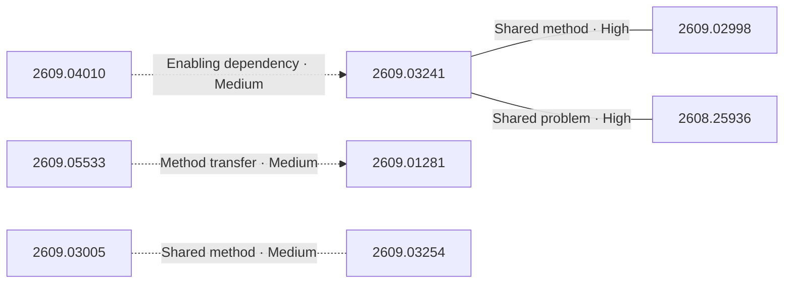
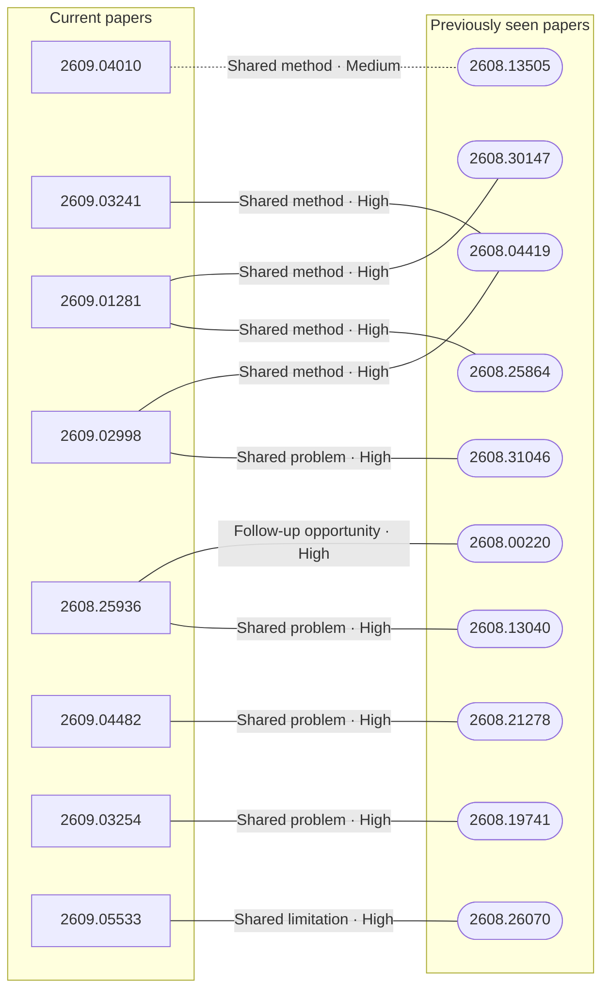

# Paper relationship graph — 2026-09-08

> [← Daily summary](../2026-09-08.md)

> **Interpretation caveat:** Every edge is an evidence-screened editorial hypothesis, not proof of citation, influence, priority, historical use, dependency, or an author-claimed relationship.

## Legend

- Rectangular nodes are current-day papers; rounded nodes are previously seen candidates.
- A line has no technical direction. An arrow shows only a proposed technical flow for an enabling dependency or method transfer.
- Solid edges are high confidence; dotted edges are medium confidence. Confidence evaluates this editorial connection, not either paper.
- Relationship labels:
  - **Shared problem:** `shared_problem`
  - **Shared method:** `shared_method`
  - **Shared evaluation:** `shared_evaluation`
  - **Complementary:** `complementary`
  - **Enabling dependency:** `enabling_dependency`
  - **Method transfer:** `method_transfer`
  - **Assumption tension:** `assumption_tension`
  - **Result tension:** `result_tension`
  - **Shared limitation:** `shared_limitation`
  - **Follow-up opportunity:** `follow_up_opportunity`

## Same-day relationships

| Source paper | Target paper | Relationship | Direction | Confidence |
| --- | --- | --- | --- | --- |
| [2609.03241](2609.03241.md) | [2609.02998](2609.02998.md) | Shared method | Not directional | High |
| [2608.25936](2608.25936.md) | [2609.03241](2609.03241.md) | Shared problem | Not directional | High |
| [2609.05533](2609.05533.md) | [2609.01281](2609.01281.md) | Method transfer | Source → target | Medium |
| [2609.03005](2609.03005.md) | [2609.03254](2609.03254.md) | Shared method | Not directional | Medium |
| [2609.04010](2609.04010.md) | [2609.03241](2609.03241.md) | Enabling dependency | Source → target | Medium |

## Connections to previously seen papers

| New paper | Previously seen paper | First seen by service | Relationship | Technical direction | Confidence |
| --- | --- | --- | --- | --- | --- |
| [2609.04010](2609.04010.md) | 2608.13505 ([Hugging Face](https://huggingface.co/papers/2608.13505) · [arXiv](https://arxiv.org/abs/2608.13505)) | 2026-08-14 | Shared method | Not directional | Medium |
| [2609.03241](2609.03241.md) | 2608.04419 ([Hugging Face](https://huggingface.co/papers/2608.04419) · [arXiv](https://arxiv.org/abs/2608.04419)) | 2026-08-11 | Shared method | Not directional | High |
| [2609.02998](2609.02998.md) | 2608.31046 ([Hugging Face](https://huggingface.co/papers/2608.31046) · [arXiv](https://arxiv.org/abs/2608.31046)) | 2026-09-01 | Shared problem | Not directional | High |
| [2609.02998](2609.02998.md) | 2608.04419 ([Hugging Face](https://huggingface.co/papers/2608.04419) · [arXiv](https://arxiv.org/abs/2608.04419)) | 2026-08-11 | Shared method | Not directional | High |
| [2608.25936](2608.25936.md) | 2608.13040 ([Hugging Face](https://huggingface.co/papers/2608.13040) · [arXiv](https://arxiv.org/abs/2608.13040)) | 2026-08-17 | Shared problem | Not directional | High |
| [2608.25936](2608.25936.md) | 2608.00220 ([Hugging Face](https://huggingface.co/papers/2608.00220) · [arXiv](https://arxiv.org/abs/2608.00220)) | 2026-08-17 | Follow-up opportunity | Not directional | High |
| [2609.01281](2609.01281.md) | 2608.25864 ([Hugging Face](https://huggingface.co/papers/2608.25864) · [arXiv](https://arxiv.org/abs/2608.25864)) | 2026-08-27 | Shared method | Not directional | High |
| [2609.01281](2609.01281.md) | 2608.30147 ([Hugging Face](https://huggingface.co/papers/2608.30147) · [arXiv](https://arxiv.org/abs/2608.30147)) | 2026-09-01 | Shared method | Not directional | High |
| [2609.04482](2609.04482.md) | 2608.21278 ([Hugging Face](https://huggingface.co/papers/2608.21278) · [arXiv](https://arxiv.org/abs/2608.21278)) | 2026-08-24 | Shared problem | Not directional | High |
| [2609.03254](2609.03254.md) | 2608.19741 ([Hugging Face](https://huggingface.co/papers/2608.19741) · [arXiv](https://arxiv.org/abs/2608.19741)) | 2026-08-25 | Shared problem | Not directional | High |
| [2609.05533](2609.05533.md) | 2608.26070 ([Hugging Face](https://huggingface.co/papers/2608.26070) · [arXiv](https://arxiv.org/abs/2608.26070)) | 2026-08-27 | Shared limitation | Not directional | High |

## Current paper key

| Paper | Analysis |
| --- | --- |
| 2609.04010 — Unlocking Lossless Speedups in LLMs via Discrete Diffusion | [Read analysis](2609.04010.md) |
| 2609.03241 — FlowBalance: Verifier-Grounded Self-Improvement from On-Policy Reasoning Experience | [Read analysis](2609.03241.md) |
| 2609.03756 — ENEAS: Embedding-guided Neural Ensemble for Adaptive Segmentation | [Read analysis](2609.03756.md) |
| 2609.03003 — Causal Foundation Models | [Read analysis](2609.03003.md) |
| 2609.01281 — EmbodiedSkills: A Unified Framework for Orchestrating, Training, and Deploying VLA Agents | [Read analysis](2609.01281.md) |
| 2609.02998 — Verify Before You Distill: Prompt-Level Teacher Gating for On-Policy Distillation | [Read analysis](2609.02998.md) |
| 2608.25936 — One Symptom, Three Levers: A Critical Review of On-Policy Self-Distillation | [Read analysis](2608.25936.md) |
| 2609.03005 — Unifying Conformal Language Tasks with In-Context Ensembles | [Read analysis](2609.03005.md) |
| 2609.04482 — Safety for Whom? Boundary-Aware Self-Distillation for Controlled LLM Safety Refusal | [Read analysis](2609.04482.md) |
| 2609.04382 — Privacy Failure in Split-LLM Training, The Returned Gradient Nullifies the Decoys | [Read analysis](2609.04382.md) |
| 2609.03254 — What Else Needs Fixing? Exploring Cost-Effective Test-Time Compute for Revision Propagation in Artifacts Generated Through Conversation | [Read analysis](2609.03254.md) |
| 2609.05533 — SimpleMemVLA: A Simple but Effective Native-Video Memory for Vision-Language-Action Models | [Read analysis](2609.05533.md) |

## Current papers without a published edge

- [2609.03756](2609.03756.md)
- [2609.03003](2609.03003.md)
- [2609.04382](2609.04382.md)

---

[Support these research summaries on Buy Me a Coffee](https://buymeacoffee.com/vollero)
