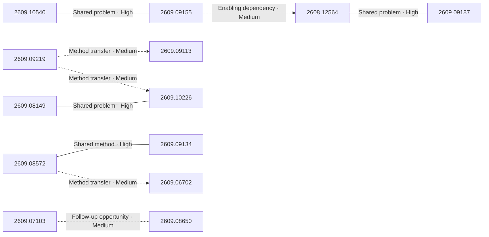

# Paper relationship graph — 2026-09-10

> [← Daily summary](../2026-09-10.md)

> **Interpretation caveat:** Every edge is an evidence-screened editorial hypothesis, not proof of citation, influence, priority, historical use, dependency, or an author-claimed relationship.

## Legend

- Rectangular nodes are current-day papers; rounded nodes are previously seen candidates.
- A line has no technical direction. An arrow shows only a proposed technical flow for an enabling dependency or method transfer.
- Solid edges are high confidence; dotted edges are medium confidence. Confidence evaluates this editorial connection, not either paper.
- Relationship labels:
  - **Shared problem:** `shared_problem`
  - **Shared method:** `shared_method`
  - **Shared evaluation:** `shared_evaluation`
  - **Complementary:** `complementary`
  - **Enabling dependency:** `enabling_dependency`
  - **Method transfer:** `method_transfer`
  - **Assumption tension:** `assumption_tension`
  - **Result tension:** `result_tension`
  - **Shared limitation:** `shared_limitation`
  - **Follow-up opportunity:** `follow_up_opportunity`

## Same-day relationships

| Source paper | Target paper | Relationship | Direction | Confidence |
| --- | --- | --- | --- | --- |
| [2608.12564](2608.12564.md) | [2609.09187](2609.09187.md) | Shared problem | Not directional | High |
| [2609.09155](2609.09155.md) | [2608.12564](2608.12564.md) | Enabling dependency | Source → target | Medium |
| [2609.10540](2609.10540.md) | [2609.09155](2609.09155.md) | Shared problem | Not directional | High |
| [2609.08572](2609.08572.md) | [2609.09134](2609.09134.md) | Shared method | Not directional | High |
| [2609.08572](2609.08572.md) | [2609.06702](2609.06702.md) | Method transfer | Source → target | Medium |
| [2609.08149](2609.08149.md) | [2609.10226](2609.10226.md) | Shared problem | Not directional | High |
| [2609.09219](2609.09219.md) | [2609.09113](2609.09113.md) | Method transfer | Source → target | Medium |
| [2609.09219](2609.09219.md) | [2609.10226](2609.10226.md) | Method transfer | Source → target | Medium |
| [2609.07103](2609.07103.md) | [2609.08650](2609.08650.md) | Follow-up opportunity | Not directional | Medium |

## Connections to previously seen papers

_The visual diagram is omitted because this graph is too large or dense for a readable snapshot; every edge remains in the table below._

| New paper | Previously seen paper | First seen by service | Relationship | Technical direction | Confidence |
| --- | --- | --- | --- | --- | --- |
| [2609.10540](2609.10540.md) | 2608.25927 ([Hugging Face](https://huggingface.co/papers/2608.25927) · [arXiv](https://arxiv.org/abs/2608.25927)) | 2026-08-27 | Shared method | Not directional | High |
| [2609.08572](2609.08572.md) | 2609.00621 ([Hugging Face](https://huggingface.co/papers/2609.00621) · [arXiv](https://arxiv.org/abs/2609.00621)) | 2026-09-02 | Method transfer | Previous → new | Medium |
| [2609.11042](2609.11042.md) | 2609.04094 ([Hugging Face](https://huggingface.co/papers/2609.04094) · [arXiv](https://arxiv.org/abs/2609.04094)) | 2026-09-04 | Shared problem | Not directional | High |
| [2609.08149](2609.08149.md) | 2608.09802 ([Hugging Face](https://huggingface.co/papers/2608.09802) · [arXiv](https://arxiv.org/abs/2608.09802)) | 2026-08-11 | Shared method | Not directional | High |
| [2609.09113](2609.09113.md) | 2608.09928 ([Hugging Face](https://huggingface.co/papers/2608.09928) · [arXiv](https://arxiv.org/abs/2608.09928)) | 2026-08-17 | Shared method | Not directional | High |
| [2609.09219](2609.09219.md) | 2608.13417 ([Hugging Face](https://huggingface.co/papers/2608.13417) · [arXiv](https://arxiv.org/abs/2608.13417)) | 2026-08-17 | Shared problem | Not directional | High |
| [2609.09134](2609.09134.md) | 2609.01437 ([Hugging Face](https://huggingface.co/papers/2609.01437) · [arXiv](https://arxiv.org/abs/2609.01437)) | 2026-09-03 | Shared problem | Not directional | High |
| [2609.10296](2609.10296.md) | 2608.25204 ([Hugging Face](https://huggingface.co/papers/2608.25204) · [arXiv](https://arxiv.org/abs/2608.25204)) | 2026-08-27 | Enabling dependency | Previous → new | Medium |
| [2609.07369](2609.07369.md) | 2608.14391 ([Hugging Face](https://huggingface.co/papers/2608.14391) · [arXiv](https://arxiv.org/abs/2608.14391)) | 2026-08-17 | Shared problem | Not directional | High |
| [2609.09187](2609.09187.md) | 2608.07565 ([Hugging Face](https://huggingface.co/papers/2608.07565) · [arXiv](https://arxiv.org/abs/2608.07565)) | 2026-08-11 | Shared method | Not directional | High |
| [2609.08650](2609.08650.md) | 2608.28476 ([Hugging Face](https://huggingface.co/papers/2608.28476) · [arXiv](https://arxiv.org/abs/2608.28476)) | 2026-08-31 | Shared method | Not directional | High |
| [2609.07103](2609.07103.md) | 2608.26070 ([Hugging Face](https://huggingface.co/papers/2608.26070) · [arXiv](https://arxiv.org/abs/2608.26070)) | 2026-08-27 | Complementary | Not directional | Medium |

## Current paper key

| Paper | Analysis |
| --- | --- |
| 2608.12564 — Scaling Automatic Research Agents via World Models | [Read analysis](2608.12564.md) |
| 2609.10522 — Show-Harness: Just a VLM Agent Can Play Robots | [Read analysis](2609.10522.md) |
| 2609.08572 — AgentGrad: Intervention-guided Prompt Optimization for Multi Agent Systems | [Read analysis](2609.08572.md) |
| 2609.10540 — Programmable World Model | [Read analysis](2609.10540.md) |
| 2609.11042 — T1: Terminal Agent Reinforcement Learning for Long-Horizon Tasks | [Read analysis](2609.11042.md) |
| 2609.05405 — WearableQA: A Benchmark for Health Reasoning over Real-World Wearable Data | [Read analysis](2609.05405.md) |
| 2609.08149 — SWE-Bench Pro Verified: A Reliable Benchmark for Software Engineering Agents | [Read analysis](2609.08149.md) |
| 2609.09113 — SAEScientist-Bench: Can AI Agents Conduct Autonomous SAE Interpretability Research? | [Read analysis](2609.09113.md) |
| 2609.09219 — Scores Alone Do Not Prove Discovery: The Discovery Certification Protocol for Auditing AI Research Agents | [Read analysis](2609.09219.md) |
| 2609.00369 — Puppeteer: Object-Grounded Posture-Aware Co-Speech Gesture Generation | [Read analysis](2609.00369.md) |
| 2609.09155 — SyncWorld: Visual Calibration Enables World Models as Zero-Shot Simulators | [Read analysis](2609.09155.md) |
| 2609.06702 — PARSER: Read in Parallel, Reason in Depth for Long-Context LLM Agents | [Read analysis](2609.06702.md) |
| 2609.10226 — Φ-Bench: Can Large Language Models Engineer the Infrastructure That Powers Them? | [Read analysis](2609.10226.md) |
| 2609.06703 — DianShi-RxnDB: A Large-Scale, Fine-Grained Organic Reaction Data Platform Built via a Fully Automated Pipeline for Researchers and AI Agents | [Read analysis](2609.06703.md) |
| 2609.07103 — Revisiting Complete Reasoning Traces for Post-Training | [Read analysis](2609.07103.md) |
| 2609.06806 — Train Smarter, Not Harder: Switching Signal-Guided Training in Active Learning | [Read analysis](2609.06806.md) |
| 2609.08126 — SchemeArena: Factorized Stress Testing of Scheming in LLM Agents | [Read analysis](2609.08126.md) |
| 2609.09187 — AgenticGen: Reward-Guided Agentic Video Generation for Advertising | [Read analysis](2609.09187.md) |
| 2609.09264 — StochBench: A Domain-Specific Benchmark for Stochastic Processes in Lean | [Read analysis](2609.09264.md) |
| 2609.06490 — OracleZoom: On-Policy Self-Distillation Inspired Reference-Constrained Recursive Image Super Resolution | [Read analysis](2609.06490.md) |
| 2609.10355 — Why Is Video Still So Expensive? A Survey of Inference-Efficiency Mechanisms in Video and Audiovisual LLMs | [Read analysis](2609.10355.md) |
| 2609.05779 — Diffs vs. Whole Files: An Empirical Comparison of Iterative Edit-Based and Direct Generation for Flutter/Dart Code Models | [Read analysis](2609.05779.md) |
| 2609.05463 — A Three-Layer Caching Architecture for Low-Latency LLM Web Search on Commodity CPU Hardware | [Read analysis](2609.05463.md) |
| 2609.09134 — Co-Evolving Harnesses and Models: On-Policy Correction Helps Weaker Models Catch Up Where Imitation Fails | [Read analysis](2609.09134.md) |
| 2609.09657 — RESCUE-BENCH: Towards Relation-Aware Multi-Party Emotional Support Conversation Systems | [Read analysis](2609.09657.md) |
| 2609.10296 — The Semantic Bottleneck: Leveraging Semantic Representations for Non-Invasive Speech Decoding | [Read analysis](2609.10296.md) |
| 2609.08650 — Difficulty-Adaptive Tree-Structured Policy Optimization for Expanding Reasoning Coverage in RLVR | [Read analysis](2609.08650.md) |
| 2609.07369 — DF26: We Cannot Tell Fake From Real Anymore | [Read analysis](2609.07369.md) |
| 2609.02771 — From Reweighting to Rewriting: Unlocking the Intervention Effects of Influential Samples in Training Data Attribution | [Read analysis](2609.02771.md) |
| 2609.10060 — Reference-Based Bias Detection in LLMs via Relative Representations of Hidden States | [Read analysis](2609.10060.md) |
| 2509.01809 — The Price of Sparsity: Sufficient Conditions for Sparse Recovery using Sparse and Sparsified Measurements | [Read analysis](2509.01809.md) |
| 2609.08965 — PlannerForge: LLM Agents for Scenario-Based Testing of Motion Planners in Autonomous Driving | [Read analysis](2609.08965.md) |

## Current papers without a published edge

- [2609.10522](2609.10522.md)
- [2609.05405](2609.05405.md)
- [2609.00369](2609.00369.md)
- [2609.06703](2609.06703.md)
- [2609.06806](2609.06806.md)
- [2609.08126](2609.08126.md)
- [2609.09264](2609.09264.md)
- [2609.06490](2609.06490.md)
- [2609.10355](2609.10355.md)
- [2609.05779](2609.05779.md)
- [2609.05463](2609.05463.md)
- [2609.09657](2609.09657.md)
- [2609.02771](2609.02771.md)
- [2609.10060](2609.10060.md)
- [2509.01809](2509.01809.md)
- [2609.08965](2609.08965.md)

---

[Support these research summaries on Buy Me a Coffee](https://buymeacoffee.com/vollero)
