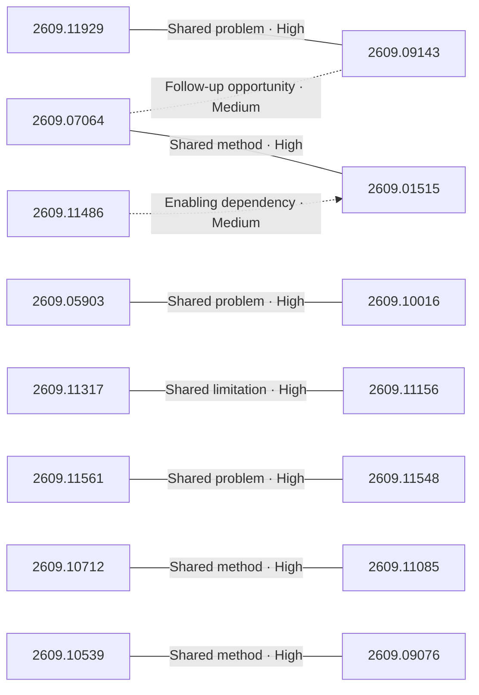

# Paper relationship graph — 2026-09-11

> [← Daily summary](../2026-09-11.md)

> **Interpretation caveat:** Every edge is an evidence-screened editorial hypothesis, not proof of citation, influence, priority, historical use, dependency, or an author-claimed relationship.

## Legend

- Rectangular nodes are current-day papers; rounded nodes are previously seen candidates.
- A line has no technical direction. An arrow shows only a proposed technical flow for an enabling dependency or method transfer.
- Solid edges are high confidence; dotted edges are medium confidence. Confidence evaluates this editorial connection, not either paper.
- Relationship labels:
  - **Shared problem:** `shared_problem`
  - **Shared method:** `shared_method`
  - **Shared evaluation:** `shared_evaluation`
  - **Complementary:** `complementary`
  - **Enabling dependency:** `enabling_dependency`
  - **Method transfer:** `method_transfer`
  - **Assumption tension:** `assumption_tension`
  - **Result tension:** `result_tension`
  - **Shared limitation:** `shared_limitation`
  - **Follow-up opportunity:** `follow_up_opportunity`

## Same-day relationships

| Source paper | Target paper | Relationship | Direction | Confidence |
| --- | --- | --- | --- | --- |
| [2609.11929](2609.11929.md) | [2609.09143](2609.09143.md) | Shared problem | Not directional | High |
| [2609.07064](2609.07064.md) | [2609.01515](2609.01515.md) | Shared method | Not directional | High |
| [2609.05903](2609.05903.md) | [2609.10016](2609.10016.md) | Shared problem | Not directional | High |
| [2609.11561](2609.11561.md) | [2609.11548](2609.11548.md) | Shared problem | Not directional | High |
| [2609.10712](2609.10712.md) | [2609.11085](2609.11085.md) | Shared method | Not directional | High |
| [2609.11317](2609.11317.md) | [2609.11156](2609.11156.md) | Shared limitation | Not directional | High |
| [2609.10539](2609.10539.md) | [2609.09076](2609.09076.md) | Shared method | Not directional | High |
| [2609.09143](2609.09143.md) | [2609.07064](2609.07064.md) | Follow-up opportunity | Not directional | Medium |
| [2609.11486](2609.11486.md) | [2609.01515](2609.01515.md) | Enabling dependency | Source → target | Medium |

## Connections to previously seen papers

_The visual diagram is omitted because this graph is too large or dense for a readable snapshot; every edge remains in the table below._

| New paper | Previously seen paper | First seen by service | Relationship | Technical direction | Confidence |
| --- | --- | --- | --- | --- | --- |
| [2609.10715](2609.10715.md) | 2608.19863 ([Hugging Face](https://huggingface.co/papers/2608.19863) · [arXiv](https://arxiv.org/abs/2608.19863)) | 2026-08-21 | Shared method | Not directional | High |
| [2609.11929](2609.11929.md) | 2609.01607 ([Hugging Face](https://huggingface.co/papers/2609.01607) · [arXiv](https://arxiv.org/abs/2609.01607)) | 2026-09-02 | Shared method | Not directional | High |
| [2609.11929](2609.11929.md) | 2608.26105 ([Hugging Face](https://huggingface.co/papers/2608.26105) · [arXiv](https://arxiv.org/abs/2608.26105)) | 2026-08-27 | Shared evaluation | Not directional | High |
| [2609.05903](2609.05903.md) | 2608.10538 ([Hugging Face](https://huggingface.co/papers/2608.10538) · [arXiv](https://arxiv.org/abs/2608.10538)) | 2026-08-14 | Shared method | Not directional | High |
| [2609.11561](2609.11561.md) | 2609.01281 ([Hugging Face](https://huggingface.co/papers/2609.01281) · [arXiv](https://arxiv.org/abs/2609.01281)) | 2026-09-08 | Follow-up opportunity | Not directional | Medium |
| [2609.11499](2609.11499.md) | 2608.27549 ([Hugging Face](https://huggingface.co/papers/2608.27549) · [arXiv](https://arxiv.org/abs/2608.27549)) | 2026-08-31 | Shared method | Not directional | High |
| [2608.27875](2608.27875.md) | 2608.17336 ([Hugging Face](https://huggingface.co/papers/2608.17336) · [arXiv](https://arxiv.org/abs/2608.17336)) | 2026-08-25 | Shared method | Not directional | High |
| [2609.06931](2609.06931.md) | 2608.21140 ([Hugging Face](https://huggingface.co/papers/2608.21140) · [arXiv](https://arxiv.org/abs/2608.21140)) | 2026-08-27 | Shared problem | Not directional | High |
| [2609.11808](2609.11808.md) | 2608.10636 ([Hugging Face](https://huggingface.co/papers/2608.10636) · [arXiv](https://arxiv.org/abs/2608.10636)) | 2026-08-12 | Shared problem | Not directional | High |
| [2609.10445](2609.10445.md) | 2608.17744 ([Hugging Face](https://huggingface.co/papers/2608.17744) · [arXiv](https://arxiv.org/abs/2608.17744)) | 2026-08-21 | Shared method | Not directional | High |
| [2609.09143](2609.09143.md) | 2608.29335 ([Hugging Face](https://huggingface.co/papers/2608.29335) · [arXiv](https://arxiv.org/abs/2608.29335)) | 2026-09-01 | Shared problem | Not directional | High |
| [2609.11548](2609.11548.md) | 2608.13546 ([Hugging Face](https://huggingface.co/papers/2608.13546) · [arXiv](https://arxiv.org/abs/2608.13546)) | 2026-08-14 | Shared method | Not directional | High |

## Current paper key

| Paper | Analysis |
| --- | --- |
| 2609.10715 — NCP-ArchPreview Technical Report: Moving towards Latent Space Language Models through Next Concept Prediction | [Read analysis](2609.10715.md) |
| 2609.11929 — SenseNova-U1.5: Towards Native Unified Visual Intelligence | [Read analysis](2609.11929.md) |
| 2609.07064 — SpatialBlock: Enhancing Spatial Intelligence in LVLMs via Synthetic Block-Stacking Problem | [Read analysis](2609.07064.md) |
| 2609.05903 — EvoSafeHarness: Evolving Model- and Domain-Specific Harnesses for Securing Agents | [Read analysis](2609.05903.md) |
| 2609.11317 — Mi-Ripple: Restoring Images Degraded by Iterative AI Editing | [Read analysis](2609.11317.md) |
| 2609.11412 — X-AuT: Progressive Audio-Encoder Compression for Speech LLMs with Cross-Scale Distillation | [Read analysis](2609.11412.md) |
| 2609.11561 — Memory as Plans: World-Action Modeling with Memory-Grounded Planning | [Read analysis](2609.11561.md) |
| 2609.11499 — Recursive Code World Models: Building Complex Worlds through Recursive Scene Programs | [Read analysis](2609.11499.md) |
| 2609.10712 — An Open Recipe for IMO Gold: Training Nemotron for Olympiad Mathematics | [Read analysis](2609.10712.md) |
| 2609.11486 — FreeFlow: A Bias-free Hierarchical Transformer for Optical Flow Estimation | [Read analysis](2609.11486.md) |
| 2609.11548 — World in World: Explore the World with World Models | [Read analysis](2609.11548.md) |
| 2609.01515 — TempCloze: Can Video-LLMs Identify the Missing Middle? | [Read analysis](2609.01515.md) |
| 2609.09143 — Studying Image Tokenizers as Visual Languages in Unified Multimodal Models | [Read analysis](2609.09143.md) |
| 2609.11156 — UniH^3: Unifying Hierarchical Homogeneity and Heterogeneity for All-in-One Medical Image Restoration | [Read analysis](2609.11156.md) |
| 2609.11699 — Negative Self-Distillation: Learning to Reason by Avoiding Flaws | [Read analysis](2609.11699.md) |
| 2609.10016 — MetroLLM-Bench: Evaluating Language Models as Transit Kiosk Runtimes | [Read analysis](2609.10016.md) |
| 2608.27875 — HyQuant: Hybrid-Precision Quantization for LLM Attention | [Read analysis](2608.27875.md) |
| 2609.06931 — CARDEA: Auditable Reasoning Grounded in Spatial Evidence for End-to-End Coronary Angiography Interpretation | [Read analysis](2609.06931.md) |
| 2609.11155 — DRG-MAPPO: Hierarchical Dynamic Role-Graph Multi-Agent Reinforcement Learning for Cooperative Air Combat | [Read analysis](2609.11155.md) |
| 2609.11808 — Generative Late-Interaction Embeddings For Visual Document Retrieval | [Read analysis](2609.11808.md) |
| 2609.10745 — Think Before You Link: Rarity, Reasoning, and Retrieval in Multilingual Entity Linking | [Read analysis](2609.10745.md) |
| 2609.10445 — Building Multilingual Bridges: Data Mixing as the Pillar of Generalization for In-Language Reasoning | [Read analysis](2609.10445.md) |
| 2609.11085 — Beyond Solver Verdicts: Generative Reward Models for Autoformalization | [Read analysis](2609.11085.md) |
| 2609.10539 — IdeaAMBIG: Benchmarking Implementation-Critical Gaps in Research-Idea Specifications | [Read analysis](2609.10539.md) |
| 2609.09076 — ActReview: Rebuttal-Guided Training Data and Rubric Rewards for Actionable Peer Review Generation | [Read analysis](2609.09076.md) |
| 2608.15380 — Adaptive Bridge: A Proxy-Based Decoupling Layer for Mitigating DDS Backpressure in ROS 2 | [Read analysis](2608.15380.md) |

## Current papers without a published edge

- [2609.11412](2609.11412.md)
- [2609.11699](2609.11699.md)
- [2609.11155](2609.11155.md)
- [2609.10745](2609.10745.md)
- [2608.15380](2608.15380.md)

---

[Support these research summaries on Buy Me a Coffee](https://buymeacoffee.com/vollero)
