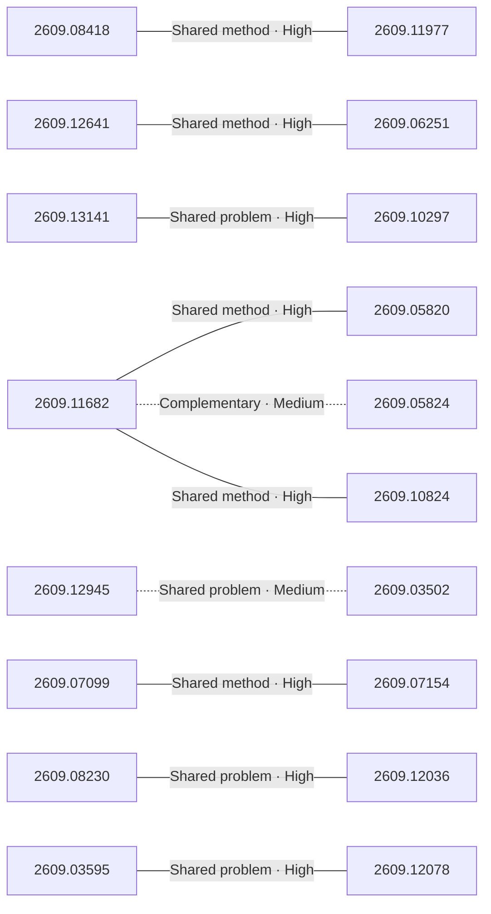

# Paper relationship graph — 2026-09-14

> [← Daily summary](../2026-09-14.md)

> **Interpretation caveat:** Every edge is an evidence-screened editorial hypothesis, not proof of citation, influence, priority, historical use, dependency, or an author-claimed relationship.

## Legend

- Rectangular nodes are current-day papers; rounded nodes are previously seen candidates.
- A line has no technical direction. An arrow shows only a proposed technical flow for an enabling dependency or method transfer.
- Solid edges are high confidence; dotted edges are medium confidence. Confidence evaluates this editorial connection, not either paper.
- Relationship labels:
  - **Shared problem:** `shared_problem`
  - **Shared method:** `shared_method`
  - **Shared evaluation:** `shared_evaluation`
  - **Complementary:** `complementary`
  - **Enabling dependency:** `enabling_dependency`
  - **Method transfer:** `method_transfer`
  - **Assumption tension:** `assumption_tension`
  - **Result tension:** `result_tension`
  - **Shared limitation:** `shared_limitation`
  - **Follow-up opportunity:** `follow_up_opportunity`

## Same-day relationships

| Source paper | Target paper | Relationship | Direction | Confidence |
| --- | --- | --- | --- | --- |
| [2609.08418](2609.08418.md) | [2609.11977](2609.11977.md) | Shared method | Not directional | High |
| [2609.11682](2609.11682.md) | [2609.05820](2609.05820.md) | Shared method | Not directional | High |
| [2609.11682](2609.11682.md) | [2609.05824](2609.05824.md) | Complementary | Not directional | Medium |
| [2609.11682](2609.11682.md) | [2609.10824](2609.10824.md) | Shared method | Not directional | High |
| [2609.13141](2609.13141.md) | [2609.10297](2609.10297.md) | Shared problem | Not directional | High |
| [2609.07099](2609.07099.md) | [2609.07154](2609.07154.md) | Shared method | Not directional | High |
| [2609.08230](2609.08230.md) | [2609.12036](2609.12036.md) | Shared problem | Not directional | High |
| [2609.12641](2609.12641.md) | [2609.06251](2609.06251.md) | Shared method | Not directional | High |
| [2609.03595](2609.03595.md) | [2609.12078](2609.12078.md) | Shared problem | Not directional | High |
| [2609.12945](2609.12945.md) | [2609.03502](2609.03502.md) | Shared problem | Not directional | Medium |

## Connections to previously seen papers

_The visual diagram is omitted because this graph is too large or dense for a readable snapshot; every edge remains in the table below._

| New paper | Previously seen paper | First seen by service | Relationship | Technical direction | Confidence |
| --- | --- | --- | --- | --- | --- |
| [2609.08418](2609.08418.md) | 2608.23181 ([Hugging Face](https://huggingface.co/papers/2608.23181) · [arXiv](https://arxiv.org/abs/2608.23181)) | 2026-08-26 | Shared method | Not directional | High |
| [2609.11682](2609.11682.md) | 2608.27454 ([Hugging Face](https://huggingface.co/papers/2608.27454) · [arXiv](https://arxiv.org/abs/2608.27454)) | 2026-08-28 | Shared method | Not directional | High |
| [2609.05824](2609.05824.md) | 2608.25500 ([Hugging Face](https://huggingface.co/papers/2608.25500) · [arXiv](https://arxiv.org/abs/2608.25500)) | 2026-08-28 | Shared problem | Not directional | High |
| [2609.11977](2609.11977.md) | 2608.23283 ([Hugging Face](https://huggingface.co/papers/2608.23283) · [arXiv](https://arxiv.org/abs/2608.23283)) | 2026-08-25 | Shared method | Not directional | High |
| [2609.12641](2609.12641.md) | 2608.24882 ([Hugging Face](https://huggingface.co/papers/2608.24882) · [arXiv](https://arxiv.org/abs/2608.24882)) | 2026-08-26 | Shared evaluation | Not directional | High |
| [2609.12945](2609.12945.md) | 2609.08936 ([Hugging Face](https://huggingface.co/papers/2609.08936) · [arXiv](https://arxiv.org/abs/2609.08936)) | 2026-09-09 | Shared evaluation | Not directional | High |
| [2609.07154](2609.07154.md) | 2609.03820 ([Hugging Face](https://huggingface.co/papers/2609.03820) · [arXiv](https://arxiv.org/abs/2609.03820)) | 2026-09-04 | Follow-up opportunity | Not directional | Medium |
| [2609.10297](2609.10297.md) | 2609.04971 ([Hugging Face](https://huggingface.co/papers/2609.04971) · [arXiv](https://arxiv.org/abs/2609.04971)) | 2026-09-09 | Shared problem | Not directional | High |
| [2609.12036](2609.12036.md) | 2608.18077 ([Hugging Face](https://huggingface.co/papers/2608.18077) · [arXiv](https://arxiv.org/abs/2608.18077)) | 2026-08-24 | Shared method | Not directional | High |
| [2609.06251](2609.06251.md) | 2608.30935 ([Hugging Face](https://huggingface.co/papers/2608.30935) · [arXiv](https://arxiv.org/abs/2608.30935)) | 2026-09-01 | Shared problem | Not directional | High |
| [2609.10824](2609.10824.md) | 2608.13417 ([Hugging Face](https://huggingface.co/papers/2608.13417) · [arXiv](https://arxiv.org/abs/2608.13417)) | 2026-08-17 | Method transfer | Previous → new | Medium |
| [2609.08365](2609.08365.md) | 2608.15698 ([Hugging Face](https://huggingface.co/papers/2608.15698) · [arXiv](https://arxiv.org/abs/2608.15698)) | 2026-08-18 | Shared method | Not directional | High |

## Current paper key

| Paper | Analysis |
| --- | --- |
| 2609.11115 — Benchmark Radar: A Living Database and Search Engine for AI Benchmarks and Evaluation | [Read analysis](2609.11115.md) |
| 2609.06107 — DataFlex-RL: An Evaluation Platform for RLVR Data Policies | [Read analysis](2609.06107.md) |
| 2609.08418 — Feyospace-v1: How the Cyber Mercury Seven Trained Frontier Cyber Models | [Read analysis](2609.08418.md) |
| 2609.12641 — Breaking the Vision-Action Shortcut: Latent Interface Training for Generalizable Robotics Foundation Models | [Read analysis](2609.12641.md) |
| 2609.13141 — SAS: Simple Attention Sparsification via End-to-End Optimization of Context Ranking | [Read analysis](2609.13141.md) |
| 2609.11682 — COBRA-Skills: Contextual Bandit-Guided Evolution for Agent Skill Optimization | [Read analysis](2609.11682.md) |
| 2609.10895 — ReactHuman: A Physics-Grounded Benchmark for Human-Like Reactive Decision-Making in Embodied Multimodal LLMs | [Read analysis](2609.10895.md) |
| 2609.12945 — StepAudio 3 Gen Technical Report | [Read analysis](2609.12945.md) |
| 2609.11977 — Occamy-1.0: Open Pareto-frontier 35B Intelligence for Co-work | [Read analysis](2609.11977.md) |
| 2608.30597 — PLC-DPO: Posterior Label Correction in Noisy and Ambiguous Preference Optimization | [Read analysis](2608.30597.md) |
| 2609.05824 — Beyond Top-k Skill Retrieval: Diversity-Aware Skill Routing for LLM Agents | [Read analysis](2609.05824.md) |
| 2609.05820 — Online Learning with LLM Experts from Limited Feedback | [Read analysis](2609.05820.md) |
| 2609.13146 — SNAP3D: Physically Grounded 3D Parts for Assembly from a Single Image | [Read analysis](2609.13146.md) |
| 2609.07099 — Ambient @ EgoProactive 2026 : Proactive Egocentric Assistance with Visually Grounded Supervision | [Read analysis](2609.07099.md) |
| 2609.07154 — Ambient @ EgoLongQA 2026: Distilling Long-Video perception into a Sub-2B Model | [Read analysis](2609.07154.md) |
| 2609.10824 — Studying Without a Syllabus: Task-Agnostic Environment Preprocessing | [Read analysis](2609.10824.md) |
| 2609.08230 — ActionSplice: In-Flight Action Editing for Interactive World Models | [Read analysis](2609.08230.md) |
| 2609.12101 — Competence-Gated Pooling of Language Models and Priors for Event Forecasting | [Read analysis](2609.12101.md) |
| 2609.10297 — TRACE: Trajectory-robust Admission with Evidence Ordering for Efficient GUI Agents | [Read analysis](2609.10297.md) |
| 2609.03595 — How Far Can Synthetic Data Take Thai OCR? | [Read analysis](2609.03595.md) |
| 2609.12078 — Feature Recovery for Object Understanding After Irreversible Fire Damage | [Read analysis](2609.12078.md) |
| 2609.12036 — Pelican-Sim 1.0: A General World Model Simulator for Embodied Intelligence | [Read analysis](2609.12036.md) |
| 2609.10728 — Towards a Deterministic Math Solver for Clinical Language Models | [Read analysis](2609.10728.md) |
| 2609.08365 — ReMoMask-2: Latent Retrieval-Augmented Masked Motion Generation | [Read analysis](2609.08365.md) |
| 2609.03502 — Building and Evaluating Fixed-Voice Thai TTS from Synthetic Speech | [Read analysis](2609.03502.md) |
| 2609.06251 — MobileVLA-R1 2.0: RL-Enhanced Reasoning for Mobile Robot Control | [Read analysis](2609.06251.md) |

## Current papers without a published edge

- [2609.11115](2609.11115.md)
- [2609.06107](2609.06107.md)
- [2609.10895](2609.10895.md)
- [2608.30597](2608.30597.md)
- [2609.13146](2609.13146.md)
- [2609.12101](2609.12101.md)
- [2609.10728](2609.10728.md)

---

[Support these research summaries on Buy Me a Coffee](https://buymeacoffee.com/vollero)
