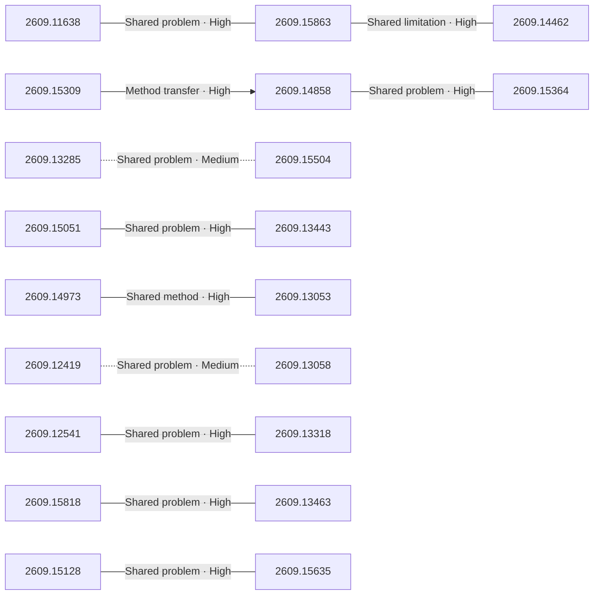

# Paper relationship graph — 2026-09-15

> [← Daily summary](../2026-09-15.md)

> **Interpretation caveat:** Every edge is an evidence-screened editorial hypothesis, not proof of citation, influence, priority, historical use, dependency, or an author-claimed relationship.

## Legend

- Rectangular nodes are current-day papers; rounded nodes are previously seen candidates.
- A line has no technical direction. An arrow shows only a proposed technical flow for an enabling dependency or method transfer.
- Solid edges are high confidence; dotted edges are medium confidence. Confidence evaluates this editorial connection, not either paper.
- Relationship labels:
  - **Shared problem:** `shared_problem`
  - **Shared method:** `shared_method`
  - **Shared evaluation:** `shared_evaluation`
  - **Complementary:** `complementary`
  - **Enabling dependency:** `enabling_dependency`
  - **Method transfer:** `method_transfer`
  - **Assumption tension:** `assumption_tension`
  - **Result tension:** `result_tension`
  - **Shared limitation:** `shared_limitation`
  - **Follow-up opportunity:** `follow_up_opportunity`

## Same-day relationships

| Source paper | Target paper | Relationship | Direction | Confidence |
| --- | --- | --- | --- | --- |
| [2609.11638](2609.11638.md) | [2609.15863](2609.15863.md) | Shared problem | Not directional | High |
| [2609.15863](2609.15863.md) | [2609.14462](2609.14462.md) | Shared limitation | Not directional | High |
| [2609.14858](2609.14858.md) | [2609.15364](2609.15364.md) | Shared problem | Not directional | High |
| [2609.15309](2609.15309.md) | [2609.14858](2609.14858.md) | Method transfer | Source → target | High |
| [2609.15818](2609.15818.md) | [2609.13463](2609.13463.md) | Shared problem | Not directional | High |
| [2609.14973](2609.14973.md) | [2609.13053](2609.13053.md) | Shared method | Not directional | High |
| [2609.12541](2609.12541.md) | [2609.13318](2609.13318.md) | Shared problem | Not directional | High |
| [2609.13285](2609.13285.md) | [2609.15504](2609.15504.md) | Shared problem | Not directional | Medium |
| [2609.15051](2609.15051.md) | [2609.13443](2609.13443.md) | Shared problem | Not directional | High |
| [2609.12419](2609.12419.md) | [2609.13058](2609.13058.md) | Shared problem | Not directional | Medium |
| [2609.15128](2609.15128.md) | [2609.15635](2609.15635.md) | Shared problem | Not directional | High |

## Connections to previously seen papers

_The visual diagram is omitted because this graph is too large or dense for a readable snapshot; every edge remains in the table below._

| New paper | Previously seen paper | First seen by service | Relationship | Technical direction | Confidence |
| --- | --- | --- | --- | --- | --- |
| [2609.11638](2609.11638.md) | 2608.23383 ([Hugging Face](https://huggingface.co/papers/2608.23383) · [arXiv](https://arxiv.org/abs/2608.23383)) | 2026-08-27 | Shared method | Not directional | High |
| [2609.14858](2609.14858.md) | 2608.08466 ([Hugging Face](https://huggingface.co/papers/2608.08466) · [arXiv](https://arxiv.org/abs/2608.08466)) | 2026-08-21 | Shared method | Not directional | High |
| [2609.15364](2609.15364.md) | 2607.21596 ([Hugging Face](https://huggingface.co/papers/2607.21596) · [arXiv](https://arxiv.org/abs/2607.21596)) | 2026-08-21 | Shared method | Not directional | High |
| [2609.15504](2609.15504.md) | 2609.04010 ([Hugging Face](https://huggingface.co/papers/2609.04010) · [arXiv](https://arxiv.org/abs/2609.04010)) | 2026-09-08 | Follow-up opportunity | Not directional | Medium |
| [2609.15973](2609.15973.md) | 2608.11341 ([Hugging Face](https://huggingface.co/papers/2608.11341) · [arXiv](https://arxiv.org/abs/2608.11341)) | 2026-08-17 | Shared problem | Not directional | High |
| [2609.15478](2609.15478.md) | 2609.11499 ([Hugging Face](https://huggingface.co/papers/2609.11499) · [arXiv](https://arxiv.org/abs/2609.11499)) | 2026-09-11 | Shared method | Not directional | High |
| [2609.12419](2609.12419.md) | 2608.20492 ([Hugging Face](https://huggingface.co/papers/2608.20492) · [arXiv](https://arxiv.org/abs/2608.20492)) | 2026-08-26 | Shared method | Not directional | High |
| [2609.13443](2609.13443.md) | 2608.00220 ([Hugging Face](https://huggingface.co/papers/2608.00220) · [arXiv](https://arxiv.org/abs/2608.00220)) | 2026-08-17 | Shared problem | Not directional | High |
| [2609.13053](2609.13053.md) | 2609.05588 ([Hugging Face](https://huggingface.co/papers/2609.05588) · [arXiv](https://arxiv.org/abs/2609.05588)) | 2026-09-09 | Shared problem | Not directional | High |
| [2609.13058](2609.13058.md) | 2608.27351 ([Hugging Face](https://huggingface.co/papers/2608.27351) · [arXiv](https://arxiv.org/abs/2608.27351)) | 2026-08-28 | Shared problem | Not directional | High |
| [2609.13463](2609.13463.md) | 2608.15242 ([Hugging Face](https://huggingface.co/papers/2608.15242) · [arXiv](https://arxiv.org/abs/2608.15242)) | 2026-08-25 | Shared problem | Not directional | High |
| [2609.14708](2609.14708.md) | 2609.07821 ([Hugging Face](https://huggingface.co/papers/2609.07821) · [arXiv](https://arxiv.org/abs/2609.07821)) | 2026-09-09 | Shared problem | Not directional | High |

## Current paper key

| Paper | Analysis |
| --- | --- |
| 2609.11638 — Vidu S2: Real-Time Interactive, Editable, and Spatial Video Generation | [Read analysis](2609.11638.md) |
| 2609.15818 — Atria Dawn: The Dawn of Agentic Superintelligence | [Read analysis](2609.15818.md) |
| 2609.13356 — ZGCM-1: A Fully Open and Extremely Efficient Foundation Model for Math and Agentic Search | [Read analysis](2609.13356.md) |
| 2609.14858 — Dream-RSI: Recursive Self-Improvement through Evolving Worlds | [Read analysis](2609.14858.md) |
| 2609.14973 — PhysBrain 1.5: From Vision-Language Models to Physical Foundation Models | [Read analysis](2609.14973.md) |
| 2609.15364 — RSIAgent: Autonomous Exploration for Recursive Self-improvement in New Environments | [Read analysis](2609.15364.md) |
| 2609.13285 — Grouped Value Attention: Efficient KV Caching via On-Demand Key Reconstruction | [Read analysis](2609.13285.md) |
| 2609.15863 — LynnReal-Omni: Native multi-modal Video Generation for Agentic Visual Workflows | [Read analysis](2609.15863.md) |
| 2609.15504 — How Lossless Is Lossless Speculative Decoding? The Role of Numerical Precision in Orthrus | [Read analysis](2609.15504.md) |
| 2609.15973 — Discovery Foundation Models: Toward Open-Ended Discovery Intelligence | [Read analysis](2609.15973.md) |
| 2609.15478 — BVB: Benchmarking Agentic Video Understanding via Programmatic Reconstruction in Blender | [Read analysis](2609.15478.md) |
| 2609.14462 — AlayaVista: Streaming World Modeling from Panoramic States to Perspective Video | [Read analysis](2609.14462.md) |
| 2609.15128 — Omni-Streaming Thinking | [Read analysis](2609.15128.md) |
| 2609.15659 — Kaininja: Extending Native 3D Generators to the Part Level | [Read analysis](2609.15659.md) |
| 2609.15134 — HazardAuditor: From Executable Threats to Safer Computer-Use Agents | [Read analysis](2609.15134.md) |
| 2609.13287 — LLaDA-UI: Bringing Block-wise Diffusion to Vision-Language GUI Agents | [Read analysis](2609.13287.md) |
| 2609.15309 — When Agents Slow Down: Understanding LLM Agents' Test-Time Strategies via Elo-per-token Analysis | [Read analysis](2609.15309.md) |
| 2609.12541 — Agent as Policy for Robotic Manipulation | [Read analysis](2609.12541.md) |
| 2609.15051 — Not All Prompts Are Equal: Exploration-Guided Prompt Scaffolding for Multimodal Reinforcement Post-Training | [Read analysis](2609.15051.md) |
| 2609.15029 — Pick Your Poison: Learning to Select Poison Sets for Stronger LLM Backdoor Attacks | [Read analysis](2609.15029.md) |
| 2609.12419 — MInTRL: Off-policy Intervention can boost On-policy RL | [Read analysis](2609.12419.md) |
| 2609.13443 — Learning to Solve Hard Problems in RL for LLMs by Never Giving Up | [Read analysis](2609.13443.md) |
| 2609.13053 — Dynin-Robotics: Omnimodal Unified Diffusion Vision-Language-Action Model | [Read analysis](2609.13053.md) |
| 2609.13058 — Expert-Space Exploration in MoE Reinforcement Learning | [Read analysis](2609.13058.md) |
| 2609.13318 — Attention-DP3: Spatially Object-aware 3D Diffusion Policy via Geometry-aligned Attentional Conditioning | [Read analysis](2609.13318.md) |
| 2609.15078 — Enabling Creative Exploration for Vibe Design Agents | [Read analysis](2609.15078.md) |
| 2609.13463 — Root-Cause Attribution Is a Search Problem: Continual Search for Long-Horizon Agent Failures | [Read analysis](2609.13463.md) |
| 2609.13498 — Building a Production Greek-English Speech Recognizer | [Read analysis](2609.13498.md) |
| 2609.13948 — Thought without systematicity? Evaluating reasoning models on rule induction tasks | [Read analysis](2609.13948.md) |
| 2609.01430 — Learning Sparse Decision Trees via Transformer Variational Auto-Encoders | [Read analysis](2609.01430.md) |
| 2609.15635 — ModaLens: Measuring Image Sensitivity in Report-Conditioned Medical VLMs | [Read analysis](2609.15635.md) |
| 2609.14302 — E2A-Bench: Benchmarking Evidence-to-Action Reliability in Financial Chart Reasoning | [Read analysis](2609.14302.md) |
| 2609.14708 — Lightning Weave: Improving the Accuracy-Efficiency Frontier of Reasoning Models through Capability Composition | [Read analysis](2609.14708.md) |

## Current papers without a published edge

- [2609.13356](2609.13356.md)
- [2609.15659](2609.15659.md)
- [2609.15134](2609.15134.md)
- [2609.13287](2609.13287.md)
- [2609.15029](2609.15029.md)
- [2609.15078](2609.15078.md)
- [2609.13498](2609.13498.md)
- [2609.13948](2609.13948.md)
- [2609.01430](2609.01430.md)
- [2609.14302](2609.14302.md)

---

[Support these research summaries on Buy Me a Coffee](https://buymeacoffee.com/vollero)
