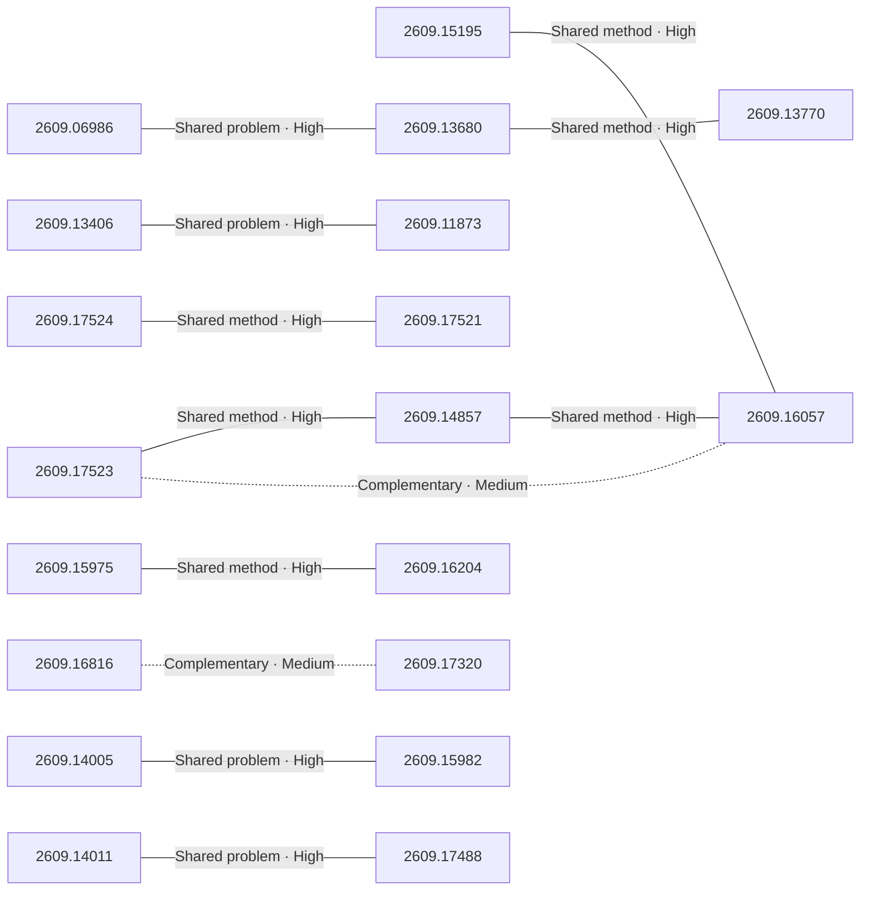

# Paper relationship graph — 2026-09-16

> [← Daily summary](../2026-09-16.md)

> **Interpretation caveat:** Every edge is an evidence-screened editorial hypothesis, not proof of citation, influence, priority, historical use, dependency, or an author-claimed relationship.

## Legend

- Rectangular nodes are current-day papers; rounded nodes are previously seen candidates.
- A line has no technical direction. An arrow shows only a proposed technical flow for an enabling dependency or method transfer.
- Solid edges are high confidence; dotted edges are medium confidence. Confidence evaluates this editorial connection, not either paper.
- Relationship labels:
  - **Shared problem:** `shared_problem`
  - **Shared method:** `shared_method`
  - **Shared evaluation:** `shared_evaluation`
  - **Complementary:** `complementary`
  - **Enabling dependency:** `enabling_dependency`
  - **Method transfer:** `method_transfer`
  - **Assumption tension:** `assumption_tension`
  - **Result tension:** `result_tension`
  - **Shared limitation:** `shared_limitation`
  - **Follow-up opportunity:** `follow_up_opportunity`

## Same-day relationships

| Source paper | Target paper | Relationship | Direction | Confidence |
| --- | --- | --- | --- | --- |
| [2609.06986](2609.06986.md) | [2609.13680](2609.13680.md) | Shared problem | Not directional | High |
| [2609.13680](2609.13680.md) | [2609.13770](2609.13770.md) | Shared method | Not directional | High |
| [2609.13406](2609.13406.md) | [2609.11873](2609.11873.md) | Shared problem | Not directional | High |
| [2609.17523](2609.17523.md) | [2609.14857](2609.14857.md) | Shared method | Not directional | High |
| [2609.14857](2609.14857.md) | [2609.16057](2609.16057.md) | Shared method | Not directional | High |
| [2609.17523](2609.17523.md) | [2609.16057](2609.16057.md) | Complementary | Not directional | Medium |
| [2609.17524](2609.17524.md) | [2609.17521](2609.17521.md) | Shared method | Not directional | High |
| [2609.15975](2609.15975.md) | [2609.16204](2609.16204.md) | Shared method | Not directional | High |
| [2609.16816](2609.16816.md) | [2609.17320](2609.17320.md) | Complementary | Not directional | Medium |
| [2609.14011](2609.14011.md) | [2609.17488](2609.17488.md) | Shared problem | Not directional | High |
| [2609.14005](2609.14005.md) | [2609.15982](2609.15982.md) | Shared problem | Not directional | High |
| [2609.15195](2609.15195.md) | [2609.16057](2609.16057.md) | Shared method | Not directional | High |

## Connections to previously seen papers

_The visual diagram is omitted because this graph is too large or dense for a readable snapshot; every edge remains in the table below._

| New paper | Previously seen paper | First seen by service | Relationship | Technical direction | Confidence |
| --- | --- | --- | --- | --- | --- |
| [2609.14005](2609.14005.md) | 2609.08977 ([Hugging Face](https://huggingface.co/papers/2609.08977) · [arXiv](https://arxiv.org/abs/2609.08977)) | 2026-09-09 | Shared problem | Not directional | High |
| [2609.17523](2609.17523.md) | 2609.00196 ([Hugging Face](https://huggingface.co/papers/2609.00196) · [arXiv](https://arxiv.org/abs/2609.00196)) | 2026-09-03 | Shared method | Not directional | High |
| [2609.14857](2609.14857.md) | 2608.08466 ([Hugging Face](https://huggingface.co/papers/2608.08466) · [arXiv](https://arxiv.org/abs/2608.08466)) | 2026-08-21 | Shared method | Not directional | High |
| [2609.15195](2609.15195.md) | 2608.30396 ([Hugging Face](https://huggingface.co/papers/2608.30396) · [arXiv](https://arxiv.org/abs/2608.30396)) | 2026-09-01 | Shared method | Not directional | High |
| [2609.15195](2609.15195.md) | 2608.30935 ([Hugging Face](https://huggingface.co/papers/2608.30935) · [arXiv](https://arxiv.org/abs/2608.30935)) | 2026-09-01 | Shared evaluation | Not directional | High |
| [2609.17524](2609.17524.md) | 2609.07398 ([Hugging Face](https://huggingface.co/papers/2609.07398) · [arXiv](https://arxiv.org/abs/2609.07398)) | 2026-09-09 | Shared problem | Not directional | High |
| [2609.17524](2609.17524.md) | 2609.12036 ([Hugging Face](https://huggingface.co/papers/2609.12036) · [arXiv](https://arxiv.org/abs/2609.12036)) | 2026-09-14 | Shared method | Not directional | High |
| [2609.17521](2609.17521.md) | 2608.19556 ([Hugging Face](https://huggingface.co/papers/2608.19556) · [arXiv](https://arxiv.org/abs/2608.19556)) | 2026-08-27 | Shared limitation | Not directional | High |
| [2609.15982](2609.15982.md) | 2609.05824 ([Hugging Face](https://huggingface.co/papers/2609.05824) · [arXiv](https://arxiv.org/abs/2609.05824)) | 2026-09-14 | Shared problem | Not directional | High |
| [2609.15982](2609.15982.md) | 2608.25500 ([Hugging Face](https://huggingface.co/papers/2608.25500) · [arXiv](https://arxiv.org/abs/2608.25500)) | 2026-08-28 | Shared problem | Not directional | High |
| [2609.16816](2609.16816.md) | 2608.31076 ([Hugging Face](https://huggingface.co/papers/2608.31076) · [arXiv](https://arxiv.org/abs/2608.31076)) | 2026-09-01 | Method transfer | New → previous | High |
| [2609.16204](2609.16204.md) | 2608.25697 ([Hugging Face](https://huggingface.co/papers/2608.25697) · [arXiv](https://arxiv.org/abs/2608.25697)) | 2026-08-31 | Complementary | Not directional | High |

## Current paper key

| Paper | Analysis |
| --- | --- |
| 2609.06986 — Continual Learning Mechanisms Compose for Long-Horizon Memorization | [Read analysis](2609.06986.md) |
| 2609.16679 — AI for Games in the Foundation Model Era | [Read analysis](2609.16679.md) |
| 2609.14005 — StepAudio 3 Realtime Technical Report | [Read analysis](2609.14005.md) |
| 2609.16034 — StepAudio 3 Music Technical Report | [Read analysis](2609.16034.md) |
| 2609.13406 — Generalized Agent Iteration: One Formal Framework for Iterative Policy Improvement and Recursive Self-Improvement | [Read analysis](2609.13406.md) |
| 2609.17523 — ScienceBuddy: Recursive-in-Recursive Self-Improvement for Interactive Scientific Agents | [Read analysis](2609.17523.md) |
| 2609.15195 — HarnessVLN: Unifying Training-Free Embodied Navigation through an Agent Harness | [Read analysis](2609.15195.md) |
| 2609.16591 — FLAT: Resampling Image and Text into 1D Flexible-Length Aligned Transmodal Tokens for Retrieval and Generation | [Read analysis](2609.16591.md) |
| 2609.11873 — The Last AI Built by Humans: Toward Genuine Recursive Self-Improvement | [Read analysis](2609.11873.md) |
| 2609.14803 — Another Blueprint In The Wall: How to Ask Frontier AI Like a Kid? | [Read analysis](2609.14803.md) |
| 2609.14857 — ModularRSI: Modular and Generalizable Recursive Harness Self-Improvement | [Read analysis](2609.14857.md) |
| 2609.17524 — Modality-Autoregressive World-Action Models | [Read analysis](2609.17524.md) |
| 2609.15972 — Mind2Dialogue: Training Human-Aware Language Models by Simulating User Mental States | [Read analysis](2609.15972.md) |
| 2609.15975 — Disentangling Representation Evolution in Transformers through Directional Decomposition | [Read analysis](2609.15975.md) |
| 2609.16372 — Register Tokens for Bounded-State Reasoning in Diffusion Language Models | [Read analysis](2609.16372.md) |
| 2609.14011 — Convergent Emergence of In-Context Learning Across Modalities | [Read analysis](2609.14011.md) |
| 2609.17521 — PhysStream: Streaming Physics-Grounded Video Generation with Structured Scene Memory and Fine-Grained Motion Control | [Read analysis](2609.17521.md) |
| 2609.12552 — RelateAnything: Real-Time Open-Vocabulary Relation Prediction From Any Inputs | [Read analysis](2609.12552.md) |
| 2609.16057 — OmniHarness: Harnessing Generalizable Visual Generation via Symbolic Policy Learning | [Read analysis](2609.16057.md) |
| 2609.16816 — ImpossibleRubrics: Stress-Testing Generated Rubrics as Reward Signals | [Read analysis](2609.16816.md) |
| 2609.16204 — Decoy Direction Optimization: A Post-Hoc Defense Against LLM Abliteration | [Read analysis](2609.16204.md) |
| 2609.17320 — Emergence World: Adversarial Stress-Testing of Long-Horizon Multi-Agent Systems | [Read analysis](2609.17320.md) |
| 2609.13680 — Drift-Constrained Optimization: Only Direction Matters in Fine-Tuning Instruct Models | [Read analysis](2609.13680.md) |
| 2609.13770 — Training Specialist Models without Reasoning Trajectories for Domain Expert Distillation | [Read analysis](2609.13770.md) |
| 2609.15982 — The Router Within: Eliciting Native Skill Routing from a Frozen LLM | [Read analysis](2609.15982.md) |
| 2609.17488 — LimiX-2: A Contextual Mechanism Network Towards General Structured-Data Intelligence | [Read analysis](2609.17488.md) |

## Current papers without a published edge

- [2609.16679](2609.16679.md)
- [2609.16034](2609.16034.md)
- [2609.16591](2609.16591.md)
- [2609.14803](2609.14803.md)
- [2609.15972](2609.15972.md)
- [2609.16372](2609.16372.md)
- [2609.12552](2609.12552.md)

---

[Support these research summaries on Buy Me a Coffee](https://buymeacoffee.com/vollero)
