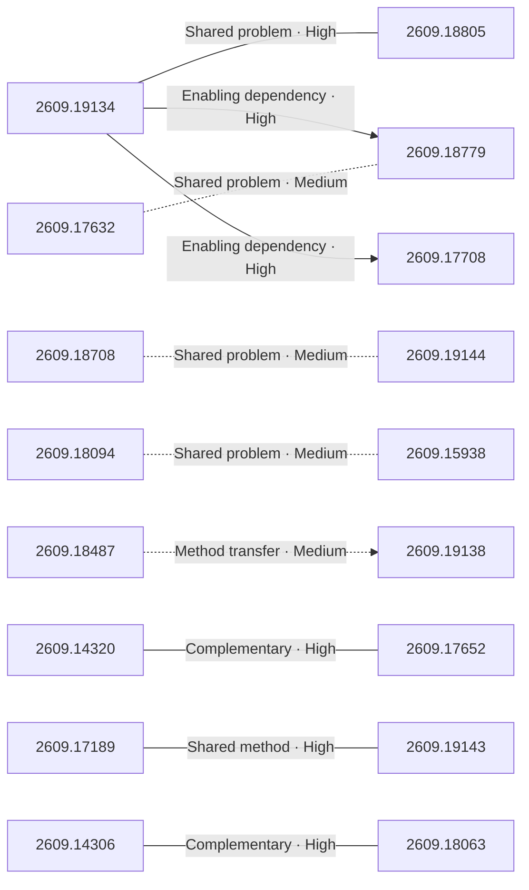

# Paper relationship graph — 2026-09-17

> [← Daily summary](../2026-09-17.md)

> **Interpretation caveat:** Every edge is an evidence-screened editorial hypothesis, not proof of citation, influence, priority, historical use, dependency, or an author-claimed relationship.

## Legend

- Rectangular nodes are current-day papers; rounded nodes are previously seen candidates.
- A line has no technical direction. An arrow shows only a proposed technical flow for an enabling dependency or method transfer.
- Solid edges are high confidence; dotted edges are medium confidence. Confidence evaluates this editorial connection, not either paper.
- Relationship labels:
  - **Shared problem:** `shared_problem`
  - **Shared method:** `shared_method`
  - **Shared evaluation:** `shared_evaluation`
  - **Complementary:** `complementary`
  - **Enabling dependency:** `enabling_dependency`
  - **Method transfer:** `method_transfer`
  - **Assumption tension:** `assumption_tension`
  - **Result tension:** `result_tension`
  - **Shared limitation:** `shared_limitation`
  - **Follow-up opportunity:** `follow_up_opportunity`

## Same-day relationships

| Source paper | Target paper | Relationship | Direction | Confidence |
| --- | --- | --- | --- | --- |
| [2609.19134](2609.19134.md) | [2609.18805](2609.18805.md) | Shared problem | Not directional | High |
| [2609.19134](2609.19134.md) | [2609.18779](2609.18779.md) | Enabling dependency | Source → target | High |
| [2609.19134](2609.19134.md) | [2609.17708](2609.17708.md) | Enabling dependency | Source → target | High |
| [2609.14320](2609.14320.md) | [2609.17652](2609.17652.md) | Complementary | Not directional | High |
| [2609.14306](2609.14306.md) | [2609.18063](2609.18063.md) | Complementary | Not directional | High |
| [2609.17189](2609.17189.md) | [2609.19143](2609.19143.md) | Shared method | Not directional | High |
| [2609.18487](2609.18487.md) | [2609.19138](2609.19138.md) | Method transfer | Source → target | Medium |
| [2609.18708](2609.18708.md) | [2609.19144](2609.19144.md) | Shared problem | Not directional | Medium |
| [2609.18094](2609.18094.md) | [2609.15938](2609.15938.md) | Shared problem | Not directional | Medium |
| [2609.17632](2609.17632.md) | [2609.18779](2609.18779.md) | Shared problem | Not directional | Medium |

## Connections to previously seen papers

_The visual diagram is omitted because this graph is too large or dense for a readable snapshot; every edge remains in the table below._

| New paper | Previously seen paper | First seen by service | Relationship | Technical direction | Confidence |
| --- | --- | --- | --- | --- | --- |
| [2609.19134](2609.19134.md) | 2608.20634 ([Hugging Face](https://huggingface.co/papers/2608.20634) · [arXiv](https://arxiv.org/abs/2608.20634)) | 2026-08-24 | Shared problem | Not directional | High |
| [2609.19134](2609.19134.md) | 2608.19799 ([Hugging Face](https://huggingface.co/papers/2608.19799) · [arXiv](https://arxiv.org/abs/2608.19799)) | 2026-08-21 | Shared evaluation | Not directional | High |
| [2609.18708](2609.18708.md) | 2608.23566 ([Hugging Face](https://huggingface.co/papers/2608.23566) · [arXiv](https://arxiv.org/abs/2608.23566)) | 2026-08-26 | Shared problem | Not directional | High |
| [2609.17708](2609.17708.md) | 2608.16002 ([Hugging Face](https://huggingface.co/papers/2608.16002) · [arXiv](https://arxiv.org/abs/2608.16002)) | 2026-08-19 | Shared problem | Not directional | High |
| [2609.18805](2609.18805.md) | 2608.21833 ([Hugging Face](https://huggingface.co/papers/2608.21833) · [arXiv](https://arxiv.org/abs/2608.21833)) | 2026-08-25 | Shared problem | Not directional | High |
| [2609.18094](2609.18094.md) | 2608.23740 ([Hugging Face](https://huggingface.co/papers/2608.23740) · [arXiv](https://arxiv.org/abs/2608.23740)) | 2026-08-26 | Shared problem | Not directional | High |
| [2609.18487](2609.18487.md) | 2608.27550 ([Hugging Face](https://huggingface.co/papers/2608.27550) · [arXiv](https://arxiv.org/abs/2608.27550)) | 2026-08-31 | Shared evaluation | Not directional | High |
| [2609.15810](2609.15810.md) | 2608.18484 ([Hugging Face](https://huggingface.co/papers/2608.18484) · [arXiv](https://arxiv.org/abs/2608.18484)) | 2026-08-24 | Shared evaluation | Not directional | High |
| [2609.17909](2609.17909.md) | 2608.23383 ([Hugging Face](https://huggingface.co/papers/2608.23383) · [arXiv](https://arxiv.org/abs/2608.23383)) | 2026-08-27 | Shared evaluation | Not directional | High |
| [2609.17909](2609.17909.md) | 2608.23565 ([Hugging Face](https://huggingface.co/papers/2608.23565) · [arXiv](https://arxiv.org/abs/2608.23565)) | 2026-08-25 | Shared limitation | Not directional | High |
| [2609.14320](2609.14320.md) | 2609.04098 ([Hugging Face](https://huggingface.co/papers/2609.04098) · [arXiv](https://arxiv.org/abs/2609.04098)) | 2026-09-04 | Complementary | Not directional | Medium |
| [2609.17652](2609.17652.md) | 2609.13141 ([Hugging Face](https://huggingface.co/papers/2609.13141) · [arXiv](https://arxiv.org/abs/2609.13141)) | 2026-09-14 | Shared problem | Not directional | High |

## Current paper key

| Paper | Analysis |
| --- | --- |
| 2609.17488 — LimiX-2: A Contextual Mechanism Network Towards General Structured-Data Intelligence | [Read analysis](2609.17488.md) |
| 2609.19134 — ScienceIDE: Turning World's Scientific Codebase into Agent Learnable Environments | [Read analysis](2609.19134.md) |
| 2609.18708 — Rethinking Critic Learning in PPO: Understanding and Mitigating Value Flattening | [Read analysis](2609.18708.md) |
| 2609.17708 — Confidence Comes from Experience: Experiential Confidence Estimation from Reasoning to Agents | [Read analysis](2609.17708.md) |
| 2609.18805 — ProgramDistill: From Interactive Web Apps to Verifiable Reference-Guided SWE Tasks | [Read analysis](2609.18805.md) |
| 2609.18094 — Agora: Git as Shared Memory for Collective AutoResearch | [Read analysis](2609.18094.md) |
| 2609.18487 — ActionPiece: Rethinking Action Tokenization for Autoregressive Vision-Language-Action Models | [Read analysis](2609.18487.md) |
| 2609.15810 — VC-Attention: Value Smoothing and Softmax Casting for Low-bit Attention | [Read analysis](2609.15810.md) |
| 2609.17632 — EvolveTrade: Experience-Driven Policy Refinement for Self-Evolving LLM Trading Agents | [Read analysis](2609.17632.md) |
| 2609.17909 — Zing-0.5: Toward Playable Worlds with Real-Time Joint Action and Text Control | [Read analysis](2609.17909.md) |
| 2609.15938 — HypoEvolve: Genetic Algorithms Enable Multi-Agent LLMs to Discover Scientific Hypotheses | [Read analysis](2609.15938.md) |
| 2609.14320 — SpectralShift: Effective Context Window Extension of Gated DeltaNet via Spectral Reparameterization | [Read analysis](2609.14320.md) |
| 2609.19144 — A Zeroth-Order Paradigm for LLM Preference Alignment | [Read analysis](2609.19144.md) |
| 2609.18011 — Gaze as Evidence for Common Grounding: A Cross-Corpus Analysis of MapTask and MUNDEX | [Read analysis](2609.18011.md) |
| 2609.17189 — EventEgoHands++: Event-based Egocentric 3D Hand Mesh Reconstruction with Real Dataset | [Read analysis](2609.17189.md) |
| 2609.19138 — In-Context Robot Learning with VLM Agents | [Read analysis](2609.19138.md) |
| 2609.14306 — Flattening Every Memory Peak in Long-Context Mixture-of-Experts Training | [Read analysis](2609.14306.md) |
| 2609.19143 — PANORAMA: Panoptic Grounded Captioning via Mask Proposal Selection | [Read analysis](2609.19143.md) |
| 2609.18063 — The Other Half of the Memory Wall: Serving 35B MoEs from SSD with Trained Routing Prediction | [Read analysis](2609.18063.md) |
| 2609.18779 — CERA-MoA: Co-Evolving Routing Mechanisms with Continually Learning LLM Agents | [Read analysis](2609.18779.md) |
| 2609.15524 — Assessing nnU-Net Generalization across Brain Tumor Populations in BraTS-GoAT 2026 | [Read analysis](2609.15524.md) |
| 2609.17172 — Fingers as Legs: Learning Self-Supported Locomotion and Manipulation with an Anthropomorphic Hand | [Read analysis](2609.17172.md) |
| 2609.17652 — Fathom: Per-Query Read Depth for Sparse Decoding over Offloaded KV Caches | [Read analysis](2609.17652.md) |

## Current papers without a published edge

- [2609.17488](2609.17488.md)
- [2609.18011](2609.18011.md)
- [2609.15524](2609.15524.md)
- [2609.17172](2609.17172.md)

---

[Support these research summaries on Buy Me a Coffee](https://buymeacoffee.com/vollero)
