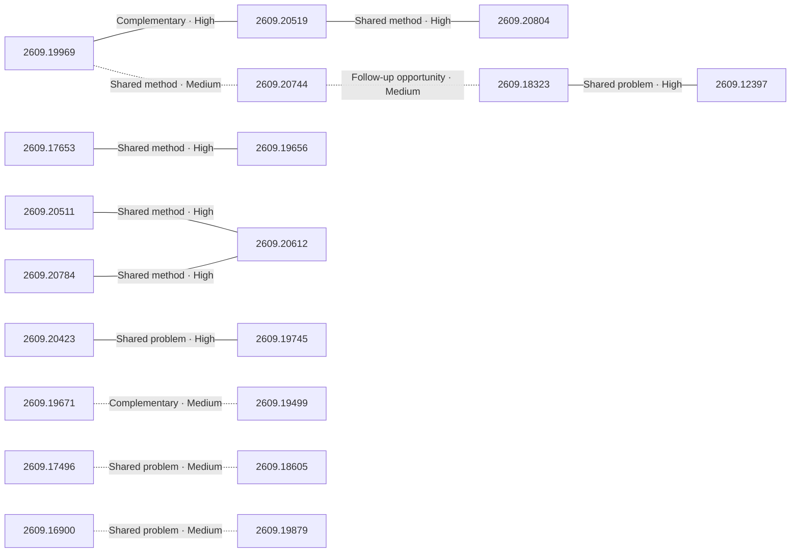

# Paper relationship graph — 2026-09-18

> [← Daily summary](../2026-09-18.md)

> **Interpretation caveat:** Every edge is an evidence-screened editorial hypothesis, not proof of citation, influence, priority, historical use, dependency, or an author-claimed relationship.

## Legend

- Rectangular nodes are current-day papers; rounded nodes are previously seen candidates.
- A line has no technical direction. An arrow shows only a proposed technical flow for an enabling dependency or method transfer.
- Solid edges are high confidence; dotted edges are medium confidence. Confidence evaluates this editorial connection, not either paper.
- Relationship labels:
  - **Shared problem:** `shared_problem`
  - **Shared method:** `shared_method`
  - **Shared evaluation:** `shared_evaluation`
  - **Complementary:** `complementary`
  - **Enabling dependency:** `enabling_dependency`
  - **Method transfer:** `method_transfer`
  - **Assumption tension:** `assumption_tension`
  - **Result tension:** `result_tension`
  - **Shared limitation:** `shared_limitation`
  - **Follow-up opportunity:** `follow_up_opportunity`

## Same-day relationships

| Source paper | Target paper | Relationship | Direction | Confidence |
| --- | --- | --- | --- | --- |
| [2609.20519](2609.20519.md) | [2609.20804](2609.20804.md) | Shared method | Not directional | High |
| [2609.19969](2609.19969.md) | [2609.20519](2609.20519.md) | Complementary | Not directional | High |
| [2609.19969](2609.19969.md) | [2609.20744](2609.20744.md) | Shared method | Not directional | Medium |
| [2609.20511](2609.20511.md) | [2609.20612](2609.20612.md) | Shared method | Not directional | High |
| [2609.20784](2609.20784.md) | [2609.20612](2609.20612.md) | Shared method | Not directional | High |
| [2609.17653](2609.17653.md) | [2609.19656](2609.19656.md) | Shared method | Not directional | High |
| [2609.20423](2609.20423.md) | [2609.19745](2609.19745.md) | Shared problem | Not directional | High |
| [2609.19671](2609.19671.md) | [2609.19499](2609.19499.md) | Complementary | Not directional | Medium |
| [2609.17496](2609.17496.md) | [2609.18605](2609.18605.md) | Shared problem | Not directional | Medium |
| [2609.16900](2609.16900.md) | [2609.19879](2609.19879.md) | Shared problem | Not directional | Medium |
| [2609.18323](2609.18323.md) | [2609.12397](2609.12397.md) | Shared problem | Not directional | High |
| [2609.20744](2609.20744.md) | [2609.18323](2609.18323.md) | Follow-up opportunity | Not directional | Medium |

## Connections to previously seen papers

_The visual diagram is omitted because this graph is too large or dense for a readable snapshot; every edge remains in the table below._

| New paper | Previously seen paper | First seen by service | Relationship | Technical direction | Confidence |
| --- | --- | --- | --- | --- | --- |
| [2609.19969](2609.19969.md) | 2609.04971 ([Hugging Face](https://huggingface.co/papers/2609.04971) · [arXiv](https://arxiv.org/abs/2609.04971)) | 2026-09-09 | Shared problem | Not directional | High |
| [2609.20511](2609.20511.md) | 2609.04172 ([Hugging Face](https://huggingface.co/papers/2609.04172) · [arXiv](https://arxiv.org/abs/2609.04172)) | 2026-09-04 | Follow-up opportunity | Not directional | Medium |
| [2609.20519](2609.20519.md) | 2609.14857 ([Hugging Face](https://huggingface.co/papers/2609.14857) · [arXiv](https://arxiv.org/abs/2609.14857)) | 2026-09-16 | Shared method | Not directional | High |
| [2609.20804](2609.20804.md) | 2608.27831 ([Hugging Face](https://huggingface.co/papers/2608.27831) · [arXiv](https://arxiv.org/abs/2608.27831)) | 2026-09-02 | Complementary | Not directional | High |
| [2609.20800](2609.20800.md) | 2608.12944 ([Hugging Face](https://huggingface.co/papers/2608.12944) · [arXiv](https://arxiv.org/abs/2608.12944)) | 2026-08-19 | Shared method | Not directional | High |
| [2609.20784](2609.20784.md) | 2609.08798 ([Hugging Face](https://huggingface.co/papers/2609.08798) · [arXiv](https://arxiv.org/abs/2609.08798)) | 2026-09-09 | Shared problem | Not directional | High |
| [2609.17653](2609.17653.md) | 2608.27454 ([Hugging Face](https://huggingface.co/papers/2608.27454) · [arXiv](https://arxiv.org/abs/2608.27454)) | 2026-08-28 | Shared method | Not directional | High |
| [2609.20423](2609.20423.md) | 2608.22817 ([Hugging Face](https://huggingface.co/papers/2608.22817) · [arXiv](https://arxiv.org/abs/2608.22817)) | 2026-08-25 | Method transfer | New → previous | Medium |
| [2609.19656](2609.19656.md) | 2608.24794 ([Hugging Face](https://huggingface.co/papers/2608.24794) · [arXiv](https://arxiv.org/abs/2608.24794)) | 2026-08-26 | Complementary | Not directional | High |
| [2609.19554](2609.19554.md) | 2609.10895 ([Hugging Face](https://huggingface.co/papers/2609.10895) · [arXiv](https://arxiv.org/abs/2609.10895)) | 2026-09-14 | Shared problem | Not directional | High |
| [2609.20612](2609.20612.md) | 2608.31046 ([Hugging Face](https://huggingface.co/papers/2608.31046) · [arXiv](https://arxiv.org/abs/2608.31046)) | 2026-09-01 | Shared problem | Not directional | High |
| [2609.18605](2609.18605.md) | 2608.19741 ([Hugging Face](https://huggingface.co/papers/2608.19741) · [arXiv](https://arxiv.org/abs/2608.19741)) | 2026-08-25 | Complementary | Not directional | High |

## Current paper key

| Paper | Analysis |
| --- | --- |
| 2609.19969 — DeepSeek-V4.1-Flash: Pushing the Limits of KV Cache Compression | [Read analysis](2609.19969.md) |
| 2609.20511 — When EOS Tokens Disagree: Understanding Length Inflation in On-Policy Distillation | [Read analysis](2609.20511.md) |
| 2609.20519 — SoL-Pi: Recursively Scaling Auto-Research Loops for Efficient Agent Harness | [Read analysis](2609.20519.md) |
| 2609.20804 — An Empirical Study of Harness Design for Coding Agents | [Read analysis](2609.20804.md) |
| 2609.20800 — JEPA-Anything: Learning Predictive Models across Different Worlds | [Read analysis](2609.20800.md) |
| 2609.16900 — RiskChainBench: A Benchmark for Obfuscated Platform Message Restoration and Evidence-Grounded Web Investigation | [Read analysis](2609.16900.md) |
| 2609.20784 — RetireOPD: Self-Retiring On-Policy Distillation for Agentic Reinforcement Learning | [Read analysis](2609.20784.md) |
| 2609.17496 — Verifiable Social Reasoning for LLM Assistants | [Read analysis](2609.17496.md) |
| 2609.17653 — Reflect, Revise, Reuse: Training-Free Skill Evolution for GUI Agents | [Read analysis](2609.17653.md) |
| 2609.20423 — WeVisDoc: From Coverage to Capability for Robust End-to-End Document Parsing | [Read analysis](2609.20423.md) |
| 2609.20744 — Video DeltaNet: A Video-Native Hybrid Attention for Livestream Video Generation | [Read analysis](2609.20744.md) |
| 2609.19656 — Self-Evolving Search Index | [Read analysis](2609.19656.md) |
| 2609.18323 — Can MiniMax-H3 Reason About the Physical World? An Evaluation of Omni-Modal Generative Model | [Read analysis](2609.18323.md) |
| 2609.19554 — VABench: Measuring Embodied Spatial Intelligence through Visual Demonstrations, Active Perception, and Metric Control | [Read analysis](2609.19554.md) |
| 2609.20817 — FAMOS: Feed-Forward 3D Articulation Modeling from Sparse Observations | [Read analysis](2609.20817.md) |
| 2609.19671 — When2Think: Learning Difficulty-Aware Length Control for Efficient Hybrid Reasoning Models | [Read analysis](2609.19671.md) |
| 2609.20612 — What Does Privileged Information Add to On-Policy Self-Distillation? | [Read analysis](2609.20612.md) |
| 2609.12397 — UFO: Chain-of-Evaluation for Omni-Condition Alignment in Multi-Modal Image Generation | [Read analysis](2609.12397.md) |
| 2609.20715 — Don't Mask the Environment: Observation Supervision Changes How Agents Explore Under RL | [Read analysis](2609.20715.md) |
| 2609.19745 — Region-Level Policy Optimization for Fine-grained MLLM Perception | [Read analysis](2609.19745.md) |
| 2609.19499 — Sample Count Is Not Enough: Candidate-Generation Strategy Shapes the Energy and Performance of LLM Test-Time Scaling | [Read analysis](2609.19499.md) |
| 2609.18605 — PACT: Can Enterprise AI Assistants Be Trusted Under Pressure? | [Read analysis](2609.18605.md) |
| 2609.19879 — VākQA: A Benchmark and Evaluation Study for Telugu Spoken Factoid Question Answering | [Read analysis](2609.19879.md) |
| 2609.05661 — Srijika: OpenType-Layout-Reusing Font Restyling for Nine Indic Scripts | [Read analysis](2609.05661.md) |

## Current papers without a published edge

- [2609.20817](2609.20817.md)
- [2609.20715](2609.20715.md)
- [2609.05661](2609.05661.md)

---

[Support these research summaries on Buy Me a Coffee](https://buymeacoffee.com/vollero)
