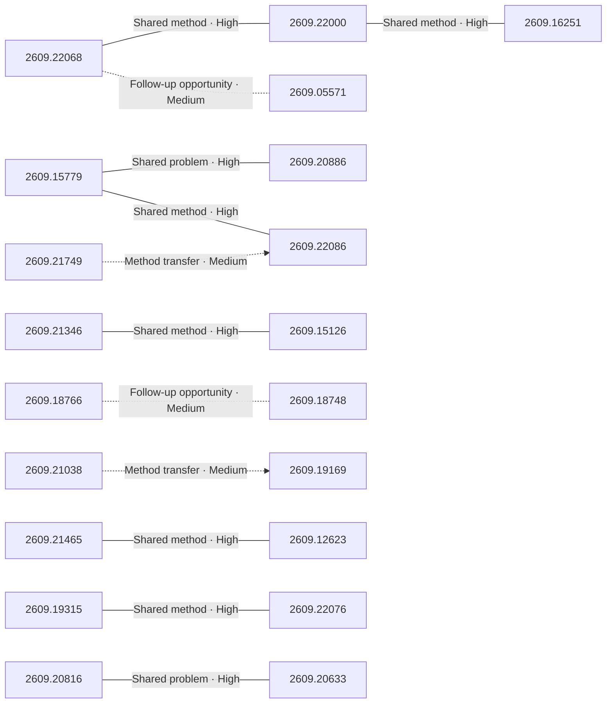

# Paper relationship graph — 2026-09-21

> [← Daily summary](../2026-09-21.md)

> **Interpretation caveat:** Every edge is an evidence-screened editorial hypothesis, not proof of citation, influence, priority, historical use, dependency, or an author-claimed relationship.

## Legend

- Rectangular nodes are current-day papers; rounded nodes are previously seen candidates.
- A line has no technical direction. An arrow shows only a proposed technical flow for an enabling dependency or method transfer.
- Solid edges are high confidence; dotted edges are medium confidence. Confidence evaluates this editorial connection, not either paper.
- Relationship labels:
  - **Shared problem:** `shared_problem`
  - **Shared method:** `shared_method`
  - **Shared evaluation:** `shared_evaluation`
  - **Complementary:** `complementary`
  - **Enabling dependency:** `enabling_dependency`
  - **Method transfer:** `method_transfer`
  - **Assumption tension:** `assumption_tension`
  - **Result tension:** `result_tension`
  - **Shared limitation:** `shared_limitation`
  - **Follow-up opportunity:** `follow_up_opportunity`

## Same-day relationships

| Source paper | Target paper | Relationship | Direction | Confidence |
| --- | --- | --- | --- | --- |
| [2609.15779](2609.15779.md) | [2609.20886](2609.20886.md) | Shared problem | Not directional | High |
| [2609.15779](2609.15779.md) | [2609.22086](2609.22086.md) | Shared method | Not directional | High |
| [2609.21749](2609.21749.md) | [2609.22086](2609.22086.md) | Method transfer | Source → target | Medium |
| [2609.22068](2609.22068.md) | [2609.22000](2609.22000.md) | Shared method | Not directional | High |
| [2609.22068](2609.22068.md) | [2609.05571](2609.05571.md) | Follow-up opportunity | Not directional | Medium |
| [2609.22000](2609.22000.md) | [2609.16251](2609.16251.md) | Shared method | Not directional | High |
| [2609.21346](2609.21346.md) | [2609.15126](2609.15126.md) | Shared method | Not directional | High |
| [2609.21465](2609.21465.md) | [2609.12623](2609.12623.md) | Shared method | Not directional | High |
| [2609.20816](2609.20816.md) | [2609.20633](2609.20633.md) | Shared problem | Not directional | High |
| [2609.18766](2609.18766.md) | [2609.18748](2609.18748.md) | Follow-up opportunity | Not directional | Medium |
| [2609.19315](2609.19315.md) | [2609.22076](2609.22076.md) | Shared method | Not directional | High |
| [2609.21038](2609.21038.md) | [2609.19169](2609.19169.md) | Method transfer | Source → target | Medium |

## Connections to previously seen papers

_The visual diagram is omitted because this graph is too large or dense for a readable snapshot; every edge remains in the table below._

| New paper | Previously seen paper | First seen by service | Relationship | Technical direction | Confidence |
| --- | --- | --- | --- | --- | --- |
| [2609.15779](2609.15779.md) | 2608.24876 ([Hugging Face](https://huggingface.co/papers/2608.24876) · [arXiv](https://arxiv.org/abs/2608.24876)) | 2026-08-26 | Shared method | Not directional | High |
| [2609.22068](2609.22068.md) | 2609.04148 ([Hugging Face](https://huggingface.co/papers/2609.04148) · [arXiv](https://arxiv.org/abs/2609.04148)) | 2026-09-04 | Shared method | Not directional | High |
| [2609.22000](2609.22000.md) | 2608.21833 ([Hugging Face](https://huggingface.co/papers/2608.21833) · [arXiv](https://arxiv.org/abs/2608.21833)) | 2026-08-25 | Shared evaluation | Not directional | High |
| [2609.22086](2609.22086.md) | 2608.27454 ([Hugging Face](https://huggingface.co/papers/2608.27454) · [arXiv](https://arxiv.org/abs/2608.27454)) | 2026-08-28 | Shared method | Not directional | High |
| [2609.21749](2609.21749.md) | 2609.09153 ([Hugging Face](https://huggingface.co/papers/2609.09153) · [arXiv](https://arxiv.org/abs/2609.09153)) | 2026-09-09 | Shared method | Not directional | High |
| [2609.21749](2609.21749.md) | 2609.11682 ([Hugging Face](https://huggingface.co/papers/2609.11682) · [arXiv](https://arxiv.org/abs/2609.11682)) | 2026-09-14 | Shared method | Not directional | High |
| [2609.21619](2609.21619.md) | 2608.31046 ([Hugging Face](https://huggingface.co/papers/2608.31046) · [arXiv](https://arxiv.org/abs/2608.31046)) | 2026-09-01 | Shared problem | Not directional | High |
| [2609.20942](2609.20942.md) | 2609.09076 ([Hugging Face](https://huggingface.co/papers/2609.09076) · [arXiv](https://arxiv.org/abs/2609.09076)) | 2026-09-11 | Follow-up opportunity | Not directional | Medium |
| [2609.22076](2609.22076.md) | 2609.01836 ([Hugging Face](https://huggingface.co/papers/2609.01836) · [arXiv](https://arxiv.org/abs/2609.01836)) | 2026-09-02 | Follow-up opportunity | Not directional | Medium |
| [2609.22069](2609.22069.md) | 2609.15863 ([Hugging Face](https://huggingface.co/papers/2609.15863) · [arXiv](https://arxiv.org/abs/2609.15863)) | 2026-09-15 | Shared evaluation | Not directional | High |
| [2609.20669](2609.20669.md) | 2609.05588 ([Hugging Face](https://huggingface.co/papers/2609.05588) · [arXiv](https://arxiv.org/abs/2609.05588)) | 2026-09-09 | Shared problem | Not directional | High |
| [2609.21346](2609.21346.md) | 2608.24763 ([Hugging Face](https://huggingface.co/papers/2608.24763) · [arXiv](https://arxiv.org/abs/2608.24763)) | 2026-08-26 | Shared method | Not directional | High |

## Current paper key

| Paper | Analysis |
| --- | --- |
| 2609.15779 — EvoOntology: A Self-Evolving Ontology Layer for Data Agents | [Read analysis](2609.15779.md) |
| 2609.22068 — CodeMidas: Scaling Agentic Coding RL Environments from Code Itself | [Read analysis](2609.22068.md) |
| 2609.05571 — Grounded Skill Synthesis from Code at Scale for Agentic Intelligence | [Read analysis](2609.05571.md) |
| 2609.22000 — RecreationWorld: Scalable and Verifiable Environments for Hybrid Computer-Use Agents | [Read analysis](2609.22000.md) |
| 2609.21346 — IntBMoE: Integrating Block-Level Conditioning into Expert Composition for Full-Participation Mixture-of-Experts | [Read analysis](2609.21346.md) |
| 2609.21465 — OmniVChat: Synthesizing, Benchmarking, and Training for Native Audio-Visual Dialogue | [Read analysis](2609.21465.md) |
| 2609.20816 — Paint-Anything: Unified Any-Color Control for Image Generation and Editing | [Read analysis](2609.20816.md) |
| 2609.22086 — Designer-RSI: Evolving Procedural Memory from User Traffic for Agentic Graphic Design | [Read analysis](2609.22086.md) |
| 2609.22069 — OmniVBench: A Benchmark and Large-Scale Dataset for Omni Reference-to-Video Generation | [Read analysis](2609.22069.md) |
| 2609.20886 — BI-Agent and BI-Bench: Towards Automating End-to-End Business Intelligence | [Read analysis](2609.20886.md) |
| 2609.22083 — MintAct: A Unified Visual Agent for Digital Environments | [Read analysis](2609.22083.md) |
| 2609.21749 — GraphSkillEvo: Evolutionary Optimization of Graph-Structured Agent Skills | [Read analysis](2609.21749.md) |
| 2609.22039 — Gricea: An Open Science Platform for Conversational AI Research | [Read analysis](2609.22039.md) |
| 2609.15126 — MoME: Mixture-of-Memory Embeddings for Context-Aware Sparse Lookup | [Read analysis](2609.15126.md) |
| 2609.21619 — Calibrating Teacher--Student Discrepancy for On-Policy Distillation | [Read analysis](2609.21619.md) |
| 2609.21788 — From Pretraining to Proficiency: Real-World Subtask RL for Long-Horizon Manipulation with Minimal Human Intervention | [Read analysis](2609.21788.md) |
| 2609.16251 — CADWorld: Computer-Use Benchmark for Long-Horizon Computer-Aided Design | [Read analysis](2609.16251.md) |
| 2609.09206 — MLLMs Hallucinate when Information Distribution Drifts in Synergy Heads | [Read analysis](2609.09206.md) |
| 2609.20942 — When AI Reviews Train AI Reviewers: Scientific-Judgment Collapse and Mitigation | [Read analysis](2609.20942.md) |
| 2609.18766 — FRAUDSkill: Structured Frozen-Weight Skill Optimization for Audio Anti-Fraud Detection | [Read analysis](2609.18766.md) |
| 2609.18748 — TeleAntiFraud 2.0: A Refreshable, Profile-Grounded, and Audio-Based Benchmark for Telecom Fraud Detection | [Read analysis](2609.18748.md) |
| 2609.20669 — Learning Foresight without Explicit Trajectories for 3D Diffusion Policies | [Read analysis](2609.20669.md) |
| 2609.19169 — SiliconBench: Speed, Memory, and Fidelity for LLM Serving on Unified-Memory Desktops | [Read analysis](2609.19169.md) |
| 2609.19122 — Training-Adaptive Convolutional Sparse Coding via Information Bottleneck for Robust Visual Representation | [Read analysis](2609.19122.md) |
| 2609.18620 — DeformSmith: Physics Harness-Guided Hierarchical Generation of Deformable Assets for Robot Manipulation | [Read analysis](2609.18620.md) |
| 2609.12623 — SteerDuplex: Steerable Duplex Speech Dialogue Models | [Read analysis](2609.12623.md) |
| 2609.19315 — GAVEL: Graph World Models for Verified and Efficient Long-Horizon LLM Task Planning | [Read analysis](2609.19315.md) |
| 2609.22076 — APort Vault: Benchmarking AI Agent Payment Authorization with the Open Agent Passport | [Read analysis](2609.22076.md) |
| 2609.20633 — Refinement Is Inherently Editable: Training-Free Prompt-to-Prompt Image Editing with Generative Refinement Network | [Read analysis](2609.20633.md) |
| 2609.21038 — Retention-Constrained Post-Training Quantization of Cellpose-SAM for Stem Cell Microscopy | [Read analysis](2609.21038.md) |
| 2609.21094 — Geometry of Values: Task Vector Composition for Ethical Preference Alignment in Language Models | [Read analysis](2609.21094.md) |

## Current papers without a published edge

- [2609.22083](2609.22083.md)
- [2609.22039](2609.22039.md)
- [2609.21788](2609.21788.md)
- [2609.09206](2609.09206.md)
- [2609.19122](2609.19122.md)
- [2609.18620](2609.18620.md)
- [2609.21094](2609.21094.md)

---

[Support these research summaries on Buy Me a Coffee](https://buymeacoffee.com/vollero)
