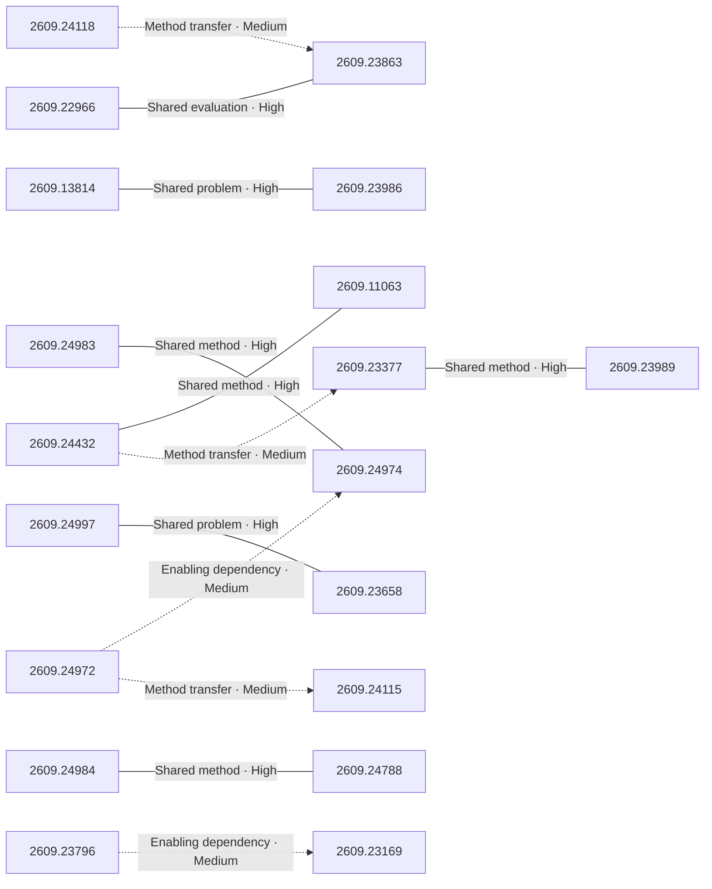

# Paper relationship graph — 2026-09-22

> [← Daily summary](../2026-09-22.md)

> **Interpretation caveat:** Every edge is an evidence-screened editorial hypothesis, not proof of citation, influence, priority, historical use, dependency, or an author-claimed relationship.

## Legend

- Rectangular nodes are current-day papers; rounded nodes are previously seen candidates.
- A line has no technical direction. An arrow shows only a proposed technical flow for an enabling dependency or method transfer.
- Solid edges are high confidence; dotted edges are medium confidence. Confidence evaluates this editorial connection, not either paper.
- Relationship labels:
  - **Shared problem:** `shared_problem`
  - **Shared method:** `shared_method`
  - **Shared evaluation:** `shared_evaluation`
  - **Complementary:** `complementary`
  - **Enabling dependency:** `enabling_dependency`
  - **Method transfer:** `method_transfer`
  - **Assumption tension:** `assumption_tension`
  - **Result tension:** `result_tension`
  - **Shared limitation:** `shared_limitation`
  - **Follow-up opportunity:** `follow_up_opportunity`

## Same-day relationships

| Source paper | Target paper | Relationship | Direction | Confidence |
| --- | --- | --- | --- | --- |
| [2609.24972](2609.24972.md) | [2609.24974](2609.24974.md) | Enabling dependency | Source → target | Medium |
| [2609.24983](2609.24983.md) | [2609.24974](2609.24974.md) | Shared method | Not directional | High |
| [2609.23377](2609.23377.md) | [2609.23989](2609.23989.md) | Shared method | Not directional | High |
| [2609.24972](2609.24972.md) | [2609.24115](2609.24115.md) | Method transfer | Source → target | Medium |
| [2609.24118](2609.24118.md) | [2609.23863](2609.23863.md) | Method transfer | Source → target | Medium |
| [2609.22966](2609.22966.md) | [2609.23863](2609.23863.md) | Shared evaluation | Not directional | High |
| [2609.24432](2609.24432.md) | [2609.11063](2609.11063.md) | Shared method | Not directional | High |
| [2609.24432](2609.24432.md) | [2609.23377](2609.23377.md) | Method transfer | Source → target | Medium |
| [2609.24997](2609.24997.md) | [2609.23658](2609.23658.md) | Shared problem | Not directional | High |
| [2609.24984](2609.24984.md) | [2609.24788](2609.24788.md) | Shared method | Not directional | High |
| [2609.13814](2609.13814.md) | [2609.23986](2609.23986.md) | Shared problem | Not directional | High |
| [2609.23796](2609.23796.md) | [2609.23169](2609.23169.md) | Enabling dependency | Source → target | Medium |

## Connections to previously seen papers

_The visual diagram is omitted because this graph is too large or dense for a readable snapshot; every edge remains in the table below._

| New paper | Previously seen paper | First seen by service | Relationship | Technical direction | Confidence |
| --- | --- | --- | --- | --- | --- |
| [2609.13814](2609.13814.md) | 2609.08977 ([Hugging Face](https://huggingface.co/papers/2609.08977) · [arXiv](https://arxiv.org/abs/2609.08977)) | 2026-09-09 | Shared method | Not directional | High |
| [2609.24972](2609.24972.md) | 2609.14857 ([Hugging Face](https://huggingface.co/papers/2609.14857) · [arXiv](https://arxiv.org/abs/2609.14857)) | 2026-09-16 | Shared problem | Not directional | High |
| [2609.24984](2609.24984.md) | 2608.29910 ([Hugging Face](https://huggingface.co/papers/2608.29910) · [arXiv](https://arxiv.org/abs/2608.29910)) | 2026-09-01 | Shared problem | Not directional | High |
| [2609.22966](2609.22966.md) | 2609.19138 ([Hugging Face](https://huggingface.co/papers/2609.19138) · [arXiv](https://arxiv.org/abs/2609.19138)) | 2026-09-17 | Shared method | Not directional | High |
| [2609.24974](2609.24974.md) | 2609.09134 ([Hugging Face](https://huggingface.co/papers/2609.09134) · [arXiv](https://arxiv.org/abs/2609.09134)) | 2026-09-10 | Shared method | Not directional | High |
| [2609.23377](2609.23377.md) | 2608.16647 ([Hugging Face](https://huggingface.co/papers/2608.16647) · [arXiv](https://arxiv.org/abs/2608.16647)) | 2026-08-24 | Shared problem | Not directional | High |
| [2609.24118](2609.24118.md) | 2609.01281 ([Hugging Face](https://huggingface.co/papers/2609.01281) · [arXiv](https://arxiv.org/abs/2609.01281)) | 2026-09-08 | Shared method | Not directional | High |
| [2609.23989](2609.23989.md) | 2608.24763 ([Hugging Face](https://huggingface.co/papers/2608.24763) · [arXiv](https://arxiv.org/abs/2608.24763)) | 2026-08-26 | Shared method | Not directional | High |
| [2609.24682](2609.24682.md) | 2608.23478 ([Hugging Face](https://huggingface.co/papers/2608.23478) · [arXiv](https://arxiv.org/abs/2608.23478)) | 2026-08-31 | Shared method | Not directional | High |
| [2609.24788](2609.24788.md) | 2608.27123 ([Hugging Face](https://huggingface.co/papers/2608.27123) · [arXiv](https://arxiv.org/abs/2608.27123)) | 2026-08-28 | Shared problem | Not directional | High |
| [2609.23796](2609.23796.md) | 2608.30821 ([Hugging Face](https://huggingface.co/papers/2608.30821) · [arXiv](https://arxiv.org/abs/2608.30821)) | 2026-09-01 | Shared problem | Not directional | High |
| [2609.22220](2609.22220.md) | 2609.01865 ([Hugging Face](https://huggingface.co/papers/2609.01865) · [arXiv](https://arxiv.org/abs/2609.01865)) | 2026-09-03 | Shared method | Not directional | High |

## Current paper key

| Paper | Analysis |
| --- | --- |
| 2609.13814 — Realtime-Venus: A full-duplex interaction system with asynchronous delegation | [Read analysis](2609.13814.md) |
| 2609.24972 — RRSI: Regularized Recursive Self-Improvement of Agent Harnesses | [Read analysis](2609.24972.md) |
| 2609.23088 — OmniEdu: Open Foundation Models for Learning and Teaching | [Read analysis](2609.23088.md) |
| 2609.24984 — WorldCrafter: Consistent Video World Model with Implicit 3D-aware Memory | [Read analysis](2609.24984.md) |
| 2609.25001 — GameHorizon Suite: Multi-Horizon Data and Evaluation in Gameplay | [Read analysis](2609.25001.md) |
| 2609.22966 — Transferring the Intelligence of VLMs to Robotic Control | [Read analysis](2609.22966.md) |
| 2609.23863 — Grounded Action Model: 3D Grounding as a Foundation for Robotics | [Read analysis](2609.23863.md) |
| 2609.24220 — Document Retrieval-Aware Chunking (D-RAC): Universal Retrieval-Aware Ingestion of Enterprise Documents via PDF Normalization and Multimodal Markdown Conversion | [Read analysis](2609.24220.md) |
| 2609.24997 — VideoGen-Agent: Reinforcing Video Generation Agents | [Read analysis](2609.24997.md) |
| 2609.24983 — onPanda: Efficient Annotation of On-Policy Alignment Data for LLMs and Agents via Token-Level Correction | [Read analysis](2609.24983.md) |
| 2609.23377 — One to More, More to One: Category-Aware Iterative Expert Training for Software Engineering Agents | [Read analysis](2609.23377.md) |
| 2609.23986 — Jev-Mem: System-One-Controlled Agentic Memory for Efficient AI Agents | [Read analysis](2609.23986.md) |
| 2609.22255 — Deep Persona: A Psychologically Grounded Architecture and Evaluation Framework for Role-Playing Agents and Simulations | [Read analysis](2609.22255.md) |
| 2609.24974 — Harness-Zero: Harness Distillation via Agent-as-Harness | [Read analysis](2609.24974.md) |
| 2609.24432 — 1% of Tokens Can Be Enough: On Gradient Estimation in On-Policy Distillation | [Read analysis](2609.24432.md) |
| 2609.24118 — CARE: Experience-Guided Atomic Corrective Execution for Vision-Language-Action Policies | [Read analysis](2609.24118.md) |
| 2609.23658 — Why Do Video Diffusion Models Violate Physics? Unveiling the Flaws in Attention Mechanisms | [Read analysis](2609.23658.md) |
| 2609.23989 — ACLArena: Agent Continue Learning in Multi-stage Post-training | [Read analysis](2609.23989.md) |
| 2609.10706 — HuRo: Robotizing Human Videos for Scalable VLA Pretraining | [Read analysis](2609.10706.md) |
| 2609.22870 — Towards Full Pipeline FP8 Reinforcement Learning for LLMs | [Read analysis](2609.22870.md) |
| 2609.06052 — SkillSpec: Intent-Masked Specification Reasoning for Agent Skill Correctness | [Read analysis](2609.06052.md) |
| 2609.15991 — The Functionalizer: Lossless Functional Decomposition for Subword Tokenization | [Read analysis](2609.15991.md) |
| 2609.24797 — Complex KDA: Understanding and Enhancing the Expressivity of Kimi Delta Attention | [Read analysis](2609.24797.md) |
| 2609.24682 — Think Like a World Model, Act Like a VLA: Distilling World-Model Representations into Compact Robot Policies | [Read analysis](2609.24682.md) |
| 2609.21996 — A Lie Detector Test for Language Models: Reading Knowledge a Model Won't Reveal | [Read analysis](2609.21996.md) |
| 2609.13231 — ShieldVLA: Feasibility-Aware Safety Alignment for Vision-Language-Action Models | [Read analysis](2609.13231.md) |
| 2609.24788 — Streaming Video Editing with Easy Adaptation | [Read analysis](2609.24788.md) |
| 2609.23796 — Mira-Scene: Pixel-Aligned Layouts for Generative 3D Scene | [Read analysis](2609.23796.md) |
| 2609.11063 — The information geometry of large language models is shared, learned, and controllable | [Read analysis](2609.11063.md) |
| 2609.20758 — Prediction-Powered Smoothing and Validation for Disaggregated AI Evaluation | [Read analysis](2609.20758.md) |
| 2609.22220 — Measuring the Checker: Mutation Analysis for GPU-Kernel Benchmark Oracles | [Read analysis](2609.22220.md) |
| 2609.24115 — EDGEGEN: Improving Tool-Calling Agents Beyond Happy Paths with Synthetic Edge Case Generation | [Read analysis](2609.24115.md) |
| 2609.23169 — UltraTex: Unleashing 2K Multi-View Diffusion for 3D Texturing | [Read analysis](2609.23169.md) |
| 2609.20869 — TAPe+ML: A Compact Structured Representation for Multi-Task Computer Vision | [Read analysis](2609.20869.md) |

## Current papers without a published edge

- [2609.23088](2609.23088.md)
- [2609.25001](2609.25001.md)
- [2609.24220](2609.24220.md)
- [2609.22255](2609.22255.md)
- [2609.10706](2609.10706.md)
- [2609.22870](2609.22870.md)
- [2609.06052](2609.06052.md)
- [2609.15991](2609.15991.md)
- [2609.24797](2609.24797.md)
- [2609.21996](2609.21996.md)
- [2609.13231](2609.13231.md)
- [2609.20758](2609.20758.md)
- [2609.20869](2609.20869.md)

---

[Support these research summaries on Buy Me a Coffee](https://buymeacoffee.com/vollero)
