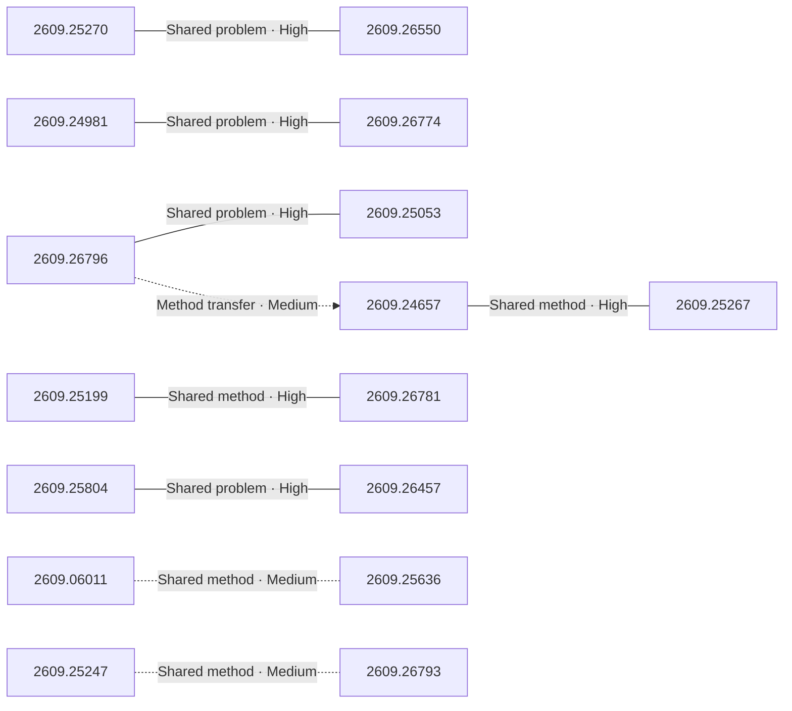

# Paper relationship graph — 2026-09-23

> [← Daily summary](../2026-09-23.md)

> **Interpretation caveat:** Every edge is an evidence-screened editorial hypothesis, not proof of citation, influence, priority, historical use, dependency, or an author-claimed relationship.

## Legend

- Rectangular nodes are current-day papers; rounded nodes are previously seen candidates.
- A line has no technical direction. An arrow shows only a proposed technical flow for an enabling dependency or method transfer.
- Solid edges are high confidence; dotted edges are medium confidence. Confidence evaluates this editorial connection, not either paper.
- Relationship labels:
  - **Shared problem:** `shared_problem`
  - **Shared method:** `shared_method`
  - **Shared evaluation:** `shared_evaluation`
  - **Complementary:** `complementary`
  - **Enabling dependency:** `enabling_dependency`
  - **Method transfer:** `method_transfer`
  - **Assumption tension:** `assumption_tension`
  - **Result tension:** `result_tension`
  - **Shared limitation:** `shared_limitation`
  - **Follow-up opportunity:** `follow_up_opportunity`

## Same-day relationships

| Source paper | Target paper | Relationship | Direction | Confidence |
| --- | --- | --- | --- | --- |
| [2609.25804](2609.25804.md) | [2609.26457](2609.26457.md) | Shared problem | Not directional | High |
| [2609.25199](2609.25199.md) | [2609.26781](2609.26781.md) | Shared method | Not directional | High |
| [2609.25270](2609.25270.md) | [2609.26550](2609.26550.md) | Shared problem | Not directional | High |
| [2609.24981](2609.24981.md) | [2609.26774](2609.26774.md) | Shared problem | Not directional | High |
| [2609.26796](2609.26796.md) | [2609.25053](2609.25053.md) | Shared problem | Not directional | High |
| [2609.24657](2609.24657.md) | [2609.25267](2609.25267.md) | Shared method | Not directional | High |
| [2609.06011](2609.06011.md) | [2609.25636](2609.25636.md) | Shared method | Not directional | Medium |
| [2609.25247](2609.25247.md) | [2609.26793](2609.26793.md) | Shared method | Not directional | Medium |
| [2609.26796](2609.26796.md) | [2609.24657](2609.24657.md) | Method transfer | Source → target | Medium |

## Connections to previously seen papers

_The visual diagram is omitted because this graph is too large or dense for a readable snapshot; every edge remains in the table below._

| New paper | Previously seen paper | First seen by service | Relationship | Technical direction | Confidence |
| --- | --- | --- | --- | --- | --- |
| [2609.25804](2609.25804.md) | 2608.15242 ([Hugging Face](https://huggingface.co/papers/2608.15242) · [arXiv](https://arxiv.org/abs/2608.15242)) | 2026-08-25 | Complementary | Not directional | High |
| [2609.25270](2609.25270.md) | 2609.09076 ([Hugging Face](https://huggingface.co/papers/2609.09076) · [arXiv](https://arxiv.org/abs/2609.09076)) | 2026-09-11 | Shared method | Not directional | High |
| [2609.25165](2609.25165.md) | 2608.24053 ([Hugging Face](https://huggingface.co/papers/2608.24053) · [arXiv](https://arxiv.org/abs/2608.24053)) | 2026-08-26 | Shared method | Not directional | High |
| [2609.15987](2609.15987.md) | 2609.00444 ([Hugging Face](https://huggingface.co/papers/2609.00444) · [arXiv](https://arxiv.org/abs/2609.00444)) | 2026-09-07 | Shared problem | Not directional | High |
| [2609.26796](2609.26796.md) | 2608.30135 ([Hugging Face](https://huggingface.co/papers/2608.30135) · [arXiv](https://arxiv.org/abs/2608.30135)) | 2026-09-01 | Shared method | Not directional | High |
| [2609.25199](2609.25199.md) | 2609.09264 ([Hugging Face](https://huggingface.co/papers/2609.09264) · [arXiv](https://arxiv.org/abs/2609.09264)) | 2026-09-10 | Shared limitation | Not directional | High |
| [2609.26781](2609.26781.md) | 2608.23283 ([Hugging Face](https://huggingface.co/papers/2608.23283) · [arXiv](https://arxiv.org/abs/2608.23283)) | 2026-08-25 | Shared method | Not directional | High |
| [2609.26457](2609.26457.md) | 2609.24972 ([Hugging Face](https://huggingface.co/papers/2609.24972) · [arXiv](https://arxiv.org/abs/2609.24972)) | 2026-09-22 | Shared problem | Not directional | High |
| [2609.24967](2609.24967.md) | 2608.24569 ([Hugging Face](https://huggingface.co/papers/2608.24569) · [arXiv](https://arxiv.org/abs/2608.24569)) | 2026-08-26 | Shared problem | Not directional | High |
| [2609.25636](2609.25636.md) | 2609.12641 ([Hugging Face](https://huggingface.co/papers/2609.12641) · [arXiv](https://arxiv.org/abs/2609.12641)) | 2026-09-14 | Follow-up opportunity | Not directional | Medium |
| [2609.25267](2609.25267.md) | 2609.11156 ([Hugging Face](https://huggingface.co/papers/2609.11156) · [arXiv](https://arxiv.org/abs/2609.11156)) | 2026-09-11 | Shared problem | Not directional | High |
| [2609.26793](2609.26793.md) | 2609.05594 ([Hugging Face](https://huggingface.co/papers/2609.05594) · [arXiv](https://arxiv.org/abs/2609.05594)) | 2026-09-09 | Shared method | Not directional | High |

## Current paper key

| Paper | Analysis |
| --- | --- |
| 2609.25804 — The Tasteful Agent: Measuring and Improving Taste in Long-Horizon Tasks | [Read analysis](2609.25804.md) |
| 2609.25270 — RULER: Instance-aware Rubric Rewards for SVG Generation | [Read analysis](2609.25270.md) |
| 2609.24981 — GAE: Learning a Geometry-Native Latent Space for 3D-Consistent World Generation | [Read analysis](2609.24981.md) |
| 2609.24058 — All-in-One Multilingual Scene Text Recognition with Script-aware Mixture-of-Experts | [Read analysis](2609.24058.md) |
| 2609.25165 — Ovis-Embedding: Pushing the Frontiers of Universal Omni-Modal Embeddings | [Read analysis](2609.25165.md) |
| 2609.15987 — Bellman Policy Optimization | [Read analysis](2609.15987.md) |
| 2609.24657 — Circuit Hypernetworks for Quantum-Augmented Diffusion Language Models | [Read analysis](2609.24657.md) |
| 2609.26550 — JEV-as-a-Judge: Accept When Confident, Escalate When Unsure | [Read analysis](2609.26550.md) |
| 2609.26774 — StableVQ: Practical Guidelines for Stable Vector-Quantized Tokenizer Training | [Read analysis](2609.26774.md) |
| 2609.25186 — From Pattern Recognizers to Personalized Companions: A Survey of Large Language Models in Mental Health | [Read analysis](2609.25186.md) |
| 2609.26796 — Flash-dLLM: IO-Aware KV Caching and Parallel Decoding for Fast, Memory-Efficient Diffusion LLMs | [Read analysis](2609.26796.md) |
| 2609.25199 — Lean Pool: An AI-Maintained Archive of Formalized Mathematics | [Read analysis](2609.25199.md) |
| 2609.26781 — Agensh: Scaling Organizational Intelligence to 1,024 Agents | [Read analysis](2609.26781.md) |
| 2609.26457 — Recursive self-improvement of AI research agents | [Read analysis](2609.26457.md) |
| 2609.24967 — Emergent Collusion in Long-Horizon LLM Agent Interaction | [Read analysis](2609.24967.md) |
| 2609.06011 — Tri-PvP: Exposing Modality Bias in Omni-Modal Large Language Models through Perceptual-Propositional Evidence Conflicts | [Read analysis](2609.06011.md) |
| 2609.25053 — LatentPort: Beyond KV Cache - Cross-Model Transfer of Recurrent Memory in Hybrid Language Models: A 4B-to-9B Hybrid-State Handoff Without Target Prefix Replay | [Read analysis](2609.25053.md) |
| 2609.25636 — RoboFollow: Unveiling the Instruction Following Mirage in Embodied Agents | [Read analysis](2609.25636.md) |
| 2609.26346 — Blaming Across the Aisle: Political Contrasting and Blame Attribution in the Danish Parliament | [Read analysis](2609.26346.md) |
| 2609.25247 — Geometric and Semantic Coupling for Interaction Understanding in 3D Scenes | [Read analysis](2609.25247.md) |
| 2609.22323 — ALPINE: Adaptive Localization for Parameter- and Sample-Efficient Few-Shot Learning | [Read analysis](2609.22323.md) |
| 2609.22319 — Embedding Physics Priors in Robot Learning: A Survey | [Read analysis](2609.22319.md) |
| 2609.25267 — ImIR: Image-Instruction Tuning for All-in-One Image Restoration | [Read analysis](2609.25267.md) |
| 2609.26793 — HARMONY: Hierarchical Agentic Reasoning for MONocular Image-to-Scene Synthesis | [Read analysis](2609.26793.md) |

## Current papers without a published edge

- [2609.24058](2609.24058.md)
- [2609.25186](2609.25186.md)
- [2609.26346](2609.26346.md)
- [2609.22323](2609.22323.md)
- [2609.22319](2609.22319.md)

---

[Support these research summaries on Buy Me a Coffee](https://buymeacoffee.com/vollero)
