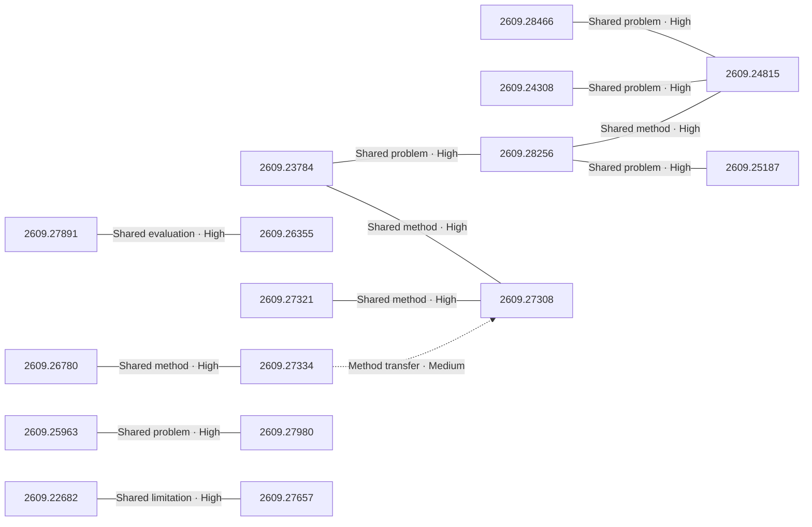

# Paper relationship graph — 2026-09-24

> [← Daily summary](../2026-09-24.md)

> **Interpretation caveat:** Every edge is an evidence-screened editorial hypothesis, not proof of citation, influence, priority, historical use, dependency, or an author-claimed relationship.

## Legend

- Rectangular nodes are current-day papers; rounded nodes are previously seen candidates.
- A line has no technical direction. An arrow shows only a proposed technical flow for an enabling dependency or method transfer.
- Solid edges are high confidence; dotted edges are medium confidence. Confidence evaluates this editorial connection, not either paper.
- Relationship labels:
  - **Shared problem:** `shared_problem`
  - **Shared method:** `shared_method`
  - **Shared evaluation:** `shared_evaluation`
  - **Complementary:** `complementary`
  - **Enabling dependency:** `enabling_dependency`
  - **Method transfer:** `method_transfer`
  - **Assumption tension:** `assumption_tension`
  - **Result tension:** `result_tension`
  - **Shared limitation:** `shared_limitation`
  - **Follow-up opportunity:** `follow_up_opportunity`

## Same-day relationships

| Source paper | Target paper | Relationship | Direction | Confidence |
| --- | --- | --- | --- | --- |
| [2609.26780](2609.26780.md) | [2609.27334](2609.27334.md) | Shared method | Not directional | High |
| [2609.22682](2609.22682.md) | [2609.27657](2609.27657.md) | Shared limitation | Not directional | High |
| [2609.23784](2609.23784.md) | [2609.27308](2609.27308.md) | Shared method | Not directional | High |
| [2609.27321](2609.27321.md) | [2609.27308](2609.27308.md) | Shared method | Not directional | High |
| [2609.23784](2609.23784.md) | [2609.28256](2609.28256.md) | Shared problem | Not directional | High |
| [2609.28256](2609.28256.md) | [2609.25187](2609.25187.md) | Shared problem | Not directional | High |
| [2609.28466](2609.28466.md) | [2609.24815](2609.24815.md) | Shared problem | Not directional | High |
| [2609.24308](2609.24308.md) | [2609.24815](2609.24815.md) | Shared problem | Not directional | High |
| [2609.28256](2609.28256.md) | [2609.24815](2609.24815.md) | Shared method | Not directional | High |
| [2609.25963](2609.25963.md) | [2609.27980](2609.27980.md) | Shared problem | Not directional | High |
| [2609.27891](2609.27891.md) | [2609.26355](2609.26355.md) | Shared evaluation | Not directional | High |
| [2609.27334](2609.27334.md) | [2609.27308](2609.27308.md) | Method transfer | Source → target | Medium |

## Connections to previously seen papers

_The visual diagram is omitted because this graph is too large or dense for a readable snapshot; every edge remains in the table below._

| New paper | Previously seen paper | First seen by service | Relationship | Technical direction | Confidence |
| --- | --- | --- | --- | --- | --- |
| [2609.26780](2609.26780.md) | 2609.23986 ([Hugging Face](https://huggingface.co/papers/2609.23986) · [arXiv](https://arxiv.org/abs/2609.23986)) | 2026-09-22 | Shared method | Not directional | High |
| [2609.23038](2609.23038.md) | 2609.03729 ([Hugging Face](https://huggingface.co/papers/2609.03729) · [arXiv](https://arxiv.org/abs/2609.03729)) | 2026-09-07 | Shared problem | Not directional | High |
| [2609.22947](2609.22947.md) | 2608.21839 ([Hugging Face](https://huggingface.co/papers/2608.21839) · [arXiv](https://arxiv.org/abs/2608.21839)) | 2026-08-27 | Shared method | Not directional | High |
| [2609.26355](2609.26355.md) | 2608.23566 ([Hugging Face](https://huggingface.co/papers/2608.23566) · [arXiv](https://arxiv.org/abs/2608.23566)) | 2026-08-26 | Shared method | Not directional | High |
| [2609.28256](2609.28256.md) | 2609.05533 ([Hugging Face](https://huggingface.co/papers/2609.05533) · [arXiv](https://arxiv.org/abs/2609.05533)) | 2026-09-08 | Shared problem | Not directional | High |
| [2609.27656](2609.27656.md) | 2609.00188 ([Hugging Face](https://huggingface.co/papers/2609.00188) · [arXiv](https://arxiv.org/abs/2609.00188)) | 2026-09-02 | Shared method | Not directional | High |
| [2609.24815](2609.24815.md) | 2609.12036 ([Hugging Face](https://huggingface.co/papers/2609.12036) · [arXiv](https://arxiv.org/abs/2609.12036)) | 2026-09-14 | Shared method | Not directional | High |
| [2609.27980](2609.27980.md) | 2609.11412 ([Hugging Face](https://huggingface.co/papers/2609.11412) · [arXiv](https://arxiv.org/abs/2609.11412)) | 2026-09-11 | Shared method | Not directional | High |
| [2609.27334](2609.27334.md) | 2608.31100 ([Hugging Face](https://huggingface.co/papers/2608.31100) · [arXiv](https://arxiv.org/abs/2608.31100)) | 2026-09-03 | Follow-up opportunity | Not directional | Medium |
| [2609.27490](2609.27490.md) | 2609.09219 ([Hugging Face](https://huggingface.co/papers/2609.09219) · [arXiv](https://arxiv.org/abs/2609.09219)) | 2026-09-10 | Complementary | Not directional | Medium |
| [2609.27891](2609.27891.md) | 2608.27831 ([Hugging Face](https://huggingface.co/papers/2608.27831) · [arXiv](https://arxiv.org/abs/2608.27831)) | 2026-09-02 | Shared method | Not directional | High |
| [2609.28473](2609.28473.md) | 2608.29335 ([Hugging Face](https://huggingface.co/papers/2608.29335) · [arXiv](https://arxiv.org/abs/2608.29335)) | 2026-09-01 | Shared problem | Not directional | High |

## Current paper key

| Paper | Analysis |
| --- | --- |
| 2609.26780 — SpeakerMem-R1: Speaker-Centered Dual-Track Memory for Multi-Party Dialogue | [Read analysis](2609.26780.md) |
| 2609.23038 — Spatial-Interactor: Learning Spatial Reasoning through Interaction with the Observable Physical World | [Read analysis](2609.23038.md) |
| 2609.24308 — HappyWorld-Bench | [Read analysis](2609.24308.md) |
| 2609.28466 — The Past Frames the Future: Memory for Autoregressive Video Generation | [Read analysis](2609.28466.md) |
| 2609.27334 — Just-in-Time Memory: Learning to Curate Task-Adaptive Memory for LLM Agents | [Read analysis](2609.27334.md) |
| 2609.22947 — RewardVerse: Rubric-Guided Policy Optimization for Video Reward Modeling | [Read analysis](2609.22947.md) |
| 2609.27891 — Schrödinger's Code Repository: Have LLMs Learned SWE-bench or Memorized It? | [Read analysis](2609.27891.md) |
| 2609.26355 — PACT: From Credit Assignment to Critic Alignment | [Read analysis](2609.26355.md) |
| 2609.26637 — Capable yet Parsimonious: Extracting and Characterizing Hidden Chain-of-Thought in Frontier Models | [Read analysis](2609.26637.md) |
| 2609.25963 — GeoPair: Geometry-Preserving Cross-Layer Factorization for Training-Free Transformer Compression | [Read analysis](2609.25963.md) |
| 2609.23784 — PackLab: A Comprehensive Framework for Developing, Training, and Evaluating MLLMs in Robotic Bin Packing | [Read analysis](2609.23784.md) |
| 2609.28256 — MemBodied: Recurrent Associative Memory for Vision-Language-Action Models | [Read analysis](2609.28256.md) |
| 2609.27284 — Hunyuan-A13B Technical Report | [Read analysis](2609.27284.md) |
| 2609.27321 — Verifiable Hidden Dynamics Play: Generating Agentic RL Environments from Solved Mechanisms | [Read analysis](2609.27321.md) |
| 2609.27490 — WhatWorkedBench: Benchmarking Experimental Understanding in AI Agents | [Read analysis](2609.27490.md) |
| 2609.27901 — All modalities are equal, but video is more equal: Closing the Cross-Attention Gap in Joint Video Generation | [Read analysis](2609.27901.md) |
| 2609.27656 — InternW0: A Foundational Physical World Model for Efficient Real-World Interactions | [Read analysis](2609.27656.md) |
| 2609.22682 — Self-Organizing Agent Teams Learn to Reason Together | [Read analysis](2609.22682.md) |
| 2609.28473 — On the Diffusibility of High-Dimensional Latents | [Read analysis](2609.28473.md) |
| 2609.27980 — Six Layers Less: Encoder Pruning for Whisper with Label-Free Recovery | [Read analysis](2609.27980.md) |
| 2609.25853 — MemoryAthena: Adaptive Routing over Latent and Generated Memories | [Read analysis](2609.25853.md) |
| 2609.28470 — StudentBench: AI and human tutoring yield equivalent GRE learning gains | [Read analysis](2609.28470.md) |
| 2609.27158 — The Linear Representation Hypothesis Needs a Group Action | [Read analysis](2609.27158.md) |
| 2609.26634 — Knowledge Pull Requests for Continual Document Authoring | [Read analysis](2609.26634.md) |
| 2609.26489 — Calibration as a First-Class Criterion in LLM Evaluation | [Read analysis](2609.26489.md) |
| 2609.27308 — EmbodiedSWE: Coding Agents for Long Horizon Dexterous Robotics | [Read analysis](2609.27308.md) |
| 2609.25187 — X-Planner: Event-Structured Task Planning for Embodied Intelligence | [Read analysis](2609.25187.md) |
| 2609.27657 — FLEET: From Logits Entropy to Enhanced Trajectories in Text Generation | [Read analysis](2609.27657.md) |
| 2609.24815 — Uranus: Building the Next-Generation Simulation Infrastructure for Embodied AI | [Read analysis](2609.24815.md) |

## Current papers without a published edge

- [2609.26637](2609.26637.md)
- [2609.27284](2609.27284.md)
- [2609.27901](2609.27901.md)
- [2609.25853](2609.25853.md)
- [2609.28470](2609.28470.md)
- [2609.27158](2609.27158.md)
- [2609.26634](2609.26634.md)
- [2609.26489](2609.26489.md)

---

[Support these research summaries on Buy Me a Coffee](https://buymeacoffee.com/vollero)
