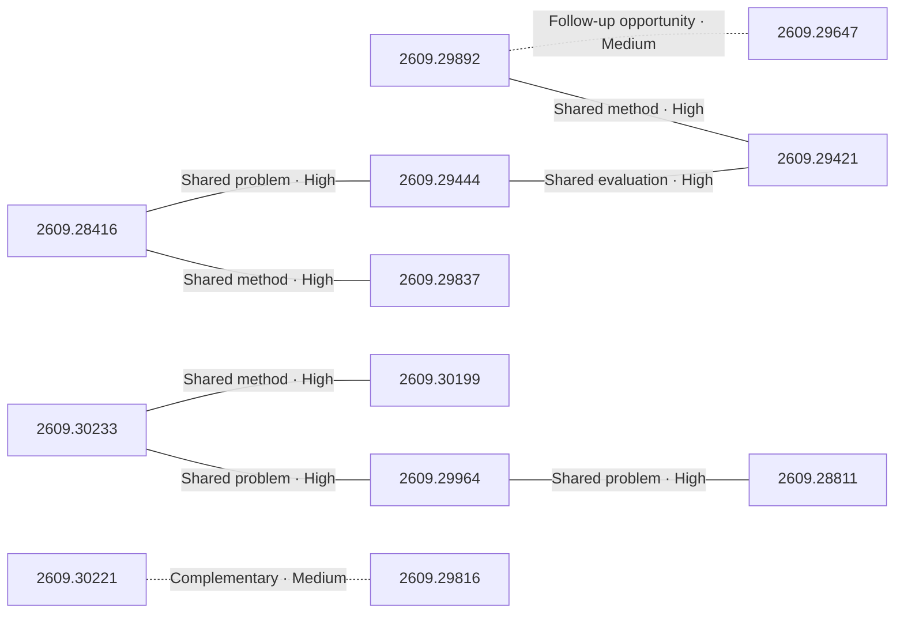

# Paper relationship graph — 2026-09-25

> [← Daily summary](../2026-09-25.md)

> **Interpretation caveat:** Every edge is an evidence-screened editorial hypothesis, not proof of citation, influence, priority, historical use, dependency, or an author-claimed relationship.

## Legend

- Rectangular nodes are current-day papers; rounded nodes are previously seen candidates.
- A line has no technical direction. An arrow shows only a proposed technical flow for an enabling dependency or method transfer.
- Solid edges are high confidence; dotted edges are medium confidence. Confidence evaluates this editorial connection, not either paper.
- Relationship labels:
  - **Shared problem:** `shared_problem`
  - **Shared method:** `shared_method`
  - **Shared evaluation:** `shared_evaluation`
  - **Complementary:** `complementary`
  - **Enabling dependency:** `enabling_dependency`
  - **Method transfer:** `method_transfer`
  - **Assumption tension:** `assumption_tension`
  - **Result tension:** `result_tension`
  - **Shared limitation:** `shared_limitation`
  - **Follow-up opportunity:** `follow_up_opportunity`

## Same-day relationships

| Source paper | Target paper | Relationship | Direction | Confidence |
| --- | --- | --- | --- | --- |
| [2609.28416](2609.28416.md) | [2609.29837](2609.29837.md) | Shared method | Not directional | High |
| [2609.28416](2609.28416.md) | [2609.29444](2609.29444.md) | Shared problem | Not directional | High |
| [2609.29444](2609.29444.md) | [2609.29421](2609.29421.md) | Shared evaluation | Not directional | High |
| [2609.29892](2609.29892.md) | [2609.29421](2609.29421.md) | Shared method | Not directional | High |
| [2609.29647](2609.29647.md) | [2609.29892](2609.29892.md) | Follow-up opportunity | Not directional | Medium |
| [2609.30233](2609.30233.md) | [2609.29964](2609.29964.md) | Shared problem | Not directional | High |
| [2609.30233](2609.30233.md) | [2609.30199](2609.30199.md) | Shared method | Not directional | High |
| [2609.29964](2609.29964.md) | [2609.28811](2609.28811.md) | Shared problem | Not directional | High |
| [2609.30221](2609.30221.md) | [2609.29816](2609.29816.md) | Complementary | Not directional | Medium |

## Connections to previously seen papers

_The visual diagram is omitted because this graph is too large or dense for a readable snapshot; every edge remains in the table below._

| New paper | Previously seen paper | First seen by service | Relationship | Technical direction | Confidence |
| --- | --- | --- | --- | --- | --- |
| [2609.28654](2609.28654.md) | 2608.26105 ([Hugging Face](https://huggingface.co/papers/2608.26105) · [arXiv](https://arxiv.org/abs/2608.26105)) | 2026-08-27 | Method transfer | Previous → new | Medium |
| [2609.30221](2609.30221.md) | 2609.00646 ([Hugging Face](https://huggingface.co/papers/2609.00646) · [arXiv](https://arxiv.org/abs/2609.00646)) | 2026-09-02 | Follow-up opportunity | Not directional | Medium |
| [2609.23407](2609.23407.md) | 2609.15195 ([Hugging Face](https://huggingface.co/papers/2609.15195) · [arXiv](https://arxiv.org/abs/2609.15195)) | 2026-09-16 | Method transfer | Previous → new | Medium |
| [2609.28416](2609.28416.md) | 2609.25804 ([Hugging Face](https://huggingface.co/papers/2609.25804) · [arXiv](https://arxiv.org/abs/2609.25804)) | 2026-09-23 | Shared method | Not directional | High |
| [2609.29892](2609.29892.md) | 2609.00196 ([Hugging Face](https://huggingface.co/papers/2609.00196) · [arXiv](https://arxiv.org/abs/2609.00196)) | 2026-09-03 | Shared method | Not directional | High |
| [2609.29444](2609.29444.md) | 2608.28476 ([Hugging Face](https://huggingface.co/papers/2608.28476) · [arXiv](https://arxiv.org/abs/2608.28476)) | 2026-08-31 | Shared problem | Not directional | High |
| [2609.29647](2609.29647.md) | 2609.01281 ([Hugging Face](https://huggingface.co/papers/2609.01281) · [arXiv](https://arxiv.org/abs/2609.01281)) | 2026-09-08 | Shared method | Not directional | High |
| [2609.30233](2609.30233.md) | 2609.12541 ([Hugging Face](https://huggingface.co/papers/2609.12541) · [arXiv](https://arxiv.org/abs/2609.12541)) | 2026-09-15 | Shared method | Not directional | High |
| [2609.29964](2609.29964.md) | 2609.19138 ([Hugging Face](https://huggingface.co/papers/2609.19138) · [arXiv](https://arxiv.org/abs/2609.19138)) | 2026-09-17 | Shared method | Not directional | High |
| [2609.28811](2609.28811.md) | 2608.24882 ([Hugging Face](https://huggingface.co/papers/2608.24882) · [arXiv](https://arxiv.org/abs/2608.24882)) | 2026-08-26 | Shared method | Not directional | High |
| [2609.28923](2609.28923.md) | 2609.02886 ([Hugging Face](https://huggingface.co/papers/2609.02886) · [arXiv](https://arxiv.org/abs/2609.02886)) | 2026-09-03 | Method transfer | New → previous | Medium |
| [2609.30199](2609.30199.md) | 2609.22000 ([Hugging Face](https://huggingface.co/papers/2609.22000) · [arXiv](https://arxiv.org/abs/2609.22000)) | 2026-09-21 | Shared problem | Not directional | High |

## Current paper key

| Paper | Analysis |
| --- | --- |
| 2609.28654 — Training Object Permanence in World Models | [Read analysis](2609.28654.md) |
| 2609.29845 — Your Transformer Can Hold Two Thoughts at Once: Evidence of Linear Superposition in LLMs | [Read analysis](2609.29845.md) |
| 2609.30221 — WanPE: Towards Cinematic Prompt Enhancement for Modern Text-to-Video Generation | [Read analysis](2609.30221.md) |
| 2609.23407 — OmniEcho: Spatial Audio Understanding for Embodied Agents | [Read analysis](2609.23407.md) |
| 2609.28416 — Agent-Editing World Model: Rethinking World Modeling for LLM Agents | [Read analysis](2609.28416.md) |
| 2609.29362 — Parts-of-Speech as Emergent Categories in SAE Latent Space | [Read analysis](2609.29362.md) |
| 2609.29892 — Qwen-Planner-Agent: A Closed-Loop AI-for-AI Framework for Real-World Mobile Planner Agents | [Read analysis](2609.29892.md) |
| 2609.29444 — IterSynth: Rethinking Deep Search Agents via Role-Decoupled Iterative Synthesis | [Read analysis](2609.29444.md) |
| 2609.29028 — RGBD20K: A Large-Scale Benchmark for RGB-D Semantic Segmentation | [Read analysis](2609.29028.md) |
| 2609.29421 — Rufus-Air: An Open LLM Post-Training Recipe | [Read analysis](2609.29421.md) |
| 2609.30233 — Coding Agents for Generalized Task and Motion Planning Problems | [Read analysis](2609.30233.md) |
| 2609.23087 — Neural Spectral Capacity: Measuring and Designing Architectures from Network Specification Alone | [Read analysis](2609.23087.md) |
| 2609.29647 — AgentKernel: The Trust-Native Agentic Operating System | [Read analysis](2609.29647.md) |
| 2609.28603 — Learning to Discover Interesting Mathematics | [Read analysis](2609.28603.md) |
| 2609.29837 — PUBG Ally: A Conversational Embodied Agent as an AI Teammate | [Read analysis](2609.29837.md) |
| 2609.30199 — ExplorationBench: Measuring AI Systems' Exploration in Verifiable Alien Worlds | [Read analysis](2609.30199.md) |
| 2609.29816 — AV-GRPO: Modality-Anchored Decoupling Diffusion Reinforcement Learning for Joint Audio-Video Generation | [Read analysis](2609.29816.md) |
| 2609.29964 — World Action Agent: Harnessing VLMs for Robot Manipulation via World Action Rehearsal | [Read analysis](2609.29964.md) |
| 2609.29429 — Just Ask Jev: Reinforcement Learning for Calibrated Decisions as a Zero-Shot Detector of AI Alignment Failures | [Read analysis](2609.29429.md) |
| 2609.28811 — DeltaWAM: Delta World Action Models for Bimanual Manipulation | [Read analysis](2609.28811.md) |
| 2609.28923 — ViRDM: Taming Representation Distribution Matching for Few-Step Causal Video Generation | [Read analysis](2609.28923.md) |
| 2609.30077 — Rate-distortion optimization for full-reference image quality metrics via stochastic Hessian estimates | [Read analysis](2609.30077.md) |

## Current papers without a published edge

- [2609.29845](2609.29845.md)
- [2609.29362](2609.29362.md)
- [2609.29028](2609.29028.md)
- [2609.23087](2609.23087.md)
- [2609.28603](2609.28603.md)
- [2609.29429](2609.29429.md)
- [2609.30077](2609.30077.md)

---

[Support these research summaries on Buy Me a Coffee](https://buymeacoffee.com/vollero)
