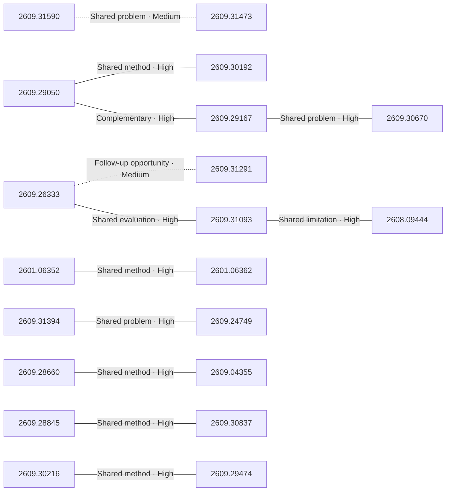

# Paper relationship graph — 2026-09-28

> [← Daily summary](../2026-09-28.md)

> **Interpretation caveat:** Every edge is an evidence-screened editorial hypothesis, not proof of citation, influence, priority, historical use, dependency, or an author-claimed relationship.

## Legend

- Rectangular nodes are current-day papers; rounded nodes are previously seen candidates.
- A line has no technical direction. An arrow shows only a proposed technical flow for an enabling dependency or method transfer.
- Solid edges are high confidence; dotted edges are medium confidence. Confidence evaluates this editorial connection, not either paper.
- Relationship labels:
  - **Shared problem:** `shared_problem`
  - **Shared method:** `shared_method`
  - **Shared evaluation:** `shared_evaluation`
  - **Complementary:** `complementary`
  - **Enabling dependency:** `enabling_dependency`
  - **Method transfer:** `method_transfer`
  - **Assumption tension:** `assumption_tension`
  - **Result tension:** `result_tension`
  - **Shared limitation:** `shared_limitation`
  - **Follow-up opportunity:** `follow_up_opportunity`

## Same-day relationships

| Source paper | Target paper | Relationship | Direction | Confidence |
| --- | --- | --- | --- | --- |
| [2609.26333](2609.26333.md) | [2609.31291](2609.31291.md) | Follow-up opportunity | Not directional | Medium |
| [2609.26333](2609.26333.md) | [2609.31093](2609.31093.md) | Shared evaluation | Not directional | High |
| [2609.31093](2609.31093.md) | [2608.09444](2608.09444.md) | Shared limitation | Not directional | High |
| [2609.28845](2609.28845.md) | [2609.30837](2609.30837.md) | Shared method | Not directional | High |
| [2609.29050](2609.29050.md) | [2609.30192](2609.30192.md) | Shared method | Not directional | High |
| [2609.29050](2609.29050.md) | [2609.29167](2609.29167.md) | Complementary | Not directional | High |
| [2609.29167](2609.29167.md) | [2609.30670](2609.30670.md) | Shared problem | Not directional | High |
| [2601.06352](2601.06352.md) | [2601.06362](2601.06362.md) | Shared method | Not directional | High |
| [2609.30216](2609.30216.md) | [2609.29474](2609.29474.md) | Shared method | Not directional | High |
| [2609.31590](2609.31590.md) | [2609.31473](2609.31473.md) | Shared problem | Not directional | Medium |
| [2609.31394](2609.31394.md) | [2609.24749](2609.24749.md) | Shared problem | Not directional | High |
| [2609.28660](2609.28660.md) | [2609.04355](2609.04355.md) | Shared method | Not directional | High |

## Connections to previously seen papers

_The visual diagram is omitted because this graph is too large or dense for a readable snapshot; every edge remains in the table below._

| New paper | Previously seen paper | First seen by service | Relationship | Technical direction | Confidence |
| --- | --- | --- | --- | --- | --- |
| [2609.31620](2609.31620.md) | 2609.28473 ([Hugging Face](https://huggingface.co/papers/2609.28473) · [arXiv](https://arxiv.org/abs/2609.28473)) | 2026-09-24 | Shared problem | Not directional | High |
| [2609.31093](2609.31093.md) | 2609.13141 ([Hugging Face](https://huggingface.co/papers/2609.13141) · [arXiv](https://arxiv.org/abs/2609.13141)) | 2026-09-14 | Method transfer | New → previous | Medium |
| [2609.31394](2609.31394.md) | 2609.28811 ([Hugging Face](https://huggingface.co/papers/2609.28811) · [arXiv](https://arxiv.org/abs/2609.28811)) | 2026-09-25 | Shared method | Not directional | High |
| [2609.27277](2609.27277.md) | 2608.28363 ([Hugging Face](https://huggingface.co/papers/2608.28363) · [arXiv](https://arxiv.org/abs/2608.28363)) | 2026-08-31 | Complementary | Not directional | Medium |
| [2609.28845](2609.28845.md) | 2609.20511 ([Hugging Face](https://huggingface.co/papers/2609.20511) · [arXiv](https://arxiv.org/abs/2609.20511)) | 2026-09-18 | Follow-up opportunity | Not directional | Medium |
| [2609.30837](2609.30837.md) | 2609.02998 ([Hugging Face](https://huggingface.co/papers/2609.02998) · [arXiv](https://arxiv.org/abs/2609.02998)) | 2026-09-08 | Shared problem | Not directional | High |
| [2609.29050](2609.29050.md) | 2608.27906 ([Hugging Face](https://huggingface.co/papers/2608.27906) · [arXiv](https://arxiv.org/abs/2608.27906)) | 2026-08-31 | Shared problem | Not directional | High |
| [2609.29167](2609.29167.md) | 2609.10016 ([Hugging Face](https://huggingface.co/papers/2609.10016) · [arXiv](https://arxiv.org/abs/2609.10016)) | 2026-09-11 | Shared evaluation | Not directional | High |
| [2609.28660](2609.28660.md) | 2609.07498 ([Hugging Face](https://huggingface.co/papers/2609.07498) · [arXiv](https://arxiv.org/abs/2609.07498)) | 2026-09-09 | Shared problem | Not directional | High |
| [2609.30670](2609.30670.md) | 2609.02780 ([Hugging Face](https://huggingface.co/papers/2609.02780) · [arXiv](https://arxiv.org/abs/2609.02780)) | 2026-09-07 | Follow-up opportunity | Not directional | Medium |
| [2609.24749](2609.24749.md) | 2609.25804 ([Hugging Face](https://huggingface.co/papers/2609.25804) · [arXiv](https://arxiv.org/abs/2609.25804)) | 2026-09-23 | Shared method | Not directional | High |
| [2609.04355](2609.04355.md) | 2609.24118 ([Hugging Face](https://huggingface.co/papers/2609.24118) · [arXiv](https://arxiv.org/abs/2609.24118)) | 2026-09-22 | Shared method | Not directional | High |

## Current paper key

| Paper | Analysis |
| --- | --- |
| 2609.31620 — FuseReg: Regularizing Layer Fusion Mitigates the Reconstruction-Generation Gap in Representation Autoencoders | [Read analysis](2609.31620.md) |
| 2609.26333 — Disaggregated Quantization: Specializing LLM Prefill and Decode | [Read analysis](2609.26333.md) |
| 2609.18703 — RayOrch: Programming and Executing Lineage-Controlled Multi-Grain Dataflows for Foundation-Model Data Preparation | [Read analysis](2609.18703.md) |
| 2609.31093 — Block Sparse Attention with Log-Linear Complexity | [Read analysis](2609.31093.md) |
| 2609.31394 — InternW0-Δ: A World Action Model Bridging Predictive Dynamics and Actions with 20K+ Hours of Open Data | [Read analysis](2609.31394.md) |
| 2609.27277 — TimeEvo: Failure-Driven Self-Evolution of a Time Series Agent | [Read analysis](2609.27277.md) |
| 2609.28845 — LastOPD: Taming Collapse in Latent On-Policy Distillation | [Read analysis](2609.28845.md) |
| 2609.24385 — Tactile-JEPA: Topology-Aware Self-Supervised Representation Learning for Distributed Tactile Sensors | [Read analysis](2609.24385.md) |
| 2609.30216 — Jev in the Wild: A Data-Driven Analysis of the Jev Model's Functionality, Applications and Ecosystem | [Read analysis](2609.30216.md) |
| 2609.31199 — Enhancing Photogrammetric Digital Surface Models with Pretrained Diffusion Models and Multimodal Conditioning | [Read analysis](2609.31199.md) |
| 2609.25716 — FoMo: Forking Moment in Generative Trajectory as a Perceptual Distance | [Read analysis](2609.25716.md) |
| 2609.30222 — TrackEverything: Long Horizon Dense Tracking via De-Duplicating 3D Scene Representations | [Read analysis](2609.30222.md) |
| 2609.31590 — AgentWorld: Benchmarking Long-Horizon Collaboration of Multi-agent LLMs | [Read analysis](2609.31590.md) |
| 2609.29050 — SLCA-GRPO: Resolving Cross-Segment Credit Misattribution in Tool-Calling RL | [Read analysis](2609.29050.md) |
| 2609.30192 — SAGE: Mitigating Long-Horizon Reasoning Biases via Topological Guidance | [Read analysis](2609.30192.md) |
| 2609.31473 — Game Arena: Strategic LLM Evaluation in Competitive Environments | [Read analysis](2609.31473.md) |
| 2609.29167 — IndicBankBench: Evaluating Safety and Reliability of Language Model Assistants in Indian Retail Banking | [Read analysis](2609.29167.md) |
| 2601.06352 — CARD: Cluster-level Adaptation with Reward-guided Decoding for Personalized Text Generation | [Read analysis](2601.06352.md) |
| 2601.06362 — Do Implicit Personalization and Explicit Styles Conflict? PsPLUG: A Lightweight Plug-in for Balancing Personalization and Style in Customized LLMs | [Read analysis](2601.06362.md) |
| 2609.28660 — Morphometric Imitation: From Morphology and Contact Aware Hand Retargeting to Sim-to-Real Visuomotor Policy | [Read analysis](2609.28660.md) |
| 2609.24749 — D-JEPA: A Decision-Aligned Latent World Model | [Read analysis](2609.24749.md) |
| 2609.04355 — VLA-Precision: Asymmetric Co-Bootstrapping for Efficient Real-World Online RL of Vision-Language-Action Models | [Read analysis](2609.04355.md) |
| 2609.30670 — TRACE: Temporal Audit and Condition-aware Evaluation of Streaming Video Understanding | [Read analysis](2609.30670.md) |
| 2609.22237 — Not All Ranks Are Equal: Budget-Aware LoRA Merging Across Tasks | [Read analysis](2609.22237.md) |
| 2609.28327 — LightMIS: Ultra-Lightweight Medical Image Segmentation Without a Stage-Wise Decoder | [Read analysis](2609.28327.md) |
| 2609.31291 — Softmax Reparameterization for Output-Head Quantization | [Read analysis](2609.31291.md) |
| 2609.30837 — MOPD-Router: Rethinking Teacher Routing in Multi-Teacher On-Policy Distillation | [Read analysis](2609.30837.md) |
| 2609.30867 — Evidence-Grounded Auditing of Identification Assumptions in Climate-Policy Causal Evaluations | [Read analysis](2609.30867.md) |
| 2609.31002 — ZooWork-ShopRanker: An Open, Preference-Aligned E-Commerce Reranker | [Read analysis](2609.31002.md) |
| 2609.29474 — CodeGraph: Open-Taxonomy Knowledge Graph for Source Code with Wikidata Grounding | [Read analysis](2609.29474.md) |
| 2608.09444 — Depth-adaptive Inference of Looped Language Models via Continuous Depth Batching | [Read analysis](2608.09444.md) |
| 2604.02103 — BoundInk: Boundary-Aware Online Handwriting Generation | [Read analysis](2604.02103.md) |
| 2609.23551 — Paragraph Boundaries Are Not White Space:Compression Depth as the Signature of Hierarchical Structure | [Read analysis](2609.23551.md) |

## Current papers without a published edge

- [2609.18703](2609.18703.md)
- [2609.24385](2609.24385.md)
- [2609.31199](2609.31199.md)
- [2609.25716](2609.25716.md)
- [2609.30222](2609.30222.md)
- [2609.22237](2609.22237.md)
- [2609.28327](2609.28327.md)
- [2609.30867](2609.30867.md)
- [2609.31002](2609.31002.md)
- [2604.02103](2604.02103.md)
- [2609.23551](2609.23551.md)

---

[Support these research summaries on Buy Me a Coffee](https://buymeacoffee.com/vollero)
